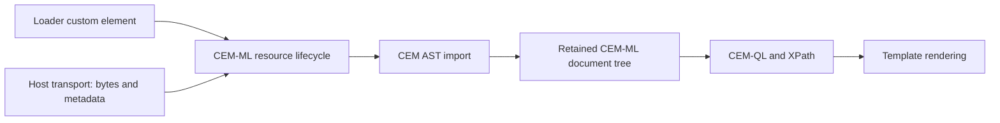

# CEM-ML document loader plan

Materialized loader implemented and verified, 2026-09-17. This plan applies the
[external-data import principle](cem-data-import-principle.md) to the loader
custom element. Implementation tasks are in [todo.md](todo.md).

## Loaded data contract

The loader custom element uses the `cem-ml` library's resource loading and
import capabilities to load XML and JSON into a retained CEM-ML AST tree. Its
loaded value is the CEM-ML document tree backed by that AST, with native node
identity, source provenance and ownership. CEM-QL, XPath and templates consume
the same tree capabilities already used by ordinary CEM data imports.

Loaded document data must never become JavaScript JSON objects or arrays in
runtime code, samples, test adapters or worker messages. Do not call
`response.json()` or `JSON.parse()` on response documents, convert browser XML
DOM into records, or serialize a native AST into JSON for a handoff. Do not
preserve an object-shaped compatibility data binding. XML and JSON source
fixtures remain valid byte inputs; fixtures assert the imported tree and its
query results. Explicit request/control metadata and diagnostics remain their
separately named protocols and cannot carry a document-object substitute.

The library owns content-type selection, character decoding, parser dispatch,
mapping vocabulary and diagnostics. The element supplies the request and host
transport integration. Reuse existing library capability; add missing native
or WASM entrypoints there before wiring the element. The element must not grow
its own XML/JSON parser or mapping. YAML, CSV and later formats extend the
library import contract and its tests.

## Request lifecycle

Use legacy `http-request` behavior as the lifecycle reference: request initiation,
request/response metadata updates, completion/failure notification, reload when
request inputs change, and cancellation when the element disconnects or the
request is replaced. Use the existing portable CEM lifecycle vocabulary and
revision guards. Test empty URLs, failures followed by recovery, repeated
requests, stale completions and independent instances.

The first delivery materializes a complete, bounded CEM tree before publishing
loaded data. Header and lifecycle updates can be observed earlier. Preserve
source identity and diagnostics on failure. Worker and fallback execution must
retain the native owner, release resource references on replacement/disposal,
and keep already selected nodes valid for their defined lifetime. Use native
handles or the existing typed/binary AST mechanisms across execution boundaries;
an AST must not travel as a generic JSON object graph.

## Materialized loader contract

The existing `<http-request>` spelling is the CEM loader control. Its request
attributes remain `slice`, `url`, `method` (`GET`/`HEAD`), `header-*`,
`content-type`, `credentials`, and `cache`. Request changes replace and cancel
the old owner. An absent/empty URL removes the control and releases its owner.
Disconnect and declaration-scope disposal also release owners. A `HEAD` response
publishes metadata with no document binding.

`datadom.slices.<slice>` keeps `scheduled`, `in-progress`, `loaded`, and `failed`
state, request/response metadata, source identity, revision and diagnostics.
Lifecycle changes schedule rendering and update the existing
`datadom.eventPayloads.<slice>` notification metadata. In native template
execution, `.data` is one retained CEM **document node**. Navigate its
`children`, `attributes`, `name`, `namespace`, `value` and source information,
or pass the node directly to an explicitly referenced XPath function library.
There is no `.data.results` or `.data.items` object shortcut.

For example, the HTTP and loop demos declare `xpath-functions="./http-data.cemt"`
and call `native:call("http.rows", datadom.slices.catalog.data)`. That separate
library queries the imported vocabulary and returns retained nodes; its field
function returns display text. It does not parse response source.

JavaScript snapshots/data islands carry only lifecycle metadata with `data: null`.
They carry neither response records nor AST objects nor durable native handles.
On reconnect/hydration the metadata returns to `scheduled` and the request
acquires a fresh native owner. The package-private processing protocol is
`cem-processing-host-v4`: its explicit `document` operation transfers response
bytes plus ownership metadata, retains/releases the CEM tree, and supplies
instance/scope-checked bindings separately from render data. Worker fallback
re-imports retained source bytes through the same CEM-ML import API. Handles are
execution-local, cannot be inferred from JSON data, and are never reused by the
native registry. Selected native nodes retain their tree after handle release.

CEM-ML owns MIME aliases/parameters and byte decoding, including XML, JSON, YAML,
CSV and UTF-8 plain text. The HTTP transport keeps its configurable response
byte limit (1 MiB default); native document retention adds a 64-owner / 16 MiB
source-byte budget. Import also enforces bounded depth and value/event counts.
The smaller `data:read` source limit remains 32 KiB.

The standalone `custom-element/http-request.js` companion is retired, including
its package export and IDE declaration. Its HTTP and version-picker examples
now install `cem-elements` and use CEM-ML declarations with the shared XPath
function library. The legacy `custom-element` rendering wrapper already delegates
to the shared runtime; no separate rendering-engine migration is needed.

## Migration and verification

The five steps below are complete. Native/WASM node binding, worker fallback,
replacement/disconnect, independent instances and versioned hydration are covered.
The legacy standalone module is retired; source, distribution and packed examples
use the shared loader. The active evidence is recorded in [todo.md](todo.md).

1. Add native loader/import lifecycle fixtures for XML and JSON, preserving
   source maps, node identity, limits, cancellation and error diagnostics.
2. Expose the retained tree through the CEM-ML library's browser/WASM interface
   and wire the loader element, worker/fallback ownership and reactive updates.
3. Replace object-based HTTP parsing and migrate the HTTP and `for-each` samples,
   legacy companion examples, fixture adapters and their consumers to CEM tree
   queries. Existing `.data.results` JavaScript-record assumptions are removed.
4. Move the older lifecycle CEM-QL JSON-member/XML-event query views onto common
   CEM import and node capabilities. They must not provide a second data model.
5. Verify native/WASM parity, request lifecycle behavior, standalone/source-loaded
   demos and equivalent XML/JSON query results. Extend source-boundary guards and
   their Nx cache inputs to cover the loader and migrated consumers. Inventory
   remaining document-object bypasses before closing the migration.

Raw native parser AST inspection and explicit export tools keep their named
inspection/export contracts. They cannot substitute for the loader's document
binding in samples or ordinary queries.

## Later: CEM-ML AST streaming

Progressive consumption of a CEM-ML AST stream is an accepted follow-up, recorded
in [wishlist.md](wishlist.md#cem-ml-runtime). It is deferred until the materialized
loader and migrated samples pass verification. Receiving HTTP byte chunks alone
does not constitute AST streaming.

Retain the same library, source identity and resource lifecycle. Define typed AST
chunks/events, node identity across chunks, backpressure, bounded retention,
partial-input errors, cancellation and disposal. Specify which queries can
consume incrementally and which require tree materialization; arbitrary XPath
must not be advertised as streaming. Commit incremental render updates only for
the active resource revision. Do not introduce JavaScript document objects as an
intermediate representation when adding streaming.
