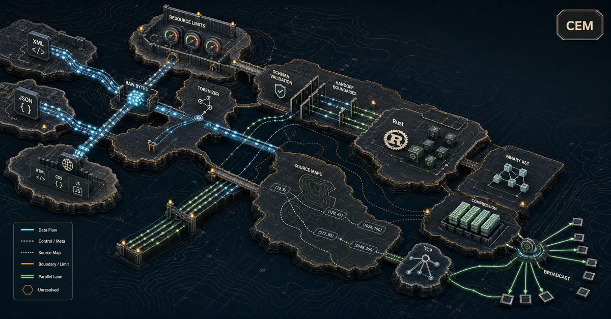

# `cem-ml` Stack Design

**Status:** Draft high-level design. Implementation contracts are split into
[`cem-ml-stack-design-impl.md`](cem-ml-stack-design-impl.md).  
**Primary source:** [`parsing-algorithms-research.md`](../parsing-algorithms-research.md)  
**Date:** 2026-05-08

---

## 1. Purpose And Scope

This document translates the layered parser architecture from `parsing-algorithms-research.md`
into a concrete design for the `cem-ml` Rust library and `cem-ml-cli` binary. It fixes:

- functional layer boundaries and module ownership,
- algorithm selections for each layer,
- Rust module topology,
- source-map, diagnostic, report, and projection responsibilities,
- the Tier A MVP scope, and
- open design decisions that must be resolved before implementation begins.

`parsing-algorithms-research.md` remains the primary architectural source. This
document is the active high-level design contract derived from that research: it defines
current behavior, tiers, module responsibilities, and layer boundaries for `cem-ml` work
until the design is revised. Concrete interface sketches, struct shapes, projection keys,
and file-level implementation ownership live in
[`cem-ml-stack-design-impl.md`](cem-ml-stack-design-impl.md). Other workspace documents
(acceptance criteria, CLI plan, todo) are non-authoritative projections and planning
aids; they may verify this design, but they do not introduce or override requirements.

### 1.1 Acceptance Criteria Derivation Policy

Acceptance criteria must be derived from resolved design decisions and layer contracts
in this document and its implementation companion. They must not introduce new
requirements, syntax, APIs, tiers, or behavior that are absent from the design.

While this design is still draft, acceptance criteria that conflict with this document
are stale and must be rewritten or ignored for implementation planning. After the
design is complete, independent acceptance criteria should be rewritten from the
completed design or phased out in favor of generated/checklist-style verification
references.

---

## 2. Domain Context

CEM semantic HTML is standard HTML5 plus schema-qualified CEM attributes. These
attributes are transformation annotations in the namespace associated with the active
schema, not HTML `data-*` metadata and not replacements for native HTML element meaning.
The `cem:` prefix below is illustrative; the active schema owns the concrete namespace
binding:

```html

<main cem:screen="login" aria-labelledby="login-title">
    <h1 id="login-title">Sign in</h1>
    <form cem:form="sign-in" method="post" action="/session">
        <label for="email">Email</label>
        <input id="email" name="email" type="email" required>
        <button type="submit" cem:action="primary">Sign in</button>
    </form>
</main>
```

The five fixtures in `examples/semantic/` (login, registration, profile, assets-list,
message-thread) are the Tier A validation surface. The pipeline must:

1. Read raw HTML bytes, detect/decode encoding, preserve byte offsets throughout.
2. Tokenize as HTML following WHATWG tokenizer states.
3. Normalize tokens into a cross-format event stream (open, close, name, value, …).
4. Validate event structure against the CEM schema using a RELAX NG derivative validator.
5. Handle embedded content (inline `<style>`, `style=""` attributes) through an explicit
   handoff stack.
6. Reconstruct the schema-defined token hierarchy as the initial input DOM/AST with
   source-map stacks and reference slots on every node.
7. Apply content-type transformations over that input DOM/AST. For HTML, WHATWG DOM
   compliance is a schema-driven transformation from the initial HTML parser DOM to the
   implementation DOM.
8. Transform the CEM AST projection to light-DOM custom-element markup (`<cem-screen>`,
   `<cem-form>`, etc.).

---

## 3. Pipeline Overview


*Architectural blueprint.*

```
ByteSource
  └─ EncodingDecoder
       └─ SchemaTokenizer              (WHATWG HTML or XML 1.0 profile)
            └─ EventNormalizer
                 └─ SchemaMachine      (RELAX NG derivative frame stack)
                      ├─ [HandoffStack ──> child SchemaTokenizer / SchemaMachine]
                      └─ InputDomAstBuilder
                           (schema-defined initial DOM/AST + source maps)
                           └─ ContentTypeTransformPipeline
                                (WHATWG HTML DOM update, CSS/SCSS transforms, CEM projection)
                                └─ [BinaryAstEncoder]  ← deferred Tier B
                                     └─ [ChunkCompressor]  ← deferred Tier B
                                          └─ ImplementationInterpreter
                                               (CEM transform → custom-element markup)
```

Layers in brackets are designed for stable interfaces but not implemented in Tier A.
For Tier A, the pipeline runs synchronously in-process against an in-memory byte buffer;
the encoder, compressor, and broadcast/cache paths are absent.

The schema machine instantiates a child pipeline (tokenizer → normalizer → schema
machine) for each embedded content region. The handoff stack controls the boundary and
return condition.

### 3.1 Resource Limit Policy


*Streaming data corridor.*

Depth and count limits are defined by the active content-type policy. The outer content
type owns the effective limits and criticality for the parse scope, including nesting
depth, attributes per element, references per document, residual cache size, chunk count,
diagnostic count, and analogous resource ceilings.

Embedded contexts inherit the outer policy and may only increase restraint: a child
content-type policy can lower a limit or raise the failure criticality, but it cannot
raise a limit or downgrade a fail-closed condition from the parent. This makes resource
behavior monotonic across handoff boundaries. A permissive outer HTML parse may allow a
child CSS parser to impose stricter CSS-specific bounds, but an embedded context cannot
weaken document-level protections.

When a limit is exceeded, the effective policy determines whether the parser records a
recoverable diagnostic and continues in degraded mode, aborts the current scope, or
aborts the full parse.

Resource ceilings for transform-owned loading graphs use the same scope policy model.
The outer content type owns the effective policy, and child scopes may only increase
restraint by lowering limits or raising criticality. Fetch count, redirect depth, byte
count, reference depth, timeout, and allowed schemes are content-type policy fields, not
tokenizer behavior.

### 3.2 Unsafe Content And URL Policy

Unsafe-content diagnostics are owned by content-type transformation policies, not by the
tokenizer. The tokenizer preserves source bytes and tokens, the schema machine validates
structure, and the input DOM records URL-bearing attributes and inline content with
source maps. URL-bearing fields are then resolved by the active transformation policy
against the owner context's base URL, module or import map, and substitution rules.
External resources such as XML DTDs follow the same rule: the matching content-type
transform owns fetch initialization, parsing, transformation, and application back to the
originating context. They are modeled like CSS or JavaScript loading graphs, not as
tokenizer-owned side effects.

When no transform has opted into handling an external construct, the active scope policy
determines whether the construct is rejected, diagnosed, or preserved. If the policy does
not reject it, the construct is kept as an unresolved resource slot for later use by a
matching transform or caller.

After resolution and before any fetch, execution, embedding, or output materialization,
the same policy applies security restrictions such as allowed schemes, `javascript:`
rejection, same-origin requirements, inline-event handling, `srcdoc` handling,
form-action constraints, and allowed embedded content types.

Each parse or handoff scope has an effective policy inherited from its owner context.
Embedded contexts may tighten restrictions or add content-type-specific validation, but
they may not weaken the outer policy. The outer context may override inner URL mappings
and substitutions; inner scopes cannot override parent mappings in a way that relaxes
security.

---

## 4. Source-Map Model

Source maps are a functional contract of the AST, not a diagnostic side table. Every
source-derived node must carry a source-map stack that can trace from the current node
back to the original byte range that produced it. Transform-generated nodes inherit the
nearest owning source range and add a transform frame for the operation that created
them.

The coordinate model is byte-first:

- `ByteRange` is the durable location primitive: absolute byte offset plus byte length.
- Line and column are projections from a per-source line index; they are derived for
  reports and editor integration, not stored as node identity.
- Bit-level ranges are reserved for deferred binary/compressed content and are not
  populated in Tier A.

The stack records the processing chain: tokenizer, event normalizer, schema validation,
CEM AST builder, handoff boundaries, implementation transforms, and future binary
encoding. This lets tooling resolve from generated custom-element output back to the raw
HTML token or embedded resource that produced it.

Detailed `ByteRange`, `SourceMapStack`, `SourceMapFrame`, `TransformKind`, diagnostic,
and traversal shapes live in
[`cem-ml-stack-design-impl.md`](cem-ml-stack-design-impl.md#2-shared-source-map-and-diagnostic-contracts).

---

## 5. Layer 1 - ByteSource And EncodingDecoder (`cem_ml::source`)

### Purpose

Owns raw bytes, chunking, and encoding detection. Preserves absolute byte offsets through
all subsequent layers.

### Functional Design

Layer 1 presents every input as an immutable source with a stable `SourceId`, a full
source byte range, decoded scalar spans, and cached line-index metadata. It is modeled on
LLVM `MemoryBuffer`: the implementation may keep a padded internal allocation with a
sentinel byte so lexers can scan safely, but offsets and public ranges always address the
real source bytes.

Rules from the research:

- Keep absolute `u64` byte offsets for every token and event.
- Keep decoded scalar spans alongside scalars for Unicode-aware validation.
- Preserve raw byte slices for zero-copy diagnostic snippets.
- Decode each byte source into a Unicode scalar stream before tokenization. Tokenizers
  consume decoded Unicode scalars, never raw encoding-specific code units.
- Treat BOM detection as byte-stream initiation. If the first bytes of a `ByteSource`
  are a supported BOM, the BOM determines the source encoding, the BOM bytes are skipped
  from the decoded scalar stream, and later encoding overrides for that source are
  ignored.
- If no BOM is present, use the explicit/default encoding parameter supplied with the
  source. Callers may derive this value from server `Content-Type` headers or other
  transport metadata. If no encoding is supplied, default to UTF-8.
- Inline embedded contexts receive source-mapped decoded streams from their owner and do
  not perform BOM detection. External or separately loaded resources are new byte-source
  initiations and apply the same BOM/default-encoding precedence independently.

Encoding resource bounds remain an open review item in §18.3.3.

### Tier A Scope

Tier A accepts in-memory byte buffers, string input, and file-path input. Chunked async
network delivery is deferred to Tier B, but Tier A must preserve absolute offsets so the
future streaming interface can reuse the same source-map model.

Implementation interfaces are in
[`cem-ml-stack-design-impl.md`](cem-ml-stack-design-impl.md#31-layer-1-bytesource-and-encodingdecoder-cem_mlsource).

---

## 6. Layer 2 - SchemaTokenizer (`cem_ml::tokenizer`)

### Purpose

Converts decoded input into format-native tokens. The tokenizer is mode-aware and
schema-guided: it knows which lexical modes, embedded boundaries, and delimiter patterns
the schema defines. Structural validation, hierarchy reconstruction, and semantic rules
remain downstream.

### Functional Design

For HTML, the tokenizer follows WHATWG tokenizer states and emits source-spanned tokens.
It does not construct either the source-preserving initial HTML parser DOM or the WHATWG
implementation DOM. The schema-defined token hierarchy is reconstructed later by the
input DOM/AST builder, and WHATWG DOM compliance is applied as a content-type transform.

The schema can select valid tokenizer contexts and embedded-content boundaries, but it
does not rewrite WHATWG lexical behavior. XML follows the same layer contract with an
XML 1.0 profile so Layers 3 and above can consume a format-agnostic event stream.

XML constructs that require external resources or compatibility behavior, including DTDs,
entities, notation declarations, and XInclude, are delegated to the XML content-type
transform. Entity expansion is XML-specific and is not a CEM-ML primitive; CEM-ML
reference resolution uses slots and inlined references without cloning referenced content
into the originating tree.

**Ambiguity 2** covers whether Tier A wraps an existing Rust HTML5 tokenizer or uses a
custom WHATWG implementation.

Token shapes are in
[`cem-ml-stack-design-impl.md`](cem-ml-stack-design-impl.md#32-layer-2-schematokenizer-cem_mltokenizer).

---

## 7. Layer 3 - EventNormalizer (`cem_ml::events`)

### Purpose

Converts format-native tokens into a small, cross-format set of normalized event
categories. This is the unification point: the schema machine consumes the same event
taxonomy regardless of input format.

### Functional Design

The normalized taxonomy is:

- open scope;
- close scope;
- name;
- scalar value;
- separator;
- mode switch for embedded content;
- error.

For HTML, each start tag emits an open scope followed by name/value events for each
attribute, preserving attribute source positions. End tags emit close scopes. Text emits
scalar text values. Comments are discarded unless the active schema marks comments as
significant. Parse errors become diagnostic events.

HTML `data-*` attributes stay in the HTML stack and may be projected to the HTML-specific
`dataset` equivalent on HTML AST nodes. CEM transform annotation attributes are
schema-qualified names, arrive as name/value events within the element's open-scope
group, and are handled by the schema machine.

The event enum and token mapping table are in
[`cem-ml-stack-design-impl.md`](cem-ml-stack-design-impl.md#33-layer-3-eventnormalizer-cem_mlevents).

---

## 8. Layer 4 - SchemaMachine (`cem_ml::schema`)

### Purpose

Validates the normalized event stream against the CEM schema incrementally. Maintains a
push/pop stack of schema frames. The preferred algorithm is a RELAX NG derivative
validator; Tier A may use a hand-written DFA for the constrained CEM vocabulary if it
keeps the derivative replacement path open.

### Algorithm Selection

From the research algorithm comparison table:

- **Nested events -> visibly pushdown frame stack.** Start tags push frames, end tags pop
  frames, and attributes/text update the current frame.
- **Schema validation -> RELAX NG derivatives.** After each event, compute the residual
  schema `D(event, schema)`. If the residual is the empty language, emit a hard error.
  Residuals also provide expected-content diagnostics.

**Ambiguity 9** covers whether Tier A uses a full RELAX NG derivative engine or a
hand-written DFA for the initial CEM vocabulary.

### Functional Design

The schema machine validates scope opens, scalar values, separators, embedded handoffs,
and closes. It records diagnostics on the current frame, runs recovery for non-fatal
errors, aborts the current scope for fatal errors, and passes validated events to the
input DOM/AST builder.

A schema frame owns the active schema id, content type, validation state, expected close,
namespace context, source-map stack, seen names, and diagnostics. Exact frame fields and
transition sketches are in
[`cem-ml-stack-design-impl.md`](cem-ml-stack-design-impl.md#34-layer-4-schemamachine-cem_mlschema).

### CEM Vocabulary In The Schema

The schema defines the namespace, qualified attribute names, allowed values, and nesting
rules for CEM transform annotations. CEM does not use HTML `data-cem-*` attributes for
CEM ownership. HTML `data-*` remains HTML-specific metadata and is exposed, when needed,
as the HTML `dataset` equivalent on HTML AST nodes. Based on the component
surface and fixture vocabulary:

```
CEM transform annotation attributes in the active schema namespace:
  cem:screen   - screen/page root
  cem:form     - form boundary
  cem:action   - interactive action (button, link)
  cem:list     - data list / navigation list
  cem:card     - card container
  cem:thread   - message thread container
  cem:message  - individual message
  cem:badge    - badge / status label

Allowed state values (on any CEM-attributed element):
  cem:state: default | hover | focus-visible | active | selected
           | disabled | invalid | required | loading | empty
```

Nesting rules, required sibling relationships, allowed parent elements, unknown-content
policy, and state constraints are expressed in the schema and validated through the frame
stack. The schema source language is the CEM-native declarative format selected in §13.

### Namespace Resolution For Tags And Attributes

Names are resolved through the schema frame's namespace context before validation or
transformation. A parsed tag or attribute name has two identities:

- **lexical name:** the literal spelling in the source, such as `cem-screen`, `screen`,
  `cem:screen`, or `button`;
- **expanded name:** the resolved namespace plus local name, owned by a schema.

CEM-specific tags and attributes live in the namespace associated with their schema. They
do not collide with HTML attributes, pass-through attributes, or another schema's tags as
long as the namespace is defined. Rendered projections may choose unqualified convenience
spellings, but the internal identity remains namespace-qualified.

Namespace declarations are scoped and ordered. A namespace name is the explicit prefix
when present, or the empty name for the default namespace. A default namespace can expose
a schema's own tags without a prefix. Multiple default namespaces can coexist across
nested or sequential scopes because each declaration has an effective source range and
scope owner.

Resolution rules:

- A namespace declaration applies from its declaration point forward within the owning
  scope, unless a later declaration with the same namespace name overrides it.
- If a namespace with the same name appears multiple times in the same scope, the latter
  declaration wins from that point forward.
- If an inner scope declares the same namespace name as an outer scope, the inner
  declaration wins inside the inner scope until that scope ends.
- If two default namespaces define the same unqualified tag in the same visible scope,
  the later effective namespace wins for subsequent unqualified uses.
- Previously resolved references keep their expanded namespace identity even if a later
  declaration changes which namespace the same lexical name resolves to.
- The runtime tracks namespace binding changes as source-mapped binding events so the
  same lexical name can resolve to different schema-owned tags at different source
  positions.

Example sequence inside one scope:

1. Declare default namespace `NS1`.
2. Use unqualified tag `screen`; it resolves to `{NS1}screen`.
3. Declare default namespace `NS2`.
4. Use unqualified tag `screen` again; it now resolves to `{NS2}screen`.

This is intentionally similar to repeated `var` declarations in JavaScript: the binding
name can be declared more than once in the same scope, the later declaration becomes the
active binding for subsequent uses, and earlier uses keep the binding that was active at
their source position.

Named namespaces follow the same override rule as the default namespace. The empty
namespace name represents the default namespace; it is not a special global singleton.
The parser can therefore support scoped default namespaces for CEM tags, HTML-compatible
unqualified output, and future XSLT/template-driven transformations without changing the
AST identity model.

The namespace defined as the attribute in node does not leave the ability to define multile namespacs under
same name due to unique attribute name. While it would be possible to define a namespace
attribute that lists multiple schemas, the ability to define the namespace via tag TBD.

Namespace-resolution implementation contracts are in
[`cem-ml-stack-design-impl.md`](cem-ml-stack-design-impl.md#341-namespace-context-contracts).

### Diagnostics And Reports

Diagnostics use byte offsets as ground truth and derive line/column positions for human
outputs. The canonical report model is an AST-associated report tree, not a flat list.
Each parser, schema, handoff, transform, validation, or runtime event attaches to the
current AST node when one exists, the current source module state, the event-time
source-map stack, and a monotonic event sequence number.

The report tree can be projected to CEM-native, XML, JSON, Markdown, text, HTML, or any
other supported structured format. Text and HTML reports are reference convenience
renderers over the report tree, not canonical report storage formats.

Diagnostic and report data shapes are in
[`cem-ml-stack-design-impl.md`](cem-ml-stack-design-impl.md#25-diagnostics) and
[`cem-ml-stack-design-impl.md`](cem-ml-stack-design-impl.md#35-report-event-model-cem_mlreport).

### CLI Projection And Target Ownership

Stack layers own data artifacts. The CLI owns projection selection, output targets, and
default stream behavior. A command may expose one primary output, one report output, and
zero or more side outputs that address intermediate stack layers.

Target rules:

- Primary output goes to `--out` when provided; otherwise it goes to `stdout`.
- Validation-style operations (`validate`, `check`, `fixture validate`) have the report
  as their primary output. They render the selected report format to `stdout` by default.
  `stderr` is reserved for CLI usage errors, I/O failures, unexpected internal failures,
  and operational messages that are not part of the report AST.
- Load/save or conversion-style operations (`parse`, `convert`, future `load`/`save`)
  have converted content or selected layer data as their primary output. They write it
  to `--out` when provided, or to `stdout` by default. Reports for these operations are
  side outputs and should be written only when a report target is requested.
- When the primary output uses `stdout`, additional layer projections must not also write
  to `stdout` unless the CLI explicitly selects a multiplexed container format. Side
  outputs should use explicit file targets.
- Human text and HTML outputs are reference convenience projections. Structured report
  or layer projections should prefer CEM-native, XML, JSON, or another supported
  structured format.

Standard projection layers include source metadata, decoded scalars, tokens, normalized
events, schema frames, namespace bindings, handoffs, input DOM, WHATWG DOM, CEM AST,
transform output, UI DOM plans, machine state, hydration plans, template registries,
source-map data, report AST, trace data, and deferred binary/chunk projections. The
exact projection key table is in
[`cem-ml-stack-design-impl.md`](cem-ml-stack-design-impl.md#36-cli-projection-keys).

---

## 9. Layer 5 - Scoped Embedded Handoff Stack (`cem_ml::handoff`)

### Purpose

Manages embedded content regions where the active parser and schema must switch to a
different content type. Embedded language boundaries are explicit and parent-owned. A
child parser never infers the parent's return condition independently.

### Functional Design

A handoff records the child content type, the inherited parent context, the child schema
id when one is known, the source span when available, and the return condition. The
current context parser is responsible for recognizing a content-type switch and decoding
the owned body or attribute content when decoding is required. Creation of the embedded
context is the `ModeSwitch`: it yields a `HandoffRecord` plus the source-mapped decoded
stream for the child context. The reference implementation recommends using the CEM
framework to map the entity context type, create the embedded context, and attach the
decoded stream, instead of hand-constructing child contexts in each parser. The child
context receives a source-mapped decoded stream, not a plain string and not undecoded
parent bytes. The child parser consumes through the declared return condition and then
returns control to the parent.

Tier A handoff cases:

| Parent context | Trigger              | Child content type             | Return condition    |
|----------------|----------------------|--------------------------------|---------------------|
| HTML document  | `<style>` start tag  | `text/css`                     | `</style>` end tag  |
| HTML element   | `style=""` attribute | `text/css` (declaration block) | attribute quote end |
| HTML document  | `<script>` start tag | raw text (not parsed Tier A)   | `</script>` end tag |

For attribute handoffs such as `style=""`, the HTML container first decodes the attribute
value according to HTML rules. The CSS child parser receives the decoded stream with
source-map frames back to the parent attribute ranges, including entity or escape-origin
mapping where available.

For Tier A, the CSS child parser is a stub that emits diagnostics but does not produce a
typed CSS AST. Script regions are treated as raw text by the parser. Whether a script
region is preserved, warned, rejected, or allowed only for specific `type` values is
defined by the active scope/content-type policy, using the same error-level handling as
all other content types. The handoff stack is implemented fully in Tier A to keep the
interface stable for Tier B content-type expansion.

The one WHATWG-specified exception is script-data mode: `</script>` ends the script
region according to WHATWG tokenizer rules regardless of the child parser. This is
modeled as a matching-end-tag return condition but driven by the WHATWG tokenizer state,
not independently inferred by the child parser.

Deferred handoff cases should be listed in the handoff model now, but implementation
priority is explicit:

1. **XML next:** CDATA sections, entity boundaries, DTD/internal subsets, external
   resources, XInclude, and XML compatibility handoffs.
2. **JSON after XML:** JSON strings, object/array subtrees, escaped string views, and
   fixed-length or delimiter-bounded JSON payloads.
3. **HTML and other embedded cases later:** additional HTML raw-text and RCDATA cases,
   CSV/CSF fields, TypeScript template strings, JSX islands, CSS functions, and any
   other language-specific embedded boundaries from the research.

Listing a deferred case does not move it into Tier A. Tier A implements the HTML
style/script cases above and keeps the enum/interface surface broad enough to add XML,
JSON, HTML extensions, and other embedded handoffs without changing parent-owned
boundary semantics.

Handoff record and return-condition shapes are in
[`cem-ml-stack-design-impl.md`](cem-ml-stack-design-impl.md#37-layer-5-scoped-embedded-handoff-stack-cem_mlhandoff).

---

## 10. Layer 6 - InputDomAstBuilder / InterpreterAstBuilder (`cem_ml::parser`)

### Purpose

Converts the validated, normalized event stream into the schema-defined input DOM/AST.
For HTML, this is the initial HTML parser DOM: a source-preserving reconstruction of the
schema-defined token hierarchy, not the WHATWG implementation DOM. Every node carries a
source-map stack, attributes, and reference slots for unresolved `id`/`for`/`aria-*`
targets.

The CEM AST projection is an annotation and transformation view over that input DOM/AST.
It records schema-qualified CEM attributes, state labels, transform triggers, and
CEM-specific reference helpers without changing the initial parser DOM or replacing an
element's native HTML/XML identity.

### Functional Design

The input DOM/AST is generic and schema-defined. It must be able to represent XML and
(X)HTML grammar constructs such as elements, attributes, text, comments, doctypes,
processing instructions, CDATA sections where the content type supports them, raw-text
regions, recovered error nodes, and future schema-owned node kinds. These are not CEM
semantic constructs by default, but they remain part of the source-preserving input tree
when the active schema or content-type policy preserves them.

The minimal Tier A set of non-CEM constructs to preserve is TBD. CEM-specific support
and syntax for treating comments or CDATA as semantic CEM content is also TBD.

The CEM projection is narrower than the generic input DOM/AST. It records CEM transform
annotations attached to source nodes, including:

- screen;
- form;
- action;
- list;
- card;
- thread;
- message;
- badge;
- state.

These schema-qualified attributes are transform triggers and transform inputs. They do
not, by themselves, replace the source element's tag meaning or native role. For example,
`<button cem:action="primary">` is still a `button`; `cem:action` supplies CEM
transformation data associated with that button.

A source element may carry zero or more CEM annotations. Transformations usually preserve
the associated source element. When a schema-owned transform changes the subtree,
including replacing or splitting the element itself, that transform plan owns
composition, precedence, rejection, or diagnostics for any incompatible annotations on
the same source node.

Each CEM annotation has an annotation id, source node id, schema-qualified annotation
name, value, source-map stack, and optional state. The document also owns the global id
table used for reference resolution.

Reference slots support unresolved forward references. A reference to an id that has not
yet appeared binds to a mutable slot. When the parser later encounters the target id, it
fills the slot, and existing label/for/ARIA references observe the resolved target.
Remaining unfilled slots are checked at document close and reported according to the
severity decision in **Ambiguity 6**.

CEM-ML reference slots inline references by binding to the resolved target; they do not
clone the referenced content into the originating tree. Content-type transforms that need
clone-like behavior, such as XML compatibility entity expansion, own that behavior within
their own transform scope.

AST node, annotation, and reference-slot shapes are in
[`cem-ml-stack-design-impl.md`](cem-ml-stack-design-impl.md#38-layer-6-inputdomastbuilder-interpreterastbuilder-cem_mlparser).

---

## 11. Layers 7-8 - BinaryAstEncoder And ChunkCompressor (Deferred Tier B)

### Design Intent

The binary layer is the future internal transport and cache format. It can encode node
kinds, schema ids, scope slots, source-map stacks, string tables, typed values,
dictionaries, subtree chunks, integrity hashes, and dependency ids without repeated
textual markup.

For Tier A, the pipeline skips these layers. The `InputDomAstBuilder` and
`InterpreterAstBuilder` outputs are in-memory Rust trees with no binary encoding. The
`encode` and `segment` state transitions on the schema machine are no-ops. Any IDs used
inside Tier A stubs are opaque process-local handles only and are not serialized binary
identifiers.

### Canonical Identity And Ordering

Canonical binary representation must not depend on incidental AST element order for
identity or references. Parsing preserves source order where the source format makes
order semantic. Transformations preserve that order unless the active content-type schema
permits or defines a different semantic order.

References in canonical binary form are key/value mappings by default. Node references,
attributes, dictionary entries, source-map frames, dependency slots, and chunk relations
must have stable logical keys so references remain valid if physical storage order
changes. Positional indexes are permitted only as schema-constrained optimizations over
the canonical key/value model.

Diagnostics and report-linked data preserve emission order through monotonic event
sequence numbers. Chunk continuation order is preserved through explicit chunk relation
sequence numbers.

### Deferred Broadcast, Compression, And Incremental Mode

Broadcast/cache paths are absent in Tier A. Later tiers can attach broadcast delivery to
the compressed chunk layer after subtree ownership, dependency ids, integrity hashes, and
dictionary version requirements are stable.

Incremental/editor support is also Tier B. Tier A remains a batch/fixture path, but Tier
A source maps and scope boundaries must preserve enough information for later reuse. The
future incremental runtime consumes caller-provided changed byte ranges, maps them
through source-map stacks to owning schema scopes, invalidates affected scopes, and falls
back to enclosing-scope rescan when boundaries or cross-scope references are unsafe to
reuse.

Binary, chunk, compression, id-policy, and incremental contracts are in
[
`cem-ml-stack-design-impl.md`](cem-ml-stack-design-impl.md#39-layers-7-8-binaryastencoder-and-chunkcompressor-cem_mlast)
and
[`cem-ml-stack-design-impl.md`](cem-ml-stack-design-impl.md#5-incremental-and-editor-mode-contract-deferred-tier-b).

---

## 12. Layer 9 - ImplementationInterpreter (`cem_ml::interpreter`)

### Purpose

Consumes the validated typed CEM AST and produces the target output. For CEM Tier A, the
interpreter is the transform pipeline: semantic HTML -> light-DOM custom-element markup
compatible with `@epa-wg/custom-element`.

### WHATWG HTML DOM Transformation

WHATWG HTML DOM treatment is a content-type transformation over the initial HTML parser
DOM. It is driven by the active schema because the schema defines the token hierarchy
that the input DOM/AST builder reconstructs from the token stream. The transformation
then applies WHATWG insertion modes, stack-of-open-elements behavior, active formatting
element handling, foster parenting, foreign-content behavior, and DOM update rules to
produce or update an implementation DOM.

This boundary keeps token extraction, hierarchy reconstruction, and implementation DOM
compliance separate:

- `SchemaTokenizer` follows WHATWG lexical/tokenizer rules and emits source-spanned
  tokens.
- `SchemaMachine` validates the stream and determines the schema-defined hierarchy and
  embedded-content ownership.
- `InputDomAstBuilder` reconstructs the initial HTML parser DOM from that hierarchy.
- The WHATWG HTML DOM transformation materializes the compliant implementation DOM from
  the initial DOM.

Other content-type transformations use the same model: SCSS can lower to CSS, CSS can
resolve `url()`/`@import` references into parsed child ASTs or unresolved resource slots,
and CEM semantic HTML can lower to custom-element markup while preserving source-map
stacks.

### Visual Content And Machine State Data

The internal CEM AST uses one ownership, source-map, reference-slot, and scope model
across content types. It does not create fundamentally different AST families for HTML,
SVG, MathML, canvas instructions, CSS, JavaScript, JSON, XML, or other embedded formats.
Content type is scope metadata plus transform policy. The active policy decides whether
a scope is treated as visual content, executable or transform code, machine state data,
or an inert/unresolved resource.

Functional scope roles:

- **Visual content:** HTML, SVG, MathML, canvas command data, images, video, and other
  renderable scopes that can contribute nodes or resources to the UI output.
- **Machine state data:** data islands, attributes, `dataset`, payload/slot content,
  fetched resources, route/location state, storage state, form state, call-instance
  slot data, and runtime slices that parameterize transforms.
- **Code or transform content:** CSS, SCSS, XSLT or template DSL fragments, JavaScript
  when enabled by policy, and other content that can affect rendering or state but is
  not itself the rendered UI tree.
- **Unresolved resource slots:** external resources or embedded constructs preserved
  for a later transform or caller when no active policy consumes them.

The CEM engine can transform a visual scope with access to both:

- the owned scope data visible through the schema frame and AST ownership chain; and
- the HTML implementation DOM projection produced by the WHATWG DOM transformation when
  that projection is available.

The result is a CEM UI DOM plan: a virtual rendering plan that can materialize browser
DOM, light-DOM custom-element markup, or another rendered projection. Virtualization at
this layer means template reuse by reference plus data application during
transformation. A template is a scoped transform resource. It can be addressed by schema
identity, local id, URL, URL fragment, registry entry, or a DCE/custom-element tag name;
the render plan keeps the template reference stable and binds current machine state data
into that template when transforming.

This behavior is part of the CEM concept and does not require Declarative Custom Element
(DCE) markup as the template source. DCE is one runtime/authoring projection. In that
projection, a custom tag or `<custom-element>` declaration provides the template
reference and binds attributes, dataset, payload/slots, and data slices into the
transformation data. The CEM transform model must remain able to execute the same
template-reference plus data-binding concept without requiring the DCE syntax.

Hydration rules describe which runtime events can update machine state and which render
scope is invalidated by that update. A hydrated render follows this sequence:

1. Runtime event or browser data adapter updates a machine state slot.
2. The hydration rule maps that slot to one or more affected transform scopes.
3. The engine re-applies the template reference to the updated state.
4. The DOM update layer patches the rendered UI while preserving unchanged DOM nodes,
   source-map relationships, focus/selection state, and runtime-owned resources where
   policy allows.

The `<custom-element>` stack is therefore an integration target, not the definition of
the CEM render model. Its DCE implementation adds declarative interactivity by
propagating events to data slices and rerendering affected UI. Other custom-element
stack primitives expose browser data and APIs, such as HTTP request, storage, and
location/route state, as machine state providers. CEM models those providers as runtime
data adapters feeding machine state slots; they are not special AST node families.

CEM machine-state slots are data propagation placeholders supplied by a call instance or
runtime adapter. They are not HTML `<slot>` elements and do not follow HTML slot
distribution rules. Multiple CEM slots with the same name intentionally refer to the
same state slot, so the same data is reused wherever that name appears in the same
effective scope.

Tier A may emit static rendered output and enough template/state metadata for later
hydration. Live event handling, browser API adapters, DOM patching, DOM identity
preservation, and reusable template registries are subject to a separate design phase
(TBD) unless a narrower implementation phase explicitly brings one forward.

Implementation contracts for template references, machine state slots, hydration rules,
and virtual DOM patch metadata are in
[`cem-ml-stack-design-impl.md`](cem-ml-stack-design-impl.md#311-visual-content-machine-state-and-hydration-contracts).

### Schema-Driven Transform Rules

Transform behavior is schema-driven. The schema owns the transform layers, including
source annotation matching, target element construction, attribute mapping, child
traversal, copy/pass-through rules, and source-map frame creation. Rust code, XSLT, or a
template DSL are execution backends for the schema-owned transform plan; none of them is
the reference source of truth.

For the CEM semantic HTML projection, schema-qualified CEM annotations drive custom
element output, wrapper generation, attribute generation, or no structural output
depending on the active transform plan. Schema-qualified CEM attributes can become
generated custom-element attributes such as `cem-id`, `variant`, or `state` according to
the active schema. Other standard HTML attributes (class, id, ARIA, and HTML `data-*`)
pass through only as HTML-owned metadata unless the active schema defines a stricter
mapping. Transformers match CEM annotations, not raw HTML `data-*` attributes or the
HTML-specific `dataset` projection.

| CEM annotation         | Source element (typical)        | Possible output projection       |
|------------------------|---------------------------------|----------------------------------|
| `cem:screen="id"`      | `<main cem:screen="id">`        | `<cem-screen cem-id="id">`       |
| `cem:form="id"`        | `<form cem:form="id">`          | `<cem-form cem-id="id">`         |
| `cem:action="primary"` | `<button cem:action="primary">` | `<cem-action variant="primary">` |
| `cem:list`             | `<ul cem:list>`                 | `<cem-list>`                     |
| `cem:card`             | `<div cem:card>`                | `<cem-card>`                     |
| `cem:thread`           | `<ul cem:thread>`               | `<cem-thread>`                   |
| `cem:message`          | `<article cem:message>`         | `<cem-message>`                  |
| `cem:badge`            | Any with `cem:badge`            | `<cem-badge>`                    |
| No CEM annotation      | Any other element               | Pass through unchanged           |

Children are transformed recursively. Text nodes pass through unchanged.

### Canonical CEM-ML Serialization

The canonical serialization of a transformed AST tree is CEM-ML format. Canonical
snapshots, hashes, fixture round trips, and cache identities use this CEM-ML tree rather
than rendered HTML or another target projection. The CEM-ML serialization is schema-owned
and follows the same transform plan that produced the tree.

Canonical CEM-ML serialization rules:

- Node order follows schema-defined semantic order.
- If the schema permits source-order preservation, preserve parse/source order.
- If the schema defines a transformed order, use the schema-defined transformed order.
- Node identity and references use stable CEM-ML keys, not process-local AST ids.
- Attributes and properties serialize in schema-defined order first, then stable lexical
  key order for open or extension fields.
- Text values use the CEM-ML escaping policy for the selected CEM-ML syntax.
- Source maps are included only when the selected projection requests them; minimal
  canonical CEM-ML content does not require inline source-map payloads.
- Diagnostics are serialized through the report AST, not embedded into canonical CEM-ML
  content unless a combined report projection explicitly requests them.

### Rendered Output Projections

Light-DOM custom-element HTML is a rendered projection of the canonical CEM-ML tree, not
the canonical AST serialization. Rendered output must still be deterministic for
snapshots and fixture comparison:

- schema-owned generated attributes serialize before pass-through attributes;
- attributes within each group serialize in stable key order unless the schema defines a
  stricter order;
- text and attribute values use one renderer-specific escaping policy;
- custom elements use explicit start and end tags;
- whitespace defaults to compact output unless a pretty renderer is explicitly selected.

Each output custom-element node appends an implementation transform frame. Prior frames
trace back to the original input token, enabling generated output such as `<cem-screen>`
to resolve back to `<main cem:screen="login">`.

### Transform Execution Backends

The reference implementation stack must execute schema-driven transform plans. A
hand-written Rust backend is allowed as developer convenience, for prototyping, and for
optimized execution of schema rules, but it must not become the essential source of
transform behavior. Any Rust implementation must be traceable back to schema-owned rules
and must preserve the same diagnostics and source-map semantics as another backend.

XSLT or an XSLT-like template backend is one possible execution backend for the same
schema-owned plan. Tier placement for the Rust backend, a minimal template DSL, or a full
XSLT engine is a scheduling decision and can be defined later as long as it does not
conflict with the primary principle that schema controls transform layers.

Transform interface shapes are in
[`cem-ml-stack-design-impl.md`](cem-ml-stack-design-impl.md#310-layer-9-implementationinterpreter-cem_mlinterpreter).

---

## 13. CEM Schema Language

The schema machine requires a machine-readable CEM schema. The research establishes
RELAX NG derivatives as the **validation algorithm**. The selected schema authoring
source is a CEM-native declarative format.

The CEM-native format is the source of truth for CEM vocabulary and schema behavior:
roles, states, token tiers, component names, namespace ownership, open-content policy,
structural content models, embedded handoff declarations, and schema-owned transform
hooks. Existing token tables or external schema artifacts may be supported as import
adapters, but they are not competing canonical authoring formats for CEM schemas.

The dedicated schema compiler emits two products:

- a structural validation IR that can drive the Tier A CEM DFA and preserve the Tier B
  RELAX NG derivative replacement path; and
- a semantic rule registry for cross-reference, contextual, policy, and transform checks
  that are not structural grammar constraints.

Functional parity requirements:

- The structural IR must support `D(event, schema)` computation, or an equivalent DFA
  transition model, so the schema machine can produce residual/expected-content
  diagnostics with the contract defined in §18.5.1.
- The format must represent the CEM annotations and state values in §8, namespace
  bindings, qualified names, required attributes and children, child ordering and
  multiplicity, simple value-type and pattern constraints, unknown/open-content policy,
  embedded content handoffs, content-type transform hooks, and rendered/canonical
  projection metadata.
- The compiler must separate structural constraints from cross-reference and semantic
  constraints using the tier split in §18.5.5.
- The schema machine consumes compiler output, not authoring syntax. Selecting the
  CEM-native format fixes the compiler source contract without changing the event
  processing, frame-stack, DFA, or derivative-runtime boundaries.

---

## 14. Rust Module Map

The high-level module topology keeps I/O, parsing, validation, transformation, reporting,
and CLI orchestration separate. Exact structs, traits, and file-level implementation
ownership live in
[`cem-ml-stack-design-impl.md`](cem-ml-stack-design-impl.md#4-rust-module-map).

```
cem_ml/src/
  source/        byte sources, decoding, line-index projection
  tokenizer/     WHATWG HTML and XML tokenization profiles
  events/        normalized event taxonomy and token-to-event conversion
  schema/        schema machine, validation state, derivative/DFA backend
  handoff/       embedded content handoff stack and return conditions
  parser/        input DOM/AST reconstruction, CEM AST projection, reference slots
  source_map/    source-map stacks and transform frame kinds
  transform/     content-type transform pipeline, including WHATWG HTML and CSS hooks
  interpreter/   schema-driven CEM transform execution and rendered output
  runtime/       machine state slots, template registry, hydration rules, patch policy
  report/        AST-associated report tree and report renderers
  engine/        I/O-independent execution interface
  command/       I/O-independent command orchestration
  query/         lookup helpers for roles, state, diagnostics, labels, source maps
  ast/           deferred Tier B binary AST encoding and chunking stubs
```

`cem_ml_cli/src/main.rs` owns only Clap argument parsing, cwd/workspace detection,
stdout/stderr writing, and process exit. All parsing, validation, transformation,
reporting, and fixture logic lives in `cem_ml`.

---

## 15. Tier A Scope

Nothing is implemented yet. The table below reflects **design readiness** — whether the
design in this document is complete enough to start implementation without resolving
further open questions first.

Status key:

- **Design ready** — design is complete enough to implement; open sub-questions are
  refinements, not blockers.
- **Design partial** — one or more open concerns in §17–18 must be resolved before
  clean implementation can begin. Blocker references are noted.
- **Deferred Tier B/C** — explicitly out of Tier A scope; interface stubs may be
  defined now for stability.

| Component                                                   | Design status                                                                                                                                                                           |
|-------------------------------------------------------------|-----------------------------------------------------------------------------------------------------------------------------------------------------------------------------------------|
| L1 ByteSource: in-memory buffer, string, file path          | Design partial — source ownership/resource bounds need decisions (§18.3.1, §18.3.3)                                                                                                     |
| L1 ByteSource: async network streaming                      | Deferred Tier B — Tier A interfaces must still preserve absolute offsets for future chunked input                                                                                       |
| L1 EncodingDecoder: UTF-8                                   | Design ready — UTF-8 is the fallback when no BOM or explicit/default encoding is present (§5, §18.3.2)                                                                                  |
| L1 EncodingDecoder: UTF-16, Latin-1, BOM detection          | Design ready — byte-stream initiation, BOM precedence, BOM skipping, and caller/default encoding precedence are resolved (§5, §18.3.2)                                                   |
| L1 Sentinel-byte ownership                                  | Design partial — Rust safety model for sentinel not resolved (§18.3.1)                                                                                                                  |
| L2 SchemaTokenizer: HTML WHATWG profile                     | Design partial — crate choice and token offset behavior unresolved (Ambiguity 2)                                                                                                        |
| L2 SchemaTokenizer: XML 1.0 profile                         | Design partial — namespace/name model remains unresolved (§18.4.4); DTD/external-resource ownership follows transform policy (§3.2, §6)                                                 |
| L3 EventNormalizer                                          | Design partial — attribute-list close event, void elements, name model, and trivia remain unspecified (§18.4.1–4); `ModeSwitch` creates the embedded context (§9)                       |
| L4 SchemaMachine: visibly pushdown frame stack              | Design partial — recovery invariant, multiplicity/required-name state, and diagnostic propagation affect core semantics (§18.5.3–4, Ambiguity 8)                                        |
| L4 SchemaMachine: RELAX NG derivative engine                | Deferred Tier B — Tier A DFA must preserve a replacement path for residual diagnostics (Ambiguity 9, §18.5.1)                                                                           |
| L4 SchemaMachine: CEM vocabulary DFA                        | Design partial — DFA state table and unknown-content edge cases remain unspecified (Ambiguity 9, §18.5.1–2); CEM-native source and compiler output contract are fixed by §13 and impl §3.4 |
| L5 HandoffStack: ownership and return-condition tracking    | Design ready — current context parser recognizes `ModeSwitch`; CEM framework maps entity content type and creates child context with decoded stream (§9)                                  |
| L5 Child parser: CSS (stub, diagnostic only)                | Design ready — container content type decodes before handoff; child receives a source-mapped decoded stream (§9)                                                                        |
| L5 Child parser: Script (raw text only)                     | Design ready — parser preserves raw text; warning/error/reject/allow behavior is defined by active scope/content-type policy (§3.1–3.2, §9)                                             |
| L6 InputDomAstBuilder: schema-defined initial DOM/AST       | Design ready — schema reconstructs token hierarchy; WHATWG DOM compliance is a downstream transformation over this initial DOM                                                          |
| L6 InterpreterAstBuilder: CEM annotation projection         | Design partial — CEM attributes are transform annotations on source nodes; transform conflict policy is schema-owned; Tier A non-CEM minimum and CEM comment/CDATA syntax remain TBD (§10) |
| L6 Reference slots: id/for/aria-*                           | Design partial — unfilled-slot severity remains unresolved (Ambiguity 6); concrete slot storage model is implementation TBD (§10)                                                        |
| L6 Source-map stacks: byte-range + transform chain          | Design partial — frame order, multi-range nodes, escape/entity decoding, and diagnostics-before-AST mapping unresolved (§18.2.1–3, §18.2.5)                                             |
| L6 Source-map stacks: bit-level ranges                      | Deferred Tier B — reserve representation only after source-map frame model is fixed (§18.2.1–2); no serialized binary frame ids in Tier A (§11)                                         |
| L7 BinaryAstEncoder                                         | Deferred Tier B — Tier A does not freeze serialized binary ids; canonical identity, ordering, and future id policy are scoped in §11                                                    |
| L8 ChunkCompressor                                          | Deferred Tier B — compression profiles are research-backed; canonical chunk identity, ordering, and dependency slots are scoped in §11                                                  |
| ContentTypeTransformPipeline: WHATWG HTML DOM               | Design ready — schema-driven initial HTML parser DOM is transformed into WHATWG implementation DOM updates                                                                              |
| L9 ImplementationInterpreter: schema-driven transform rules | Design ready — schema owns transform layers; namespace-qualified CEM identity resolves source collisions; canonical serialization and HTML `data-*` ownership are defined in §8 and §12 |
| L9 ImplementationInterpreter: transform execution backends  | Deferred Tier B/C — Rust, template DSL, and XSLT tier placement is a scheduling decision constrained by schema-owned transform rules (§12, Ambiguity 4)                                 |
| Visual content and machine state data                       | Design partial — uniform AST role model is defined; live hydration, browser adapters, and DOM patch identity are subject to a separate design phase TBD (§12)                           |
| LineIndex: byte-offset → line/col projection                | Design partial — column-unit model, newline normalization, tabs, replacement chars, and UTF-16/scalar projections unspecified (§18.2.4)                                                 |
| Diagnostics and reports                                     | Design partial — source-map ownership and diagnostics-before-AST mapping unresolved (§18.2.5)                                                                                           |
| CLI output projections and fixture round-trip reports       | Design ready — CLI owns projection targets and side outputs; stack layers own projected artifacts                                                                                       |
| Resource and security limits                                | Design partial — byte/decode bounds remain unresolved (§18.3.3); XML external-resource limits follow transform policy and content-type limits (§3.1–3.2, §6)                            |
| Incremental/editor parsing                                  | Deferred Tier B — caller-provided diffs map through source maps to changed scopes, with enclosing-scope rescan fallback                                                                 |
| Post-parse reference validation (unfilled slots)            | Design partial — Warning vs Error severity unresolved (Ambiguity 6 sub-question)                                                                                                        |
| Per-scope error boundaries                                  | Deferred Tier B (Ambiguity 5)                                                                                                                                                           |
| Async mutation API (`*Async` DOM mutations)                 | Deferred Tier B/C — outside the primary parsing research; requires separate runtime API design                                                                                          |

---

## 16. Algorithm Selection Summary



*Multi-format parser atlas.*

| Layer     | Problem                      | Algorithm                                                | Reason from research                                                                           |
|-----------|------------------------------|----------------------------------------------------------|------------------------------------------------------------------------------------------------|
| L2        | HTML tokenization            | WHATWG tokenizer states                                  | Browser-compatible; separates token extraction from DOM                                        |
| L2        | XML tokenization             | XML 1.0 scanner                                          | Well-defined, same tokenizer contract as HTML                                                  |
| L3        | Cross-format event model     | Open/close/name/value taxonomy                           | Research §3: small event set lets schema validation share algorithms across formats            |
| L4        | Nested validation            | Visibly pushdown frame stack                             | Research §4, §Algorithms: "natural fit for open/close structures"                              |
| L4        | Schema validation Tier A     | Hand-written CEM DFA                                     | Simple constrained vocabulary; allows derivative upgrade without API change (Ambiguity 9)      |
| L4        | Schema validation Tier B     | RELAX NG derivatives                                     | Research §XML notes: "residual describes what was expected next" — streaming, good diagnostics |
| L5        | Embedded languages           | Parent-owned handoff with explicit return condition      | Research §5: "child parser never infers parent close condition independently"                  |
| L6        | Initial DOM/AST              | Schema-defined token hierarchy reconstruction            | Drives WHATWG HTML DOM compliance without making tokenization circular                         |
| Transform | WHATWG HTML DOM              | Content-type transform over initial HTML parser DOM      | Applies insertion modes, active formatting elements, foster parenting, and DOM updates         |
| L6        | Forward references           | Mutable scoped name slots                                | Research §4: "slot filled when defining entity arrives"                                        |
| L6        | Source location ground truth | `u64` byte offset                                        | Research Unicode policy: "byte offsets as stable storage format"                               |
| L6        | Line/column                  | On-demand projection via LineIndex                       | Research: "derived coordinates" — never stored, computed from byte offset                      |
| L9        | CEM transform semantics      | Schema-driven transform plan                             | Keeps schema in charge of transform layers across Rust, template, or XSLT backends             |
| L9        | UI virtualization            | Template reference + machine-state binding               | Reuses templates by reference and applies owned scope data during transformation               |
| L9        | CEM transform backends       | Rust convenience backend / template DSL / XSLT engine    | Backend tier placement is deferred; each backend executes the schema-owned plan                |
| Deferred  | Binary AST transport         | Dictionary-encoded subtree chunks                        | Research §Binary AST: parallel delivery, retry, cache reuse                                    |
| Deferred  | Chunk compression            | Zstandard (`canonical-fast`), Brotli (`canonical-dense`) | Research §Compression Strategy                                                                 |

---

## 17. Open Ambiguities

Each open ambiguity is a design decision that must be resolved before the corresponding
implementation phase begins. Numbering preserves previously assigned ambiguity IDs;
resolved items are omitted. They are ordered by the layer they block.

---

### Ambiguity 2 — HTML5 Tokenizer: Existing Crate vs. Custom

**Blocks:** Layer 2 HTML profile implementation.

**Question:** Should `cem_ml::tokenizer::html` wrap an existing Rust HTML5 tokenizer
crate (e.g., `html5ever`, `lol_html`, `quick-xml`) or implement a custom WHATWG-compliant
tokenizer?

**For existing crate:** Battle-tested WHATWG recovery behavior; handles real-world HTML
edge cases; faster to integrate.  
**For custom:** Full control of token shapes; guaranteed byte-offset preservation on every
token and attribute; no coupling to external crate API evolution.

**Key constraint from research:** The tokenizer must emit byte-range-annotated tokens.
The chosen crate must preserve exact byte offsets for every attribute name, attribute
value, and text node — or the source-map stack cannot be fully populated. Verify before
committing.

---

### Ambiguity 4 — Transform Backend Tier Placement

**Blocks:** Layer 9 implementation depth, not the schema-owned transform principle.

**Question:** Which execution backend is implemented in each tier for schema-owned
transform plans:  
A. Rust convenience backend generated from or traceable to schema rules.  
B. Minimal template DSL backend (match + value-of + apply-templates + copy).  
C. Full XSLT engine backend (Tier C per AC-T-3).

**Resolved principle:** Transform semantics are schema-driven. Hand-written Rust rules
are not the reference implementation source of truth; they are a developer convenience
or optimization backend only. Tier A or Tier C placement can be defined later as long as
the chosen backend executes the same schema-owned transform plan.

**Impact:** Option B requires building a template parser/evaluator but moves closer to
loadable transforms from URI or stream (AC-T-4). Option A is simpler for early execution,
but it must remain generated from or traceable to schema rules and cannot block a later
template or XSLT backend.

---

### Ambiguity 5 — Scope Granularity For CEM Documents

**Blocks:** Layer 4 scope-boundary design; Tier B scope isolation (AC-P-4, AC-I-3).

**Question:** Is a CEM parse scope (error boundary) one per document, or one per
top-level schema-qualified CEM element (e.g., per `cem:screen`)?

**Per document:** Simple; one schema machine per parse run.  
**Per `cem:screen`:** Aligns with AC-P-5 (nested scopes) and AC-I-3 (interpreter
owns subtree exclusively). Errors inside one screen don't corrupt others.

**Recommendation:** For Tier A, use one scope per document with named subtree anchors.
Per-screen scope isolation is Tier B; design the `SchemaFrame` to carry a `scope_id` now
so the Tier B boundary is additive.

---

### Ambiguity 6 — Forward Reference Resolution Strategy

**Blocks:** Layer 6 `slots.rs` design and post-parse validation ordering.

**Question:** One-pass with mutable `NameSlot`s, or two-pass (first build id table, then
resolve references)?

**Research position:** The research explicitly describes one-pass mutable slots: "When a
target token, declaration, or entity is defined, the interpreter updates that slot." This
is the design.

**Consequence:** AC-V-6 (broken `id`/`for`/`aria-*` references) is validated in a
post-parse step that inspects unfilled `NameSlot`s, not during streaming. The schema
machine's `close` transition on the document root triggers this check.

**Open sub-question:** Should unfilled slots on document close be `Warning` or `Error`
severity? The answer depends on whether CEM allows documents with dangling references
(e.g., `aria-labelledby` pointing to a dynamically rendered id).

---

### Ambiguity 7 — Synchronous vs. Async Rust API For Tier A

**Blocks:** Layer 1 and Layer 9 API contract.

**Question:** Does the Tier A `cem_ml` library expose a synchronous Rust API (processes
an in-memory byte slice end-to-end), or a fully async API from the start?

**AC-A-1** requires all processing to be asynchronous. **AC-P-2** requires the parser to
accept a `ReadableStream<Uint8Array | string>`.

**Research position:** The `ByteSource` model is a byte buffer; streaming is a delivery
concern. A synchronous Rust parser can be wrapped by a WASM/JS binding that returns a
`Promise`, satisfying the JS API contract.

**Recommendation:** Tier A Rust library is synchronous — takes `&[u8]` or file path.
The WASM/JS binding wraps the synchronous call in a resolved `Promise`. Full async
chunked-input delivery (parsing while bytes arrive over the network) is Tier B.

---

### Ambiguity 8 — Diagnostic Error Propagation Across Layers

**Blocks:** Layer 4 and Layer 9 error model; AC-A-8.

**Question:** Do per-node errors appear as rejected promises on that node only, or do
they bubble to the document root?

**Research position:** The schema machine records diagnostics on the current `SchemaFrame`
and runs a recovery strategy. Errors do not automatically propagate up the frame stack
unless severity is `Fatal`.

**Recommendation:** Diagnostics are collected per frame and surfaced through the
structured event stream (`onParseEvent`). Promise-level rejection applies only to `Fatal`
severity or explicit scope aborts. Non-fatal errors accumulate in the diagnostic list
and appear in the report, not as thrown exceptions.

**Open sub-question:** What is the exact boundary between `Error` severity (scope
continues with permissive residual) and `Fatal` severity (scope aborts)? This needs a
severity table in the schema machine implementation.

---

### Ambiguity 9 — RELAX NG Derivative Engine vs. Hand-Written DFA

**Blocks:** Layer 4 schema validation algorithm choice for Tier A.

**Question:** Does Tier A implement a full RELAX NG derivative engine, or a
hand-written DFA specifically for the CEM vocabulary?

**Full derivative engine:** General, handles arbitrary RELAX NG grammars including open
content models, interleave, and attribute ordering. Better diagnostics (residual
describes expected content). Significant implementation work; few mature Rust crates
available (most existing implementations are Java — Jing/Trang per the research).

**Hand-written DFA:** Purpose-built for the CEM vocabulary (eight transform annotations,
ten states, two dozen attributes). Fast to implement, deterministic, easy to test.
Cannot generalize to schemas beyond CEM without rewriting.

**Recommendation:** Option C (hybrid): Tier A uses a hand-written DFA for the CEM
vocabulary. The `SchemaState` type and `derivative.rs` module interface are designed so
that the derivative engine can replace the DFA without changing the `SchemaMachine`
external API. Full RELAX NG derivatives are required when mixed-content HTML5 schemas
or external schema loading (AC-S-5) are needed.

---

## 18. Critical Review Questions And Concerns

This section records unresolved issues found by reviewing this design against
`parsing-algorithms-research.md` as the primary source. These are not decisions. They
are follow-up questions and concerns to resolve before implementation. Other workspace
documents may provide terminology, but they should not decide the answers here.

### 18.2 Source-Map And Coordinate Model Gaps

**Concern 18.2.1 — Source-map frame order is internally inconsistent.**  
The implementation companion defines frames as "earliest context first", but the source
map examples list `CemAstBuilder` before `SchemaValidation`, `EventNormalizer`, and
`HtmlTokenizer`, which is latest-context first.

**Question:** Is `SourceMapStack.frames[0]` the original byte source frame or the current
AST/transformed frame? This must be fixed before traversal, compression deltas, and
generated-node inheritance are implemented.

**Answer A — `frames[0]` is the original byte-source frame; the current frame is `frames.last()`.**
This matches §2.2's literal "earliest context first" wording and the natural reading of a
"stack" appended to as transforms accrue: the bottom is the origin, the top is now. Pros:
(a) traversal back to the byte source is `frames[0]` — a stable index that does not move
when new transform frames are pushed; (b) inheritance for generated nodes is "copy
parent's stack, push a new top", which is `Vec::push`-shaped; (c) compression deltas
between sibling nodes share long common prefixes, so prefix-shared encoding is efficient.
Action: rewrite the §2.3 traversal examples in origin-first order so `frame[0]` is
`HtmlTokenizer` and the last frame is `CemAstBuilder`. Treat the current examples as the
bug, not the contract.

**Answer B — `frames[0]` is the current/topmost frame; the original byte-source frame is `frames.last()`.**
This matches the §2.3 examples literally and reads diagnostics top-down ("here is where
the node is now; here is what produced it"). Pros: (a) error rendering walks `frames[0..]`
in the order a human reads a stack trace; (b) `frame[0].byte_range` is the most-local
range, useful for snippet extraction without a length lookup. Cons: (a) every push must
shift existing frames or use a different data structure (`VecDeque::push_front` /
reverse-indexed slice); (b) the §2.2 phrase "earliest context first" must be rewritten to
"latest context first". Action: keep the examples, fix the prose, and document push as
"prepend" semantically (it can still be implemented as `Vec::push` with reversed read
order, but the contract must be explicit).

**Recommendation:** Adopt **Answer A**. It is the cheaper retrofit (prose stays, examples
get reordered), preserves O(1) origin lookup at `[0]`, makes "inherit + push" the natural
generated-node operation in §2.4, and matches how compiler source-map stacks are normally
built (lex → parse → lower, each appended). The §2.3 examples are the artifact to fix.

**Ambiguity (to be answered):** Regardless of order chosen, the contract must name two
indices explicitly — `origin_frame()` and `current_frame()` — so consumers never index
positionally. Open question: are these methods on `SourceMapStack`, or on a thin
`SourceMapView` returned from traversal?

**Concern 18.2.2 — A single `ByteRange` per frame is not enough for all research cases.**  
The research explicitly mentions merged nodes, split nodes, generated nodes,
transform-owned reference inlining, and source-map stacks through transformations. A
single `byte_range` cannot represent a text node produced from multiple source regions,
such as `a&amp;b`, or a node merged from adjacent text/event fragments.

**Question:** Should `SourceMapFrame` support one range, many ranges, generated sentinel
ranges, and transform-owned reference inlining? If not, where are escape decoding,
merge, split, and XML-compatibility entity mappings stored?

**Answer A — Promote `byte_range` to an enum `FrameSpan`.**
Replace `byte_range: ByteRange` with:

```
FrameSpan:
  Single(ByteRange)                  // common case: 1:1 source mapping
  Multi(Vec<ByteRange>)              // merged text nodes, joined fragments
  Generated { owner: ByteRange }     // transform-synthesized; carries nearest source range
  Inlined { reference: ByteRange,    // a reference site that pulled in another source
            target: SourceMapStack } //   target carries its own origin chain
```

The default constructor still takes one range (no migration of single-range call sites).
Pros: encodes all four cases in §2.2 without auxiliary side tables; `Generated` matches
§2.4's existing "owner range" notion; `Inlined` is the only shape that can faithfully
represent transform-owned reference resolution (e.g. `aria-labelledby` slot inlining)
without flattening the target's own provenance. Cons: pattern-matching cost on every
traversal; serialization size of the report grows.

**Answer B — Keep one `byte_range` and add typed sub-frames per concern.**
`SourceMapFrame` stays single-range. Instead, define explicit `TransformKind` variants
that carry the extra structure:

```
TransformKind::EscapeDecoded { decoded_to_source: Vec<(ScalarRange, ByteRange)> }
TransformKind::TextMerged    { parts: Vec<ByteRange> }
TransformKind::TextSplit     { source: ByteRange, slice: ByteRange }
TransformKind::Generated     { owner: ByteRange }
TransformKind::ReferenceInlined { ref_site: ByteRange, target_stack: SourceMapStack }
```

The frame's outer `byte_range` becomes the *summary* span (e.g. min start to max end of
the merged parts) for snippet rendering; the variant payload holds exact mapping. Pros:
common case stays cheap; consumers that only need snippet bounds touch one field; mapping
fidelity lives where the transform is named, not in a generic span container. Cons:
duplicates the "where am I" answer between the outer span and the variant payload; risk
of drift between the two.

**Answer C — Hybrid: `Single | Multi` on the frame; reference inlining as a separate frame.**
Allow only `Single` and `Multi` on `FrameSpan`. Reference inlining and external-resource
boundaries get their own dedicated frames (`TransformKind::ReferenceInlined`,
`TransformKind::ExternalResource`) whose own `source_id` switches to the target buffer —
the target's source map is then the natural continuation when traversal crosses the
frame, exactly as §2.3's CSS-in-`<style>` example already does. Pros: keeps the frame
shape uniform; reuses the existing handoff-style boundary pattern; no nested stacks
embedded in a frame. Cons: traversal of an inlined reference now requires walking out of
one stack and into another via the boundary frame's metadata.

**Recommendation:** Adopt **Answer C** as the primary contract, with `Multi(Vec<ByteRange>)`
covering escape decoding, text merge, and entity expansion. Reference inlining and
external-resource resolution are already boundary-shaped (`HandoffBoundary` is the
analogue), so reusing that pattern keeps `SourceMapFrame` shape uniform. Generated nodes
keep §2.4's "nearest owning range" rule — they are expressible as
`Single(owner_range)` plus `TransformKind::Implementation`.

**Ambiguity (to be answered):**
- For `Multi`, is the order of ranges source-order or emit-order? (For `a&amp;b`, source
  order is `[a-range, &amp;-range, b-range]`; emit order matches.) Pick source-order;
  document explicitly.
- Does a per-scalar mapping live on the frame (heavy) or on the `DecodedChunk` it
  produced (deferred lookup)? See 18.2.3.

**Concern 18.2.3 — Entity and escape decoding needs source-map ownership.**  
HTML character references, XML entity references, CSS escapes, JSON string escapes, and
CSV quoted escapes all transform raw bytes into logical scalar values. The current
`DecodedChunk` model maps scalars to byte spans, but later token/event layers do not
state how escape-produced scalars preserve their original source.

**Question:** Does each language tokenizer emit per-scalar source ranges after escape
processing, or does it append a transform frame that maps decoded values back to raw
bytes?

**Answer A — Per-scalar source ranges on `DecodedChunk` (no extra frame).**
Layer 1's `DecodedChunk { scalars: [(char, ByteRange)] }` already pairs each decoded
scalar with its origin span. Extend this to escape-producing tokenizers (HTML char refs,
XML entity refs, CSS escapes, JSON `\uXXXX`, CSV doubled-quote): the decoded scalar's
`ByteRange` is the entire raw source span that produced it (e.g. `&amp;` → one scalar
`&` with `ByteRange` covering all 5 source bytes). Pros: zero new frame types; matches
the existing layer-1 contract; per-scalar precision is available to everyone downstream
without any decoding-aware traversal logic. Cons: `Vec<(char, ByteRange)>` is heavy for
ASCII-only spans; needs a memory-efficient encoding (e.g. run-length `1:1` segments plus
sparse "decoded" entries).

**Answer B — Append a `TransformKind::EscapeDecoded` frame per escape.**
Tokenizers leave the decoded text on the token; `EventNormalizer` (or the tokenizer
itself) adds an `EscapeDecoded` frame to the resulting `Value` event's source map. The
frame carries `Vec<(decoded_offset, source_range)>` for every decoded escape inside the
value. Pros: cost is paid only when escapes occur; raw 1:1 spans need no special
encoding. Cons: every consumer that wants a per-scalar position must walk frames; two
adjacent escapes in one value still need a vector inside the frame.

**Answer C — Hybrid (recommended).**
Layer 1 emits per-scalar ranges only for byte→scalar decoding (UTF-8/UTF-16/Latin-1).
Higher-level escape processing (HTML/XML entities, CSS/JSON/CSV escapes) is owned by the
tokenizer that recognizes the escape, and the tokenizer attaches an `EscapeDecoded`
sub-mapping to the *token* (not a separate frame): `RawToken.escape_map: Option<Vec<(char_index, ByteRange)>>`.
Empty/None means 1:1. Reasoning: the frame stack records *layer transitions*, while
escape decoding is intra-layer detail of the tokenizer. Source-map traversal stays
shallow; per-scalar precision is available when the consumer asks for it.

**Recommendation:** Adopt **Answer C**. It keeps frame depth bounded by layer count
(predictable for compression deltas in 18.2.1) while still letting Tier B reports
project per-scalar offsets when needed.

**Ambiguity (to be answered):** For multi-scalar entities (e.g. `&NotEqualTilde;` →
two-scalar grapheme), does the escape map record one entry per output scalar or one
entry per input source span? Default: one entry per output scalar, both pointing at the
same source span — round-tripping the source span is the dominant query.

**Concern 18.2.4 — Line/column projection is underspecified.**  
The design says line/column are derived from byte offsets, but different consumers need
different column units: Unicode scalar index, UTF-16 code units, display columns, or
language-specific positions.

**Question:** Which coordinate projections are required in Tier A reports, and how are
CRLF, isolated CR, tabs, multi-byte UTF-8, replacement characters, and HTML preprocessing
handled?

**Answer A — Tier A ships exactly one projection: `(line, column_utf8_bytes)`.**
Lines are 1-based and counted at decoded-scalar level after WHATWG HTML preprocessing
(`CR`, `CRLF`, and isolated `LF` all collapse to `LF` for line counting; the original
byte offset still points at the raw `CR` or `CRLF` start). Columns are 1-based byte
counts within the line, not scalar counts. Tabs count as one column. Multi-byte UTF-8
sequences count as their byte length (matches `git`, `clang`, `rustc`, most editors with
"raw column" mode). Replacement characters (U+FFFD) introduced by Layer 1 are treated as
ordinary scalars with whatever byte length their producing source had. Pros: one
projection, easy to test, matches what most CLIs print. Cons: editors that report
columns in UTF-16 code units (LSP) must convert.

**Answer B — Tier A ships two projections: byte-column and UTF-16 code units.**
Add `column_utf16: u32` alongside `column_utf8_bytes` for direct LSP consumption. Pros:
no conversion shim in editor integrations; matches `textDocument/publishDiagnostics`
without a hidden re-encoding pass. Cons: doubles the projection cost; computing UTF-16
units requires a second scan or a richer `LineIndex`.

**Answer C — Single byte-column projection in Tier A; defer scalar/UTF-16/display columns to a `ProjectionService` in Tier B.**
Tier A reports always carry `(byte_offset, line, column_utf8_bytes)`. A separate
`ProjectionService` in Tier B owns scalar-index, UTF-16, display-width, and
language-specific columns and is invoked by editor adapters. Pros: keeps Tier A surface
minimal; lets editor adapters pick their own column convention without bloating the
diagnostic shape. Cons: editor adapters must always run a projection pass.

**Recommendation:** Adopt **Answer C**. Tier A diagnostics are CLI-readable with byte
columns; Tier B/editor work converts on demand. CRLF/CR/LF normalization rule:
`LineIndex` stores raw byte offsets of each `LF`; an isolated `CR` (no following `LF`)
is also a line break for index purposes but column resets *after* the `CR`'s byte. HTML
preprocessing (NUL → U+FFFD, etc.) runs in Layer 1 and never changes byte offsets —
substituted scalars keep the original byte's range.

**Resolved detail:** Byte columns exclude a skipped BOM on line 1. The BOM is byte-stream
metadata, not a line character, but byte offsets still address the original BOM bytes.

**Remaining implementation detail:** Tab stops for display columns are deferred to Tier B
`ProjectionService`; Tier A never expands tabs.

**Concern 18.2.5 — Diagnostics before AST construction still need source-map stacks.**  
The research says source maps are not just a diagnostic side table, but parse and schema
diagnostics can occur before AST nodes exist. The current `Diagnostic` shape has
`byte_offset` and optional `node`, but no explicit `SourceMapStack`.

**Question:** Should diagnostics carry a `SourceMapStack` directly, or only a
`SourceId + ByteRange` until AST nodes exist?

**Answer A — Every `Diagnostic` carries a `SourceMapStack`, always.**
Replace `byte_offset: u64` + optional `node` with a required `source_map: SourceMapStack`.
Pre-AST diagnostics emit a single-frame stack
(`[Frame { transform: HtmlTokenizer | EncodingDecoder | ..., byte_range, source_id }]`).
AST-time diagnostics inherit the node's stack. Pros: one shape; consumers never branch
on "is there a node yet?"; aligns with the design rule that "source maps are an AST
contract, not a side table" — a diagnostic *is* a source-map consumer regardless of
phase. Cons: small allocation cost per pre-AST diagnostic that previously needed only a
`u64`.

**Answer B — Tagged union: `DiagnosticLocation::PreAst { source_id, byte_range } | NodeBound { node, source_map }`.**
Pre-AST diagnostics stay cheap (no stack allocation); AST-time diagnostics carry the
node's stack. Pros: minimal allocation in the hot tokenizer/decoder path. Cons:
consumers must handle both shapes; relinking pre-AST diagnostics to nodes after the fact
needs a separate pass.

**Answer C — `SourceMapStack` always, with a `Phase` tag.**
Same as A, but add `phase: DiagnosticPhase { ByteSource | Decode | Tokenize | Normalize | Schema | AstBuild | Transform | Render }`
so consumers can filter without inspecting the topmost frame. Pros: clearer report
grouping; matches the report-event model in §3.5 of the impl doc, which already records
"source module state" at emit time. Cons: phase is largely derivable from the topmost
`TransformKind` — risks duplicating that information.

**Recommendation:** Adopt **Answer A** (with `phase` derivable from
`source_map.last().transform`, not stored separately). The hot-path allocation worry is
small — a single-frame stack is one `Vec` with capacity 1, and most diagnostics are
either rare (errors) or batched (warnings). The §3.5 report-event model already requires
a source-map stack on every event; making `Diagnostic` consistent with that avoids two
location shapes.

**Ambiguity (to be answered):**
- Does the `node: Option<AstNodeId>` field stay (as a convenience back-reference) or
  get removed in favor of "look at the topmost AST frame"? Default: keep as
  `Option<AstNodeId>`, populated when (and only when) the diagnostic was raised against
  a built AST node.

### 18.3 ByteSource And Decoding Questions

**Concern 18.3.1 — Sentinel-byte semantics are unsafe unless ownership is explicit.**  
The LLVM `MemoryBuffer` model is useful, but a Rust `&[u8]` cannot guarantee a sentinel
byte after `bytes.len()` unless the runtime owns an internal padded allocation.

**Question:** Does `ByteSource.bytes()` expose the original byte slice without the
sentinel, or an internal padded buffer that includes it? How do offsets exclude the
sentinel?

**Answer A — Public `bytes()` returns the original slice; sentinel is private.**
`ByteSource` internally owns a padded `Vec<u8>` of length `n + K` (with `K ≥ 1`
zero/sentinel bytes). `bytes()` returns `&padded[..n]`. Lexers that need the sentinel
get it via a separate, internal-only API: `bytes_with_sentinel() -> &[u8]` (crate-private,
returning `&padded[..n + K]`). All public byte ranges, line indices, and snippet ranges
are within `[0, n)`. Pros: external invariant "offset < bytes.len()" is unambiguous;
sentinel is an implementation detail of the lexer; safe Rust slice semantics enforce the
boundary. Cons: requires the runtime to own the buffer (no zero-copy from a borrowed
caller `&[u8]` without an internal copy or padding allocation).

**Answer B — Public `bytes()` returns the padded slice; the contract documents that valid offsets are `< len_unpadded`.**
`ByteSource::len_unpadded() -> u64` is the authoritative end-of-source bound. Lexers may
read `bytes()[offset]` up to and including offset = `len_unpadded()` (the sentinel) but
must never address beyond that. Pros: one slice, no second API. Cons: easier to write
buggy consumers that scan `bytes().len()` directly; the sentinel leaks into the public
contract.

**Answer C — Two-mode constructor.**
- Owned mode: `ByteSource::from_owned(bytes: Vec<u8>)` allocates `+K` padding internally
  and behaves like Answer A.
- Borrowed mode: `ByteSource::from_borrowed(bytes: &'a [u8])` does not pad; lexers get a
  `bytes_with_optional_sentinel()` that returns `Either<padded, unpadded>` and falls
  back to a per-character bounds check on the unpadded path.

Pros: zero-copy for embedders that already pad; safe default for the common owned case.
Cons: lexer hot path must handle both shapes (or always copy on ingress to normalize).

**Recommendation:** Adopt **Answer A**. It cleanly separates contract (`bytes()` is real
source bytes; offsets are `[0, bytes.len())`) from implementation (lexer scans through
sentinel via a private API). Tier A is in-memory anyway (§18.3.3), so the one-time
padding allocation is acceptable. Borrowed-mode optimization is a Tier B concern.

**Ambiguity (to be answered):**
- How many sentinel bytes? `K = 4` (largest UTF-8 sequence length) is the safe default
  so `next_char` can read up to 4 bytes past `len_unpadded` without bounds checks. The
  sentinel byte value should be `0x00` (matches LLVM `MemoryBuffer`); confirm this does
  not collide with any tokenizer's "EOF" marker semantics.
- Should `bytes()` return `&[u8]` or `Cow<[u8]>`? `&[u8]` for simplicity.

**Decision 18.3.2 — Source-stream decoding policy.**
The parser consumes a Unicode scalar stream. Layer 1 owns the byte-to-Unicode transition
before tokenization starts for a source.

Encoding selection order for each byte-source initiation:

1. **BOM wins.** If the source begins with a supported BOM, the BOM determines the
   encoding. The BOM bytes are skipped from the decoded scalar stream, remain addressable
   in the original `ByteSource`, and cause later encoding overrides for that source to be
   ignored.
2. **Explicit/default encoding parameter.** If no BOM is present, use the encoding
   supplied with the parse request. For browser/server inputs, the caller can derive this
   from transport metadata such as `Content-Type` headers. For library callers, this is a
   parser configuration parameter.
3. **UTF-8 fallback.** If neither a BOM nor a supplied encoding exists, assume UTF-8.

Inline embedded contexts are not byte-source initiations. The owning context has already
decoded the source bytes, and the handoff passes a source-mapped decoded stream to the
child context. Therefore inline embedded contexts do not perform BOM detection and cannot
contain an independent BOM header. If an external resource or explicitly byte-valued
payload is loaded as its own `ByteSource`, it starts a new source initiation and applies
the same precedence above.

In-band encoding declarations discovered after decoding, including HTML metadata or
content-type-specific encoding switches, do not force the current source to be re-decoded.
If policy allows an in-band declaration to initiate or configure a later child byte
stream, it supplies that child stream's explicit/default encoding parameter. A BOM on the
child source still wins over that parameter.

HTML preprocessing replacements such as NUL handling occur after decoding on Unicode
scalars, not on raw bytes. An isolated UTF-8 BOM is accepted silently and excluded from
the decoded scalar stream; byte ranges continue to address the original source bytes.

**Concern 18.3.3 — Resource bounds are missing from the byte and decode layer.**  
The research emphasizes streaming and bounded memory, but Tier A uses in-memory buffers.

**Question:** What are the maximum input size, maximum line index size, maximum decoded
scalar count, and maximum diagnostic snippet size for Tier A?

**Answer A — Tight, compile-time-checked Tier A limits.**
- Maximum input size: **64 MiB** per `SourceId`. Larger inputs return
  `cem.source.too_large` (`Fatal`) at `from_bytes`/`from_path`. Rationale: Tier A is
  in-memory; 64 MiB covers the largest realistic single CEM document by ≥3 orders of
  magnitude.
- Maximum line count: **8 M** lines (matches 64 MiB at average ≥8 bytes/line). The
  `LineIndex` is a `Vec<u32>` of relative offsets per line, capped at this size.
- Maximum decoded scalar count: derived (bounded by input size); no separate cap.
- Maximum diagnostic snippet size: **240 bytes** before/after the offending byte range,
  truncated at the nearest line boundary; total snippet ≤ 1 KiB.
- Maximum frames in a `SourceMapStack`: **32** (sufficient for tokenizer →
  normalizer → schema → ast-builder → handoff(×N) → impl-transform → render).
- Maximum AST depth: **1024**.
- Maximum diagnostics per source: **10 000** (further diagnostics dropped with one
  trailing `cem.diagnostics.truncated` event).

**Answer B — Configurable limits with sane defaults.**
Same numbers as Answer A become fields on a `ParserConfig` struct passed to the runtime;
tests and benchmarks can lift them. Pros: future-proofing; one place to retune. Cons:
config plumbing through every layer.

**Answer C — Defer all limits to Tier B; Tier A is best-effort.**
Layer 1 imposes only `usize::MAX` (host limit). Pros: no policy work. Cons: silent
performance cliffs and no clean error code for "this input is too big to handle".

**Recommendation:** Adopt **Answer A** for Tier A and revisit the numbers in Tier B as
**Answer B** (with the same defaults). Hard-coded constants are easier to test and
document; configurability without a use case is premature.

**Ambiguity (to be answered):**
- Does the 64 MiB cap apply to the original source, the decoded scalar buffer, or
  both? Default: applies to the *original byte buffer*; decoded scalars are derived and
  do not have a separate cap.
- Should the limits be defined in a single `cem_ml::limits` module, or as
  `pub const` items on each layer? Default: `cem_ml::limits` for discoverability and
  test override.

### 18.4 Tokenizer And Event-Normalizer Gaps

**Concern 18.4.1 — Attribute-list boundaries are not represented.**  
The normalizer emits `OpenScope`, then `Name`/`Value` pairs for attributes, then children
appear later. The schema machine needs to know when the start tag's attribute set is
complete so it can validate required attributes, duplicate attributes, and element
content separately.

**Question:** Should the normalizer emit an explicit `SeparatorKind::ElementBoundary`,
`StartTagEnd`, or `OpenScopeComplete` event after all attributes?

**Answer A — Emit `Separator { kind: ElementBoundary, byte_range }` after the last attribute of every start tag.**
The byte range covers the `>` (or `/>` end) of the start tag. SchemaMachine treats
`ElementBoundary` as the trigger for "attribute set complete; check required-attribute
rule and duplicate-attribute rule; transition to child-content state". Pros: reuses an
existing `SeparatorKind` variant; uniform with comma/colon/delimiter separators in
JSON/CSS handoff streams; no new event variant. Cons: zero-attribute start tags must
also emit it (otherwise the trigger is implicit), which makes the event stream slightly
more chatty.

**Answer B — Add a dedicated `OpenScopeComplete { name, byte_range }` event.**
A first-class event signals end-of-attributes. Pros: explicit and self-describing; easy
to grep for in the events projection. Cons: new variant in `NormalizedEvent`; slightly
more code in every consumer.

**Answer C — Emit attribute-set boundaries via a paired sub-scope: `OpenAttributes` / `CloseAttributes` around the `Name`/`Value` pairs, then content events follow.**
Mirrors `OpenScope`/`CloseScope` for the attribute "container". Pros: schema validation
of attribute multiplicity feels symmetric to content multiplicity; eases future
attribute-shape grammars. Cons: doubles event count for the common case; deviates from
research-paper event shape and existing §3.3 mapping table.

**Answer D — No event; SchemaMachine looks ahead one event for `OpenScope` or another opening event to detect attribute-set close.**
Pros: smallest event stream. Cons: implicit; complicates streaming where lookahead is
expensive; required-attribute checks happen lazily.

**Recommendation:** Adopt **Answer A**. It reuses the existing variant, requires one
line of addition to the §3.3 mapping table ("after all attribute pairs, emit
`Separator { kind: ElementBoundary }`"), and makes the SchemaMachine's "attribute phase
→ content phase" transition explicit. Update §3.3 mapping table to include the
boundary emission for both attribute-bearing and zero-attribute start tags.

**Ambiguity (to be answered):**
- Does `ElementBoundary` carry the byte range of the `>` character only, or the entire
  start tag? Default: the closing delimiter only (`>` or `/>`), so SchemaMachine can
  attribute "missing required attribute" diagnostics to a precise position.
- For self-closing tags (next concern), does `ElementBoundary` precede or coincide with
  the synthetic `CloseScope`? Default: precede. The boundary closes the attribute
  phase; the synthetic close then closes the element scope.

**Concern 18.4.2 — Self-closing and void HTML elements need explicit close semantics.**  
The mapping table handles `StartTag` and `EndTag`, but not `self_closing` or HTML void
elements such as `input`, `img`, and `br`.

**Question:** Does the normalizer synthesize `CloseScope` for self-closing and void
elements? If so, what source range does the synthetic close event use?

**Answer A — Synthesize `CloseScope` immediately for both void HTML elements and self-closing XML/foreign-content tags.**
After emitting `OpenScope`, attribute pairs, and `Separator { ElementBoundary }`, the
normalizer emits `CloseScope { name, byte_range }` synchronously when:
- the start tag has `self_closing = true` *and* the active tokenizer mode permits
  self-closing semantics (XML, SVG, MathML); or
- the element is a known HTML void element (`area`, `base`, `br`, `col`, `embed`, `hr`,
  `img`, `input`, `link`, `meta`, `source`, `track`, `wbr`).

Source range for the synthetic close: the byte range of the start tag's closing
delimiter (`>` or `/>`), with a `TransformKind::EventNormalizer` frame and a `synthetic:
true` marker on the event (`CloseScope { name, byte_range, synthesis: Synthesis::VoidElement | Synthesis::SelfClosing | Synthesis::Real }`).
Pros: schema validation sees a clean open/close pair for every element regardless of
syntax; downstream layers don't need void-element knowledge; the `synthesis` tag lets
report formatters distinguish "the author wrote `</br>`" from "we synthesized one".

**Answer B — Synthesize for XML self-closing only; void HTML elements close at the next `OpenScope`/`CloseScope` of the parent.**
Pros: matches WHATWG insertion-mode behavior literally (void elements have no end
tag). Cons: SchemaMachine must implement WHATWG insertion-mode parenting separately —
defeats the layer separation that lets it consume a uniform event stream.

**Answer C — Synthesize for void HTML; reject `self_closing` on non-foreign HTML with `cem.html.invalid_self_close` warning, no synthesis.**
WHATWG ignores `self_closing` on HTML namespace start tags. Pros: WHATWG-conformant.
Cons: still doesn't address what `OpenScope`/`CloseScope` shape the schema layer sees
for `<input/>` typed by the author.

**Recommendation:** Adopt **Answer A**, with the caveat from C: in HTML namespace,
`self_closing` on a non-void element produces a warning *and* the synthetic close is
emitted (Synthesis::SelfClosingIgnored). This gives the schema layer a uniform stream
while preserving WHATWG diagnostics. Add `synthesis: Synthesis` field to `CloseScope`
in the impl doc.

**Ambiguity (to be answered):**
- Does the synthetic close share the byte range with `Separator { ElementBoundary }`?
  Default: yes — both point at the same `/>` or `>`. The events differ in kind, not
  position.
- For HTML elements like `<p>` or `<li>` that close implicitly via WHATWG insertion-mode
  rules, does the normalizer synthesize closes? Default: **no** — implicit close is
  WHATWG DOM-construction concern, owned by the WHATWG content-type transform (§7), not
  the event normalizer. The schema layer either accepts the resulting stream as-is or
  consumes the post-WHATWG-transform tree.

**Concern 18.4.3 — Comments, whitespace, and trivia policy is underspecified.**  
The design says comments are discarded unless schema marks them significant. Whitespace
text nodes may also be significant or ignorable depending on context.

**Question:** Are discarded comments/whitespace represented in source maps, diagnostics,
or binary AST trivia tables? If they are fully dropped, can source-preserving transforms
or round trips ever be supported?

**Answer A — Tier A: comments and ignorable whitespace are dropped; round-tripping is a non-goal.**
The tokenizer still emits `Comment` and `Whitespace` tokens (so debug projection
`tokens` can show them); the normalizer discards them unless the active schema marks
them significant (per §3.3 of the impl doc). They do not appear in the AST, source map,
or report tree. Round-trip is explicitly deferred to Tier C with a `TriviaTable`
side-structure. Pros: keeps Tier A small; matches research recommendation that "trivia
is round-trip surface, not validation surface". Cons: cannot regenerate byte-identical
source from the AST.

**Answer B — Tier A: trivia preserved as a per-source `TriviaTable`, not on AST nodes.**
A `TriviaTable { entries: [(byte_range, TriviaKind)] }` is built alongside the AST.
Source-preserving transforms read from it; standard transforms ignore it. Pros:
round-trip-capable from day one; storage cost is bounded by source size. Cons: every
transform that reorders or rewrites must also rewrite the trivia table to maintain
positions.

**Answer C — Tier A: schema-significant trivia only; everything else dropped (matches §3.3).**
Schemas declare which whitespace and comment regions are significant
(e.g. `<pre>` content, comment-bearing CSS rules). The normalizer emits `Value`/`Comment`
events for those; everything else is dropped without trace. Pros: matches the existing
§3.3 mapping table verbatim; no new contract. Cons: round-trip is impossible without
modifying the schema to mark all trivia significant.

**Recommendation:** Adopt **Answer A** for Tier A and explicitly defer **Answer B** to
Tier C. The Tier A `tokens` projection retains comments/whitespace for debugging, so
trivia is never *invisible*, just not load-bearing.

**Ambiguity (to be answered):**
- Are HTML processing instructions (`<?xml-stylesheet … ?>`) trivia, errors, or
  schema-driven? Default: HTML namespace → `cem.html.unexpected_pi` warning + drop;
  XML namespace → emit as a typed event the schema can opt into.
- Inside `<pre>`, `<textarea>`, and the embedded `<style>`/`<script>` script-data
  states, *all* whitespace is content. Confirm: significance is decided by tokenizer
  state, not the normalizer.
- Do diagnostics that reference a comment or whitespace span (e.g. "comment near `<x>`
  contains `--` sequence") still need a `byte_range`? Yes — diagnostics are not bound
  to surviving events.

**Concern 18.4.4 — QName and namespace handling is only partially defined.**  
CEM namespace binding, scoped defaults, and ordered namespace overrides are defined in
§8. HTML lowercasing, XML namespace syntax compatibility, foreign content, prefixed
attribute parsing, and case sensitivity remain unspecified.

**Question:** What is the Tier A name model for HTML elements, HTML attributes,
schema-qualified CEM attributes, XML names, and future SVG/MathML foreign content?

**Answer A — One unified `QName { prefix, local, expanded: ExpandedName }` resolved at the normalizer boundary; case folding is a per-namespace policy.**
- HTML namespace (`http://www.w3.org/1999/xhtml`): element and attribute lexical names
  are ASCII-lowercased *during tokenization* (matches WHATWG); the lexical name on the
  `QName` is the lowercased form, and `ExpandedName.local_name` matches.
- XML namespace and any non-HTML namespace: case is preserved verbatim.
- CEM schema-qualified attributes: prefix is resolved through the active `NsContext`
  (per §3.4.1 of the impl doc) to an `ExpandedName { namespace_uri, schema_id, local_name }`.
  Prefix-less attribute names without a default schema namespace are *HTML-namespaced*,
  not CEM-namespaced.
- Foreign content (SVG, MathML): tokenizer enters foreign-content mode (per WHATWG
  insertion-mode rules later applied by the WHATWG content-type transform); names are
  case-preserved per the foreign namespace's case-folding rules (SVG has a list of
  camelCase exceptions; MathML preserves case).
- Collision and duplicate-attribute checks compare `ExpandedName`, not lexical
  spelling.

**Answer B — Two name layers: `LexicalName` on tokens, `ExpandedName` on schema events.**
Tokens carry only `LexicalName: String` (raw bytes, post-decoding). The normalizer
attaches the resolved `ExpandedName` and `binding_id` to each `OpenScope`/`Name` event
via the existing §3.4.1 `NameResolution` shape. Pros: tokenizer doesn't need namespace
context; resolution is centralized. Cons: matches §3.4.1 anyway.

**Answer C — Case folding is a content-type-transform concern, not a tokenizer concern.**
Tokenizer keeps raw bytes verbatim; the WHATWG HTML content-type transform performs
ASCII-lowercasing as it builds the implementation DOM. Pros: token-level fidelity;
"raw" projection shows what the author wrote. Cons: schema validation runs *before* the
content-type transform — schema rules would have to deal with both `Input` and `INPUT`
forms.

**Recommendation:** Adopt **Answer B** with **Answer A**'s namespace rules. Tokenizer
emits raw lexical names; normalizer attaches `NameResolution` and lowercases for the
HTML namespace at the moment of attaching. This matches §3.4.1 and keeps the tokenizer
free of namespace context. Foreign-content cases (SVG/MathML) are deferred — Tier A
fixtures contain none — but the contract is: foreign content's tokenizer mode tags
its tokens with a `foreign_namespace_hint`, and the normalizer applies the foreign
namespace's case-folding policy when binding `ExpandedName`.

**Ambiguity (to be answered):**
- Are HTML `data-*` attributes a separate `ExpandedName` family (synthetic
  `cem:html-data` namespace), or are they HTML-namespace attributes with no special
  treatment? Default: HTML-namespace attributes; the schema may match them by lexical
  prefix `data-`.
- Does HTML5's "duplicate attribute → drop subsequent" tokenizer rule run before or
  after the normalizer's `ExpandedName` resolution? Default: tokenizer drops duplicate
  *lexical* names per WHATWG (which is sufficient because HTML attribute names are all
  same-namespace); CEM-prefixed duplicates are caught later via `ExpandedName`
  collision in the schema machine.
- For SVG `viewBox`, `preserveAspectRatio`, etc., is the camelCase preservation list
  hard-coded in the tokenizer or pulled from schema metadata? Default: hard-coded WHATWG
  list, since it is normative; schema may extend, not override.

### 18.5 Schema-Machine And Validation Questions

**Concern 18.5.1 — RELAX NG derivatives and the Tier A DFA may not produce equivalent
diagnostics.**  
The design recommends a hand-written DFA for Tier A, while the research favors
derivatives for residual-based expected-content diagnostics.

**Question:** What diagnostic quality must the Tier A DFA match so that later replacing
it with a derivative engine does not break reports or feature tests?

**Answer A — Define a stable diagnostic contract (codes + payload shape) that both engines must satisfy; the DFA is allowed to under-approximate "expected content" but must not produce different `DiagCode`s for the same input.**
Required diagnostic shape at every error:
- stable `DiagCode` (e.g. `cem.schema.unexpected_open`, `cem.schema.required_missing`,
  `cem.schema.duplicate_attr`, `cem.schema.bad_value_type`, `cem.schema.bad_value_pattern`,
  `cem.schema.unexpected_close`, `cem.schema.unclosed_scope`),
- `expected_set: Vec<ExpectedItem>` where each item is one of
  `Element { qname }`, `Attribute { qname, required: bool }`, `Value { kind, pattern: Option<String> }`,
  `Close { qname }`,
- `actual: Option<EventDescriptor>` (what was seen),
- `byte_range: ByteRange` and `source_map: SourceMapStack`.

The Tier A DFA computes `expected_set` from outgoing transitions of the current state
(possibly empty if the DFA was hand-written and didn't precompute follow sets). A
derivative engine computes it from the residual's nullable-leaves analysis — same shape,
finer answers. Feature tests assert on `DiagCode` and required `expected_set` *members*
(superset relation), not exact set equality. Migration to derivatives strengthens
`expected_set` without breaking tests.

**Answer B — Tier A DFA has no `expected_set`; only `DiagCode` and `actual` are stable.**
Pros: simplest DFA; no follow-set precomputation. Cons: feature tests cannot assert on
"after `<form>`, expected `<label>` or `<button>`"; migration to derivatives changes
test surface.

**Answer C — Tier A DFA precomputes follow sets at compile time; derivative engine produces equivalent follow sets at runtime.**
Pros: identical diagnostic quality at the boundary. Cons: more upfront work in Tier A;
hand-written follow-set tables drift from grammar changes.

**Recommendation:** Adopt **Answer A**. The contract guarantees code-level
compatibility (same `DiagCode`s, same payload shape); engines may differ in
*completeness* of `expected_set`. Tier A tests should assert "expected_set ⊇ {required
items}", which is monotone under engine upgrade.

**Ambiguity (to be answered):**
- Is `expected_set` ordered? Default: stable but unspecified ordering at the contract
  level; reports sort it for display. The engine should produce a canonical order
  (lexicographic on `ExpandedName`) to keep snapshot tests stable.
- Should `actual` carry the resolved `ExpandedName` (helpful for namespace-related
  errors) or the lexical name (closer to author intent)? Default: both —
  `actual: { lexical: String, expanded: Option<ExpandedName> }`.

**Concern 18.5.2 — Unknown/extension content policy is not formalized.**  
The design mentions warnings for unknown attributes and semver-compatible drift, but does
not define open-content rules in the schema state.

**Question:** Which unknown elements and attributes are warnings, which are errors, and
which are ignored? Does the policy differ for standard HTML, ARIA, HTML `data-*`, and
schema-qualified CEM attributes?

**Answer A — Open-content policy keyed on `ExpandedName` namespace.**
| Family                                                   | Unknown element                                   | Unknown attribute                                  |
|----------------------------------------------------------|---------------------------------------------------|----------------------------------------------------|
| HTML namespace, standard tag/attr                        | `error: cem.schema.unknown_html_element`          | `warning: cem.schema.unknown_html_attribute`       |
| HTML `data-*`                                            | n/a                                               | accepted, ignored by validation                    |
| ARIA (`role`, `aria-*`)                                  | n/a                                               | accepted; ARIA validity is a separate pass (Tier B)|
| Active CEM schema namespace                              | `error: cem.schema.unknown_cem_element`           | `error: cem.schema.unknown_cem_attribute`          |
| Other registered schema namespaces                       | per registered schema's open-content policy       | per registered schema's open-content policy        |
| Unbound prefix                                           | `error: cem.schema.unbound_prefix`                | `error: cem.schema.unbound_prefix`                 |
| No-namespace, schema declares `open: true`               | `warning: cem.schema.extension_element`           | `warning: cem.schema.extension_attribute`          |
| No-namespace, schema declares `open: false` (default)    | `error`                                           | `error`                                            |

Pros: explicit per-family rule; `data-*` and ARIA carve-outs are clearly orthogonal to
schema validation; semver-compatible drift is expressible by registering schema
namespaces with `open: true`. Cons: requires the schema model to expose an
`open: bool` (or a richer `OpenContent { allowed: Vec<NamespaceUri>, severity }`) per
content model.

**Answer B — Single global "unknown → warning" policy with a per-name allowlist.**
Pros: simple. Cons: cannot distinguish "unknown CEM attribute" (should be an error,
likely a typo) from "unknown HTML attribute on a custom element" (should be ignored).

**Answer C — Schema-language-driven: the schema declares open-content rules per content model, no built-in defaults.**
Pros: maximum flexibility. Cons: empty schemas behave inconsistently; no sensible
default if the author forgets the rule.

**Recommendation:** Adopt **Answer A**. The CEM schema language gains a per-content-model
`OpenContent` declaration (default closed for CEM names, default warning for HTML, accept
for `data-*` and ARIA). The DFA/derivative engine consults this model on every unknown
event.

**Ambiguity (to be answered):**
- Are vendor-prefixed HTML attributes (e.g. `x-data` from Alpine.js) treated as `data-*`
  or as unknown? Default: unknown (warning), unless an extension namespace is registered.
- Custom elements (`<my-thing>`) — unknown HTML element warning, or accepted as a
  WHATWG-conformant author-defined element? Default: accepted; CEM does not police the
  customElements registry.

**Concern 18.5.3 — Recovery with a "permissive residual" needs a concrete invariant.**  
The schema machine says non-fatal errors continue with a permissive residual, but a
permissive state can hide cascaded errors or corrupt AST shape.

**Question:** After an error, does recovery skip to the next close event, accept any
child until expected close, or continue with a special "error subtree" frame?

**Answer A — Push an `ErrorSubtree` frame; accept any child until matching close, then resume parent state.**
On any non-Fatal schema error during open/value/separator handling, the engine:
1. Records the diagnostic on the current frame.
2. Pushes a `SchemaFrame { state: SchemaState::ErrorSubtree, expected_close: <name from triggering event>, ... }`.
3. Accepts every child event without further structural validation (still validates
   well-formedness: balanced opens/closes, value type minimums).
4. On the matching `CloseScope`, pops the error frame and resumes the parent state
   *unchanged* (the parent never advanced; the error subtree is treated as if the parent
   saw exactly one acceptable child placeholder).
5. AST nodes built inside the error subtree carry a `tainted: true` marker so downstream
   transforms can skip or specially handle them.

Pros: bounded blast radius (one element); parent state preserved; cascading errors
suppressed inside the error subtree but report tree still records diagnostics; matches
the research's "permissive residual" framing as a *frame-local* relaxation rather than
a state machine corruption.

**Answer B — Skip to next sibling close: drop events until the matching `CloseScope` of the offending element, then resume.**
Like A but no error frame; events are silently consumed. Pros: simpler. Cons: no AST
nodes inside the error region (loses content for IDE features); no place to attach
nested diagnostics.

**Answer C — Continue with a permissive residual: any element/value is acceptable in the current state until the next valid close.**
Pros: maximum tooling completeness. Cons: hides cascading errors; one missing tag turns
the rest of the document into "anything goes".

**Answer D — Fatal-on-first-error mode for batch validation; A for IDE/tooling mode.**
Configurable per invocation. Pros: lints can fail-fast; editors get full diagnostics.
Cons: two contracts to test.

**Recommendation:** Adopt **Answer A** as the default behavior. **Answer D** is a thin
configuration wrapper: `RecoveryPolicy::FailFast | Recover` that gates whether a
non-Fatal error is upgraded to Fatal. Add `tainted: bool` to AST nodes and `Synthesis`
already on synthetic close events (see 18.4.2).

**Ambiguity (to be answered):**
- If the offending event was an `OpenScope` of an element that is unknown to the
  schema (no expected `CloseScope` name), does recovery still wait for a matching close?
  Default: yes — the engine matches by lexical name; if the unknown element is
  void-ish and has no matching close, recovery ends at the parent's close instead.
- Do attribute-phase errors (`Name`/`Value` validation failures during the start tag)
  push an error frame, or just record the diagnostic and continue the attribute phase?
  Default: continue the attribute phase, no frame; only OpenScope/element-content
  errors push `ErrorSubtree`.

**Concern 18.5.4 — Multiplicity, ordering, and required-name tracking need phase
boundaries.**  
The frame stores `seen_names`, but content validation also needs seen children, required
child roles, multiplicity, ordering, and possibly unordered/interleaved groups.

**Question:** What exact state is tracked on `SchemaFrame` for attributes versus child
content, and when is each constraint checked?

**Answer A — Split frame state into two explicit phases with distinct trackers.**

```
SchemaFrame:
  ...existing fields...
  phase: FramePhase                       // Attribute | Content | Closed
  attr_state: AttributeState
  content_state: ContentState

AttributeState:
  seen: HashMap<ExpandedName, ByteRange>  // name → first-occurrence range (for dup diagnostics)
  required_remaining: HashSet<ExpandedName>
  // attribute multiplicity is always 0..1 in HTML/XML; multi-valued attrs validated
  // at value-shape level, not here

ContentState:
  residual_or_dfa_state: SchemaState      // RELAX NG residual | DFA state id
  seen_children: Vec<(ExpandedName, ByteRange)>   // emit-order, for ordering diagnostics
  required_remaining_children: HashSet<ExpandedName>
  // multiplicity tracked inside residual/DFA state; required_remaining_children is a
  // mirror for fast "what's missing" diagnostics at close time
```

Constraint check schedule:
| Constraint                  | Where checked                         | Frame phase    |
|-----------------------------|---------------------------------------|----------------|
| Duplicate attribute         | on `Name` event                       | Attribute      |
| Unknown attribute           | on `Name` event                       | Attribute      |
| Bad attribute value         | on `Value` event                      | Attribute      |
| Required attribute missing  | on `Separator { ElementBoundary }`    | Attribute→Content transition |
| Unexpected child element    | on `OpenScope`                        | Content        |
| Unexpected text content     | on `Value` (text)                     | Content        |
| Bad child ordering          | on `OpenScope`                        | Content        |
| Multiplicity exceeded       | on `OpenScope`                        | Content        |
| Required child missing      | on `CloseScope`                       | Content→Closed |
| Unclosed scope              | on EOF                                | any → Closed   |

Pros: each constraint has one well-defined trigger point; diagnostic byte ranges
correspond to the precise event that violated the rule; required-set diagnostics emit at
the boundary that closes the corresponding phase.

**Answer B — Single residual covers both attribute and content; check on every event.**
Treat attributes as ordered grammar prefix (`attribute-set` non-terminal) followed by
`content`. Pros: uniform model; matches RELAX NG derivative computation literally. Cons:
attribute order in HTML is arbitrary, so the residual must encode "interleave" — this
is expensive and the diagnostic for "missing required attribute" comes out at the wrong
position (at the close, not the boundary).

**Answer C — Hybrid: attributes as a separate non-residual check (set-membership +
required set); content uses residual/DFA.**
Equivalent to A but without explicit phase tracking — the engine picks behavior per
event kind. Pros: simpler than A's phase enum. Cons: no explicit place for the
"attribute phase complete" hook; required-attribute diagnostics still need a trigger
event (which is `ElementBoundary` from 18.4.1 anyway).

**Recommendation:** Adopt **Answer A**. The explicit phase enum makes the
`Separator { ElementBoundary }` event from 18.4.1 load-bearing for required-attribute
diagnostics, gives `seen_children` a natural home for ordering diagnostics, and matches
the constraint table verbatim.

**Ambiguity (to be answered):**
- For unordered-but-required content groups (e.g. `<head>` allows `<title>`,
  `<meta charset>`, `<base>` in any order, exactly one each), is the model an
  interleave operator in the residual or a separate set-tracker? Default: set-tracker
  on `ContentState` (`required_remaining_children`) plus a residual that accepts any
  order; multiplicity policed by the set tracker.
- Does `seen_children` store all children or only the unexpected/required-relevant
  ones? Default: only those needed for diagnostics — the residual already encodes the
  rest.
- For schemas that declare attribute *order* significant (rare; not in CEM today), how
  is that expressed? Default: deferred — emit `cem.schema.unsupported_constraint` at
  schema compile time.

**Concern 18.5.5 — CEM-native schema language must separate authoring syntax from runtime semantics.**
Section 13 selects the CEM-native declarative format as the schema source of truth. That
selection still requires a clear boundary between constraints compiled into structural
validation IR and constraints enforced by later semantic passes.

**Question:** Which CEM constraints are structural grammar constraints, and which are
semantic validation passes outside RELAX NG derivatives?

**Answer A — Split CEM constraints into three explicit tiers.**

| Tier                                    | Examples                                                                                                                       | Engine                                  |
|-----------------------------------------|--------------------------------------------------------------------------------------------------------------------------------|-----------------------------------------|
| 1. Structural (derivative-computable)   | element/attribute names, child ordering & multiplicity, attribute presence, simple value-type and pattern constraints          | CEM schema IR -> Tier A DFA / later derivative runtime |
| 2. Cross-references (post-structural)   | `aria-labelledby` / `for` ID resolution, `href` fragment targets, `cem:slot` slot-to-named-target binding                      | Reference-resolution pass over input DOM/AST |
| 3. Semantic / contextual                | uniqueness of `id`, allowed embedding by content-type (e.g. `<style>` only inside `<head>` or scoped contexts), ARIA semantics | Dedicated validation passes after AST build  |

Section 13's CEM-native compiler contract applies strictly to Tier 1. The compiler emits
a structural IR that can drive either the Tier A DFA or a later derivative runtime. Tiers
2 and 3 run *after* structural validation completes and may consult the full input
DOM/AST plus `NameResolution` records. Their rules live in a separate `SemanticRule`
registry emitted from the CEM-native schema and keyed by AST node kind, not inside the
structural grammar.

**Answer B — All constraints in the residual; non-derivative-computable rules emit `cem.schema.unsupported_constraint` at compile time.**
Pros: one engine. Cons: rejects useful constraints (ID uniqueness across siblings,
ARIA-required-context); pushes ad-hoc encoding into the grammar.

**Answer C — Two-tier: structural in residual, everything else in a single "semantic pass" framework.**
Pros: simpler than A. Cons: lumps cross-references with arbitrary semantic checks;
makes it harder to specialize incremental re-validation.

**Recommendation:** Adopt **Answer A**. The three tiers map cleanly onto reuse: Tier 1
is engine-swappable (DFA → derivatives); Tier 2 reuses `NameResolution` and slot
tables already produced for the projection layer; Tier 3 hosts policy-style rules
(ARIA, ID uniqueness) and can be enabled per-profile.

**Remaining implementation questions:**
- Where does HTML5 conformance live (e.g. `<input type="checkbox" checked>` is fine,
  `<input checked>` without `type` is allowed)? Tier 1 (residual) for type/value
  combinations; Tier 3 for context-dependent attribute requirements (e.g. `alt` is
  required on `` but content-dependent on `role`).
- Should Tier 2 and Tier 3 produce diagnostics with the same `DiagCode` namespace as
  Tier 1, or separate (`cem.semantic.*`, `cem.refs.*`)? Default: separate namespaces so
  filters and report grouping are obvious.

---

*End of design document. Each ambiguity and review concern above should be resolved with
a brief decision record before the corresponding implementation phase starts. Resolved
items should be struck through and replaced with the chosen option and rationale.*
