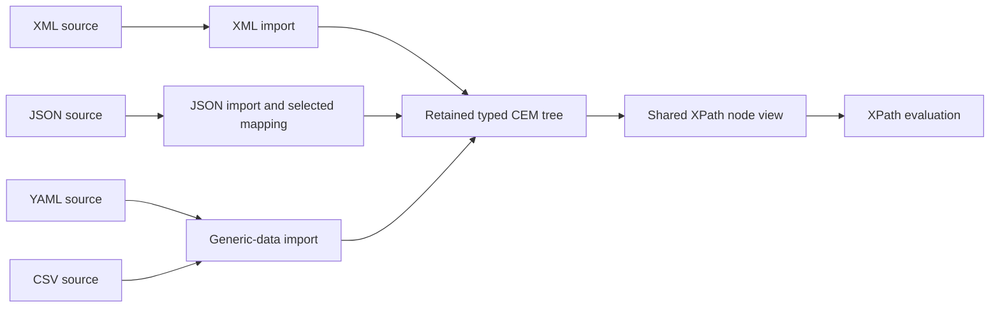

# Shared XPath view of imported CEM trees

User direction, 2026-09-17: XPath must consume the CEM tree produced by an
import, with the same query machinery for XML and JSON. JSON-specific behavior
belongs in import. This document records the design analysis and implementation
sequence. The shared native view and data-reader binding are implemented and
verified through native, WASM and browser tests. Evidence and remaining legacy
binding migrations are tracked in [todo.md](todo.md).
The format-wide [import principle](cem-data-import-principle.md) is normative.



## Original gap (resolved by the shared view)

The default reader already builds a `CemDocument` from both formats and retains
the original native owner. Its `CemAstView` exposes that tree to CEM-QL. The
explicit JSON-to-XML projection also produces a `CemDocument` directly.

The previous XPath reader took a different route: `projection=xpath` required
XML and wrapped its parser events in `XPathNativeNode`. Its node handles,
navigation, bounded string-value traversal and source metadata addressed an
`XmlDocumentAst`. Named-function argument binding accepted `XPathQueryItem` but
could not accept an imported CEM node. The shared CEM-tree XPath view now supplies
that capability.

Relevant implementation:

- [Typed CEM document](../packages/cem_ml/src/parser/document.rs) and
  [node kinds](../packages/cem_ml/src/parser.rs).
- [Reader and retained CEM view](../packages/cem_ql/src/eval/data.rs).
- [Shared data import](../packages/cem_ml/src/import.rs),
  [retained tree](../packages/cem_ml/src/parser/tree.rs) and
  [reader retention](../packages/cem_ql/src/eval/data/xpath_view.rs).
- [Native XPath nodes](../packages/cem_ml/src/validation/xpath/node.rs) and
  [bounded text traversal](../packages/cem_ml/src/validation/xpath/text.rs).
- [Named-function binding](../packages/cem_ql/src/xpath/functions.rs).

## Import owns the vocabulary

Both existing JSON mappings should be consumable by the same XPath view:

- `cem` produces the existing `cem:generic-data` object/property/value tree,
  also used by other data imports.
- `json-to-xml` produces the standard `map`, `array`, `string`, `number`,
  `boolean` and `null` elements in the XPath-functions namespace, with member
  names in `@key`. The mapping handles arbitrary member names and preserves
  explicit null nodes and array order. See the
  [W3C mapping](https://www.w3.org/TR/xpath-functions-31/#json-to-xml-mapping).

Changing the mapping changes the tree vocabulary and thus authored paths. It
does not change the evaluator. Keep the existing default projection and its
identity; XPath support does not require selecting a new JSON default.

For example, importing `{"qty":3,"note":null}` with `json-to-xml` produces
the semantic equivalent of this XML, shown only to explain the tree:

```xml
<fn:map xmlns:fn="http://www.w3.org/2005/xpath-functions"><fn:number key="qty">3</fn:number><fn:null key="note"/></fn:map>
```

With that namespace bound, ordinary XPath can select
`/fn:map/fn:number[@key='qty']` and test
`exists(/fn:map/fn:null[@key='note'])`. The mapping's `map` element is an element
node; native XPath map/array values remain separate explicit values. No
`fn:parse-json` implementation or automatic map conversion is required to query
this tree.

The existing
[`project_json_to_xml`](../packages/cem_ml/src/validation/json_xml.rs) already
constructs these CEM nodes directly. An intermediate XML-shaped model is useful;
serializing XML text and parsing it again adds no needed capability. Duplicate
key policy, escaping and accepted JSON syntax remain import responsibilities.

## Shared node and ownership contract

Place the retained tree capability in `cem-ml`, where XPath and importers can
use it without depending on CEM-QL's private reader types. The capability owns
the typed document, native source retention, source metadata and any generic
semantic metadata required by the view. Concrete Rust types remain an
implementation detail.

The XPath view supplies node kind, expanded name, parent/children/attributes,
document order, semantic values, provenance and stable node identity. Retaining
a selected node must retain its document and source owner. Repeated adaptation
of one retained tree must reuse its node identities; independently imported
documents must remain distinct even when their bytes match. Cache retention,
replacement and disposal must preserve the existing bounded lifecycle.

Named XPath functions should accept an actual retained CEM node through this
capability. Recognizing the native type is sufficient; inspecting record fields
or serializing the tree is unnecessary. Import projection and XPath adaptation
are separate operations, so a JSON import should not need a second,
JSON-specific query-view switch. Existing XML XPath entry points should delegate
to the common view after parity verification.

The canonical input here is the typed native tree. A presentation dump of an AST
is a separate artifact and must not become the query data model accidentally.

## Semantic parity must be established before switching XML

The source-preserving CEM AST and the XPath data model have different purposes.
The shared view must coalesce adjacent text-like nodes, omit empty child text,
handle namespace declarations and XML declarations correctly, and preserve
logical parent/order/identity and all contributing source spans. These are
node-model operations, independent of the imported JSON vocabulary. The
[XDM node constraints](https://www.w3.org/TR/xpath-datamodel-31/#Nodes)
require distinct node identities and prohibit consecutive text children.

Some normalization must happen while the importer still knows the source
syntax. In XML, a literal CR is normalized while `&#13;` preserves CR. The
previous CEM importer could merge decoded references with literal text before
this distinction has been captured as semantic values. A generic XPath view
cannot recover it from the merged value alone. Applying XML line-ending rules
to JSON string values would also change the imported data incorrectly.

Have import produce the needed semantic values/metadata alongside the retained
source tree. Preserve existing source-oriented CEM fields and lexical ASTs;
XPath consumes the semantic view. Cover attribute normalization, PI target/data,
namespace metadata and document source identity in the same audit. No JSON
tag-name checks or source-format branches belong in XPath navigation,
atomization, comparisons or functions.

Use [the existing XML view fixtures](../packages/cem_ml/tests/xpath_xml_view.rs)
as the parity baseline. Add native fixtures before production changes:

1. Evaluate ordinary paths, predicates, scalar functions and returned nodes
   against XML and JSON imports through the same typed-tree entry point.
   Equivalent imported trees must produce equivalent query results; source
   provenance and document identities remain specific to each import.
2. Cover both JSON mappings, nested/heterogeneous arrays, arbitrary and
   duplicate keys, null versus absent members, empty strings, numeric spelling
   and import escaping. Query results must retain the original JSON owner.
3. Preserve XML text/CDATA/entity runs, literal versus referenced CR, attribute
   values, namespace shadowing, comments, PIs, declarations, document order,
   node identity and merged source spans. Keep default CEM views unchanged.
4. Verify returned nodes nested inside XPath maps/arrays, repeated invocation,
   cache eviction/disposal, cancellation and the existing item/text/work limits.
   Reject malformed/unsupported native trees explicitly.
5. Verify named-function binding and compiled-program reload before downstream
   WASM and browser coverage. Demonstrate ordinary imported roots reaching XPath
   without a JSON-specific runtime path.

## Loader integration and later AST streaming

The user selected the [CEM-ML loader plan](cem-data-loader-plan.md) on 2026-09-17.
A loader custom element uses the library to load XML and JSON into the same
retained CEM-ML document/AST tree, with request lifecycle behavior modeled on
legacy `http-request`. Runtime code and samples consume native CEM nodes;
JavaScript document objects are removed from the data path. Worker ownership,
replacement, stale-result handling and disposal remain implementation tasks.

The first delivery publishes a complete materialized tree. Progressive CEM-ML
AST stream consumption is recorded as an accepted later phase in the loader
plan and wishlist. The common XPath view supplies the query model for the
materialized tree; it does not imply every XPath query can execute incrementally.
