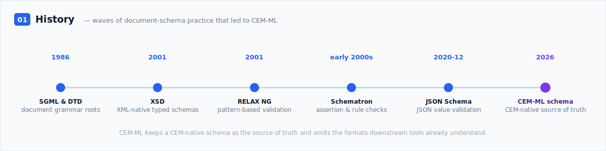
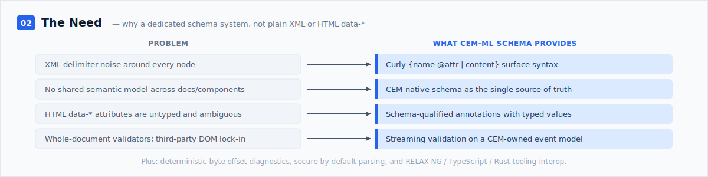
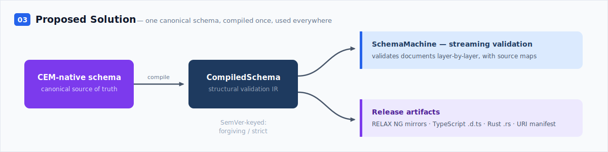
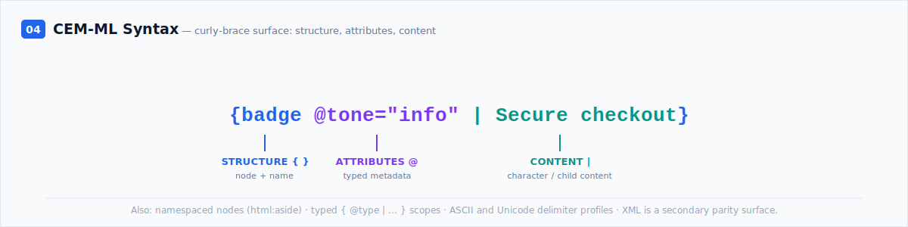
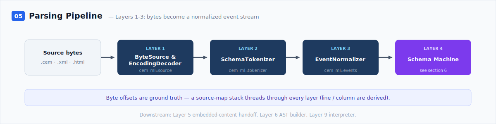
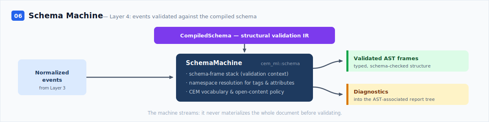
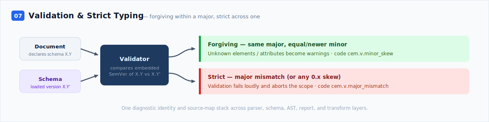
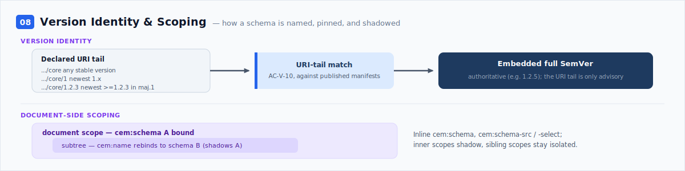
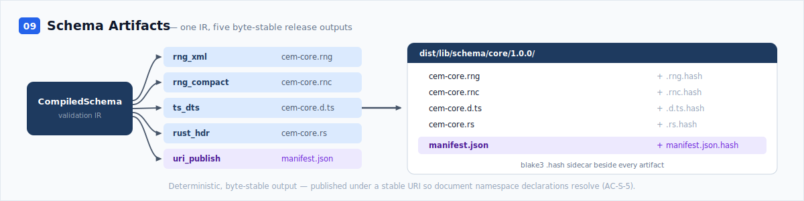
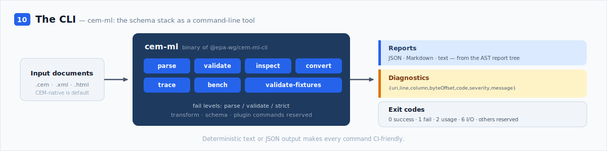

# CEM-ML Schema — A Presentation

> **Non-normative overview.** This is a *secondary* document — a narrative introduction to the
> CEM-ML schema system, meant to be read top to bottom. It is **not** a specification and **must
> not** be used for decision-making or code design. The canonical, authoritative sources are:
>
> - [`cem-ml-ac.md`](../cem-ml-ac.md) — acceptance criteria (the testable contract);
> - [`cem-ml-stack-design.md`](../cem-ml-stack-design.md) — the architecture design;
> - [`cem-ml-stack-design-impl.md`](../cem-ml-stack-design-impl.md) — the implementation design.
>
> Where this document and a canonical source disagree, the canonical source wins. Snapshot as of
> **2026-05-21**; details below may drift as implementation continues.

CEM-ML is the schema-defined parser and document-runtime foundation of the CEM project — the layer
that lets documentation, components, transforms, and demos all share one validated semantic model.
This presentation walks from the problem CEM-ML schema solves, through the proposed solution, to a
layer-by-layer tour from authoring syntax to the command-line tool. Each section opens with an
illustrative banner.

## Contents

1. [History](#1-history)
2. [The Need](#2-the-need)
3. [Proposed Solution](#3-proposed-solution)
4. [CEM-ML Syntax](#4-cem-ml-syntax)
5. [Parsing Pipeline](#5-parsing-pipeline)
6. [Schema Machine](#6-schema-machine)
7. [Validation and Strict Typing](#7-validation-and-strict-typing)
8. [Version Identity and Scoping](#8-version-identity-and-scoping)
9. [Schema Artifacts](#9-schema-artifacts)
10. [The CLI](#10-the-cli)

---

## 1. History



Before CEM-ML, document schemas grew through several waves of industry practice.

**SGML and DTDs** were the starting point for structured markup. SGML was standardized as
ISO 8879:1986, and XML 1.0 later arrived as a web-oriented subset of SGML. DTDs gave documents a
grammar: element declarations, attribute-list declarations, entities, default values, and a
`DOCTYPE` hook that could connect an instance document to the declarations that described its
shape.

**XSD** — W3C XML Schema — came next as XML moved from publishing into data exchange. In 2001 W3C
released XML Schema as a Recommendation in three parts: primer, structures, and datatypes. XSD made
schema documents XML documents, added namespace-aware vocabulary design, introduced a rich datatype
system, and became attractive for data binding and enterprise integration. Its tradeoff was
complexity: the model is powerful, but the language couples structural validation, type assignment,
and post-validation information in ways that can be heavy for document-oriented markup.

**RELAX NG** responded from the document-schema side. The OASIS 2001 specification describes a
simple XML schema language based on patterns over the structure and content of XML documents; its
official history places it in ISO/IEC 19757-2 and traces it to TREX and RELAX Core. RELAX NG kept
mixed content and extensible document shapes pleasant to model, and its compact syntax made schemas
readable without giving up an XML form for tools.

**Schematron** filled the rule gap. Instead of only saying which children and attributes are
allowed, it lets a schema make assertions over selected nodes, usually with XPath-style tests, and
emit human-oriented diagnostics. ISO Schematron is part of the DSDL family, and the common XSLT
"skeleton" implementation has been in use since the early 2000s. In practice Schematron became the
place for business rules and cross-field constraints that grammar languages express poorly.

**JSON Schema** carried the same idea into JSON APIs. Draft 2020-12 is split into Core and
Validation, with vocabularies for validation, metadata, format handling, content, and output. JSON
Schema is strong where the data is already JSON: it documents object shapes, constrains values,
supports references, and gives API tooling a common contract. It is less natural for mixed-content
document markup, namespaces, and streaming parser scopes.

That history explains CEM-ML's shape: it does not try to replace every schema format. It takes the
document grammar lessons from DTD and RELAX NG, the typed contract lessons from XSD and JSON Schema,
and the business-rule lesson from Schematron, then keeps **CEM-native schema** as the source of
truth and emits the formats that downstream tools already understand.

| Format | Native strengths | Known tradeoff | Relationship to CEM-ML schema |
|--------|------------------|----------------|-------------------------------|
| DTD | Grammar for elements, attributes, entities, defaults, and document-type declarations. | Weak datatype and namespace story; validation is tied to XML parser/entity behavior. | Historical root for "schema as document contract"; CEM avoids DTD entity/default coupling and uses explicit CEM namespaces. |
| XSD | XML-native schema documents, namespaces, rich datatypes, identity constraints, and data-binding support. | Powerful but complex; type assignment and validation metadata are heavier than CEM's streaming MVP needs. | Downstream adapter only when a consumer requires it; CEM keeps the canonical IR smaller and emits TypeScript/Rust headers separately. |
| RELAX NG | Pattern-based XML validation, good mixed-content modeling, XML and compact syntaxes, strong validator ecosystem. | Structural grammar only; business rules and rich diagnostics need companion layers. | Primary XML mirror for CEM schemas: `rng_xml` and `rng_compact` artifacts provide external validation parity. |
| Schematron | Assertion/rule validation, cross-field checks, phaseable rule sets, useful diagnostic text. | Not a structural grammar; often runs as a separate rule pass. | CEM's semantic rule registry and diagnostics cover this role inside the SchemaMachine rather than as a separate `.sch` artifact. |
| JSON Schema | JSON object/array/value validation, references, vocabularies, metadata, API documentation, standard output shapes. | Best for JSON values, not namespace-rich mixed markup or streaming XML/HTML/CEM parser scopes. | Influences manifest and tooling thinking, but CEM schema artifacts stay CEM-native plus XML/type-header outputs. |
| CEM-ML schema | Canonical CEM-native syntax, streaming `SchemaMachine`, semantic rules, source-map diagnostics, stable URI manifest, TypeScript/Rust headers, RELAX NG mirrors. | Purpose-built for CEM documents, not a general-purpose replacement for every schema ecosystem. | Owns the source of truth and projects into established formats where interoperability matters. |

The CEM project began in January 2026 as an Nx monorepo whose first deliverable was the
design-token and theme core (`packages/cem-theme`) — canonical token specs compiled into CSS, DTCG
JSON, and native outputs. The roadmap then framed a larger goal: a *schema-defined parser and
document runtime* (Roadmap Phase 2) that components, docs, transforms, and demos could all share.

That runtime needed a deliberate foundation, so the work opened with an Architecture Decision
Record — the Parser & Schema ADR (2026-05-07). It surveyed Java XML precedents and the Rust
ecosystem, and set the load-bearing decisions: a CEM-owned parser and event boundary (no
third-party DOM as the public surface), RELAX NG as the primary XML schema mirror, generated
CEM-specific validators rather than a general RELAX NG runtime, and secure-by-default parsing.

From there the schema work moved quickly. The schema-compiler output module was designed and its
open questions resolved on 2026-05-19; the RELAX NG, TypeScript `.d.ts`, and Rust `.rs` emitters
landed on 2026-05-20; and stable-URI publication followed on 2026-05-21. The banner above traces
that arc.

*External sources: Library of Congress [SGML](https://www.loc.gov/preservation/digital/formats/fdd/fdd000465.shtml)
and [DTD](https://www.loc.gov/preservation/digital/formats/fdd/fdd000076.shtml) format notes;
W3C [XML 1.0](https://www.w3.org/TR/xml/) and
[XML Schema](https://www.w3.org/news/2001/xml-schema-becomes-a-w3c-recommendation/)
Recommendation notes; OASIS / ISO [RELAX NG](https://relaxng.org/) pages;
[Schematron](https://schematron.com/) project notes; [JSON Schema Draft
2020-12](https://json-schema.org/draft/2020-12); XML.com
[schema-language comparison](https://www.xml.com/pub/a/2001/12/12/schemacompare.html)
articles. Canonical CEM sources: `roadmap.md` §Phase 2; `cem-ml-parser-schema-adr.md`.*

---

## 2. The Need



Why build a dedicated schema system at all — why not just use XML, or HTML with `data-*`
attributes?

XML carries real strengths: a clean separation of structure, attributes, content, namespaces, and
parser scopes. But it pays for that with delimiter noise around every node. HTML is ubiquitous, but
`data-*` attributes are untyped, unvalidated, and semantically ambiguous — there is no way to state
what a value *means*, or to check it.

CEM needs a *shared semantic model*: one description of consumer-experience concepts — actions,
badges, messages, states — that documentation, components, transforms, and demos can all consume
without re-encoding the same structure in five different formats.

It also needs that model to be enforced *cheaply and safely*: validation that streams rather than
buffering whole documents; diagnostics anchored to exact byte offsets; parsing that treats every
input as untrusted; and a public data surface that is CEM-owned rather than borrowed from a
third-party DOM crate. Finally, the model has to *interoperate* — existing RELAX NG validators and
TypeScript or Rust toolchains should be able to consume it directly. The CEM-ML schema system is
the answer to each of these needs.

*Canonical sources: `cem-ml-parser-schema-adr.md` §Context, §Decision; `cem-ml-ac.md` §2–§3.*

---

## 3. Proposed Solution



The solution is a single canonical schema, compiled once, used everywhere.

A CEM schema is authored in **CEM-native syntax** — the same curly-brace surface as CEM-ML
documents — and that authored form is the *one source of truth*. The compiler reads it and produces
a `CompiledSchema`: a structural validation IR that captures the vocabulary, allowed values,
states, namespace bindings, semantic rules, and open-content policy.

That IR then drives two things. At runtime it feeds the **SchemaMachine**, which validates
documents as a stream of events. Offline, the **schema compiler** projects it into release
artifacts: RELAX NG XML and compact mirrors for existing validators, TypeScript `.d.ts` headers for
editors and type-checkers, Rust `.rs` headers for native consumers, and a publication manifest that
exposes the schema at a stable URI.

Validation itself is keyed to SemVer — forgiving inside a compatible version range, strict across
an incompatible one (see [§7](#7-validation-and-strict-typing)). The net result: authors write one
schema; consumers get a validator, type headers in two languages, an XML mirror, and a resolvable
URI — all generated, all kept consistent.

*Canonical sources: `cem-ml-ac.md` §2; `cem-ml-stack-design.md` §13.*

---

## 4. CEM-ML Syntax



CEM-ML documents — and CEM schemas — are written in a curly-brace surface syntax designed to keep
XML's useful separations while cutting its delimiter noise. Every node is one expression:

```cem
{badge @tone="info" | Secure checkout}
```

Three visual planes do the work. `{ }` marks **structure** — a node and its name. `@` marks
**attributes** — typed metadata on the node. `|` marks the **content** boundary: everything after
it is character or child content. The equivalent XML is `<badge tone="info">Secure checkout</badge>`;
the CEM-ML form drops the angle brackets and the repeated closing tag.

The syntax also provides namespaced nodes and attributes (`html:aside`, `@html:class`), typed
content scopes (`{@type="text/html" | … }`) that switch the parser and schema content type without
adding a semantic node, reserved expression nodes (`{$ | … }`), and rich-content fences for
payloads that should skip escaping. ASCII and Unicode delimiter profiles are equivalent lexical
choices, like single versus double quotes. XML and HTML remain *parity surfaces* — accepted as
input and lowered into the same event model — but the curly-brace form is canonical.

*Canonical sources: `cem-ml-syntax.md`.*

---

## 5. Parsing Pipeline

*Layers 1–3 — bytes become a normalized event stream.*



Parsing is deliberately layered, so each stage is a separate, testable contract. The first three
layers turn raw bytes into a normalized event stream.

**Layer 1 — ByteSource & EncodingDecoder** (`cem_ml::source`) reads the input bytes and decodes the
character encoding. It also builds a line index, so positions can later be reported as line and
column.

**Layer 2 — SchemaTokenizer** (`cem_ml::tokenizer`) scans the decoded text into tokens. It runs
profile-specific tokenization — canonical CEM-ML curly syntax, plus WHATWG HTML and XML parity
profiles — but always emits into one shared vocabulary.

**Layer 3 — EventNormalizer** (`cem_ml::events`) converts those tokens into a normalized event
taxonomy: the single event shape every later layer consumes, whichever input syntax produced it.

Throughout, **byte offsets are ground truth**. Line and column numbers are *derived* from the byte
offset against the line index, never trusted from a parser. A source-map stack threads through
every layer, so a diagnostic raised deep in validation still points back to the exact source bytes.
Downstream, Layer 5 handles embedded-content handoffs, Layer 6 builds the AST, and Layer 9
interprets it.

*Canonical sources: `cem-ml-stack-design.md` §3, §5–§7.*

---

## 6. Schema Machine

*Layer 4 — where a document meets its schema.*



Layer 4 — the **SchemaMachine** (`cem_ml::schema`) — is where a document meets its schema.

It consumes the normalized event stream from Layer 3 and validates it *as it arrives*: it does not
build the whole document first. Its working state is a **schema-frame stack** — each open scope
pushes a frame holding the active schema, version identity, namespace context, and phase. As events
flow, the machine resolves namespaces for tags and attributes, checks nodes and attributes against
the schema vocabulary, and applies the schema-owned open-content policy for names it does not
recognize.

The rulebook it checks against is the `CompiledSchema` — the structural validation IR produced by
the schema compiler. The machine emits two things: validated AST frames (typed, schema-checked
structure for the later layers) and diagnostics, which flow into the AST-associated report tree
with their source-map stacks intact.

Because it is streaming and frame-based, the SchemaMachine can validate large or deeply embedded
documents without holding everything in memory, and it can recover from non-fatal errors with
tainted subtrees rather than aborting the whole parse.

*Canonical sources: `cem-ml-stack-design.md` §8; `cem-ml-stack-design-impl.md` §3.4.*

---

## 7. Validation and Strict Typing



Validation compares what a document *declares* against the schema that is *loaded*, and its
behavior is deliberately keyed to SemVer. A schema version is a pair: a stable URI and an embedded,
complete SemVer. When a document declares schema version X.Y and the loaded schema is X.Y′:

- **Forgiving mode** — same major, and the loaded minor/patch is equal or newer. The document is in
  a compatible range, so unknown elements and attributes are reported as **warnings**
  (`cem.v.minor_skew`), not errors — a newer schema may simply know more.
- **Strict mode** — the major versions differ (or, for an unstable `0.x` schema, any skew at all).
  The contract has broken, so validation **fails loudly and aborts the scope**
  (`cem.v.major_mismatch`).

Beyond version skew, validation detects unknown names under a schema-owned open-content policy,
invalid state combinations, missing accessible names, broken `id` / `for` / `aria-*` references,
and unsafe content. Crucially, every diagnostic — whether raised by the parser, schema, AST,
report, or transform layer — shares one identity and one source-map stack, so a single report model
explains a failure no matter which layer found it. Non-fatal errors recover into tainted subtrees
rather than corrupting the surrounding structure.

*Canonical sources: `cem-ml-ac.md` §3.*

---

## 8. Version Identity and Scoping



Two mechanisms keep schemas unambiguous: precise version identity, and document-side scoping.

**Version identity.** A schema is identified by a pair — a URI and an embedded full SemVer. The URI
*may* end in a version segment that acts as a partial pin: `…/core` matches any stable release,
`…/core/1` matches the newest `1.x`, and `…/core/1.2.3` matches the newest release at or above
`1.2.3` within major 1. The loader matches that URI-tail constraint against the embedded versions
of published schemas. The embedded SemVer — never the URI tail — is authoritative; the tail is only
an advisory constraint. Pre-releases are reachable only through a URI that names them exactly.

**Scoping.** A document does not pick one schema globally. A schema binding has a *scope*: it can
be declared inline (`cem:schema`) or pulled in (`cem:schema-src` / `cem:schema-select`), and it
applies to a subtree. A nested scope can rebind the same name to a different schema, shadowing the
outer binding for that subtree only; sibling scopes stay isolated. This lets one document mix
vocabularies cleanly — an HTML region inside a CEM region inside another — without ambiguity about
which schema owns which node.

*Canonical sources: `cem-ml-ac.md` §3.1; `cem-ml-stack-design.md` §13.1.*

---

## 9. Schema Artifacts



A schema is most useful when other tools can consume it. The **schema compiler output module**
takes one `CompiledSchema` and projects it into five byte-stable artifacts:

- **`rng_xml`** → a RELAX NG XML mirror (`.rng`) — validates in any RELAX NG tool;
- **`rng_compact`** → the RELAX NG compact form (`.rnc`);
- **`ts_dts`** → TypeScript declaration headers (`.d.ts`) — structural by default, with an opt-in
  `Validated<T>` brand;
- **`rust_hdr`** → Rust headers (`.rs`) for native consumers;
- **`uri_publish`** → a publication `manifest.json`, plus a blake3 `.hash` sidecar beside every
  artifact.

All outputs are **byte-stable**: emitting the same schema twice produces identical bytes, which
makes diffs meaningful and releases reproducible. They are written into a versioned publication
tree — `dist/lib/schema/<namespace-tail>/<embedded-version>/` — so a document's namespace
declaration can resolve to exactly the schema it names. The manifest records each artifact's path,
content hash, and size; the sidecars let any consumer verify a single artifact without parsing the
manifest.

The net effect: author a schema once, and a validator, two language headers, an XML mirror, and a
resolvable URL all fall out of one build command.

*Canonical sources: `cem-ml-stack-design.md` §13.2; `cem-ml-stack-design-impl.md` §3.4.2.*

---

## 10. The CLI



Everything above is reachable from one command-line tool: **`cem-ml`**, the binary of the
`@epa-wg/cem-ml-cli` package.

The CLI exposes the stack as a set of verbs: **parse** one input into structured output;
**validate** one or more inputs and emit diagnostics; **inspect** parsed output as a summary, tree,
AST, events, or source-offset view; **convert** between CEM-native, XML, and HTML projections;
**trace** parser and validator work deterministically; **bench** parse and validate performance;
and **validate-fixtures** for the canonical fixture corpus. Transform, schema, and plugin commands
are reserved until those subsystems are designed.

Input format is selectable — CEM-native, XML, or HTML — with CEM-native as the default. A *fail
level* of `parse`, `validate`, or `strict` controls how strict a run is. Output is available as
JSON, Markdown, or text, all rendered from the same canonical AST report tree, so one run is
equally useful to a human and to CI.

Two contracts make it scriptable: a fixed diagnostic shape —
`{uri, line, column, byteOffset, code, severity, message}` — and a stable exit-code policy (`0`
success, `1` failure, `2` usage error, `6` I/O, others reserved). Deterministic text or JSON output
makes every command safe to gate a pipeline on.

*Canonical sources: `cem-ml-cli-contract.md`; `cem-ml-cli-plan.md`.*

---

*End of presentation. Banner diagrams are hand-authored SVGs under [`assets/`](assets/), each
1200×300 and editable as text. For the authoritative detail behind any section, follow its
*Canonical sources* line.*
