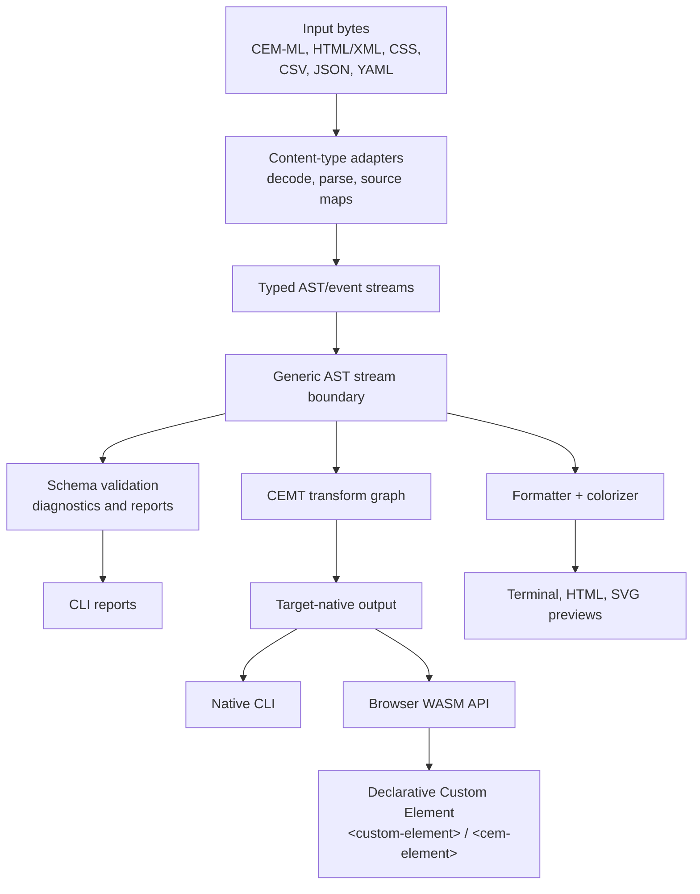

# CEM-ML Project Summary For Declarative Amsterdam

This is a working introduction/summary draft for presenting CEM-ML at
Declarative Amsterdam.

## Online Introduction Patterns Reviewed

Strong technical project introductions generally follow the same order:

1. Name the project category in one sentence.
2. State the user-facing problem or value before listing internals.
3. List capabilities as verbs, not as a pile of nouns.
4. Mention implementation and deployment surfaces after the concept is clear.
5. Use a small architecture diagram to show the one mental model the audience
   should keep.

Examples reviewed:

- Declarative Amsterdam frames the conference around declarative programming
  and declarative data, with topics including XML, JSON, CSS, parsing, data
  modelling, grammars, and domain-specific languages:
  <https://declarative.amsterdam/>
- The 2024 Declarative Custom Element abstract leads with a concrete authoring
  promise: app development without JavaScript, using HTML and XSLT markup:
  <https://declarative.amsterdam/presentations/program-2024>
- Tree-sitter introduces itself first as a parser generator and incremental
  parsing library, then explains speed, robustness, and embeddability:
  <https://tree-sitter.github.io/tree-sitter/>
- Wasmtime introduces the runtime category first, then CLI/library embedding,
  then properties like fast, secure, configurable, and standards-compliant:
  <https://docs.wasmtime.dev/>
- Deno introduces the runtime, languages, secure defaults, and developer
  experience before deeper feature detail:
  <https://docs.deno.com/runtime/>
- Vite uses a terse product sentence, then groups features into visible
  developer outcomes:
  <https://vite.dev/>

The pattern to copy is not the marketing tone. It is the compression: category,
purpose, pipeline, surfaces.

## Critique Of The Draft

Original draft:

> Thinking of how to introduce CEM-ML. It is aa multi content type AST DOM
> stream engine with various services around. From CLI for data data validation
> with custom schema, transformation graph to formatter/colorizers on terminal
> and HTML. Written in CEM-ML and Rust and compiled into Linux native CLI and
> WASM for browser. It's streaming transfromation async API is used by
> Declarative Custom Element(DCE) <custom-element>. All major markups and HTML
> stack with css & js. (think what image/diagram would be useful)

What works:

- It has the right raw ingredients: multiple content types, AST/event streams,
  schema validation, transform graphs, formatter/colorizer output, native CLI,
  WASM, and Declarative Custom Element integration.
- It correctly treats the CLI and browser runtime as surfaces over the same
  engine, not as separate products.
- It points toward the main audience fit for Declarative Amsterdam: declarative
  data, markup, schemas, parsing, and transformation.

What needs tightening:

- The first sentence is too implementation-heavy. "multi content type AST DOM
  stream engine" is accurate-ish, but it does not tell the audience what problem
  CEM-ML solves.
- "AST DOM stream" mixes terms. Prefer "source-map-bearing AST/event stream" or
  "document lifecycle engine". DOM is one projection, not the whole spine.
- "various services around" sounds vague. Name the services: validation,
  conversion, transform graph execution, formatting, coloring, reports, and
  previews.
- "Written in CEM-ML and Rust" needs precision. The engine is Rust. Schemas,
  package manifests, formatter/colorizer resources, and transformation
  contracts are authored in CEM-ML/CEMT.
- "All major markups and HTML stack with css & js" overclaims unless JavaScript
  support is being presented as future work or host integration. The current
  safer phrasing is: CEM-ML covers the HTML/XML family plus CSS, CSV, JSON,
  YAML, XSLT, CEM-QL, and projection packages. JavaScript-like object inputs
  such as JSONP belong in the future generic AST stream pattern.
- The DCE relationship should be a result, not the definition. CEM-ML powers the
  async transformation API used by Declarative Custom Element; it is not only a
  DCE implementation detail.
- Fix copy issues: "aa", "data data", "transfromation", and "It's" -> "Its".

## Recommended One-Sentence Introduction

CEM-ML is a declarative document lifecycle engine that validates, transforms,
formats, and renders structured content by lowering many source formats into a
source-map-bearing AST/event stream.

## Conference Summary Draft

CEM-ML is a declarative document lifecycle engine for structured content. It
reads sources such as CEM-ML, CSV, JSON, YAML, CSS, and the HTML/XML family into
typed, source-map-bearing AST/event streams; validates them against
schema-package contracts; and then converts, transforms, formats, colors, or
renders them through the same pipeline.

The project has two authoring layers. The core runtime is written in Rust and
builds as a Linux-native CLI and as WebAssembly for browser hosts. The domain
contracts are declarative: schemas, package manifests, formatter/colorizer
resources, and transform templates are authored as CEM-ML and CEMT package
assets rather than hard-coded as format-pair shortcuts.

For command-line users, `cem-ml` provides validation, conversion, transform
graph execution, reports, terminal output, and HTML/SVG previews. For browser
users, the same engine exposes an async WASM API used by Declarative Custom
Element (`<custom-element>`) and the planned `<cem-element>` substrate, so
declarative components can parse data, run transformations, and render light DOM
without moving the document semantics into handwritten JavaScript.

## Short Spoken Version

CEM-ML is the OSS document engine underneath the next Declarative Custom Element
runtime. It takes many structured content types, lowers them into one
source-mapped AST/event stream, and runs validation, conversion, transformation,
formatting, and coloring from declarative schema packages. The engine is Rust,
but the package semantics are CEM-ML and CEMT, and it runs both as a native CLI
and as browser WASM.

## Ultra-Short Program Blurb

CEM-ML is a Rust and WASM document lifecycle engine for declarative validation,
conversion, transformation, and rendering across CEM-ML, HTML/XML, CSS, CSV,
JSON, and YAML, with schema-package-defined behavior and source-map-preserving
AST streams.

## Suggested Diagram

Use one pipeline diagram. The audience should remember that many content types
enter one declarative lifecycle spine, and multiple user surfaces come out.

Slide/image direction:

- Main visual: a vertical pipeline with colored input lanes merging into one
  AST/event stream spine.
- Show source maps as a thin trace line running under the pipeline from input
  bytes to diagnostics and output spans.
- Put `package.cem`, schema `.cem`, formatter `.cemt`, and colorizer `.cemt`
  beside the middle of the pipeline to make the declarative ownership visible.
- Put CLI and WASM/browser at the far right as deployment surfaces, not as
  separate architectures.

## Recommended Refinement For The Original Draft

If you want to stay close to the original wording:

CEM-ML is a multi-content-type document lifecycle engine. It lowers CEM-ML,
HTML/XML, CSS, CSV, JSON, YAML, and related schema-package inputs into
source-map-bearing AST/event streams, then runs validation, conversion,
transform graphs, formatting, and terminal/HTML colorizing through the same
declarative pipeline. The runtime is written in Rust and builds as a Linux
native CLI and browser WASM. The schemas, transformation contracts, formatter
profiles, and colorizer profiles are authored in CEM-ML/CEMT. Declarative
Custom Element uses its async WASM API to power `<custom-element>` and the
future `<cem-element>` browser substrate.
