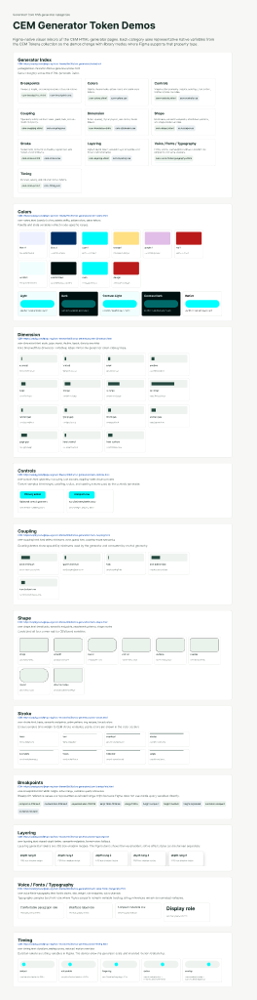

# CEM Figma Token Workflow

The Figma workflow is a native Figma library generated from token artifacts. Markdown token specs remain the source of
truth; Figma changes must be converted into spec edits before they enter the build.

## Native Figma Library Setup

1. Run the token export pipeline so `packages/cem-theme/dist/lib/tokens/figma/` contains:
    - `cem-light.tokens.json`
    - `cem-dark.tokens.json`
    - `cem-contrast-light.tokens.json`
    - `cem-contrast-dark.tokens.json`
    - `cem-native.tokens.json`
    - `cem-figma-report.md`
2. In the `CEM UI Kit`, create or refresh one native Figma variable collection named `CEM Tokens`.
3. Import each generated file as a separate mode:
    - `Light`
    - `Dark`
    - `Contrast Light`
    - `Contrast Dark`
    - `Native`
4. Keep the library read-only from generated artifacts. Do not treat Figma edits as source changes.
5. Before sharing the collection, check `cem-figma-report.md` for excluded tokens, concrete alias fallbacks, warnings,
   and validation errors.

`native` mode values are Chromium-computed browser-reference values. They are not iOS or Android system color
equivalents.

## Sample Application

Use [sample-token-application.md](./sample-token-application.md) as the local fixture for applying imported variables
to a button and card in the CEM UI Kit. Replace it with screenshots after the native Figma library variables have been
validated in the real file.

## Native Library Validation

Validation run: 2026-04-30.

Validated CEM UI Kit file:
https://www.figma.com/design/vLZUzjS7xHACjXgYLA9vtD/CEM-UI-Kit?node-id=2-24&t=QQwTKeMg0v9dTQ10-1

Result:

- `CEM Tokens` collection exists.
- Modes: `Light`, `Dark`, `Contrast Light`, `Contrast Dark`, `Native`.
- Variable count: 230.
- Variable types: 42 color, 100 float, 88 string.
- Missing mode values: 0.
- Variable aliases present: 255 mode values.
- `01 Tokens` includes the `CEM Generator Token Demos` frame.

Screenshot:



## Visual Parity Check

Validation run: 2026-04-30.

Web reference:

- Source: `packages/cem-theme/src/lib/css-generators/index.html`
- Screenshot: [cem-css-generators-index-web.png](./screenshots/cem-css-generators-index-web.png)
- Extracted rows: [cem-css-generators-index-web.json](./screenshots/cem-css-generators-index-web.json)

Figma reference:

- File: https://www.figma.com/design/vLZUzjS7xHACjXgYLA9vtD/CEM-UI-Kit?node-id=2-24&t=QQwTKeMg0v9dTQ10-1
- Frame: `CEM Generator Token Demos`
- Screenshot: [cem-generator-token-demos.png](./screenshots/cem-generator-token-demos.png)

Result:

- The web generator index exposes 10 generator categories: Breakpoints, Colors, Controls, Coupling, Dimension, Shape,
  Stroke, Layering, Voice / Fonts / Typography, and Timing.
- The Figma demo includes those same 10 categories plus a `Generator Index` section that documents the category source.
- The Figma category sections include the corresponding unpkg CDN source links in the section titles.
- Visual parity is category-level and token-demo-level, not pixel-level. The web page is a tabular generator index; the
  Figma page is a native design-library demo surface bound to CEM variables where Figma supports binding.

## REST API Sync Policy

Do not enable Figma REST API write/sync in local builds or CI until file import is stable and token governance exists.
If REST sync is added later, it must start as a manual script with:

- explicit Figma file id configuration
- scoped write token
- dry-run/report mode
- no default local build execution

CI REST sync may only be considered after manual sync is proven. It must be gated behind protected branch or release
workflows, required approval, secret-scoped tokens, generated diff/report artifacts, and rollback instructions.

## Developer Prompt: Refresh Native Figma Variables

Use this prompt when refreshing the native Figma Variables from generated files:

```text
Update the CEM UI Kit native Figma Variables from generated token files.
Keep one CEM Tokens collection. Use the generated files in dist/lib/tokens/figma/ as the only Figma input:
cem-light.tokens.json, cem-dark.tokens.json, cem-contrast-light.tokens.json, cem-contrast-dark.tokens.json,
and cem-native.tokens.json. Preserve read-only governance: Figma changes must become markdown spec edits, not
write-backs. Update docs/todo.md, packages/cem-theme/docs/token-export.md, and examples/figma/README.md.
```

## Developer Prompt: Split Figma Collections

Use this prompt only if Figma collection limits or designer navigation justify splitting the one-collection workflow:

```text
Update the CEM token export Figma workflow to split the single CEM collection into dimension-specific collections
only if Figma collection limits or designer navigation justify it. Proposed collections: CEM Color, CEM Dimension,
CEM Typography, CEM Motion, and CEM Platform Notes. Keep markdown specs as source of truth, keep Figma read-only,
and document cross-collection alias handling. If aliases cannot be preserved safely across collections, duplicate
only resolved values and list the loss of alias semantics in cem-figma-report.md. Update docs/todo.md,
packages/cem-theme/docs/token-export.md, and examples/figma/README.md.
```
