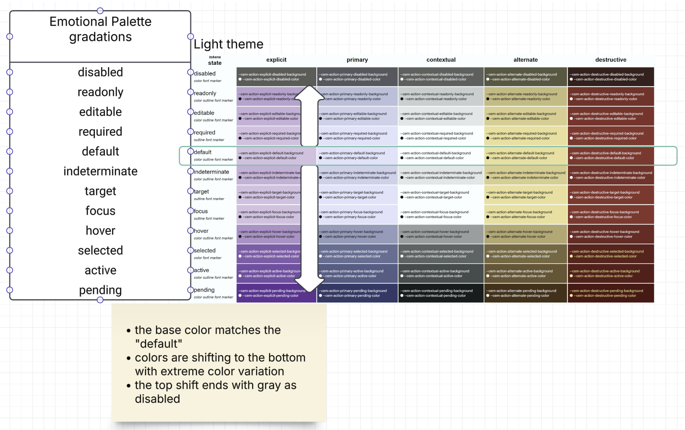

# Semantic Palettes and Action States

**Status:** Canonical (v1.0)  
**Last updated:** 2025-12-21  
**Taxonomy placement:** D0. Color (Emotional Palette)  
**Audience:** Design Systems, Product Design, Front-End Engineering

---

CEM uses **color** as the primary channel for communicating, using a **branded palette** to express:

- using **branded palette** express
- **Emotional intent:** what the interface wants the user to feel (trust, danger, creativity, etc.)
- **Interaction meaning:** what an action will do (primary, destructive, alternate, etc.)
- **State progression:** how an element's condition changes (default → hover → active → pending)

**Companion specs:**
- **D1. Space & Rhythm** ([`cem-dimension.md`](./cem-dimension.md)) — spacing scale, density modes, and layout gaps
- **D2. Coupling & Compactness** ([`cem-coupling.md`](./cem-coupling.md)) — density affects perceived color intensity and separability
- **D3. Shape — Bend** ([`cem-shape.md`](./cem-shape.md)) — rounded shapes soften color impact
- **D4. Layering** ([`cem-layering.md`](./cem-layering.md)) — tonal shifts for depth perception (recess/lift)
- **D5. Stroke & Separation** ([`cem-stroke.md`](./cem-stroke.md)) — focus/selection colors; D0 defines hue, D5 defines geometry
- **D6. Typography** ([`cem-voice-fonts-typography.md`](./cem-voice-fonts-typography.md)) — text contrast requirements
- **D7. Time & Motion** ([`cem-timing.md`](./cem-timing.md)) — color transition timing

## Table of contents

1. [Scope](#1-scope)
2. [Design principles](#2-design-principles)
3. [Token taxonomy](#3-token-taxonomy)
4. [Base branded color family](#4-base-branded-color-family)
5. [Emotional palette](#5-emotional-palette)
6. [Theme modes](#6-theme-modes)
7. [Action intent and state tokens](#7-action-intent-and-state-tokens)
8. [Zebra outline colors](#8-zebra-outline-colors)
9. [System colors and forced-colors](#9-system-colors-and-forced-colors)
10. [Component mapping checklist](#10-component-mapping-checklist)
11. [Accessibility and QA](#11-accessibility-and-qa)
12. [Implementation guidance](#12-implementation-guidance)
13. [Governance and versioning](#13-governance-and-versioning)
14. [Canonical token summary](#14-canonical-token-summary)
15. [References](#15-references)

---

## 1. Scope

### 1.1 What D0 controls (and what it does not define)

D0 (Color) defines:

- The **semantic meaning** of color: emotional palette, action intent colors, and state colors.
- **System/forced-colors mapping** for survivable theming in high-contrast environments.
- The **color endpoints** used by other dimensions (e.g., zebra stripe *colors*).

D0 (Color) does **not** define:

- Stroke geometry (ring widths, stripe layout, offsets): see **D5 Stroke**.
- Spacing/density and hit targets: see **D1 Space & Rhythm**.
- Layer depth/physical appearance (shadows, blur): see **D4 Layering**.
- Motion durations/easing: see **D7 Motion**.

This spec defines **consumer-semantic color tokens** for CEM:

- A compact **branded color family** (`--cem-color-*`) used as implementation substrate.
- An **emotional palette** (`--cem-palette-*`) that expresses *meaning* in user language (comfort, trust, danger, etc.).
- **Action intent and state tokens** (`--cem-action-*`) for buttons/steps and other “do something” controls.
- **Zebra outline colors** (`--cem-zebra-*`) used with D5 Stroke to express selection/focus/target without relying on
  fill.
- **System/forced-colors integration** so CEM remains accessible and compatible with platform theming.

Non-goals:

- This document does not define shape/stroke/spacing metrics (see D5 Stroke, D1 Space, etc.).
- This document does not prescribe a single brand palette; it specifies semantic endpoints and default reference
  mappings.

---

## 2. Design principles

### 2.1 Consumer-semantic meaning first

Tokens are named for **what the user experiences** (comfort, danger, trust) and for **flow semantics** (primary, 
destructive, selected, pending), rather than for RGB/hex values.

### 2.2 State separation is multi-channel

CEM intentionally separates meaning across channels:

- **Background/fill** for “background-driven” states (default/hover/active/pending/disabled).
- **Zebra outline** (D5 + `--cem-zebra-*`) for high-salience but non-fill states (focus/target/selected).
- **Marker/text** for required/indeterminate and other information-bearing states.

This avoids overloading color fill and improves accessibility in compact/dense UIs.

### 2.3 Forced-colors is first-class

### 2.4 Bounded variation (governance by design)

To avoid “palette explosion”, D0 constrains variation intentionally:

- **Stable semantic set:** emotions and action intents are a fixed vocabulary.
- **Fixed brightness variants:** branded hues use a small set of variants (`xl`, `l`, `d`, `xd`), not per-component
  shades.
- **Formulaic state progression:** hover/active/pending are derived via `color-mix()` rather than hand-picked colors.
- **Theme modes are adapters:** theme modes remap the same semantics; they do not introduce new semantics.

### 2.5 Cross-dimension coupling (informative)

- **D0 → D4 (Layering):** surface/overlay colors must preserve legibility as layers change.
- **D0 → D5 (Stroke):** focus/selection meaning is primarily expressed via **outline channels** (zebra) where fill must
  not be relied upon.
- **D0 → D6 (Typography):** text tokens and weight strategies exist to preserve contrast when fills collapse.
- **D0 → D7 (Motion):** color changes should align with feedback timing (e.g., hover is immediate; pending is
  persistent).

When forced-colors is active, **system colors win**. CEM must preserve semantics using `Canvas`, `CanvasText`,
`Highlight`, `SelectedItem`, etc., and avoid losing meaning when shadows/glows are dropped by the UA.

---

## 3. Token taxonomy

### 3.1 Consumer color vocabulary (informative)

**Emotional terms** (what the interface wants the user to feel):
###### cem-palette-emotion
| Term         | Primary palette token        | Typical usage                             |
|--------------|------------------------------|-------------------------------------------|
| comfort      | `--cem-palette-comfort`      | canvas/surfaces, low-salience backgrounds |
| calm         | `--cem-palette-calm`         | subtle affordances, secondary emphasis    |
| trust        | `--cem-palette-trust`        | explicit emphasis, strong call-to-action  |
| enthusiasm   | `--cem-palette-enthusiasm`   | alternate emphasis, “positive energy”     |
| creativity   | `--cem-palette-creativity`   | primary emphasis, “go forward” actions    |
| danger       | `--cem-palette-danger`       | errors, destructive affordances           |
| conservative | `--cem-palette-conservative` | neutral/disabled, “quiet UI”              |

**Action terms** (what an action will do):
###### cem-action-kind
| Term        | Intent token prefix          | Typical usage                 |
|-------------|------------------------------|-------------------------------|
| primary     | `--cem-action-primary-*`     | default “go forward” action   |
| explicit    | `--cem-action-explicit-*`    | strong call-to-action         |
| contextual  | `--cem-action-contextual-*`  | within-context action         |
| alternate   | `--cem-action-alternate-*`   | secondary/alternate action    |
| destructive | `--cem-action-destructive-*` | deletion, irreversible change |

**State terms** (how condition changes):

| State                      | Channel           | Notes                                          |
|----------------------------|-------------------|------------------------------------------------|
| disabled/readonly/editable | background + text | subdued progression (see §7.2)                 |
| hover/active/pending       | background + text | formulaic `color-mix()` progression (see §7.2) |
| focus/selected/target      | outline (zebra)   | do not rely on fill alone (see §8)             |

### 3.2 Token model: branded → emotional → action

```
Branded hues (implementation substrate)
  --cem-color-{hue}-{variant}
        │
        ▼
Emotional palette (semantic contract)
  --cem-palette-{emotion} (+ -x / -text / -text-x)
        │
        ▼
Action intents (consumer-facing API)
  --cem-action-{intent}-{state}-{attribute}
```

### 3.3 Why three layers?

- **Brand control:** adjust the branded family without breaking product semantics.
- **Semantic stability:** emotions/intents remain stable across themes.
- **Implementation clarity:** components consume action/state endpoints; they do not depend on raw hues.

CEM color endpoints are layered:

1. **Base branded family (implementation):** `--cem-color-{hue}-{variant}`
2. **Emotional palette (semantic):** `--cem-palette-{emotion}` and `--cem-palette-{emotion}-text`
3. **Action tokens (flow semantic):** `--cem-action-{intent}-{state}-{attribute}`
4. **Zebra outline colors (state channel):** `--cem-zebra-color-0..3` + strip size

**Rule:** consumers should theme primarily by adjusting **palette** and (optionally) **base colors**; product code
should depend on palette/action/zebra endpoints.

---

## 4. Base branded color family

### 4.1 Brightness variants (selection guidance)

Branded hues are provided in a small, repeatable set of brightness variants:

| Variant | Meaning (relative) | Typical role                                                           |
|---------|--------------------|------------------------------------------------------------------------|
| `xl`    | lightest           | large surface fills in light schemes; extreme contrast partner in dark |
| `l`     | light              | standard surface/intent fill in light schemes                          |
| `d`     | dark               | standard surface/intent fill in dark schemes                           |
| `xd`    | darkest            | extreme contrast partner in light schemes; deep surfaces in dark       |

### 4.2 Contrast pairing rule of thumb

When selecting a safe pairing (especially for text and outlines), prefer **opposite ends**:

- On **light** backgrounds (`xl`/`l`): pair with `d` or `xd` for text/outline.
- On **dark** backgrounds (`d`/`xd`): pair with `l` or `xl` for text/outline.

### 4.3 Neutral (grey) exception

The neutral/grey family is intentionally smaller (typically `l` + `d`) and is used primarily via the **conservative**
palette.

The base family is a small set of named hues with a few variants. These are **reference values** (from
`theme-data.xhtml`) and may be overridden by a brand, as long as the semantic palette mappings remain coherent.

### 4.4 Branded color tokens
###### cem-color-hue-variant
| Token                                 | Hue    | Variant | Value                                         | Label              | Intended use                               | Tier |
|---------------------------------------|--------|---------|-----------------------------------------------|--------------------|--------------------------------------------|-----|
| `--cem-color-blue-xl`                 | blue   | xl      | #e0e8ff                                       | Lightest blue      | Trust palette (light scene surface)        | recommended |
| `--cem-color-blue-l`                  | blue   | l       | #d7e3ff                                       | Light blue         | Trust palette, attention semantic          | recommended |
| `--cem-color-blue-d`                  | blue   | d       | #002f65                                       | Dark blue          | Trust palette (dark theme)                 | recommended |
| `--cem-color-blue-xd`                 | blue   | xd      | #001b3f                                       | Darkest blue       | Trust palette (dark scene surface)         | recommended |
| `--cem-color-brown-xl`                | brown  | xl      | #d7ccc8                                       | Extra light brown  | Conservative palette (light theme)         | recommended |
| `--cem-color-brown-l`                 | brown  | l       | #a1887f                                       | Light brown        | Conservative emotion, brand-3              | recommended |
| `--cem-color-brown-d`                 | brown  | d       | #4e342e                                       | Dark brown         | Conservative palette (dark theme)          | recommended |
| `--cem-color-brown-xd`                | brown  | xd      | #3e2723                                       | Extra dark brown   | Conservative palette (dark theme, extreme) | recommended |
| `--cem-color-cyan-xl`                 | cyan   | xl      | #f1fefe                                       | Extra light cyan   | Used for comfort palette (light scenes)    | recommended |
| `--cem-color-cyan-l`                  | cyan   | l       | #00fbfb                                       | Light cyan         | Calm palette, creativity accent            | recommended |
| `--cem-color-cyan-d`                  | cyan   | d       | #006a6a                                       | Dark cyan          | Calm palette (dark theme)                  | recommended |
| `--cem-color-cyan-xd`                 | cyan   | xd      | #001010                                       | Extra dark cyan    | Used for comfort palette (dark scenes)     | recommended |
| `--cem-color-grey-l`                  | grey   | l       | #f1f1eb                                       | Light grey         | Conservative palette, neutral backgrounds  | recommended |
| `--cem-color-grey-d`                  | grey   | d       | #1a1c18                                       | Dark grey          | Conservative palette (dark theme)          | recommended |
| `--cem-color-orange-xl`               | orange | xl      | #f0f070                                       | Extra light yellow | Enthusiasm palette (light theme)           | recommended |
| `--cem-color-orange-l`                | orange | l       | #ffe082                                       | Light orange       | Enthusiasm emotion, brand-2                | recommended |
| `--cem-color-orange-d`                | orange | d       | #723600                                       | Dark orange        | Enthusiasm hype (dark theme)               | recommended |
| `--cem-color-orange-xd`               | orange | xd      | #502400                                       | Extra dark orange  | Enthusiasm palette (dark theme, extreme)   | recommended |
| `--cem-color-purple-xl`               | purple | xl      | #f3e5f5                                       | Extra light purple | Creativity palette (light theme)           | recommended |
| `--cem-color-purple-l`                | purple | l       | #e1bee7                                       | Light purple       | Creativity emotion, brand-1                | recommended |
| `--cem-color-purple-d`                | purple | d       | #6a1b9a                                       | Dark purple        | Creativity palette (dark theme)            | recommended |
| `--cem-color-purple-xd`               | purple | xd      | #4a148c                                       | Extra dark purple  | Creativity palette (dark theme, extreme)   | recommended |
| `--cem-color-red-xl`                  | red    | xl      | #ffb4ab                                       | Extra light red    | Danger palette (light theme)               | recommended |
| `--cem-color-red-l`                   | red    | l       | #ba1a1a                                       | Light red          | Danger emotion, alert semantic             | recommended |
| `--cem-color-red-d`                   | red    | d       | #690005                                       | Dark red           | Danger palette (dark theme)                | recommended |
| `--cem-color-red-xd`                  | red    | xd      | #410002                                       | Extra dark red     | Danger palette (dark theme, extreme)       | recommended |
| `--cem-color-visitedtext-30-black`    | nat    | d       | color-mix(in srgb, VisitedText 30%, black)    | light trust-x      | Native palette Trust extreme variant       | recommended |
| `--cem-color-visitedtext-30-white`    | nat    | l       | color-mix(in srgb, VisitedText 30%, white)    | dark trust-x       | Native palette Trust extreme variant       | recommended |
| `--cem-color-mark-30-black`           | nat    | d       | color-mix(in srgb, Mark 30%, black)           | light enthusiasm-x | Native palette Enthusiasm extreme variant  | recommended |
| `--cem-color-mark-30-white`           | nat    | l       | color-mix(in srgb, Mark 30%, white)           | dark enthusiasm-x  | Native palette Enthusiasm extreme variant  | recommended |
| `--cem-color-canvastext-30-purple`    | nat    | d       | color-mix(in srgb, CanvasText 30%,  purple  ) | light creativity-x | Native palette Creativity extreme variant  | recommended |
| `--cem-color-canvastext-30-lightpink` | nat    | l       | color-mix(in srgb, CanvasText 30%, lightpink) | dark creativity-x  | Native palette Creativity extreme variant  | recommended |
| `--cem-color-red-30-black`            | nat    | d       | color-mix(in srgb, red 30%, black)            | light danger-x     | Native palette Danger extreme variant      | recommended |
| `--cem-color-red-30-white`            | nat    | l       | color-mix(in srgb, red 30%, white)            | dark danger-x      | Native palette Danger extreme variant      | recommended |
| `--cem-color-white`                   | nat    | l       | white                                         | dark trust text    | Trust and Extreme palette dark mode text   | recommended |

Variant semantics:

- `xl` / `l`: light-scene support (surfaces, containers, accents)
- `d` / `xd`: dark-scene support (surfaces, ink-safe accents)

### 4.5 Native browser colors
###### cem-color-native

[CSS system colors](https://developer.mozilla.org/en-US/docs/Web/CSS/system-color) adapt automatically to the user's
OS color scheme. In `native` mode, CEM maps palette endpoints directly to these values (see §9).

| Color              | Text pair          | Description                                          |
|--------------------|--------------------|------------------------------------------------------|
| `AccentColor`      | `AccentColorText`  | Background of accented user interface controls       |
| `AccentColorText`  | `AccentColor`      | Text of accented user interface controls             |
| `ActiveText`       | `Canvas`           | Text of active links                                 |
| `ButtonBorder`     | `Canvas`           | Base border color of controls                        |
| `ButtonFace`       | `CanvasText`       | Background color of controls                         |
| `ButtonText`       | `Canvas`           | Text color of controls                               |
| `Canvas`           | `CanvasText`       | Background of application content or documents       |
| `CanvasText`       | `Canvas`           | Text color in application content or documents       |
| `Field`            | `CanvasText`       | Background of input fields                           |
| `FieldText`        | `Canvas`           | Text in input fields                                 |
| `GrayText`         | `Canvas`           | Text color for disabled items                        |
| `Highlight`        | `HighlightText`    | Background of selected items                         |
| `HighlightText`    | `Highlight`        | Text color of selected items                         |
| `LinkText`         | `Canvas`           | Text of non-active, non-visited links                |
| `Mark`             | `MarkText`         | Background of specially marked text (e.g. `<mark>`)  |
| `MarkText`         | `Mark`             | Text of specially marked text                        |
| `SelectedItem`     | `SelectedItemText` | Background of selected items (e.g. checkbox)         |
| `SelectedItemText` | `SelectedItem`     | Text of selected items                               |
| `VisitedText`      | `Canvas`           | Text of visited links                                |

---

## 5. Emotional palette

The emotional palette is the **primary semantic contract** for color.

Reference mappings (from `theme-data.xhtml`) use `light-dark()` so a single token resolves appropriately for light vs dark schemes.

###### cem-palette-emotion-shift
| Token                               | Role                         | Light           | dark           | Native Light                       | Native Dark                           | Usage                                            | Emotion      | Shift  | tier |
|-------------------------------------|------------------------------|-----------------|----------------|------------------------------------|---------------------------------------|--------------------------------------------------|--------------|--------|------|
| `--cem-palette-comfort`             | Base comfort color           | cyan-xl         | cyan-xd        | Canvas                             |                                       | Main canvas/background                           | comfort      |        | required |
| `--cem-palette-comfort-x`           | Comfort extreme variant      | cyan-xd         | cyan-xl        | CanvasText                         |                                       | Used in color-mix for state variations           | comfort      | x      | recommended |
| `--cem-palette-comfort-text`        | Comfort text color           | cyan-xd         | cyan-xl        | CanvasText                         |                                       | Primary text on comfort backgrounds              | comfort      | text   | required |
| `--cem-palette-comfort-text-x`      | Comfort extreme text         | cyan-xl         | cyan-xd        | Canvas                             |                                       | Text on extreme variant backgrounds              | comfort      | text-x | recommended |
| `--cem-palette-calm`                | Base calm color              | cyan-l          | cyan-d         | cyan                               |                                       | Foreground elements                              | calm         |        | recommended |
| `--cem-palette-calm-x`              | Calm extreme variant         | cyan-d          | cyan-l         | rgb(0, 120, 120)                   |                                       | Inverted calm color ( darked darkcyan )          | calm         | x      | recommended |
| `--cem-palette-calm-text`           | Calm text color              | comfort-text    | comfort-text   | black                              |                                       | Text on calm backgrounds                         | calm         | text   | recommended |
| `--cem-palette-calm-text-x`         | Calm extreme text            | comfort-text-x  | comfort-text-x | white                              |                                       | Text on extreme calm backgrounds                 | calm         | text-x | recommended |
| `--cem-palette-trust`               | Base trust color             | blue-l          | blue-d         | color-mix(in srgb, Highlight 70%, black) |                                       | Explicit actions, highlights                     | trust        |        | required |
| `--cem-palette-trust-x`             | Trust extreme variant        | blue-d          | blue-l         | `--cem-color-visitedtext-30-black` | `--cem-color-visitedtext-30-white`    | Darker/lighter trust variation                   | trust        | x      | recommended |
| `--cem-palette-trust-text`          | Trust text color             | comfort-text    | white          | HighlightText                      |                                       | Text on trust backgrounds                        | trust        | text   | required |
| `--cem-palette-trust-text-x`        | Trust extreme text           | comfort-text-x  | comfort-text-x | Canvas                             | Canvas                                | Text on extreme trust backgrounds                | trust        | text-x | recommended |
| `--cem-palette-enthusiasm`          | Base enthusiasm color        | orange-l        | orange-d       | Mark                               |                                       | Brand-2, alternate actions                       | enthusiasm   |        | recommended |
| `--cem-palette-enthusiasm-x`        | Enthusiasm extreme variant   | orange-xd       | orange-xl      | `--cem-color-mark-30-black`        | `--cem-color-mark-30-white`           | Darker/lighter enthusiasm variation              | enthusiasm   | x      | recommended |
| `--cem-palette-enthusiasm-text`     | Enthusiasm text color        | comfort-text    | white          | MarkText                           |                                       | Text on enthusiasm backgrounds                   | enthusiasm   | text   | recommended |
| `--cem-palette-enthusiasm-text-x`   | Enthusiasm extreme text      | comfort-text-x  | comfort-text-x | Canvas                             |                                       | Text on extreme enthusiasm backgrounds           | enthusiasm   | text-x | recommended |
| `--cem-palette-creativity`          | Base creativity color        | purple-l        | purple-d       | ButtonFace                         |                                       | Brand-1, primary actions                         | creativity   |        | recommended |
| `--cem-palette-creativity-x`        | Creativity extreme variant   | purple-d        | purple-l       | `--cem-color-canvastext-30-purple` | `--cem-color-canvastext-30-lightpink` | Darker/lighter creativity variation              | creativity   | x      | recommended |
| `--cem-palette-creativity-text`     | Creativity text color        | comfort-text    | comfort-text   | CanvasText                         |                                       | Text on creativity backgrounds                   | creativity   | text   | recommended |
| `--cem-palette-creativity-text-x`   | Creativity extreme text      | comfort-text-x  | comfort-text-x | Canvas                             |                                       | Text on extreme creativity backgrounds           | creativity   | text-x | recommended |
| `--cem-palette-danger`              | Base danger color            | red-l           | red-d          | red-l                              | red-d                                 | Error messages, destructive actions              | danger       |        | required |
| `--cem-palette-danger-x`            | Danger extreme variant       | red-d           | red-l          | `--cem-color-red-30-black`         | `--cem-color-red-30-white`            | Darker/lighter danger variation                  | danger       | x      | recommended |
| `--cem-palette-danger-text`         | Danger text color            | comfort-text-x  | comfort-text   | Canvas                             | CanvasText                            | Text on danger backgrounds                       | danger       | text   | required |
| `--cem-palette-danger-text-x`       | Danger extreme text          | orange-xl       | orange-xl      | Canvas                             |                                       | High contrast text on extreme danger backgrounds | danger       | text-x | recommended |
| `--cem-palette-conservative`        | Base conservative color      | grey-l          | grey-d         | ButtonFace                         |                                       | Brand-3, disabled states                         | conservative |        | required |
| `--cem-palette-conservative-x`      | Conservative extreme variant | grey-d          | grey-l         | CanvasText                         |                                       | Darker/lighter conservative variation            | conservative | x      | recommended |
| `--cem-palette-conservative-text`   | Conservative text color      | comfort-text    | comfort-text   | CanvasText                         |                                       | Text on conservative backgrounds                 | conservative | text   | required |
| `--cem-palette-conservative-text-x` | Conservative extreme text    | comfort-text-x  | comfort-text-x | Canvas                             |                                       | Text on extreme conservative backgrounds         | conservative | text-x | recommended |


### 5.1 Semantics of the core emotions

- **comfort:** neutral surface/canvas
- **calm:** low-salience affordances, calm emphasis
- **trust:** explicit action affordance, highlight (the button you press)
- **enthusiasm:** alternate/secondary positive emphasis
- **creativity:** primary emphasis, “go forward”
- **danger:** errors and destructive actions
- **conservative:** low-emphasis/disabled/brand-3 support

---

## 6. Theme modes

CEM defines 5 operational modes for color behavior:

###### cem-theme-mode
| Mode             | Color scheme | Description                                           |
|------------------|--------------|-------------------------------------------------------|
| `native`         | system       | Rely on system colors (`Canvas`, `CanvasText`, etc.)  |
| `light`          | light        | Branded palette in light scheme                       |
| `dark`           | dark         | Branded palette in dark scheme                        |
| `contrast-light` | light        | Minimize fill differences; emphasize outlines/markers |
| `contrast-dark`  | dark         | Same, in dark scheme                                  |

**Normative expectations:**

- `native` MUST preserve meaning using system semantic colors (no hard-coded hex assumptions).
- `contrast-*` MUST NOT encode state primarily via background darkness; state must remain legible via zebra outline and
  markers.

---

## 7. Action intent and state tokens

Action tokens encode **user-flow intent** (primary, explicit, destructive, etc.) and **interaction/state**.


### 7.0 Visual reference: emotional palette gradations (light theme)



**Supplemental title:** Light theme — Emotional palette gradations across interaction states (action intents).

Notes (interpretation):
- The base color aligns with the `default` state row.
- As interaction escalates (hover → active → pending), tones shift toward the extreme variant (`*-x`) for higher salience.
- The upward direction ends in neutral/gray for `disabled`, preserving “less available” semantics.

### 7.1 Action intent mapping (reference)
###### cem-action-intent-emotion
| Action intent | Emotional palette | Branded (light)    | Branded (dark)     | Primary token                                 |
|---------------|-------------------|--------------------|--------------------|-----------------------------------------------|
| `explicit`    | `trust`           | blue-l (#d7e3ff)   | blue-d (#002f65)   | `--cem-action-explicit-default-background`    |
| `primary`     | `creativity`      | purple-l (#e1bee7) | purple-d (#6a1b9a) | `--cem-action-primary-default-background`     |
| `contextual`  | `comfort`         | cyan-xl (#f1fefe)  | cyan-xd (#001010)  | `--cem-action-contextual-default-background`  |
| `alternate`   | `enthusiasm`      | orange-l (#ffe082) | orange-d (#723600) | `--cem-action-alternate-default-background`   |
| `destructive` | `danger`          | red-l (#ba1a1a)    | red-d (#690005)    | `--cem-action-destructive-default-background` |

### 7.2 Canonical state model

CEM action states (union of form/action semantics and interaction semantics):

- `disabled`
- `readonly`
- `editable`
- `required`
- `default`
- `indeterminate`
- `target`
- `focus`
- `hover`
- `selected`
- `active`
- `pending`

State progression is defined as a **formulaic** movement from “least emphasized” to “most emphasized”, using
`color-mix()` against the emotion’s extreme variant (`--cem-palette-{emotion}-x`).

#### 7.2.1 Background-driven states

```
disabled → readonly → editable → default → indeterminate → hover → active → pending
 (30%)      (80%)      (90%)      (base)   (90%)          (70%)   (25%)   (5%)
```

- Percentages are **weights of the base emotion** mixed toward an “extreme” anchor.
- For **disabled**, the anchor is the conservative extreme (`--cem-palette-conservative-x`) to desaturate and quiet the
  UI.

#### 7.2.2 State formulas (normative)
###### cem-action-state-color
| State         | Background formula (palette-level)                                                        | Text token                               | tier |
|---------------|-------------------------------------------------------------------------------------------|------------------------------------------|------|
| disabled      | `color-mix(in srgb, var(--cem-palette-[emotion]) 30%, var(--cem-palette-conservative-x))` | `var(--cem-palette-conservative-text-x)` | required |
| readonly      | `color-mix(in srgb, var(--cem-palette-[emotion]) 80%, var(--cem-palette-[emotion]-x))`    | `var(--cem-palette-[emotion]-text)`      | recommended |
| editable      | `color-mix(in srgb, var(--cem-palette-[emotion]) 90%, var(--cem-palette-[emotion]-x))`    | `var(--cem-palette-[emotion]-text)`      | recommended |
| default       | `var(--cem-palette-[emotion])`                                                            | `var(--cem-palette-[emotion]-text)`      | required |
| indeterminate | `color-mix(in srgb, var(--cem-palette-[emotion]) 90%, var(--cem-palette-[emotion]-x))`    | `var(--cem-palette-[emotion]-text)`      | recommended |
| hover         | `color-mix(in srgb, var(--cem-palette-[emotion]) 70%, var(--cem-palette-[emotion]-x))`    | `var(--cem-palette-[emotion]-text)`      | required |
| active        | `color-mix(in srgb, var(--cem-palette-[emotion]) 25%, var(--cem-palette-[emotion]-x))`    | `var(--cem-palette-[emotion]-text-x)`    | required |
| pending       | `color-mix(in srgb, var(--cem-palette-[emotion])  5%, var(--cem-palette-[emotion]-x))`    | `var(--cem-palette-[emotion]-text-x)`    | recommended |

**Applying this to action intents:** substitute `[emotion]` with the emotional palette mapped by the intent (see §7.1).
The resulting values populate `--cem-action-{intent}-{state}-background` and `--cem-action-{intent}-{state}-text`.

#### 7.2.3 Outline-driven states

`focus`, `selected`, and `target` are primarily expressed through the **zebra outline channel** (§8). Background tokens
MAY remain at `default` for these states; do not rely on fill alone.

### 7.3 Attribute channels

Action state can affect these channels (the set varies by state):

- `background` (fill)
- `text` (ink on fill)
- `outline` (via zebra / stroke tokens)
- `marker` (required star, etc.)
- `font` (weight/face, see Typography spec)

### 7.4 Minimal required action endpoints

To render functional UIs, the following endpoints are REQUIRED per action intent:

- `--cem-action-{intent}-default-background`
- `--cem-action-{intent}-default-text`
- `--cem-action-{intent}-hover-background`
- `--cem-action-{intent}-hover-text`
- `--cem-action-{intent}-active-background`
- `--cem-action-{intent}-active-text`
- `--cem-action-{intent}-disabled-background`
- `--cem-action-{intent}-disabled-text`

Other states (`focus`, `target`, `pending`, `required`, `indeterminate`, `readonly`, `editable`) are RECOMMENDED, and
may be implemented through zebra/markers rather than fill.

### 7.5 Contrast themes: collapse fills, keep semantics

In `contrast-light` and `contrast-dark`, background tokens SHOULD converge on the base surface (
`--cem-palette-comfort`), with state primarily expressed via:

- zebra outline strip colors (`--cem-zebra-color-*`)
- markers (required/indeterminate)
- typography deltas (weight/decoration), if needed

---

### 7.6 Implementation guidance (non-normative)

**Deriving state backgrounds from palette (example):**

```css
/* Example: primary intent is mapped to creativity */
:root {
  --cem-action-primary-default-background: var(--cem-palette-creativity);
  --cem-action-primary-default-text:       var(--cem-palette-creativity-text);

  --cem-action-primary-hover-background:   color-mix(in srgb, var(--cem-palette-creativity) 70%, var(--cem-palette-creativity-x));
  --cem-action-primary-hover-text:         var(--cem-palette-creativity-text);

  --cem-action-primary-active-background:  color-mix(in srgb, var(--cem-palette-creativity) 25%, var(--cem-palette-creativity-x));
  --cem-action-primary-active-text:        var(--cem-palette-creativity-text-x);
}

/* Focus should be expressed via zebra outlines (D5), not by fill alone */
.button:focus-visible { outline-color: var(--cem-zebra-color-1); }
```

**Framework adapters (illustrative, not normative):**

| CEM semantic                 | MUI (conceptual)                  | Angular Material (conceptual)           |
|------------------------------|-----------------------------------|-----------------------------------------|
| `--cem-action-primary-*`     | `palette.primary.*` (creativity)  | `primary` (creativity)                  |
| `--cem-action-destructive-*` | `palette.error.*`                 | `warn`                                  |
| `--cem-action-alternate-*`   | `palette.secondary.*` (or custom) | `accent` (or custom)                    |
| zebra focus/selected/target  | focus ring / outline styles       | focus indicator / ripple-outline styles |

## 8. Zebra outline colors

### 8.1 Outline-driven state mapping (zebra)

| State    | Zebra stripe          | Recommended meaning                  |
|----------|-----------------------|--------------------------------------|
| focus    | `--cem-zebra-color-1` | keyboard focus visibility            |
| target   | `--cem-zebra-color-2` | navigation target / guided attention |
| selected | `--cem-zebra-color-3` | selection / checked / chosen         |

See D5 Stroke for zebra geometry (stripe order, offsets, and ring widths).

Zebra is a **striped outline** (implemented in D5 Stroke) with four semantic strips.

Color endpoints:

###### cem-zebra-tokens
| Token | value-type | default-formula | tier | notes |
|---|---|---|---|---|
| `--cem-zebra-color-0` | `<color>` | `var(--cem-palette-comfort)` | required | Base stripe; state selectors override per §8.2 |
| `--cem-zebra-color-1` | `<color>` | `var(--cem-palette-comfort)` | required | Focus stripe; `:focus` override = `CanvasText` |
| `--cem-zebra-color-2` | `<color>` | `var(--cem-palette-comfort)` | required | Target stripe; `:target` override = `Mark` |
| `--cem-zebra-color-3` | `<color>` | `var(--cem-palette-comfort)` | required | Selected stripe; `.selected` override = `SelectedItem` |
| `--cem-zebra-strip-size` | `<length>` | `2px` | required | Stripe thickness basis; D5 geometry references this |

> **Why target occupies the middle ring (color-2):**
> Target is the least-used state — typically once per page. When inactive it
> collapses to `--cem-palette-comfort`, so its ring acts as a neutral visual gap.
> When active the target color is always hue-distinct from both the focus ring
> (color-1) and the selection ring (color-3), providing clear three-way
> separability without competing for attention alongside the two more common
> states. In light and contrast-light modes a warm orange (`orange-l`) serves
> this role; in dark mode a mid-tone purple (`creativity`) does; in native mode
> the OS `Mark` color (typically yellow) is used.

### 8.2 Theme-mode mapping

Focus, selected, and target MUST always resolve to different hues so that combined states
(e.g., a focused-and-selected item) remain distinguishable. `--cem-zebra-color-0` anchors
the ring to the base surface; the remaining stripes are state indicators.

###### cem-zebra-mode-mapping
| Theme mode       | `--cem-zebra-color-0` (base)         | `--cem-zebra-color-1` (focus) | `--cem-zebra-color-2` (target) | `--cem-zebra-color-3` (selected) |
|------------------|--------------------------------------|-------------------------------|--------------------------------|----------------------------------|
| `native`         | `Canvas`                             | `CanvasText`                  | `Mark`                         | `SelectedItem`                   |
| `light`          | `--cem-palette-comfort`              | `--cem-palette-trust-x`       | `--cem-color-orange-l`         | `--cem-palette-creativity-x`     |
| `dark`           | `--cem-palette-comfort`              | `--cem-palette-comfort-x`     | `--cem-palette-creativity`     | `--cem-palette-calm-x`           |
| `contrast-light` | `--cem-palette-comfort`              | `--cem-palette-trust-x`       | `--cem-color-orange-l`         | `--cem-palette-creativity-x`     |
| `contrast-dark`  | `--cem-palette-comfort`              | `--cem-palette-comfort-x`     | `--cem-palette-enthusiasm-x`   | `--cem-palette-trust`          |

**Rationale:**

- **`native`** — `Canvas` anchors the base stripe to the system surface. `CanvasText` gives high-contrast
  focus without colliding with button borders. `Mark` (yellow) is the OS semantic for highlighted/pointed-at
  content and maps naturally to the target role. `SelectedItem` is the OS semantic for selection (color-3).
  If `Mark` is unavailable on a target platform, fall back to `Highlight`.
- **`light`** — `trust-x` (cool blue) for focus. `orange-l` (warm) for target: hue-distinct from both the
  focus ring and the selection ring, and bright enough to read as a light visual separator. `creativity-x`
  (vivid purple) for selected: high salience without colliding with either focus or target hues.
- **`dark`** — `comfort-x` (inverted surface) for focus: sufficient contrast against the dark surface without
  an additional branded color. `creativity` (purple, mid-tone) for target: warm-to-cool shift from
  `comfort-x` keeps the two states distinct. `calm-x` (inverted cyan) for selected: a cooler, distinct hue
  that reads as "chosen" without competing with focus or target.
- **`contrast-light`** — identical mapping to `light`. In contrast mode, fills collapse to the surface, so the
  zebra rings carry all state meaning; using the same high-contrast hues as light mode preserves legibility
  without requiring a separate token set.
- **`contrast-dark`** — `comfort-x` for focus (same as dark). `enthusiasm-x` (deep orange/mark-derived) for
  target: high salience in a dark scheme. `trust` (mid-tone blue) for selected: affirming but clearly
  distinct from the target stripe.

Zebra colors MUST NOT reuse the same tone as action border/box-shadow indicators in the same theme variation.

### 8.3 Rules

- `:root` defaults for focus/target/selected MUST use native system colors (`CanvasText`, `Mark`, `SelectedItem`) so that zebra is functional without an explicit theme class.
- Zebra colors MUST remain distinguishable from the adjacent surface in all modes.
- Zebra MUST remain meaningful in forced-colors; in `native` this is achieved by mapping to system colors.

---

## 9. System colors and forced-colors

### 9.1 Native/system palette mapping

In `native` mode, palette endpoints SHOULD map to system colors:

- `--cem-palette-comfort`: `Canvas`
- `--cem-palette-comfort-text`: `CanvasText`
- `--cem-palette-trust`: `color-mix(in srgb, Highlight 70%, black)`
- `--cem-palette-trust-text`: `HighlightText`
- `--cem-zebra-color-0`: `Canvas`
- `--cem-zebra-color-1`: `CanvasText`
- `--cem-zebra-color-2`: `Mark` (fallback: `Highlight`)
- `--cem-zebra-color-3`: `SelectedItem`

* Disclaimer. `Highlight` color in Chromium and Firefox do not pass contrast compliance against `HighlightText`, have to be darkened.
### 9.2 Forced colors

When `@media (forced-colors: active)` is true:

- Prefer system colors (`Canvas`, `CanvasText`, `Highlight`, `SelectedItem`) over authored colors.
- Avoid relying on `box-shadow`/glow as a sole state indicator (UAs commonly drop or adjust it).
- Use outline/zebra and semantic system colors to preserve state visibility.

---

## 10. Component mapping checklist

Use this as a quick “did we wire tokens correctly?” checklist.

### 10.1 Actions

- [ ] Buttons (primary): `--cem-action-primary-*`
- [ ] Buttons (explicit): `--cem-action-explicit-*`
- [ ] Toolbar/menu actions (contextual): `--cem-action-contextual-*`
- [ ] Secondary actions (alternate): `--cem-action-alternate-*`
- [ ] Destructive: `--cem-action-destructive-*`

### 10.2 Inputs and selection controls

- [ ] Text fields use comfort surface; state uses zebra/underline + `readonly/editable/required`
- [ ] Checkboxes/radios reflect `selected` and `indeterminate` distinctly
- [ ] Targeted elements (`:target`) use target zebra strip

### 10.3 Informational semantics

- [ ] Errors use `--cem-palette-danger` + `--cem-palette-danger-text`
- [ ] Highlights use `--cem-palette-trust`
- [ ] Low-emphasis/disabled uses `--cem-palette-conservative`

---

## 11. Accessibility and QA

### 11.1 Contrast requirements (normative)

| Element                             | Minimum ratio                |
|-------------------------------------|------------------------------|
| Body text on background             | ≥4.5:1                       |
| Large text (≥18pt or ≥14pt bold)    | ≥3:1                         |
| UI components and graphical objects | ≥3:1                         |
| Focus indicators                    | ≥3:1 against adjacent colors |

### 11.2 QA checklist (done-ness)

- Verify **theme switching** (light/dark/contrast/native) does not change semantics (only mappings).
- Verify all **action intents** have complete state endpoints (default/hover/active/disabled/selected).
- Verify **zebra focus/selection/target** remains visible across surfaces and in forced-colors.
- Verify **pending** is perceivable without relying on hue alone (may require motion per D7).
- Verify **color-blind resilience**: state remains distinguishable via outline/pattern/label/shape.

Minimum QA expectations:

- Contrast: text-on-background combinations MUST meet your target WCAG level for the corresponding text size.
- Focus visibility: keyboard focus MUST be detectable without color-fill changes (zebra/outline required).
- Forced-colors: verify key flows with forced-colors enabled (Windows High Contrast / similar).
- Color-blindness: verify that state is still perceivable via non-hue channels (outline thickness, pattern, marker).

---


### 11.3 Color-blind resilience and redundancy (normative)

- Meaning MUST NOT rely on hue alone. Any state with user impact (error, destructive, focus, selection, pending) MUST also be conveyed via at least one of:
  - text (label or status copy)
  - iconography
  - outline/pattern (e.g., zebra ring), or
  - shape/position change (where appropriate).
- Implementations SHOULD test common color-vision deficiencies (e.g., deuteranopia and protanopia) and verify that state progression remains distinguishable.

### 11.4 Motion sensitivity (normative)

- Theme transitions and state transitions SHOULD respect `prefers-reduced-motion` (see D7).
- Instant color changes are acceptable; animated gradients and long “breathing” color loops SHOULD NOT be required to understand state.
## 12. Implementation guidance

### 12.1 Recommended layering: branded → emotional → action

Implementations SHOULD preserve the three-layer model:

1) **Branded hues** (`--cem-color-*`) — implementation substrate (brand-controlled)
2) **Emotional palette** (`--cem-palette-*`) — semantic contract (theme-adaptive via `light-dark()`)
3) **Action intents** (`--cem-action-*`) — product-facing API (derived state progression via `color-mix()`)

### 12.2 Derivation pattern (illustrative CSS)

```css
:root {
  /* Emotional palette (example) */
  --cem-palette-creativity:        light-dark(var(--cem-color-purple-l), var(--cem-color-purple-d));
  --cem-palette-creativity-x:      light-dark(var(--cem-color-purple-d), var(--cem-color-purple-l));
  --cem-palette-creativity-text:   light-dark(var(--cem-palette-comfort-text), var(--cem-palette-comfort-text));
  --cem-palette-creativity-text-x: light-dark(var(--cem-palette-comfort-text-x), var(--cem-palette-comfort-text-x));

  /* Primary intent mapped to creativity */
  --cem-action-primary-default-background: var(--cem-palette-creativity);
  --cem-action-primary-default-text:       var(--cem-palette-creativity-text);

  --cem-action-primary-hover-background: color-mix(in srgb, var(--cem-palette-creativity) 70%, var(--cem-palette-creativity-x));
  --cem-action-primary-hover-text:       var(--cem-palette-creativity-text);

  --cem-action-primary-active-background: color-mix(in srgb, var(--cem-palette-creativity) 25%, var(--cem-palette-creativity-x));
  --cem-action-primary-active-text:       var(--cem-palette-creativity-text-x);
}

@media (forced-colors: active) {
  :root {
    --cem-palette-comfort: Canvas;
    --cem-palette-comfort-text: CanvasText;
    --cem-palette-trust: color-mix(in srgb, Highlight 70%, black);
    --cem-palette-trust-text: HighlightText;
  }
}
```

### 12.3 Framework mapping (conceptual)

| CEM semantic                 | Material Design 3 (concept)   | Angular Material (concept)  | MUI (concept)                      |
|------------------------------|-------------------------------|-----------------------------|------------------------------------|
| `--cem-palette-comfort`      | `md-sys-color-surface`        | `--mat-sys-surface`         | `theme.palette.background.default` |
| `--cem-palette-comfort-text` | `md-sys-color-on-surface`     | `--mat-sys-on-surface`      | `theme.palette.text.primary`       |
| `--cem-palette-trust`        | `md-sys-color-primary`        | `--mat-sys-primary`         | `theme.palette.primary.main`       |
| `--cem-palette-danger`       | `md-sys-color-error`          | `--mat-sys-error`           | `theme.palette.error.main`         |
| zebra focus/selected/target  | focus indicator guidance      | focus indicator styles      | focus ring / outline styles        |

### 12.4 Test focus: “semantic survives adapters”

In addition to contrast, validate that **semantic meaning remains stable** across:

- light/dark
- contrast-light/contrast-dark
- `forced-colors: active`
- density modes (D2), where reduced whitespace increases the importance of outlines/markers.

## 13. Governance and versioning

Treat as **breaking** (major):

- Renaming/removing any `--cem-palette-*`, `--cem-action-*`, or `--cem-zebra-*` canonical endpoint.
- Changing the semantic meaning of any endpoint (e.g., swapping “trust” and “danger”).
- Changing the intent↔emotion mapping used for action defaults (e.g., `primary` no longer mapping to `trust`).
- Changing the meaning or ordering of canonical states (e.g., redefining `active` to be less emphasized than `hover`).
- Reducing contrast below the normative thresholds stated in §11.1.

Treat as **non-breaking** (minor/patch):

- Adjusting reference hex values of `--cem-color-*` while preserving semantics.
- Adding new optional endpoints with clear scope.
- Clarifying mapping guidance.

---

## 14. Canonical token summary

### 14.1 Required (product contract)

**Emotional palette (minimum set):**

- `--cem-palette-comfort`, `--cem-palette-comfort-text`
- `--cem-palette-trust`, `--cem-palette-trust-text`
- `--cem-palette-danger`, `--cem-palette-danger-text`
- `--cem-palette-conservative`, `--cem-palette-conservative-text`

**Zebra (outline/pattern channel):**

- `--cem-zebra-color-0`, `--cem-zebra-color-1`, `--cem-zebra-color-2`, `--cem-zebra-color-3`
- `--cem-zebra-strip-size`

**Actions (per shipped intent):**

For each shipped intent (`primary`, `explicit`, `contextual`, `alternate`, `destructive`), the implementation MUST provide at least:

- `--cem-action-{intent}-default-background`, `--cem-action-{intent}-default-text`
- `--cem-action-{intent}-hover-background`, `--cem-action-{intent}-hover-text`
- `--cem-action-{intent}-active-background`, `--cem-action-{intent}-active-text`
- `--cem-action-{intent}-disabled-background`, `--cem-action-{intent}-disabled-text`
- `--cem-action-{intent}-selected-background`, `--cem-action-{intent}-selected-text`

### 14.2 Recommended (implementation substrate)

- Branded hues: `--cem-color-*` (brand-controlled; used to derive palette tokens)
- Palette extremes: `--cem-palette-*-x`, `--cem-palette-*-text-x` (required if using formulaic `color-mix()` state progression)
- Additional emotions: `--cem-palette-calm`, `--cem-palette-enthusiasm`, `--cem-palette-creativity` (recommended where the product uses the corresponding semantics)
- Additional action states (recommended where applicable): `readonly`, `editable`, `required`, `indeterminate`, `focus`, `target`, `pending`

### 14.3 Token manifest index

Token tier is encoded in the `tier` column of each source table. The manifest validator derives expected token names
from these tables using the same logic as `cem-colors.html`.

| Source table h6 id                                     | Tokens covered                | Validator derivation                |
|--------------------------------------------------------|-------------------------------|-------------------------------------|
| `cem-color-hue-variant`                                | `--cem-color-*` (35 tokens)   | one token per row                   |
| `cem-palette-emotion-shift`                            | `--cem-palette-*` (28 tokens) | one token per row                   |
| `cem-zebra-tokens`                                     | `--cem-zebra-*` (5 tokens)    | one token per row                   |
| `cem-action-intent-emotion` × `cem-action-state-color` | `--cem-action-*` (80 tokens)  | intent × state × {background, text} |
## 15. References

### Internal

- Action states and visual priority order (EPA-WG `custom-element-dist` discussion #14): https://github.com/EPA-WG/custom-element-dist/discussions/14

### External

- WCAG 2.2 — Focus Appearance (Minimum): https://www.w3.org/WAI/WCAG22/Understanding/focus-appearance.html
- WCAG 2.1 — Contrast (Minimum): https://www.w3.org/WAI/WCAG21/Understanding/contrast-minimum.html
- MDN: `color-mix()`: https://developer.mozilla.org/en-US/docs/Web/CSS/color_value/color-mix
- MDN: `light-dark()`: https://developer.mozilla.org/en-US/docs/Web/CSS/color_value/light-dark
- MDN: `forced-colors`: https://developer.mozilla.org/en-US/docs/Web/CSS/@media/forced-colors
- Material Design 3 — Color system overview: https://m3.material.io/styles/color/overview

---

*This spec is the canonical D0 contract for CEM color semantics.*
