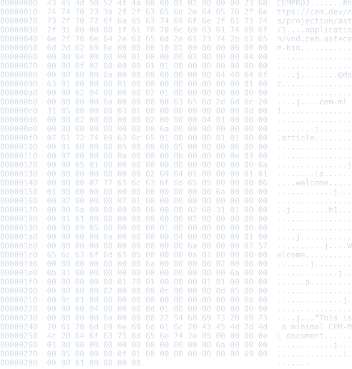

# CEM AST Projection Schema Package

Status: schema, binary/JSON examples, README previews, and package-local
verification frame

This package defines the semantic CEM AST projection layer. The projection is a
parser-owned structural view of CEM source: document nodes, element nodes,
attributes, text, token/range facts, parser diagnostics, source-map metadata,
and sealed binary chunks for runtime/cache handoff.

## Source Identity

Owned schema URI:

```text
https://cem.dev/ns/projection/ast/1
```

Primary content type:

```text
application/vnd.cem.ast+cem-bin
```

Debug/interchange view:

```text
application/vnd.cem.ast+json
```

The JSON AST export keeps the same schema identity but is a debug and
interchange view over the semantic AST projection, not the canonical runtime
artifact. The binary projection is the compatibility anchor for runtime and
cache handoff.

## Projection Facts And Diagnostics

Binary AST projection envelopes expose sealed semantic-record chunks. The root
chunk carries the binary header and links to the document node chunk; node
chunks use stable `node:{id}` root ids, parent chunk ids, ordered child links,
per-chunk hashes, and source-map deltas derived from byte source truth. Native
consumers can replay the original artifact by sorting chunks by `byteOffset`
without reserializing the JSON debug view.

The package schema declares the AST-facing element and attribute contracts and
the diagnostic codes for projection-specific policy:

- `cem.projection.ast.node_id_duplicate`
- `cem.projection.ast.token_range_invalid`
- `cem.projection.ast.chunk_hash_mismatch`
- `cem.projection.ast.source_map_missing`
- `cem.projection.ast.binary_magic`
- `cem.projection.ast.binary_truncated`
- `cem.projection.ast.binary_version`
- `cem.projection.ast.projection_mismatch`
- `cem.projection.ast.json_parse_error`
- `cem.projection.ast.json_shape`

Current incomplete boundary: binary and JSON source validation still runs
through native projection validators. The target shape is Rust extracting
neutral projection facts with byte ranges while this package's `.cem` schema
owns code, severity, and structured details.

## Output Artifacts

This package currently declares one Rust converter from
`application/vnd.cem.ast+cem-bin` to `application/vnd.cem.ast+json` for debug
inspection. It does not declare formatter or colorizer artifacts. Formatter
profiles `compact`, `pretty`, and `tabular`, colorizer profiles `terminal`,
`html`, and `md`, and generic `lineEnding=lf|crlf|preserve` behavior are
therefore not package-owned output surfaces yet.

If AST projection formatting becomes user-facing, formatter/colorizer assets
must follow the common package contract: formatters produce formatted CEM trees,
colorizers enrich those trees, and the generic writer emits target-native
terminal, HTML, Markdown, or byte output.

## Safety Notes

AST projection data may preserve source text, attribute values, diagnostics,
and source-map coordinates from user input. Tools should treat projection
artifacts as data, not executable content. Binary readers must fail closed on
invalid magic bytes, unsupported versions, truncation, hash mismatch, and
source-map inconsistency. JSON debug views should not be treated as canonical
cache input unless they are explicitly regenerated from a trusted binary
projection.

## Formatter And Preview SDLC

When an example or command changes, regenerate fenceable README source with
`samples2readme`. Refresh only the binary fallback SVG previews in
`examples/previews/` by running
`node packages/cem_ml/schema-packages/cem-ast-projection/v1/scripts/verify-previews.mjs --update`.

The package `verify` target checks fenced source and referenced fallback
preview HTML/SVG artifacts for drift.

## Verification

Focused package gates:

```bash
cargo test -p cem-ml cem_ast_projection_package_examples_are_manifest_indexed
```

```bash
cargo test -p cem-ml-cli schema_owned_cem_ast_projection_examples_validate_through_cli
```

```bash
yarn nx run cem_ml_schema_package_cem_ast_projection_v1:verify
```

## Release Behavior

This package is versioned as `1.0.0`. The primary binary content type and schema
URI are compatibility anchors. The JSON view is a debug/interchange alias and
may gain additional derived fields as long as binary projection identity remains
stable. Unsupported binary versions, malformed chunks, and invalid JSON shapes
fail closed through projection diagnostics.

Tracked but not complete:

- schema-owned fact bindings for all binary and JSON projection diagnostics;
- canonical binary writer/reader parity fixtures beyond the current basic
  projection examples;
- package-owned formatter/colorizer profiles if AST projection presentation
  becomes user-facing.

## Examples

This section is generated from `package.cem` `{example}` metadata by the
`samples2readme` Nx target. Text examples with a recognized language and
valid UTF-8 are embedded directly as language-tagged fenced source.
An SVG preview is used only when fenced source is unavailable. The target
writes fallback preview HTML to
`dist/cem_ml/schema-packages/<package>/v1/examples/<example-file>.html`,
then renders the `<pre>` spans through headless Chromium into
`examples/previews/<example-file>.svg`.
Source snapshots are used only where the current CLI cannot yet render
the package formatter/colorizer path for that content identity.

<details>
<summary>basic-ast</summary>

- Source: [`examples/basic-ast.cem-bin`](./examples/basic-ast.cem-bin)
- Content type: `application/vnd.cem.ast+cem-bin`
- Schema: `https://cem.dev/ns/projection/ast/1`
- Expected result: `pass`
- Preview renderer: `source snapshot HTML + html2svg`
- Preview HTML: `dist/cem_ml/schema-packages/cem-ast-projection/v1/examples/basic-ast.cem-bin.html`

</details>



<details>
<summary>basic-ast-json</summary>

- Source: [`examples/basic-ast.ast.json`](./examples/basic-ast.ast.json)
- Content type: `application/vnd.cem.ast+json`
- Schema: `https://cem.dev/ns/projection/ast/1`
- Expected result: `pass`
- README rendering: fenced `json` source

</details>

```json
{
  "kind": "document",
  "children": [
    {
      "kind": "element",
      "name": "p",
      "namespace": "",
      "attributes": [],
      "children": [
        {
          "kind": "text",
          "data": "Hi",
          "byteRange": {
            "start": 5,
            "len": 2
          }
        }
      ],
      "byteRange": {
        "start": 0,
        "len": 8
      }
    }
  ]
}
```

<details>
<summary>nested-ast-json</summary>

- Source: [`examples/nested-ast.ast.json`](./examples/nested-ast.ast.json)
- Content type: `application/vnd.cem.ast+json`
- Schema: `https://cem.dev/ns/projection/ast/1`
- Expected result: `pass`
- README rendering: fenced `json` source

</details>

```json
{
  "kind": "document",
  "children": [
    {
      "kind": "element",
      "name": "form",
      "namespace": "",
      "attributes": [
        {
          "name": "id",
          "namespace": "",
          "value": "login"
        }
      ],
      "children": [
        {
          "kind": "element",
          "name": "label",
          "namespace": "",
          "attributes": [
            {
              "name": "for",
              "namespace": "",
              "value": "email"
            }
          ],
          "children": [
            {
              "kind": "text",
              "data": "Email",
              "byteRange": {
                "start": 31,
                "len": 5
              }
            }
          ],
          "byteRange": {
            "start": 18,
            "len": 21
          }
        },
        {
          "kind": "element",
          "name": "input",
          "namespace": "",
          "attributes": [
            {
              "name": "id",
              "namespace": "",
              "value": "email"
            },
            {
              "name": "required",
              "namespace": "",
              "value": null
            }
          ],
          "children": [],
          "byteRange": {
            "start": 40,
            "len": 27
          }
        }
      ],
      "byteRange": {
        "start": 0,
        "len": 69
      }
    }
  ]
}
```

<details>
<summary>invalid-kind-json</summary>

- Source: [`examples/invalid-kind.ast.json`](./examples/invalid-kind.ast.json)
- Content type: `application/vnd.cem.ast+json`
- Schema: `https://cem.dev/ns/projection/ast/1`
- Expected result: `fail`
- Expected diagnostics: `cem.projection.ast.json_shape`
- README rendering: fenced `json` source

</details>

```json
{
  "kind": "document",
  "children": [
    {
      "kind": "widget",
      "name": "p",
      "namespace": "",
      "attributes": [],
      "children": []
    }
  ]
}
```

<details>
<summary>invalid-binary</summary>

- Source: [`examples/invalid-binary.cem-bin`](./examples/invalid-binary.cem-bin)
- Content type: `application/vnd.cem.ast+cem-bin`
- Schema: `https://cem.dev/ns/projection/ast/1`
- Expected result: `fail`
- Expected diagnostics: `cem.projection.ast.binary_magic`
- Preview renderer: `source snapshot HTML + html2svg`
- Preview HTML: `dist/cem_ml/schema-packages/cem-ast-projection/v1/examples/invalid-binary.cem-bin.html`

</details>


