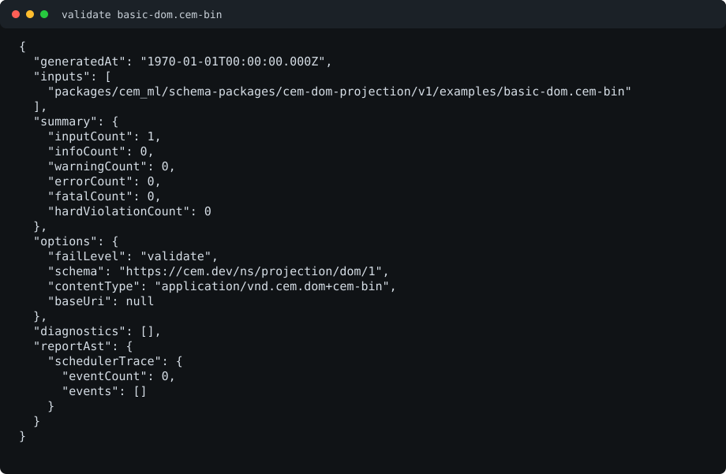
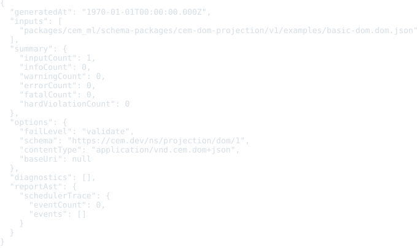

# CEM DOM Projection Schema Package

Status: schema, binary/JSON examples, ready CEMT HTML/XML converters, README
previews, and package-local verification frame

This package defines the semantic CEM DOM projection layer. The projection is a
binary-first document tree view of CEM source: document nodes, element nodes,
attributes, text, ordered child links, source ranges, source-map deltas, and
sealed binary chunks for replay and conversion.

## Source Identity

Owned schema URI:

```text
https://cem.dev/ns/projection/dom/1
```

Primary content type:

```text
application/vnd.cem.dom+cem-bin
```

Debug/interchange view:

```text
application/vnd.cem.dom+json
```

The JSON DOM export keeps the same schema identity but is a debug and
interchange view over the semantic DOM projection, including the legacy
`https://cem.dev/ns/projection/dom-json/1` export. The binary projection is the
compatibility anchor for runtime, cache, and converter handoff.

## Projection Facts And Diagnostics

Binary DOM projection envelopes expose sealed semantic-record chunks. The root
chunk carries the binary header and links to the document node chunk; node
chunks use stable `node:{id}` root ids, parent chunk ids, ordered child links,
per-chunk hashes, and source-map deltas derived from byte source truth. Native
consumers can replay the original artifact by sorting chunks by `byteOffset`
without reserializing the JSON debug view.

The package schema declares the DOM projection element and attribute contracts
and the diagnostic codes for projection-specific policy:

- `cem.projection.dom.node_id_duplicate`
- `cem.projection.dom.parent_missing`
- `cem.projection.dom.chunk_hash_mismatch`
- `cem.projection.dom.source_map_missing`
- `cem.projection.dom.binary_magic`
- `cem.projection.dom.binary_truncated`
- `cem.projection.dom.binary_version`
- `cem.projection.dom.projection_mismatch`
- `cem.projection.dom.json_parse_error`
- `cem.projection.dom.json_shape`

Current incomplete boundary: binary and JSON source validation still runs
through native projection validators. The target shape is Rust extracting
neutral DOM projection facts with byte ranges while this package's `.cem`
schema owns code, severity, and structured details.

## Output Artifacts

This package declares CEMT-primary converter edges from
`application/vnd.cem.dom+cem-bin` to HTML and XML. The CEMT assets are packaged
next to the schema and execute through the built-in bounded DOM-projection CEMT
adapter by default. The Rust serializers remain fallback implementations if
that executable adapter is unavailable.

The package also declares a Rust converter from
`application/vnd.cem.dom+cem-bin` to `application/vnd.cem.dom+json` for debug
inspection. It does not declare standalone formatter or colorizer artifacts.
Formatter profiles `compact`, `pretty`, and `tabular`, colorizer profiles
`terminal`, `html`, and `md`, and generic `lineEnding=lf|crlf|preserve`
behavior are therefore not package-owned DOM presentation surfaces yet.

The converter output contracts still use the common pipeline boundary: CEMT
produces formatted CEM tree output, optional colorization enriches that tree,
and the generic writer emits target-native HTML or XML bytes. Token arrays,
HTML spans, and serialized bytes remain writer-boundary details.

## Converter Edges

| Converter                         | From                              | To                | CEMT asset                                                   | Entrypoint | Runtime state | Fallback                                                          |
| --------------------------------- | --------------------------------- | ----------------- | ------------------------------------------------------------ | ---------- | ------------- | ----------------------------------------------------------------- |
| `cem-dom-projection-to-html-cemt` | `application/vnd.cem.dom+cem-bin` | `text/html`       | [`converters/dom-to-html.cemt`](converters/dom-to-html.cemt) | `main`     | Ready         | `HtmlExportConverter` when executable CEMT adapter is unavailable |
| `cem-dom-projection-to-xml-cemt`  | `application/vnd.cem.dom+cem-bin` | `application/xml` | [`converters/dom-to-xml.cemt`](converters/dom-to-xml.cemt)   | `main`     | Ready         | `XmlExportConverter` when executable CEMT adapter is unavailable  |

The CLI template pass validates these converter assets with converter input
bindings, loop bindings, and recursive `@with:*` call parameter bindings.
Runtime and parity coverage compare packaged CEMT output against the Rust HTML
and XML serializers on representative DOM projection fixtures. The `package.cem`
manifest declares `examples/basic-dom.cem-bin` as the shared parity fixture for
both CEMT serializer edges. Built-in runtime conversion descriptors for these
CEMT edges are loaded from this `package.cem` manifest, including the declared
`main` entrypoint and parity fixture metadata.

## Safety Notes

DOM projection data may preserve source text, element and attribute names,
attribute values, text nodes, diagnostics, and source-map coordinates from user
input. Tools should treat projection artifacts as data until a converter or
writer explicitly emits HTML, XML, or another active syntax. HTML/XML output
must escape text and attributes through the writer boundary; downstream
renderers must still apply their normal active-content, URI, script, style, and
privacy policies.

Binary readers must fail closed on invalid magic bytes, unsupported versions,
truncation, duplicate node ids, missing parents, hash mismatch, and source-map
inconsistency. JSON debug views should not be treated as canonical replay/cache
input unless they are explicitly regenerated from a trusted binary projection.

## Formatter And Preview SDLC

When a command example, fixture, converter, CLI report shape, or visible
presentation output changes, update the SVG previews in `examples/previews/`
in the same change by running
`node packages/cem_ml/schema-packages/cem-dom-projection/v1/scripts/verify-previews.mjs --update`.

The package `verify` target regenerates previews into `dist/previews/` and
fails on drift.

## Verification

Focused package gates:

```bash
cargo test -p cem-ml cem_dom_projection_package_examples_are_manifest_indexed
```

```bash
cargo test -p cem-ml-cli schema_owned_cem_dom_projection_examples_validate_through_cli
```

```bash
cargo test -p cem-ml declared_conversion_parity_contract_evaluator_runs_all_declared_fixtures
```

```bash
cargo test -p cem-ml convert_html_layer_executes_packaged_cemt_dom_converter_pipeline
```

```bash
cargo test -p cem-ml convert_xml_layer_executes_packaged_cemt_dom_converter_pipeline
```

```bash
yarn nx run cem_ml_schema_package_cem_dom_projection_v1:verify
```

## Release Behavior

This package is versioned as `1.0.0`. The primary binary content type and schema
URI are compatibility anchors. The JSON view is a debug/interchange alias and
may gain additional derived fields as long as binary projection identity remains
stable. The ready CEMT HTML/XML converter edges are preferred over Rust
fallbacks when the executable CEMT adapter is available. Unsupported binary
versions, malformed chunks, duplicate node ids, missing parents, invalid
source maps, and invalid JSON shapes fail closed through projection
diagnostics.

Tracked but not complete:

- schema-owned fact bindings for all binary and JSON projection diagnostics;
- canonical binary writer/reader parity fixtures beyond the current basic DOM
  projection examples;
- package-owned formatter/colorizer profiles if DOM projection presentation
  becomes user-facing outside the HTML/XML converter edges.

## Validation Examples

The schema-owned examples live in [`examples/`](examples/) and are used by the
CLI validation integration tests.

| Example                                                     | Content type                      | Purpose                                                                                  | Expected result                             |
| ----------------------------------------------------------- | --------------------------------- | ---------------------------------------------------------------------------------------- | ------------------------------------------- |
| [`basic-dom.cem-bin`](examples/basic-dom.cem-bin)           | `application/vnd.cem.dom+cem-bin` | Canonical binary DOM projection generated by `cem-ml convert --to-format dom-bin`.       | Pass                                        |
| [`basic-dom.dom.json`](examples/basic-dom.dom.json)         | `application/vnd.cem.dom+json`    | Minimal DOM JSON debug view with one element and text child.                             | Pass                                        |
| [`nested-dom.dom.json`](examples/nested-dom.dom.json)       | `application/vnd.cem.dom+json`    | Nested form DOM with attributes, text, null-valued boolean attribute, and source ranges. | Pass                                        |
| [`invalid-kind.dom.json`](examples/invalid-kind.dom.json)   | `application/vnd.cem.dom+json`    | DOM JSON node with an unsupported node kind.                                             | Fail with `cem.projection.dom.json_shape`   |
| [`invalid-binary.cem-bin`](examples/invalid-binary.cem-bin) | `application/vnd.cem.dom+cem-bin` | Binary projection with an invalid magic header.                                          | Fail with `cem.projection.dom.binary_magic` |

Validate a binary projection explicitly:

```bash
cargo run -p cem-ml-cli -- validate \
  --format json \
  --content-type application/vnd.cem.dom+cem-bin \
  --schema https://cem.dev/ns/projection/dom/1 \
  packages/cem_ml/schema-packages/cem-dom-projection/v1/examples/basic-dom.cem-bin
```



Validate a JSON debug view explicitly:

```bash
cargo run -p cem-ml-cli -- validate \
  --format json \
  --content-type application/vnd.cem.dom+json \
  --schema https://cem.dev/ns/projection/dom/1 \
  packages/cem_ml/schema-packages/cem-dom-projection/v1/examples/basic-dom.dom.json
```


