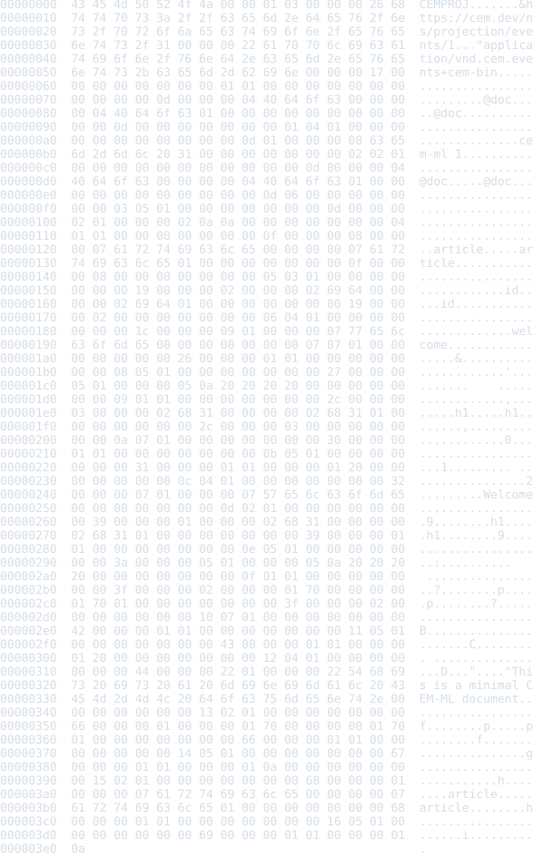

# CEM Events Projection Schema Package

Status: schema, binary/JSON examples, README previews, and package-local
verification frame

This package defines the semantic CEM event-stream projection layer. The
projection is an ordered parser/transform event view of CEM source: open/close
events, names, values, trivia, separators, mode switches, diagnostics, source
ranges, checkpoints, and sealed binary chunks for replay and multicast.

## Source Identity

Owned schema URI:

```text
https://cem.dev/ns/projection/events/1
```

Primary content type:

```text
application/vnd.cem.events+cem-bin
```

Debug/interchange view:

```text
application/vnd.cem.events+json
```

The JSON events export keeps the same schema identity but is a debug and
interchange view over the semantic event-stream projection, not the canonical
runtime artifact. The binary projection is the compatibility anchor for runtime
and cache handoff.

## Projection Facts And Diagnostics

Binary events projection envelopes expose sealed semantic-record chunks. The
root chunk carries the binary header and links to event sequence chunks; event
chunks use stable `event:{sequence}` root ids, parent chunk ids, per-chunk
hashes, and source-map deltas derived from byte source truth. Native consumers
can replay the original artifact by sorting chunks by `byteOffset` without
reserializing the JSON debug view.

The package schema declares the event-stream element and attribute contracts
and the diagnostic codes for projection-specific policy:

- `cem.projection.events.sequence_gap`
- `cem.projection.events.chunk_hash_mismatch`
- `cem.projection.events.checkpoint_invalid`
- `cem.projection.events.source_map_missing`
- `cem.projection.events.binary_magic`
- `cem.projection.events.binary_truncated`
- `cem.projection.events.binary_version`
- `cem.projection.events.projection_mismatch`
- `cem.projection.events.json_parse_error`
- `cem.projection.events.json_shape`

Current incomplete boundary: binary and JSON source validation still runs
through native projection validators. The target shape is Rust extracting
neutral event projection facts with byte ranges while this package's `.cem`
schema owns code, severity, and structured details.

## Output Artifacts

This package currently declares one Rust converter from
`application/vnd.cem.events+cem-bin` to `application/vnd.cem.events+json` for
debug inspection. It does not declare formatter or colorizer artifacts.
Formatter profiles `compact`, `pretty`, and `tabular`, colorizer profiles
`terminal`, `html`, and `md`, and generic `lineEnding=lf|crlf|preserve`
behavior are therefore not package-owned output surfaces yet.

If event-stream projection formatting becomes user-facing, formatter/colorizer
assets must follow the common package contract: formatters produce formatted
CEM trees, colorizers enrich those trees, and the generic writer emits
target-native terminal, HTML, Markdown, or byte output.

## Safety Notes

Events projection data may preserve source text, attribute values, parser
events, diagnostics, and source-map coordinates from user input. Tools should
treat projection artifacts as data, not executable content. Binary readers must
fail closed on invalid magic bytes, unsupported versions, truncation, sequence
gaps, checkpoint inconsistency, hash mismatch, and source-map inconsistency.
JSON debug views should not be treated as canonical replay/cache input unless
they are explicitly regenerated from a trusted binary projection.

## Formatter And Preview SDLC

When an example or command changes, regenerate fenceable README source with
`samples2readme`. Refresh only the binary fallback SVG previews in
`examples/previews/` by running
`node packages/cem_ml/schema-packages/cem-events-projection/v1/scripts/verify-previews.mjs --update`.

The package `verify` target checks fenced source and referenced fallback
preview HTML/SVG artifacts for drift.

## Verification

Focused package gates:

```bash
cargo test -p cem-ml cem_events_projection_package_examples_are_manifest_indexed
```

```bash
cargo test -p cem-ml-cli schema_owned_cem_events_projection_examples_validate_through_cli
```

```bash
yarn nx run cem_ml_schema_package_cem_events_projection_v1:verify
```

## Release Behavior

This package is versioned as `1.0.0`. The primary binary content type and schema
URI are compatibility anchors. The JSON view is a debug/interchange alias and
may gain additional derived fields as long as binary projection identity remains
stable. Unsupported binary versions, malformed chunks, sequence gaps, invalid
checkpoints, and invalid JSON shapes fail closed through projection
diagnostics.

Tracked but not complete:

- schema-owned fact bindings for all binary and JSON projection diagnostics;
- canonical binary writer/reader parity fixtures beyond the current basic
  event projection examples;
- package-owned formatter/colorizer profiles if event-stream projection
  presentation becomes user-facing.

## Examples

This section is generated from `package.cem` `{example}` metadata by the
`samples2readme` Nx target. Text examples with a recognized language and
valid UTF-8 are embedded directly as language-tagged fenced source.
An SVG preview is used only when fenced source is unavailable. The target
writes fallback preview HTML to
`dist/cem_ml/schema-packages/<package>/v1/examples/<example-file>.html`,
then renders the `<pre>` spans through headless Chromium into
`examples/previews/<example-file>.svg`.
Source snapshots are used only where the current CLI cannot yet render
the package formatter/colorizer path for that content identity.

<details>
<summary>basic-events</summary>

- Source: [`examples/basic-events.cem-bin`](./examples/basic-events.cem-bin)
- Content type: `application/vnd.cem.events+cem-bin`
- Schema: `https://cem.dev/ns/projection/events/1`
- Expected result: `pass`
- Preview renderer: `source snapshot HTML + html2svg`
- Preview HTML: `dist/cem_ml/schema-packages/cem-events-projection/v1/examples/basic-events.cem-bin.html`

</details>



<details>
<summary>basic-events-json</summary>

- Source: [`examples/basic-events.events.json`](./examples/basic-events.events.json)
- Content type: `application/vnd.cem.events+json`
- Schema: `https://cem.dev/ns/projection/events/1`
- Expected result: `pass`
- README rendering: fenced `json` source

</details>

```json
[
  {
    "byteRange": {
      "len": 13,
      "start": 0
    },
    "kind": "open",
    "name": "@doc"
  },
  {
    "byteRange": {
      "len": 13,
      "start": 0
    },
    "kind": "value",
    "value": "cem-ml 1"
  },
  {
    "byteRange": {
      "len": 13,
      "start": 0
    },
    "kind": "close",
    "name": "@doc"
  },
  {
    "byteRange": {
      "len": 2,
      "start": 13
    },
    "data": "\n\n",
    "kind": "trivia",
    "trivia": "whitespace"
  },
  {
    "byteRange": {
      "len": 8,
      "start": 15
    },
    "kind": "open",
    "name": "article"
  },
  {
    "byteRange": {
      "len": 2,
      "start": 25
    },
    "kind": "name",
    "name": "id"
  },
  {
    "byteRange": {
      "len": 9,
      "start": 28
    },
    "kind": "value",
    "value": "welcome"
  },
  {
    "byteRange": {
      "len": 1,
      "start": 38
    },
    "kind": "separator"
  },
  {
    "byteRange": {
      "len": 5,
      "start": 39
    },
    "data": "\n    ",
    "kind": "trivia",
    "trivia": "whitespace"
  },
  {
    "byteRange": {
      "len": 3,
      "start": 44
    },
    "kind": "open",
    "name": "h1"
  },
  {
    "byteRange": {
      "len": 1,
      "start": 48
    },
    "kind": "separator"
  },
  {
    "byteRange": {
      "len": 1,
      "start": 49
    },
    "data": " ",
    "kind": "trivia",
    "trivia": "whitespace"
  },
  {
    "byteRange": {
      "len": 7,
      "start": 50
    },
    "kind": "value",
    "value": "Welcome"
  },
  {
    "byteRange": {
      "len": 1,
      "start": 57
    },
    "kind": "close",
    "name": "h1"
  },
  {
    "byteRange": {
      "len": 5,
      "start": 58
    },
    "data": "\n    ",
    "kind": "trivia",
    "trivia": "whitespace"
  },
  {
    "byteRange": {
      "len": 2,
      "start": 63
    },
    "kind": "open",
    "name": "p"
  },
  {
    "byteRange": {
      "len": 1,
      "start": 66
    },
    "kind": "separator"
  },
  {
    "byteRange": {
      "len": 1,
      "start": 67
    },
    "data": " ",
    "kind": "trivia",
    "trivia": "whitespace"
  },
  {
    "byteRange": {
      "len": 34,
      "start": 68
    },
    "kind": "value",
    "value": "This is a minimal CEM-ML document."
  },
  {
    "byteRange": {
      "len": 1,
      "start": 102
    },
    "kind": "close",
    "name": "p"
  },
  {
    "byteRange": {
      "len": 1,
      "start": 103
    },
    "data": "\n",
    "kind": "trivia",
    "trivia": "whitespace"
  },
  {
    "byteRange": {
      "len": 1,
      "start": 104
    },
    "kind": "close",
    "name": "article"
  },
  {
    "byteRange": {
      "len": 1,
      "start": 105
    },
    "data": "\n",
    "kind": "trivia",
    "trivia": "whitespace"
  }
]
```

<details>
<summary>nested-events-json</summary>

- Source: [`examples/nested-events.events.json`](./examples/nested-events.events.json)
- Content type: `application/vnd.cem.events+json`
- Schema: `https://cem.dev/ns/projection/events/1`
- Expected result: `pass`
- README rendering: fenced `json` source

</details>

```json
[
  {
    "byteRange": {
      "len": 13,
      "start": 0
    },
    "kind": "open",
    "name": "@doc"
  },
  {
    "byteRange": {
      "len": 13,
      "start": 0
    },
    "kind": "value",
    "value": "cem-ml 1"
  },
  {
    "byteRange": {
      "len": 13,
      "start": 0
    },
    "kind": "close",
    "name": "@doc"
  },
  {
    "byteRange": {
      "len": 1,
      "start": 13
    },
    "data": "\n",
    "kind": "trivia",
    "trivia": "whitespace"
  },
  {
    "byteRange": {
      "len": 41,
      "start": 14
    },
    "kind": "open",
    "name": "@ns"
  },
  {
    "byteRange": {
      "len": 41,
      "start": 14
    },
    "kind": "value",
    "value": "html = \"http://www.w3.org/1999/xhtml\""
  },
  {
    "byteRange": {
      "len": 41,
      "start": 14
    },
    "kind": "close",
    "name": "@ns"
  },
  {
    "byteRange": {
      "len": 1,
      "start": 55
    },
    "data": "\n",
    "kind": "trivia",
    "trivia": "whitespace"
  },
  {
    "byteRange": {
      "len": 13,
      "start": 56
    },
    "kind": "open",
    "name": "@default"
  },
  {
    "byteRange": {
      "len": 13,
      "start": 56
    },
    "kind": "value",
    "value": "html"
  },
  {
    "byteRange": {
      "len": 13,
      "start": 56
    },
    "kind": "close",
    "name": "@default"
  },
  {
    "byteRange": {
      "len": 2,
      "start": 69
    },
    "data": "\n\n",
    "kind": "trivia",
    "trivia": "whitespace"
  },
  {
    "byteRange": {
      "len": 5,
      "start": 71
    },
    "kind": "open",
    "name": "main"
  },
  {
    "byteRange": {
      "len": 2,
      "start": 78
    },
    "kind": "name",
    "name": "id"
  },
  {
    "byteRange": {
      "len": 9,
      "start": 81
    },
    "kind": "value",
    "value": "profile"
  },
  {
    "byteRange": {
      "len": 1,
      "start": 91
    },
    "kind": "separator"
  },
  {
    "byteRange": {
      "len": 5,
      "start": 92
    },
    "data": "\n    ",
    "kind": "trivia",
    "trivia": "whitespace"
  },
  {
    "byteRange": {
      "len": 8,
      "start": 97
    },
    "kind": "open",
    "name": "section"
  },
  {
    "byteRange": {
      "len": 5,
      "start": 107
    },
    "kind": "name",
    "name": "class"
  },
  {
    "byteRange": {
      "len": 9,
      "start": 113
    },
    "kind": "value",
    "value": "summary"
  },
  {
    "byteRange": {
      "len": 1,
      "start": 123
    },
    "kind": "separator"
  },
  {
    "byteRange": {
      "len": 9,
      "start": 124
    },
    "data": "\n        ",
    "kind": "trivia",
    "trivia": "whitespace"
  },
  {
    "byteRange": {
      "len": 3,
      "start": 133
    },
    "kind": "open",
    "name": "h1"
  },
  {
    "byteRange": {
      "len": 1,
      "start": 137
    },
    "kind": "separator"
  },
  {
    "byteRange": {
      "len": 1,
      "start": 138
    },
    "data": " ",
    "kind": "trivia",
    "trivia": "whitespace"
  },
  {
    "byteRange": {
      "len": 12,
      "start": 139
    },
    "kind": "value",
    "value": "Ada Lovelace"
  },
  {
    "byteRange": {
      "len": 1,
      "start": 151
    },
    "kind": "close",
    "name": "h1"
  },
  {
    "byteRange": {
      "len": 9,
      "start": 152
    },
    "data": "\n        ",
    "kind": "trivia",
    "trivia": "whitespace"
  },
  {
    "byteRange": {
      "len": 1,
      "start": 161
    },
    "kind": "open",
    "name": ""
  },
  {
    "byteRange": {
      "len": 4,
      "start": 163
    },
    "kind": "name",
    "name": "type"
  },
  {
    "byteRange": {
      "len": 11,
      "start": 168
    },
    "kind": "value",
    "value": "text/html"
  },
  {
    "contentType": "text/html",
    "kind": "mode-switch"
  },
  {
    "byteRange": {
      "len": 1,
      "start": 180
    },
    "kind": "separator"
  },
  {
    "byteRange": {
      "len": 13,
      "start": 181
    },
    "data": "\n            ",
    "kind": "trivia",
    "trivia": "whitespace"
  },
  {
    "byteRange": {
      "len": 68,
      "start": 194
    },
    "kind": "value",
    "value": "<p><strong>Known for:</strong> analytical engine notes.</p>\n        "
  },
  {
    "byteRange": {
      "len": 1,
      "start": 262
    },
    "kind": "close",
    "name": ""
  },
  {
    "byteRange": {
      "len": 5,
      "start": 263
    },
    "data": "\n    ",
    "kind": "trivia",
    "trivia": "whitespace"
  },
  {
    "byteRange": {
      "len": 1,
      "start": 268
    },
    "kind": "close",
    "name": "section"
  },
  {
    "byteRange": {
      "len": 1,
      "start": 269
    },
    "data": "\n",
    "kind": "trivia",
    "trivia": "whitespace"
  },
  {
    "byteRange": {
      "len": 1,
      "start": 270
    },
    "kind": "close",
    "name": "main"
  },
  {
    "byteRange": {
      "len": 1,
      "start": 271
    },
    "data": "\n",
    "kind": "trivia",
    "trivia": "whitespace"
  }
]
```

<details>
<summary>invalid-kind-json</summary>

- Source: [`examples/invalid-kind.events.json`](./examples/invalid-kind.events.json)
- Content type: `application/vnd.cem.events+json`
- Schema: `https://cem.dev/ns/projection/events/1`
- Expected result: `fail`
- Expected diagnostics: `cem.projection.events.json_shape`
- README rendering: fenced `json` source

</details>

```json
[
  {
    "kind": "widget",
    "byteRange": {
      "start": 0,
      "len": 1
    }
  }
]
```

<details>
<summary>invalid-binary</summary>

- Source: [`examples/invalid-binary.cem-bin`](./examples/invalid-binary.cem-bin)
- Content type: `application/vnd.cem.events+cem-bin`
- Schema: `https://cem.dev/ns/projection/events/1`
- Expected result: `fail`
- Expected diagnostics: `cem.projection.events.binary_magic`
- Preview renderer: `source snapshot HTML + html2svg`
- Preview HTML: `dist/cem_ml/schema-packages/cem-events-projection/v1/examples/invalid-binary.cem-bin.html`

</details>


