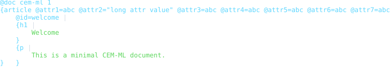
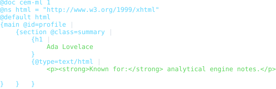
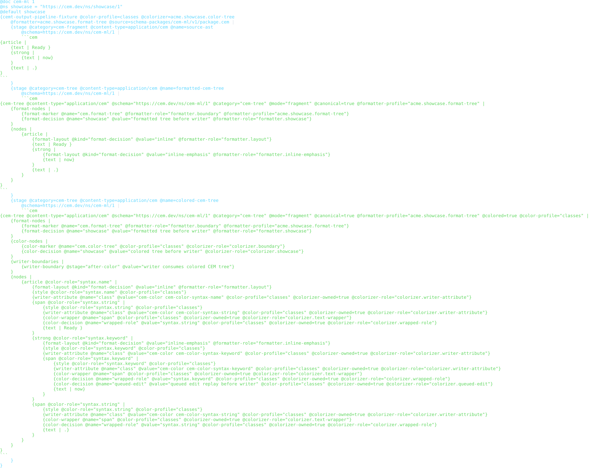
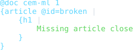
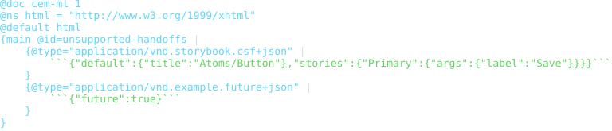

# CEM-ML Generic Schema Package

Status: bootstrap schema, examples, formatter/colorizer CEMT assets, README
previews, and package-local verification frame

[cem-ml-syntax.md](../../../../../docs/cem-ml-syntax.md)

This package is the first schema-package source for the generic CEM-ML document
model. It owns CEM-ML syntax and content-type identity, not domain semantics.
Domain vocabularies such as CEM core annotations, HTML, SVG, templates, query,
transform, and schema-package manifests are separate packages layered on top of
this generic model.

## Source Identity

Owned schema URI:

```text
https://cem.dev/ns/cem-ml/1
```

Schema source:

```text
schema/cem-ml-generic.cem
```

This filename is the documented v1 bootstrap exception to the default
`schema/cem-ml.cem` shape. It preserves the generic CEM-ML schema identity
embedded by the runtime catalog while the package still follows the rest of the
versioned folder contract.

Primary content type:

```text
application/cem
```

Current aliases mirror the Rust runtime's existing accepted CEM source content
types:

- `text/cem-ml`
- `text/cem`
- `application/cem+xml`

The semantic CEM annotation vocabulary remains in
`packages/cem_ml/schema/cem-core.md` under `https://cem.dev/ns/core/1`.

## Syntax Facts And Diagnostics

The generic CEM-ML schema declares persisted document directives, namespace
directives, default namespace directives, schema hints, lexical node forms,
attributes, text, comments, CDATA/raw text, expression nodes, and typed content
handoff scopes. Parser output preserves byte ranges, line/column coordinates,
namespace context, and handoff boundaries for downstream schema validation,
projection, formatting, and source-map reporting.

The package schema declares the diagnostics used by its examples and current
runtime validation reports:

- `cem.doc.version_missing`
- `cem.doc.semver_invalid`
- `cem.doc.format_unknown`
- `cem.doc.version_unsupported`
- `cem.doc.prerelease_unmatched`
- `cem.ast.unbalanced_close`
- `cem.ast.unclosed_scope`
- `cem.ast.unresolved_reference`
- `cem.syntax.unclosed_scope`
- `cem.syntax.invalid_name`
- `cem.namespace.unbound_prefix`
- `cem.schema.unbalanced_close`
- `cem.schema.unclosed_scope`
- `cem.schema.unresolved_namespace`
- `cem.schema.unresolved_namespace_allowed`
- `cem.schema.unresolved_namespace_ignored`
- `cem.handoff.xslt_dispatched`
- `cem.xslt.version_invalid`
- `cem.handoff.child_parser_deferred`
- `cem.handoff.unsupported_content_type`
- `cem.content_type.unsupported_handoff`

Current incomplete boundary: byte-accurate parsing, handoff dispatch facts, and
some CEM Core vocab/scoping diagnostic emission still run through native Rust.
The target shape is Rust extracting neutral facts while this package's `.cem`
schema owns code, severity, and structured details.

## Folder Contract

`package.cem` is the manifest-owned index for this folder. It declares the
schema URI and source file, the primary and alias content types, namespace
claims, Rust-backed projection converter metadata, formatter/colorizer CEMT
artifacts, helper artifacts, and every validation example under `examples/`.

Example metadata is intentionally manifest-owned. This package does not require
checked-in `.example.cem` sidecars because `package.cem` already records the
example path, content type, schema URI, expected pass/fail result, and expected
diagnostic codes.

## Converter Edges

The generic CEM-ML package owns the source side of the bootstrap projection
converters. They are declared as Rust hooks for current runtime availability,
while endpoint schema/content-type ownership is validated in the final registry
gate with the projection packages loaded.

| Converter | From | To | Implementation |
| --- | --- | --- | --- |
| `cem-ml-to-dom-projection-rust` | `application/cem`, `https://cem.dev/ns/cem-ml/1` | `application/vnd.cem.dom+cem-bin`, `https://cem.dev/ns/projection/dom/1` | `CemMlDomProjectionConverter` |
| `cem-ml-to-ast-projection-rust` | `application/cem`, `https://cem.dev/ns/cem-ml/1` | `application/vnd.cem.ast+cem-bin`, `https://cem.dev/ns/projection/ast/1` | `CemMlAstProjectionConverter` |
| `cem-ml-to-events-projection-rust` | `application/cem`, `https://cem.dev/ns/cem-ml/1` | `application/vnd.cem.events+cem-bin`, `https://cem.dev/ns/projection/events/1` | `CemMlEventsProjectionConverter` |

## Formatter And Colorizer Assets

Schema-local output transformations live beside the schema package:

- [`formatters/cem-format-tree.cemt`](formatters/cem-format-tree.cemt)
  declares `cem.format-tree` for `application/cem` /
  `https://cem.dev/ns/cem-ml/1`.
- [`formatters/cem-format-tree-helpers.cemt`](formatters/cem-format-tree-helpers.cemt)
  declares private canonical formatter helpers used by `cem.format-tree`,
  including `cem.format-tree.apply-stage`,
  `cem.format-tree.build-nodes`, and `cem.format-tree.build-envelope`.
- [`formatters/formatter-coloring-pipeline.cemt`](formatters/formatter-coloring-pipeline.cemt)
  declares `acme.showcase.format-tree` as a package-qualified formatter that
  extends `cem.format-tree`.
- [`formatters/cem-tree-helpers.cemt`](formatters/cem-tree-helpers.cemt)
  declares private `cemml.cem-tree.*` formatter helpers used by schema-local
  formatter entrypoints.
- [`colorizers/cem-color-tree.cemt`](colorizers/cem-color-tree.cemt)
  declares `cem.color-tree` for formatted CEM trees before the writer phase.
- [`colorizers/cem-color-tree-helpers.cemt`](colorizers/cem-color-tree-helpers.cemt)
  declares private canonical colorizer helpers used by `cem.color-tree`.
- [`colorizers/formatter-coloring-pipeline.cemt`](colorizers/formatter-coloring-pipeline.cemt)
  declares `acme.showcase.color-tree` as a package-qualified colorizer that
  extends `cem.color-tree`.
- [`colorizers/cem-tree-helpers.cemt`](colorizers/cem-tree-helpers.cemt)
  declares private `cemml.cem-tree.*` colorizer helpers used by schema-local
  colorizer entrypoints.

The package manifest declares entrypoint files as `formatter` and `colorizer`
artifacts and shared helper files as `formatter-helper` and `colorizer-helper`
artifacts so runtime CEMT stages are tied to schema-owned assets instead of
inline Rust template strings. The artifact entries also declare the target CEM
tree identity (`application/cem`, `https://cem.dev/ns/cem-ml/1`, `cem-tree`),
the supplied CEMT function name, the CEMT function profile when present, and
the formatter/color profiles that select the asset during output pipeline
execution.

The formatter profiles use one CEMT body with profile-aware layout:

- `compact` keeps minimal deterministic spacing and is the interchange-safe
  default;
- `pretty` expands non-text child groups into block layout;
- `tabular` keeps attributes inline while they fit within `wrapColumn`, then
  lays wrapped attributes out on vertically aligned parent + 1 indent lines.

Default output line endings are LF (`\n`, Linux style). Readable indentation
defaults to four spaces per depth level. `lineEnding` and `indent` are generic
formatter options shared across packages; CEM-ML does not define
package-specific line-ending or indentation options. Readable formatters that
emit literal tab characters use generic `tabSize` for the visual tab-stop
assumption, which defaults to `8`.

The colorizer profiles map to writer-boundary behavior:

- `terminal` records terminal output plus auto capability metadata and renders
  ANSI/SGR-colored CEM text;
- `html` maps to the class-based HTML mode and materializes HTML writer
  attributes;
- `md` records Markdown output metadata and renders Markdown-safe inline HTML
  color spans;
- `none`, `classes`, `inline-style`, and `css-custom-properties` are manifest
  selectors for current package-local output pipelines.

Formatters produce formatted CEM tree output, colorizers enrich that tree, and
only the writer emits terminal, HTML, Markdown, or source bytes. Token arrays,
ANSI codes, and HTML spans are writer-boundary implementation details.

Package-qualified formatter and colorizer artifacts are selected by explicit
CEMT function name first, then by stage profile fallback. This keeps the
canonical `cem.format-tree` and `cem.color-tree` pipeline stable while allowing
showcase or schema-specific formatter/colorizer bodies to opt in through the
same manifest-declared asset path.

`cem.format-tree.build-nodes` performs canonical node traversal in CEMT with
`typeOf`, `match`, `map`, `length`, numeric depth helpers, and helper calls. It
still delegates low-level block-child whitespace and content-boundary
construction to registered CEMT runtime primitives until those writer-adjacent
formatting primitives are also expressed as schema-owned helpers.

`cem.color-tree.apply-stage` performs canonical coloring in CEMT over the
already formatted `cem-tree`. It reads the selected `$colorProfile`, recursively
annotates `nodes`, `formatNodes`, and `colorNodes`, materializes writer
attribute nodes and text wrappers for HTML profiles, and leaves the writer as
the final serialization phase for the colored tree.

## Safety Notes

CEM-ML source can embed raw handoff content such as HTML, CSS, JavaScript, XML,
JSON, templates, or future vendor media types. Validation and formatting must
treat handoff payloads as data unless a downstream package explicitly parses or
executes that content. Unsupported handoffs fail closed with
`cem.handoff.unsupported_content_type`; supported but deferred child parsers
record `cem.handoff.child_parser_deferred` so callers can choose whether to
continue.

Formatters and colorizers must preserve source ranges and avoid executing
embedded content. HTML and Markdown writers must escape source text and
generated attributes through the writer boundary. Resolver-sensitive work must
use the shared resolver-policy layer; passive validation, formatting,
colorizing, and preview generation should not perform policy-sensitive resource
reads.

## Formatter And Preview SDLC

When a command example, fixture, formatter, colorizer, converter, CLI report
shape, or visible presentation output changes, update the SVG previews in
`examples/previews/` in the same change by running
`node packages/cem_ml/schema-packages/cem-ml/v1/scripts/verify-previews.mjs --update`.

The package `verify` target writes generated preview HTML/SVG artifacts into
`dist/cem_ml/schema-packages/cem-ml/v1/examples/` and fails on drift.

## Verification

Focused package gates:

```bash
cargo test -p cem-ml cem_ml_package_examples_are_manifest_indexed
```

```bash
cargo test -p cem-ml-cli schema_owned_cem_ml_examples_validate_through_cli
```

```bash
cargo test -p cem-ml cem_tree_output_templates_are_schema_package_assets
```

```bash
cargo test -p cem-ml conversion_output_pipeline_applies_literal_baseline_formatter_profiles
```

```bash
cargo test -p cem-ml convert_target_cem_pretty_aligns_block_closing_braces_with_opening_indent
```

```bash
cargo test -p cem-ml conversion_output_pipeline_applies_literal_baseline_colorizer_profiles
```

```bash
yarn nx run cem_ml_schema_package_cem_ml_v1:verify
```

## Release Behavior

This package is versioned as `1.0.0`. The primary `application/cem` content
type and `https://cem.dev/ns/cem-ml/1` schema URI are bootstrap compatibility
anchors. Alias content types are accepted for current runtime compatibility,
but persisted examples use the primary content type unless an alias behavior is
being tested explicitly.

Projection converter edges are ready Rust bootstrap hooks. Formatter and
colorizer assets are package-owned CEMT resources with Rust host primitives
only for the remaining low-level traversal and writer-adjacent operations
listed above.

Tracked but not complete:

- fully schema-owned parse-fact bindings for all native parser and handoff
  diagnostics;
- CEMT ownership of the remaining writer-adjacent formatter primitives;
- additional alias content-type examples if alias-specific parser or lifecycle
  behavior changes.

## Examples

This section is generated from `package.cem` `{example}` metadata by the
`samples2readme` Nx target. Each SVG previews the example content, not
the validation report. The target writes a preformatted HTML preview to
`dist/cem_ml/schema-packages/<package>/v1/examples/<example-file>.html`,
then renders the `<pre>` spans through headless Chromium into
`examples/previews/<example-file>.svg`.
Source snapshots are used only where the current CLI cannot yet render
the package formatter/colorizer path for that content identity.

<details>
<summary>basic</summary>

- Source: [`examples/basic.cem`](./examples/basic.cem)
- Content type: `application/cem`
- Schema: `https://cem.dev/ns/cem-ml/1`
- Expected result: `pass`
- Preview renderer: `CLI convert, tabular formatter, preview HTML + html2svg`
- Preview HTML: `dist/cem_ml/schema-packages/cem-ml/v1/examples/basic.cem.html`

```bash
dist/target/cem_ml_cli/debug/cem-ml convert --input-spec \
  uri=packages/cem_ml/schema-packages/cem-ml/v1/examples/basic.cem,contentType=application/cem,schema=https://cem.dev/ns/cem-ml/1 \
  --to-content-type application/cem --to-schema https://cem.dev/ns/cem-ml/1 \
  --cemt-formatter-profile tabular --cemt-color-profile terminal --output-color-type \
  ansi-256
```

</details>



<details>
<summary>nested-handoff</summary>

- Source: [`examples/nested-handoff.cem`](./examples/nested-handoff.cem)
- Content type: `application/cem`
- Schema: `https://cem.dev/ns/cem-ml/1`
- Expected result: `pass`
- Preview renderer: `CLI convert, tabular formatter, preview HTML + html2svg`
- Preview HTML: `dist/cem_ml/schema-packages/cem-ml/v1/examples/nested-handoff.cem.html`

```bash
dist/target/cem_ml_cli/debug/cem-ml convert --input-spec \
  uri=packages/cem_ml/schema-packages/cem-ml/v1/examples/nested-handoff.cem,contentType=application/cem,schema=https://cem.dev/ns/cem-ml/1 \
  --to-content-type application/cem --to-schema https://cem.dev/ns/cem-ml/1 \
  --cemt-formatter-profile tabular --cemt-color-profile terminal --output-color-type \
  ansi-256
```

</details>



<details>
<summary>embedded-handoffs</summary>

- Source: [`examples/embedded-handoffs.cem`](./examples/embedded-handoffs.cem)
- Content type: `application/cem`
- Schema: `https://cem.dev/ns/cem-ml/1`
- Expected result: `pass`
- Expected diagnostics: `cem.handoff.child_parser_deferred`
- Preview renderer: `CLI convert, tabular formatter, preview HTML + html2svg`
- Preview HTML: `dist/cem_ml/schema-packages/cem-ml/v1/examples/embedded-handoffs.cem.html`

```bash
dist/target/cem_ml_cli/debug/cem-ml convert --input-spec \
  uri=packages/cem_ml/schema-packages/cem-ml/v1/examples/embedded-handoffs.cem,contentType=application/cem,schema=https://cem.dev/ns/cem-ml/1 \
  --to-content-type application/cem --to-schema https://cem.dev/ns/cem-ml/1 \
  --cemt-formatter-profile tabular --cemt-color-profile terminal --output-color-type \
  ansi-256
```

</details>



<details>
<summary>formatter-coloring-pipeline-package-artifacts</summary>

- Source: [`examples/formatter-coloring-pipeline.package-artifacts.fixture.cem`](./examples/formatter-coloring-pipeline.package-artifacts.fixture.cem)
- Content type: `application/cem`
- Schema: `https://cem.dev/ns/cem-ml/1`
- Expected result: `fail`
- Expected diagnostics: `cem.schema.unresolved_namespace`
- Preview renderer: `CLI convert, tabular formatter, preview HTML + html2svg`
- Preview HTML: `dist/cem_ml/schema-packages/cem-ml/v1/examples/formatter-coloring-pipeline.package-artifacts.fixture.cem.html`

```bash
dist/target/cem_ml_cli/debug/cem-ml convert --input-spec \
  uri=packages/cem_ml/schema-packages/cem-ml/v1/examples/formatter-coloring-pipeline.package-artifacts.fixture.cem,contentType=application/cem,schema=https://cem.dev/ns/cem-ml/1 \
  --to-content-type application/cem --to-schema https://cem.dev/ns/cem-ml/1 \
  --cemt-formatter-profile tabular --cemt-color-profile terminal --output-color-type \
  ansi-256
```

</details>



<details>
<summary>invalid-unclosed-scope</summary>

- Source: [`examples/invalid-unclosed-scope.cem`](./examples/invalid-unclosed-scope.cem)
- Content type: `application/cem`
- Schema: `https://cem.dev/ns/cem-ml/1`
- Expected result: `fail`
- Expected diagnostics: `cem.ast.unclosed_scope`
- Preview renderer: `CLI convert, tabular formatter, preview HTML + html2svg`
- Preview HTML: `dist/cem_ml/schema-packages/cem-ml/v1/examples/invalid-unclosed-scope.cem.html`

```bash
dist/target/cem_ml_cli/debug/cem-ml convert --input-spec \
  uri=packages/cem_ml/schema-packages/cem-ml/v1/examples/invalid-unclosed-scope.cem,contentType=application/cem,schema=https://cem.dev/ns/cem-ml/1 \
  --to-content-type application/cem --to-schema https://cem.dev/ns/cem-ml/1 \
  --cemt-formatter-profile tabular --cemt-color-profile terminal --output-color-type \
  ansi-256
```

</details>



<details>
<summary>invalid-unsupported-handoffs</summary>

- Source: [`examples/invalid-unsupported-handoffs.cem`](./examples/invalid-unsupported-handoffs.cem)
- Content type: `application/cem`
- Schema: `https://cem.dev/ns/cem-ml/1`
- Expected result: `fail`
- Expected diagnostics: `cem.handoff.unsupported_content_type`
- Preview renderer: `CLI convert, tabular formatter, preview HTML + html2svg`
- Preview HTML: `dist/cem_ml/schema-packages/cem-ml/v1/examples/invalid-unsupported-handoffs.cem.html`

```bash
dist/target/cem_ml_cli/debug/cem-ml convert --input-spec \
  uri=packages/cem_ml/schema-packages/cem-ml/v1/examples/invalid-unsupported-handoffs.cem,contentType=application/cem,schema=https://cem.dev/ns/cem-ml/1 \
  --to-content-type application/cem --to-schema https://cem.dev/ns/cem-ml/1 \
  --cemt-formatter-profile tabular --cemt-color-profile terminal --output-color-type \
  ansi-256
```

</details>


