# CEM-Native Template Schema Package

Status: schema, examples, formatter, colorizer, README previews, and
package-local verification frame

This package defines the CEM-native template module language used by template
adapters. It is a schema package for authored template modules, not for CLI
transform graph configuration.

## Source Identity

Owned schema URI:

```text
https://cem.dev/ns/template/cem-native/1
```

Primary content type:

```text
application/vnd.cem.template+cem
```

Current runtime aliases are declared so callers can keep using generic CEM-ML
source content types with an explicit template schema:

- `application/cem`
- `application/cem+xml`
- `text/cem`
- `text/cem-ml`

The aliases are intentionally ambiguous without a schema URI. Callers that use
one of the generic CEM-ML content types must pass
`https://cem.dev/ns/template/cem-native/1` when they want this package instead
of an ordinary CEM document.

CEM-native template source uses the CEM-ML document syntax, directive syntax,
namespace binding, text model, and Linux-style LF (`\n`) formatter output by
default. `lineEnding` is a generic formatter option; package-specific template
options must only be added for template-specific semantics.

## Parser Facts And Diagnostics

Native parsing extracts the byte-accurate CEM-ML tree, namespace bindings,
template module declarations, imports, params, bodies, immutable `let` bindings,
and call metadata. The package schema declares the template-facing element and
attribute contracts and the diagnostic codes for template-specific policy:

- `cem.template.module_required`
- `cem.template.entrypoint_duplicate`
- `cem.template.param_duplicate`
- `cem.template.import_alias_duplicate`
- `cem.template.import_denied`
- `cem.template.import_unresolved`
- `cem.template.let_duplicate`
- `cem.template.call_unknown`
- `cem.template.param_default_expr_reserved`
- `cem.transform_template.let_expr_invalid`

Current incomplete boundary: some parser and semantic diagnostics are still
selected by Rust after extracting template facts. The target shape is the same
as CSV and CEM-QL: Rust reports neutral parser/template facts with source
ranges, and this package's `.cem` schema owns code, severity, and structured
details.

## Expression Schema Ownership

CEM-native template does not own an expression language. It owns the slots where
expressions may appear, the lexical/context bindings those slots expose, the
expected result type/nullability, and the compile/render phase in which the
expression may run. Expression syntax, parse facts, type facts, evaluator IR,
and expression diagnostics are delegated to the shared CEM-QL expression schema
owned by `cem-ql/v1`.

Current and reserved expression-bearing slots are:

- `let @expr` and `let @expression` for immutable template-scope bindings;
- `call @with:*` for values passed to another template entrypoint;
- future `param @default-expr` / `@defaultExpr` defaults, which remain reserved
  until default-expression context and failure reporting are implemented;
- CEM-ML expression nodes or attribute-value spans that appear inside template
  output fragments.

Invalid expression syntax and expression type failures should surface as
`cem.ql.*` diagnostics with template slot provenance: module URI, template
entrypoint, slot kind/path, source range, expected type/nullability, evaluation
phase, and resolver-policy stamp when the expression is allowed to perform
resource-sensitive work. Template-owned diagnostics remain for slot misuse,
such as duplicate declarations, unknown template calls, or use of a reserved
default-expression slot.

The Rust embedded-expression audit now compiles extracted template expression
slots through the shared standalone CEM-QL expression API. Audit diagnostics
preserve the CEM-QL diagnostic code and attach an `expressionSlot` report with
host package, slot kind/path, expected result type, evaluation phase,
passive-audit resolver-policy stamp, host range, and expression range.
`let @expr` / `@expression`, `call @with:*`, `@select`, `@match`, `@test`,
expression nodes, and attribute-value template spans are recognized as
expression-bearing slots. This audit classification does not change existing
render behavior for literal `@with:*` values.

## Output Artifacts

The package declares CEMT formatter and colorizer artifacts in `package.cem`.
The public formatter profile names are `compact`, `pretty`, and `tabular`.
The public colorizer profile names are `terminal`, `html`, and `md`.

Formatters produce formatted CEM trees, colorizers enrich those trees, and the
generic writer emits terminal, HTML, Markdown, or source bytes. Token arrays,
ANSI sequences, and HTML spans are writer-boundary implementation details.

Formatter profile behavior:

- `compact`: single-line module body layout after the directive prelude;
- `pretty`: indented review layout for template modules and output fragments;
- `tabular`: review layout that gives declaration attributes their own aligned
  lines where useful;
- `lineEnding=lf|crlf|preserve`: generic output line-ending control, default
  `lf`.

Colorizer profile behavior:

- `terminal`: semantic roles mapped to ANSI color output;
- `html`: semantic roles mapped to HTML color spans by the generic writer;
- `md`: reserved Markdown-oriented color role output for documentation
  pipelines.

## Safety Notes

Template modules can describe generated markup and request imports. Validation
must not execute template output, fetch imports implicitly, evaluate arbitrary
host expressions, or substitute unresolved imports without resolver-policy
approval.

## Import Resolution Policy

CEM-ML owns the generic resolver policy for CEM-native template imports through
`EngineContext.resolver_policy`. A template source declares `{import}` entries
with aliases, requested URIs, optional content-type/schema hints, and source
ranges. Source validation parses and checks declaration semantics only; it does
not fetch imported modules.

Compile, render, and explicit preflight flows resolve imports before artifact
emission:

- resolver policy runs first and decides whether the request is denied, passed
  through, or explicitly substituted;
- relative paths and local `file://` URIs are resolved through the local
  filesystem path when the source URI is local;
- remote or custom schemes require a registered CEM-ML resolver for
  `ResolvePurpose::Template`;
- no implicit fallback, best-effort replacement, or silent substitution is
  attempted; substitution is only allowed when resolver policy declares the
  requested URI and substituted URI before the read;
- denied imports emit `cem.template.import_denied` with
  `cem-template-resolution-fact` details and block artifact emission;
- allowed local reads, registry-owned imports, or policy-substituted imports
  that cannot produce bytes emit `cem.template.import_unresolved` and block
  artifact emission.

Diagnostics preserve the importing source URI, import alias, requested URI,
normalized URI, effective URI, resolved/substituted URI slots,
content-type/schema hints, resolver diagnostic code, reason, resolver-policy
stamp, source range when available, and cache-stamp behavior. Successful
dependency graph hashes include parent URI, alias, requested URI, normalized
URI, substituted URI when present, resolver-policy stamp, content-type/schema
hints, resolved URI, and content hash.

A registered resolver may still canonicalize its returned URI. Canonicalization
is not substitution: the result is considered substituted only when
`resolver_policy` selected a `substitutedUri` before dispatch.

## Formatter And Preview SDLC

When a command example, fixture, formatter, colorizer, CLI report shape, or
visible presentation output changes, update the SVG previews in
`examples/previews/` in the same change by running
`node packages/cem_ml/schema-packages/cem-native-template/v1/scripts/verify-previews.mjs --update`.

The package `verify` target writes generated preview HTML/SVG artifacts into
`dist/cem_ml/schema-packages/cem-native-template/v1/examples/` and fails on
drift.

## Verification

Focused package gates:

```bash
cargo test -p cem-ml cem_native_template_package_examples_are_manifest_indexed
```

```bash
cargo test -p cem-ml-cli schema_owned_cem_native_template_examples_validate_through_cli
```

```bash
yarn nx run cem_ml_schema_package_cem_native_template_v1:verify
```

## Release Behavior

This package is versioned as `1.0.0`. The primary content type and schema URI
are compatibility anchors. The generic CEM-ML aliases remain opt-in through an
explicit schema URI. Unsupported or ambiguous template semantics should fail
closed through validation diagnostics rather than falling back to ordinary CEM
document behavior.

Tracked but not complete:

- schema-owned fact bindings for all template parser and semantic diagnostics;
- HTML and Markdown preview drift checks once their template presentation
  profiles become stable enough for README demos.

## Examples

This section is generated from `package.cem` `{example}` metadata by the
`samples2readme` Nx target. Each SVG previews the example content, not
the validation report. The target writes a preformatted HTML preview to
`dist/cem_ml/schema-packages/<package>/v1/examples/<example-file>.html`,
then renders the `<pre>` spans through headless Chromium into
`examples/previews/<example-file>.svg`.
Source snapshots are used only where the current CLI cannot yet render
the package formatter/colorizer path for that content identity.

### basic-template

- Source: [`examples/basic-template.cem`](examples/basic-template.cem)
- Content type: `application/vnd.cem.template+cem`
- Schema: `https://cem.dev/ns/template/cem-native/1`
- Expected result: `pass`
- Preview renderer: `CLI convert, tabular formatter, preview HTML + html2svg`
- Preview HTML: `dist/cem_ml/schema-packages/cem-native-template/v1/examples/basic-template.cem.html`

```bash
dist/target/cem_ml_cli/debug/cem-ml convert --input-spec \
  uri=packages/cem_ml/schema-packages/cem-native-template/v1/examples/basic-template.cem,contentType=application/vnd.cem.template+cem,schema=https://cem.dev/ns/template/cem-native/1 \
  --to-content-type application/cem --to-schema https://cem.dev/ns/cem-ml/1 \
  --cemt-formatter-profile tabular --cemt-color-profile terminal --output-color-type \
  ansi-256
```

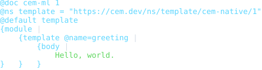

### module-template

- Source: [`examples/module-template.cem`](examples/module-template.cem)
- Content type: `application/vnd.cem.template+cem`
- Schema: `https://cem.dev/ns/template/cem-native/1`
- Expected result: `pass`
- Preview renderer: `CLI convert, tabular formatter, preview HTML + html2svg`
- Preview HTML: `dist/cem_ml/schema-packages/cem-native-template/v1/examples/module-template.cem.html`

```bash
dist/target/cem_ml_cli/debug/cem-ml convert --input-spec \
  uri=packages/cem_ml/schema-packages/cem-native-template/v1/examples/module-template.cem,contentType=application/vnd.cem.template+cem,schema=https://cem.dev/ns/template/cem-native/1 \
  --to-content-type application/cem --to-schema https://cem.dev/ns/cem-ml/1 \
  --cemt-formatter-profile tabular --cemt-color-profile terminal --output-color-type \
  ansi-256
```

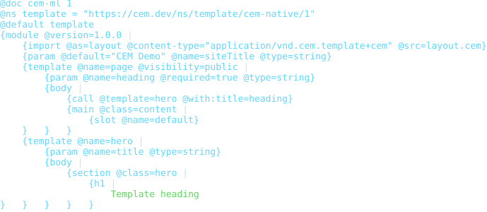

### invalid-missing-required-attribute

- Source: [`examples/invalid-missing-required-attribute.cem`](examples/invalid-missing-required-attribute.cem)
- Content type: `application/vnd.cem.template+cem`
- Schema: `https://cem.dev/ns/template/cem-native/1`
- Expected result: `fail`
- Expected diagnostics: `cem.schema_model.missing_required_attribute`
- Preview renderer: `CLI convert, tabular formatter, preview HTML + html2svg`
- Preview HTML: `dist/cem_ml/schema-packages/cem-native-template/v1/examples/invalid-missing-required-attribute.cem.html`

```bash
dist/target/cem_ml_cli/debug/cem-ml convert --input-spec \
  uri=packages/cem_ml/schema-packages/cem-native-template/v1/examples/invalid-missing-required-attribute.cem,contentType=application/vnd.cem.template+cem,schema=https://cem.dev/ns/template/cem-native/1 \
  --to-content-type application/cem --to-schema https://cem.dev/ns/cem-ml/1 \
  --cemt-formatter-profile tabular --cemt-color-profile terminal --output-color-type \
  ansi-256
```

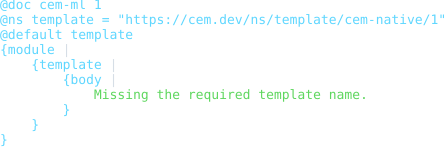

### invalid-duplicate-import-alias

- Source: [`examples/invalid-duplicate-import-alias.cem`](examples/invalid-duplicate-import-alias.cem)
- Content type: `application/vnd.cem.template+cem`
- Schema: `https://cem.dev/ns/template/cem-native/1`
- Expected result: `fail`
- Expected diagnostics: `cem.template.import_alias_duplicate`
- Preview renderer: `CLI convert, tabular formatter, preview HTML + html2svg`
- Preview HTML: `dist/cem_ml/schema-packages/cem-native-template/v1/examples/invalid-duplicate-import-alias.cem.html`

```bash
dist/target/cem_ml_cli/debug/cem-ml convert --input-spec \
  uri=packages/cem_ml/schema-packages/cem-native-template/v1/examples/invalid-duplicate-import-alias.cem,contentType=application/vnd.cem.template+cem,schema=https://cem.dev/ns/template/cem-native/1 \
  --to-content-type application/cem --to-schema https://cem.dev/ns/cem-ml/1 \
  --cemt-formatter-profile tabular --cemt-color-profile terminal --output-color-type \
  ansi-256
```

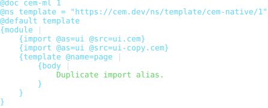

### invalid-duplicate-template-entrypoint

- Source: [`examples/invalid-duplicate-template-entrypoint.cem`](examples/invalid-duplicate-template-entrypoint.cem)
- Content type: `application/vnd.cem.template+cem`
- Schema: `https://cem.dev/ns/template/cem-native/1`
- Expected result: `fail`
- Expected diagnostics: `cem.template.entrypoint_duplicate`
- Preview renderer: `CLI convert, tabular formatter, preview HTML + html2svg`
- Preview HTML: `dist/cem_ml/schema-packages/cem-native-template/v1/examples/invalid-duplicate-template-entrypoint.cem.html`

```bash
dist/target/cem_ml_cli/debug/cem-ml convert --input-spec \
  uri=packages/cem_ml/schema-packages/cem-native-template/v1/examples/invalid-duplicate-template-entrypoint.cem,contentType=application/vnd.cem.template+cem,schema=https://cem.dev/ns/template/cem-native/1 \
  --to-content-type application/cem --to-schema https://cem.dev/ns/cem-ml/1 \
  --cemt-formatter-profile tabular --cemt-color-profile terminal --output-color-type \
  ansi-256
```

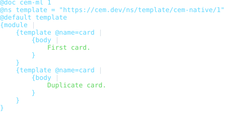

### invalid-duplicate-param

- Source: [`examples/invalid-duplicate-param.cem`](examples/invalid-duplicate-param.cem)
- Content type: `application/vnd.cem.template+cem`
- Schema: `https://cem.dev/ns/template/cem-native/1`
- Expected result: `fail`
- Expected diagnostics: `cem.template.param_duplicate`
- Preview renderer: `CLI convert, tabular formatter, preview HTML + html2svg`
- Preview HTML: `dist/cem_ml/schema-packages/cem-native-template/v1/examples/invalid-duplicate-param.cem.html`

```bash
dist/target/cem_ml_cli/debug/cem-ml convert --input-spec \
  uri=packages/cem_ml/schema-packages/cem-native-template/v1/examples/invalid-duplicate-param.cem,contentType=application/vnd.cem.template+cem,schema=https://cem.dev/ns/template/cem-native/1 \
  --to-content-type application/cem --to-schema https://cem.dev/ns/cem-ml/1 \
  --cemt-formatter-profile tabular --cemt-color-profile terminal --output-color-type \
  ansi-256
```

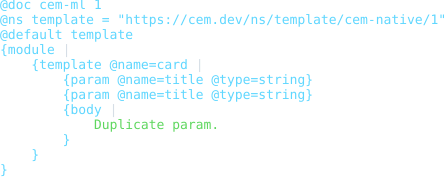

### invalid-duplicate-let

- Source: [`examples/invalid-duplicate-let.cem`](examples/invalid-duplicate-let.cem)
- Content type: `application/vnd.cem.template+cem`
- Schema: `https://cem.dev/ns/template/cem-native/1`
- Expected result: `fail`
- Expected diagnostics: `cem.template.let_duplicate`
- Preview renderer: `CLI convert, tabular formatter, preview HTML + html2svg`
- Preview HTML: `dist/cem_ml/schema-packages/cem-native-template/v1/examples/invalid-duplicate-let.cem.html`

```bash
dist/target/cem_ml_cli/debug/cem-ml convert --input-spec \
  uri=packages/cem_ml/schema-packages/cem-native-template/v1/examples/invalid-duplicate-let.cem,contentType=application/vnd.cem.template+cem,schema=https://cem.dev/ns/template/cem-native/1 \
  --to-content-type application/cem --to-schema https://cem.dev/ns/cem-ml/1 \
  --cemt-formatter-profile tabular --cemt-color-profile terminal --output-color-type \
  ansi-256
```

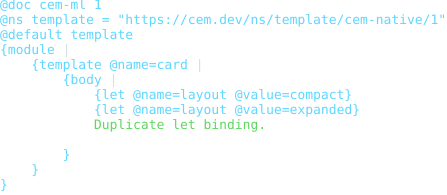

### invalid-unknown-call

- Source: [`examples/invalid-unknown-call.cem`](examples/invalid-unknown-call.cem)
- Content type: `application/vnd.cem.template+cem`
- Schema: `https://cem.dev/ns/template/cem-native/1`
- Expected result: `fail`
- Expected diagnostics: `cem.template.call_unknown`
- Preview renderer: `CLI convert, tabular formatter, preview HTML + html2svg`
- Preview HTML: `dist/cem_ml/schema-packages/cem-native-template/v1/examples/invalid-unknown-call.cem.html`

```bash
dist/target/cem_ml_cli/debug/cem-ml convert --input-spec \
  uri=packages/cem_ml/schema-packages/cem-native-template/v1/examples/invalid-unknown-call.cem,contentType=application/vnd.cem.template+cem,schema=https://cem.dev/ns/template/cem-native/1 \
  --to-content-type application/cem --to-schema https://cem.dev/ns/cem-ml/1 \
  --cemt-formatter-profile tabular --cemt-color-profile terminal --output-color-type \
  ansi-256
```

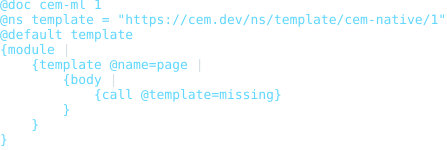

### invalid-default-expr-reserved

- Source: [`examples/invalid-default-expr-reserved.cem`](examples/invalid-default-expr-reserved.cem)
- Content type: `application/vnd.cem.template+cem`
- Schema: `https://cem.dev/ns/template/cem-native/1`
- Expected result: `fail`
- Expected diagnostics: `cem.template.param_default_expr_reserved`
- Preview renderer: `CLI convert, tabular formatter, preview HTML + html2svg`
- Preview HTML: `dist/cem_ml/schema-packages/cem-native-template/v1/examples/invalid-default-expr-reserved.cem.html`

```bash
dist/target/cem_ml_cli/debug/cem-ml convert --input-spec \
  uri=packages/cem_ml/schema-packages/cem-native-template/v1/examples/invalid-default-expr-reserved.cem,contentType=application/vnd.cem.template+cem,schema=https://cem.dev/ns/template/cem-native/1 \
  --to-content-type application/cem --to-schema https://cem.dev/ns/cem-ml/1 \
  --cemt-formatter-profile tabular --cemt-color-profile terminal --output-color-type \
  ansi-256
```

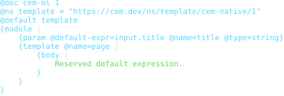

### invalid-expression-parse

- Source: [`examples/invalid-expression-parse.cem`](examples/invalid-expression-parse.cem)
- Content type: `application/vnd.cem.template+cem`
- Schema: `https://cem.dev/ns/template/cem-native/1`
- Expected result: `fail`
- Expected diagnostics: `cem.ql.use_rust_boolean_ops`
- Preview renderer: `CLI convert, tabular formatter, preview HTML + html2svg`
- Preview HTML: `dist/cem_ml/schema-packages/cem-native-template/v1/examples/invalid-expression-parse.cem.html`

```bash
dist/target/cem_ml_cli/debug/cem-ml convert --input-spec \
  uri=packages/cem_ml/schema-packages/cem-native-template/v1/examples/invalid-expression-parse.cem,contentType=application/vnd.cem.template+cem,schema=https://cem.dev/ns/template/cem-native/1 \
  --to-content-type application/cem --to-schema https://cem.dev/ns/cem-ml/1 \
  --cemt-formatter-profile tabular --cemt-color-profile terminal --output-color-type \
  ansi-256
```

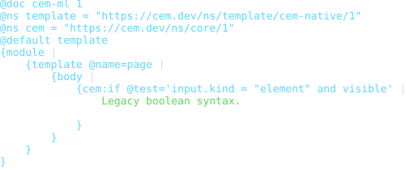

### invalid-expression-type-error

- Source: [`examples/invalid-expression-type-error.cem`](examples/invalid-expression-type-error.cem)
- Content type: `application/vnd.cem.template+cem`
- Schema: `https://cem.dev/ns/template/cem-native/1`
- Expected result: `fail`
- Expected diagnostics: `cem.ql.type_error`
- Preview renderer: `CLI convert, tabular formatter, preview HTML + html2svg`
- Preview HTML: `dist/cem_ml/schema-packages/cem-native-template/v1/examples/invalid-expression-type-error.cem.html`

```bash
dist/target/cem_ml_cli/debug/cem-ml convert --input-spec \
  uri=packages/cem_ml/schema-packages/cem-native-template/v1/examples/invalid-expression-type-error.cem,contentType=application/vnd.cem.template+cem,schema=https://cem.dev/ns/template/cem-native/1 \
  --to-content-type application/cem --to-schema https://cem.dev/ns/cem-ml/1 \
  --cemt-formatter-profile tabular --cemt-color-profile terminal --output-color-type \
  ansi-256
```

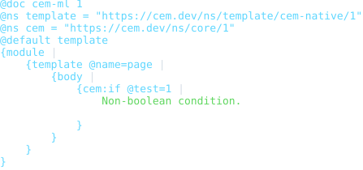

### invalid-expression-data-binding

- Source: [`examples/invalid-expression-data-binding.cem`](examples/invalid-expression-data-binding.cem)
- Content type: `application/vnd.cem.template+cem`
- Schema: `https://cem.dev/ns/template/cem-native/1`
- Expected result: `fail`
- Expected diagnostics: `cem.ql.data_binding_missing`
- Preview renderer: `CLI convert, tabular formatter, preview HTML + html2svg`
- Preview HTML: `dist/cem_ml/schema-packages/cem-native-template/v1/examples/invalid-expression-data-binding.cem.html`

```bash
dist/target/cem_ml_cli/debug/cem-ml convert --input-spec \
  uri=packages/cem_ml/schema-packages/cem-native-template/v1/examples/invalid-expression-data-binding.cem,contentType=application/vnd.cem.template+cem,schema=https://cem.dev/ns/template/cem-native/1 \
  --to-content-type application/cem --to-schema https://cem.dev/ns/cem-ml/1 \
  --cemt-formatter-profile tabular --cemt-color-profile terminal --output-color-type \
  ansi-256
```

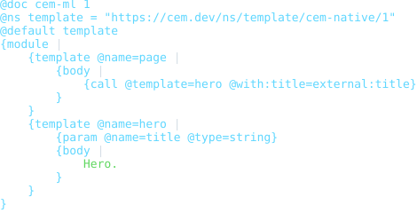
