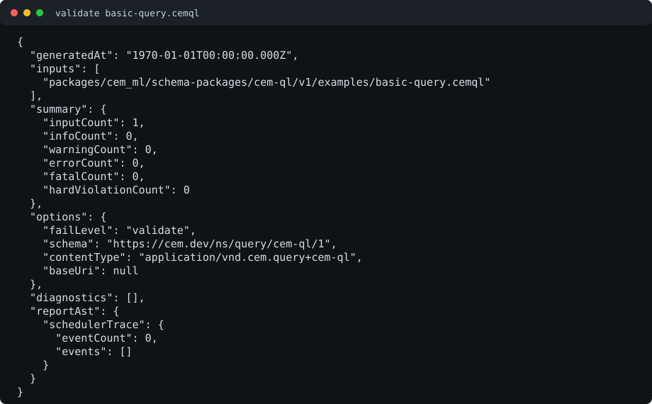
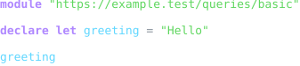
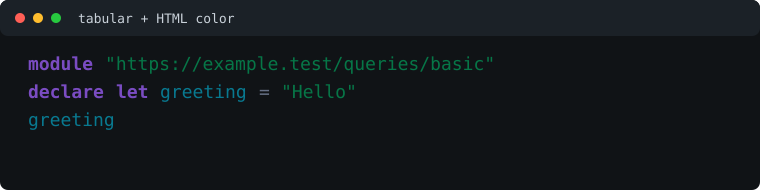

# CEM-QL Query Resource Schema Package

Status: schema, examples, formatter, and colorizer package frame

This package defines registry identity for CEM-QL query source modules, the
shared CEM-QL expression contract used by templates and schema behavior slots,
and compiled query artifacts.

CEM-QL source is not CEM-ML syntax. The schema package and this manifest are
authored in CEM-ML, but resources with the `application/vnd.cem.query+cem-ql`
content type are parsed by the `cem-ql` crate.

## Syntax Baseline

CEM-QL authoring is Rust-first: comparison, arithmetic, boolean, cast, block,
and binding forms use Rust-style spelling such as `==`, `/`, `%`, `&&`, `||`,
`!`, `expr as Type`, `{ let name = value; body }`, and `declare let name =
value`. XPath, XQuery, XSLT, JQ, and Python are functional parity references
only; their path, variable, operator, and clause syntax is not the canonical
CEM-QL surface.

The `-` operator is canonical for both numeric subtraction and stream
difference. The parser records one Rust-style token; type checking and IR
lowering resolve numeric operands to subtraction and stream or collection
operands to set difference. Mixed numeric/stream operands are validation
errors, and `seq:difference(a, b)` remains only a named helper alias.

## Owned Identities

- Schema URI: `https://cem.dev/ns/query/cem-ql/1`
- Primary source content type: `application/vnd.cem.query+cem-ql`
- Authoring alias: `text/cem-ql`
- Compiled artifact alias: `application/vnd.cem.query-artifact+cem-bin`
- Legacy/internal cache aliases: `cem-ql/1`, `cem-ql/module`
- Shared expression schema anchor: `https://cem.dev/ns/query/cem-ql/1#expression`
- Planned standalone expression content type:
  `application/vnd.cem.query-expression+cem-ql`

The standalone expression content type is intentionally not registered as a
shipped source content type until the expression API, CLI runner, examples, and
package verify gates exist. Until then, shipped CLI validation and conversion
support remains module-source oriented.

## Shared Expression Contract

CEM-QL owns the shared expression schema used by CEM-native templates,
CEM-transform resources, schema behavior declarations, and component/runtime
bindings. A parent package declares an expression slot; it does not define a
private expression grammar. Slot metadata must carry the expression source
range, slot path, lexical bindings, context item/data binding, expected result
type and nullability, evaluation phase, resolver policy, and host capability
profile.

CEM-QL owns expression tokenization, parse facts, type facts, evaluator IR,
diagnostic codes such as `cem.ql.parse_error` and `cem.ql.type_error`, and the
runtime item/value model. Parent packages may add diagnostics for slot misuse
or phase violations, but invalid expression syntax and expression type errors
remain CEM-QL facts wrapped with parent slot provenance.

Standalone expression execution runs one CEM-QL expression against a data
resource without wrapping it in a query module or template. The Rust API
exposes `cem_ql::api::compile_expression` and
`cem_ql::api::evaluate_expression` for source bytes plus typed data/context
bindings. It returns compiled expression metadata, the inferred root type,
diagnostics, policy/capability stamps supplied by the caller, and the evaluated
item stream. Source-map reporting and formatted output are still part of the
target CLI/resource-runner slice. The target CLI should expose that path under
the CEM-ML CLI, for example a future `cem-ml query expr` command that accepts
expression source from an argument, file, or stdin and data from a
content-type/schema-declared input resource.

## Standalone Expression Resource Contract

Standalone expression support uses the same schema namespace and evaluator as
query modules, but its resource shape is expression-first:

- candidate source content type:
  `application/vnd.cem.query-expression+cem-ql`;
- schema anchor: `https://cem.dev/ns/query/cem-ql/1#expression`;
- source identity: optional source URI, normalized media type, byte length,
  line-ending style, UTF-8 decode report, token ranges, source hash, and
  source-map mode;
- data/context input: one primary `input` binding plus optional named bindings,
  each lowered from a declared content type/schema resource into a CEM-QL
  `ItemStream`; a context item may be selected from `input`, from a named
  binding, or left unset;
- result model: `ItemStream` with CEM-QL atoms, records, arrays, nodes,
  lambdas, and resource handles, serialized according to the requested writer
  profile;
- diagnostics: `cem.ql.parse_error`, `cem.ql.type_error`,
  `cem.ql.expression_context_invalid`, `cem.ql.data_binding_missing`,
  `cem.ql.result_type_mismatch`, `cem.ql.host_capability_denied`, and existing
  resolver/import diagnostics where resource-sensitive helpers are allowed;
- policy/cache identity: resolver-policy stamp, host capability profile,
  type-check profile, stdlib overlay fingerprint, source hash, data/resource
  identity, and source-map mode.

`schema/cem-ql.cem` declares this report shape as `expression-resource`,
`expression-context`, `expression-binding`, `expression-result`, and
`expression-slot`. `expression-slot` is the provenance bridge used by parent
packages such as CEM-native template; it preserves host package, slot kind,
slot path, expected type/nullability, evaluation phase, and source range while
the CEM-QL diagnostic remains the expression diagnostic.

Contract-only fixtures live under
[`examples/expression-contract/`](examples/expression-contract/). They are not
manifest-declared package examples yet because the standalone API/CLI runner is
not shipped. When the runner lands, these fixtures should move into the
manifest-owned example harness with executable expected results.

## Standards And CEM Policy Matrix

| Area | External contract | CEM policy |
| ---- | ----------------- | ---------- |
| Media type | CEM-QL is CEM-owned query syntax, not an IANA-registered media type. | `application/vnd.cem.query+cem-ql` is the primary source content type. `text/cem-ql` is accepted as an authoring alias only. |
| Charset | CEM-QL source is plain text. | Direct parsing requires valid UTF-8. Other encodings require an explicit converter before CEM-QL validation or formatting. |
| Line endings | No external CEM-QL standard requires CRLF. | Formatter output defaults to LF for deterministic repository fixtures. Use generic formatter option `lineEnding=crlf` only when a downstream transport requires it, or `lineEnding=preserve` for source-preserving preview flows. |
| Syntax family | XPath, XQuery, XSLT, JQ, and Python are parity references, not source compatibility promises. | Rust-style operator and binding spelling is canonical. Compatibility spellings are parser facts that map to diagnostics and replacement hints. |
| Module identity | Query modules must have stable importable identities. | Source modules require `module "..."`; compiled artifacts carry source URI, module URI, policy stamps, import closure, and optional source maps. |
| Execution boundary | Query evaluation may read host resources or imported modules. | Validation and formatting do not execute arbitrary resource reads. Runtime execution must go through resolver policy, import policy, and host capability checks. |

Primary references for syntax behavior are the Rust `cem-ql` parser, lexer, and
evaluator crates in this workspace. XPath, XQuery, XSLT, JQ, and Python
documents are treated as functional parity material only when designing helper
coverage; they are not normative CEM-QL grammar references.

## Output Artifacts

The package declares CEMT formatter and colorizer artifacts in `package.cem`.
The public formatter profile names are `compact`, `pretty`, and `tabular`.
The public colorizer profile names are `terminal`, `html`, `md`, and `none`.

The CEM-QL formatter/colorizer artifacts keep their public entrypoints as
`cem-ql.format-tree` and `cem-ql.color-tree`, then delegate to package-owned
private helpers for Rust-first token metadata. The formatter emits formatted
CEM-tree writer-token nodes for `compact`, `pretty`, and `tabular`; the generic
writer is the stage that turns those nodes into terminal bytes or HTML. The
current CEM-QL profiles are source-preserving token-stream layouts, so the
profiles are deterministic but intentionally close in visible output until
AST-aware layout rules are added. Canonical operators are grouped under
`cem-ql.operator.*` roles before color roles are applied. Deprecated
XPath/XQuery/Python spellings such as `div`, `mod`, `and`, `or`, `not`,
`then`, `return`, `some`, `every`, `True`, `False`, `None`, and `lambda` are
modeled as diagnostics, not alternate canonical syntax.

## Formatter Presentation Profiles

CEM-QL formatting has two audiences: source-preserving review of checked-in
query modules and future AST-aware canonicalization. The current formatter
profiles are source-preserving token-stream profiles:

- `compact`: the default profile. Today it preserves source token text and
  normalizes line endings according to the generic `lineEnding` option.
- `pretty`: currently an intentional source-preserving alias for `compact`.
  It exists as the public profile that will own readable indentation and
  wrapping once AST-aware layout rules are implemented.
- `tabular`: currently an intentional source-preserving alias for `compact`
  except for profile metadata. It exists as the public profile that will own
  vertically scannable declarations, operator groups, and import/declaration
  summaries once AST-aware layout rules are implemented.

Generic formatter options are unprefixed:

- `lineEnding=lf|crlf|preserve`: output line-ending policy. `lf` is the default
  used by repository fixtures, `crlf` is available for transport-specific
  output, and `preserve` keeps source whitespace exactly where token source
  preservation metadata is available.

No CEM-QL-specific formatter options are currently implemented. Future CEM-QL
formatter options should use the `cemQl.` namespace only when they express
query-specific layout or diagnostic presentation semantics.

Colorizer profiles apply semantic roles to the formatted CEM tree:

- `terminal`: ANSI-capable terminal output through the generic writer;
- `html`: escaped HTML spans with CEM syntax role classes/styles;
- `md`: Markdown-safe role output when a Markdown writer profile is selected;
- `none`: no styled output, preserving formatted text only.

## Query Safety Boundary

CEM-QL source validation and formatting are passive. They parse, tokenize, and
render source text; they must not execute host resource reads, network imports,
query evaluation, template execution, or policy-sensitive resolver actions.

Runtime evaluation is a separate boundary. Evaluators that resolve imports,
call `read(...)`, inspect CEM-ML resources, invoke template helpers, or access
host state must run under explicit resolver policy and host capability
controls. Formatting and preview generation must remain safe for untrusted
query text and must not treat source text as executable HTML.

## Import Resolution Policy

CEM-ML owns the generic resolver policy for CEM-QL imports. CEM-QL source
declares import URIs and aliases; validation/compile receives either resolved
module identities from the active CEM-ML resolver policy or diagnostics from
that policy boundary.

The default behavior is strict and deterministic:

- no implicit fallback or best-effort replacement is attempted;
- `cem:` platform stdlib imports must name a shipped platform module;
- `urn:cem:` imports must be registered by host trust setup;
- network and local resource schemes such as `https:`, `http:`, and `file:`
  require an explicit scope-policy grant before any load attempt;
- denied imports emit `cem.ql.import_denied` with policy-controlled severity;
- allowed or registry-owned imports that cannot produce a module identity emit
  `cem.ql.import_unresolved` and block compiled artifact emission.

Policy-owned substitution is allowed only when CEM-ML resolver policy explicitly
declares it before module resolution. Reports must preserve the requested URI,
the substituted URI, the import declaration source range, and the resolver
policy stamp used for compiled artifact identity. If a substitution target is
missing, the result is still `cem.ql.import_unresolved`.

## Type Check Policy

Static type checks run after parse and import-policy resolution succeed.
Formatter, colorizer, terminal preview, and HTML preview flows remain passive
and do not type-check source text.

The default validation and compile profile is strict. A statically provable type
failure emits `cem.ql.type_error` with `cem-ql-type-report-fact` details and
blocks compiled artifact emission. The first package-owned type-error fixture
uses an integer binding in an `if` condition because CEM-QL has no truthiness
coercion: conditions must be boolean.

Imported-module surfaces and current stdlib helper aliases are treated as
`Any` until full import/export type signatures are available. This avoids false
unknown-function cascades while still catching local expression type errors
whose operands are statically known.

## Compiled Artifact Identity

Compiled CEM-QL artifacts are content-addressed generated outputs. The package
does not check in opaque `.cem-bin` examples while the binary IR layout is still
private to the Rust crate; package verification generates artifacts from
schema-owned source fixtures and validates their identity envelope.

The artifact hash covers the full envelope: artifact content type, artifact
format version, IR format, CEM-QL schema URI/version, compiler version, source
byte hash, optional source URI, module URI, cache mode, source-map mode, import
policy stamp, import closure stamp, stdlib overlay fingerprint, and type-check
profile. Reload under an active compile context must fail closed when source
bytes, source URI, import policy, stdlib overlay, cache mode, source-map mode,
or type-check profile differ from the artifact envelope.

Formatter and writer options are intentionally outside compiled query identity.
`compact`, `pretty`, `tabular`, `lineEnding`, terminal color, and HTML color
profiles affect source presentation only; they must not change compiled query
cache keys unless they also change semantic compile inputs.

## Formatter And Preview SDLC

CEM-QL formatter/colorizer changes follow the same lifecycle as CSV and other
schema-package output support:

1. Add or update the smallest CEM-QL fixture that exposes the behavior.
2. Declare the fixture in `package.cem` with expected result and diagnostics.
3. Add focused Rust or CLI tests for parser/token facts, formatter output
   bytes, HTML/terminal output, and output-stage metadata.
4. Update README command examples and SVG previews under `examples/previews/`
   when visible output changes.
5. Run the CEM-QL package verify target, which validates the package,
   validates manifest-declared examples, and checks README SVG preview drift.

Tracked but not complete:

- standalone expression resource registration, CLI runner, manifest-owned
  package examples, and package verify gates for running a CEM-QL expression
  against declared data without a wrapping query module;
- AST-aware `pretty` and `tabular` layout rules beyond source-preserving token
  streams;
- schema-owned diagnostic policy execution from parse facts rather than bridge
  logic selecting some `cem.ql.*` codes directly;
- schema-owned binary artifact fixture files once the `.cem-bin` IR envelope is
  declared public and stable. Alias content type, line-ending policy,
  comments/whitespace, invalid UTF-8, token byte-range preservation, duplicate
  import aliases, unresolved imports, static type errors, compiled
  artifact/cache identity, and duplicate declarations now have package examples
  and focused verification coverage.

## Resource Model

The schema describes the query resource model used by loaders and caches:

- query modules declare a module URI;
- imports bind other module URIs through explicit aliases;
- declarations define immutable `declare let` bindings and functions;
- expressions are compiled to typed evaluator IR and may be embedded through
  parent package slots or, after the standalone runner lands, executed directly
  against a declared data/context input;
- compiled artifacts carry hash, mode, policy stamps, import closure, and
  optional source-map sidecars.

## Design: Schema-Owned Parsing And Validation

The target is schema-owned CEM-QL semantics, not a claim that CEM-QL bytes are
parsed without host code. CEM-QL is not CEM-ML syntax, so a native lexer/parser
still supplies byte-accurate facts. The package boundary is that those facts are
projected as data, and `schema/cem-ql.cem` owns which facts become diagnostics,
including codes, severities, and structured details.

### Current Boundary

The current direct conversion bridge parses CEM-QL source through the `cem-ql`
crate, projects lexer tokens into a CEM tree subject, and routes that subject
through package-owned formatter/colorizer CEMT assets before the generic writer
emits terminal or HTML bytes. The bridge still constructs some diagnostics
directly, including invalid UTF-8, missing module URI, parser diagnostics, and
legacy syntax replacement facts.

The schema now declares a schema-facing report shape for source identity,
encoding status, token streams, parse facts, and fact-bound diagnostics. That
makes the intended ownership inspectable even while the runtime migration is
still partly native.

### Schema-Facing Parse Report

The parser primitive should project a stable report shape that the schema,
formatter, colorizer, and writer can preserve:

- `source`: URI, content type, normalized media type, byte length, and detected
  line-ending style;
- `encoding-report`: declared charset, normalized charset, decoder status, and
  first invalid byte when present;
- `token-stream`: ordered tokens with token kind, role, lexeme, cooked value,
  operator role, legacy spelling, replacement hint, byte range, line/column
  range, and source id;
- `parse-facts`: non-diagnostic facts such as `invalid-utf8`, `parse-error`,
  `module-uri-missing`, `legacy-syntax`, `import-alias-duplicate`,
  `declaration-duplicate`, `unresolved-import`, `type-error`,
  `artifact-hash-mismatch`, `policy-mismatch`, and `source-map-unavailable`;
- formatter/colorizer metadata: source maps and output spans on writer-token
  nodes so HTML, terminal, and plain text output preserve source provenance.

The schema owns the mapping from facts to diagnostics. For example,
`parseFacts.kind = "module-uri-missing"` maps to
`cem.ql.module_uri_missing`, while `parseFacts.kind = "legacy-syntax"` maps to
the appropriate `cem.ql.*` replacement diagnostic declared in
`schema/cem-ql.cem`.

### Remaining Migration Plan

1. Move all CEM-QL source validation to produce neutral parse facts first.
2. Make schema-declared `@fact-kind`, `@diagnostic`, and `@behavior` bindings
   decide emitted `cem.ql.*` codes and severities.
3. Keep direct source-output conversion registered at the engine/context layer
   so direct API users and CLI users share the same parser/output path.
4. Expand examples so every runtime-owned parser, resolver, type, policy, and
   artifact condition has a schema-owned fixture.
5. Add mutation-style contract tests that prove changing the schema bindings
   changes diagnostics without editing Rust bridge logic.

### Verification Gates

The CEM-QL package is not complete until these gates pass:

- direct `RealCemMlEngine::convert` and CLI `convert` both use the registered
  CEM-QL source-output path;
- package examples validate through the manifest-derived schema-owned example
  harness;
- source ranges for parser/token diagnostics survive through CLI JSON and
  formatted HTML output;
- CEMT formatter/colorizer assets consume the schema-facing CEM-QL token/report
  model rather than reparsing source bytes;
- `yarn nx run cem_ml_schema_package_cem_ql_v1:verify` fails on README/SVG
  drift, formatter/colorizer drift, and schema example drift.

## Validation Examples

The schema-owned examples live in [`examples/`](examples/) and are used by the
CLI validation integration tests and the package-local `verify` target.

<!--
AI maintenance: when changing any command example below, its referenced CEM-QL
fixture, formatter/colorizer assets, CLI report shape, HTML wrapper, role-color
mapping, or CEM-QL presentation output, refresh the matching SVG previews with
`node packages/cem_ml/schema-packages/cem-ql/v1/scripts/verify-previews.mjs --update`
and commit the preview changes in the same change. If the visible output is
unchanged, state that explicitly in the change notes.
-->

| Example                                                                 | Purpose                                                                                           | Expected result                       |
| ----------------------------------------------------------------------- | ------------------------------------------------------------------------------------------------- | ------------------------------------- |
| [`basic-query.cemql`](examples/basic-query.cemql)                       | Minimal query module with a module URI, immutable binding declaration, and expression.            | Pass                                  |
| [`module-query.cemql`](examples/module-query.cemql)                     | Query module with import, immutable binding declaration, function declaration, and conditional expression. | Pass                                  |
| [`operators-and-control.cemql`](examples/operators-and-control.cemql)   | Arithmetic, comparisons, boolean short-circuit operators, type tests/casts, set operators, block `let`, and `if`/`else`. | Pass                                  |
| [`collections-and-pipelines.cemql`](examples/collections-and-pipelines.cemql) | Record streams, dot pipelines, current-item projection, `for` mapping, and `any`/`all` helpers. | Pass                                  |
| [`stdlib-data-helpers.cemql`](examples/stdlib-data-helpers.cemql)       | Sequence helpers, string helpers, number helpers, date/time helpers, and report helper calls.     | Pass                                  |
| [`host-resource-helpers.cemql`](examples/host-resource-helpers.cemql)   | State helpers, template helpers, CEM-ML helpers, content-type constants, `read(...)`, and JSON-array resource boundary shape. | Pass                                  |
| [`compiled-artifact-identity.cemql`](examples/compiled-artifact-identity.cemql) | Package-owned source used to generate and validate compiled artifact cache identity stamps.        | Pass                                  |
| [`invalid-parse.cemql`](examples/invalid-parse.cemql)                   | Incomplete expression rejected by the CEM-QL parser.                                              | Fail with `cem.ql.parse_error`        |
| [`invalid-missing-module.cemql`](examples/invalid-missing-module.cemql) | Query source missing the required module URI declaration.                                         | Fail with `cem.ql.module_uri_missing` |
| [`invalid-old-syntax.cemql`](examples/invalid-old-syntax.cemql)         | XPath boolean spelling rejected with a Rust-first replacement diagnostic.                         | Fail with `cem.ql.use_rust_boolean_ops` |
| [`invalid-unresolved-import.cemql`](examples/invalid-unresolved-import.cemql) | Unregistered `urn:cem:` module import rejected by import resolution policy.                       | Fail with `cem.ql.import_unresolved` |
| [`invalid-type-error.cemql`](examples/invalid-type-error.cemql)         | Integer binding used as an `if` condition rejected by strict static type checking.                | Fail with `cem.ql.type_error`       |

The current parser has record literals and stream sequence literals; it does
not define a separate `[...]` array literal. Arrays enter CEM-QL through host
and resource boundaries such as JSON `read(...)` or WASM bindings, and are
therefore represented in the host/resource helper example rather than as a
new surface syntax.

Validate an example explicitly against this schema from a built CLI binary:

```bash
dist/target/cem_ml_cli/debug/cem-ml validate \
  --format json \
  --content-type application/vnd.cem.query+cem-ql \
  --schema https://cem.dev/ns/query/cem-ql/1 \
  packages/cem_ml/schema-packages/cem-ql/v1/examples/basic-query.cemql
```



Convert the same example with the package-owned tabular formatter and terminal
colorizer:

```bash
dist/target/cem_ml_cli/debug/cem-ml convert \
  packages/cem_ml/schema-packages/cem-ql/v1/examples/basic-query.cemql \
  --content-type application/vnd.cem.query+cem-ql \
  --schema https://cem.dev/ns/query/cem-ql/1 \
  --to-content-type application/vnd.cem.query+cem-ql \
  --to-schema https://cem.dev/ns/query/cem-ql/1 \
  --cemt-formatter cem-ql.format-tree \
  --cemt-formatter-profile tabular \
  --cemt-colorizer cem-ql.color-tree \
  --cemt-color-profile terminal \
  --output-color-type ansi-256
```



Convert the same formatted/colorized tree to HTML:

```bash
dist/target/cem_ml_cli/debug/cem-ml convert \
  packages/cem_ml/schema-packages/cem-ql/v1/examples/basic-query.cemql \
  --content-type application/vnd.cem.query+cem-ql \
  --schema https://cem.dev/ns/query/cem-ql/1 \
  --to-content-type text/html \
  --to-schema https://cem.dev/ns/data/html/1 \
  --cemt-formatter cem-ql.format-tree \
  --cemt-formatter-profile tabular \
  --cemt-colorizer cem-ql.color-tree \
  --cemt-color-profile html \
  --output-color-type html-css-vars
```


