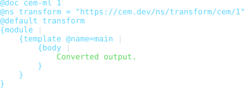
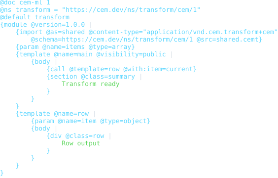
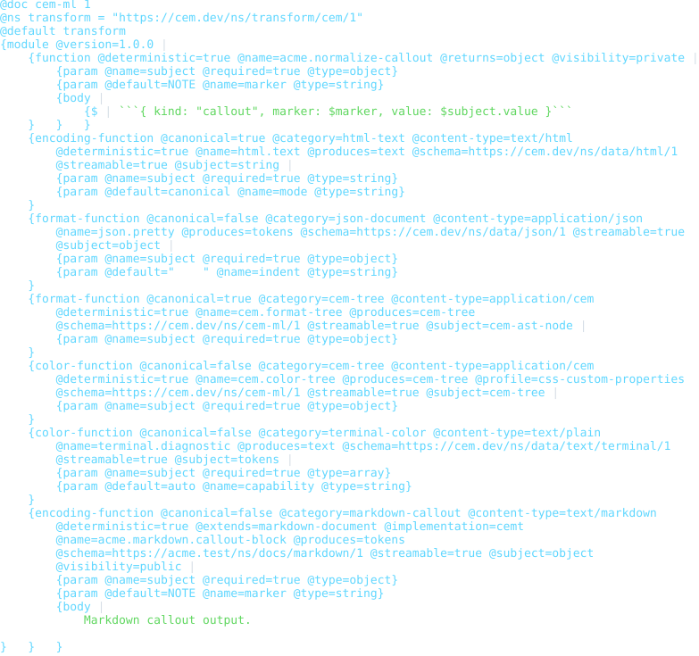
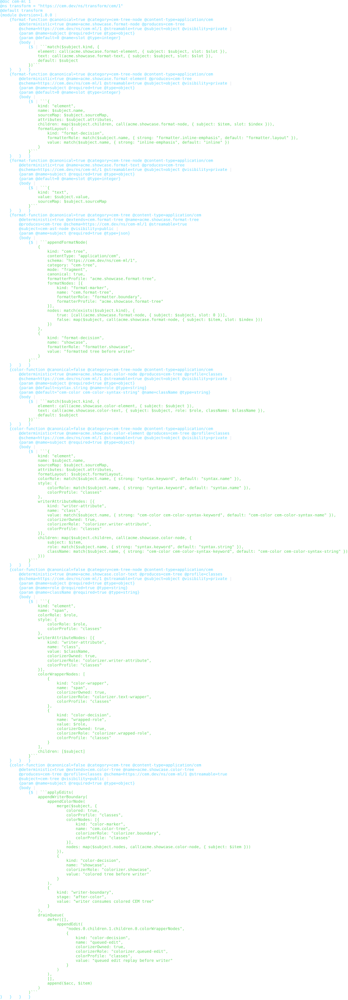
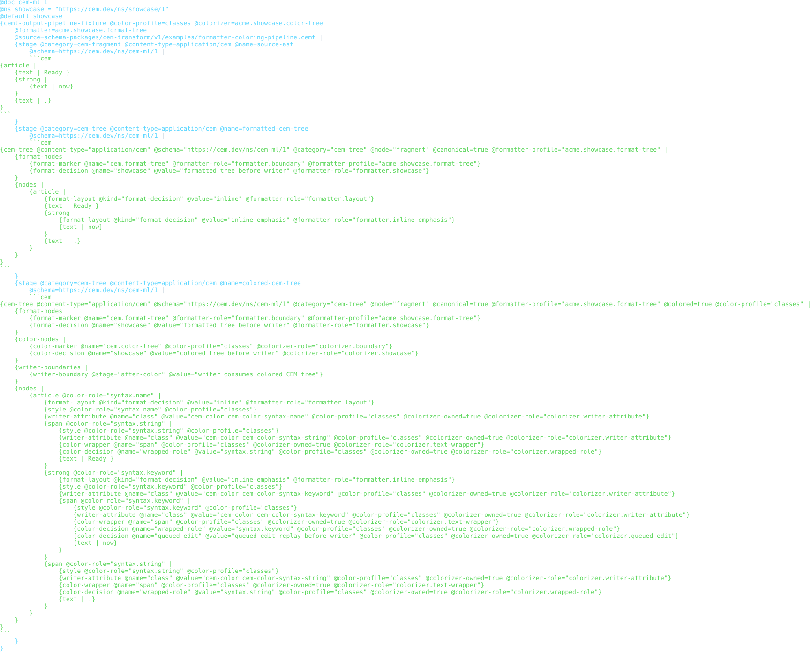
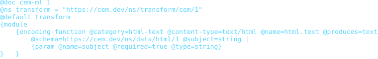

# CEM Transform Template Schema Package

Status: schema, examples, formatter, colorizer, README previews, and
package-local verification frame

This package defines CEMT (`.cemt`) resources. CEMT is the primary declarative
converter implementation language in the schema content registry design.

## Source Identity

Owned schema URI:

```text
https://cem.dev/ns/transform/cem/1
```

Primary content type:

```text
application/vnd.cem.transform+cem
```

CEMT source uses the CEM-ML document syntax, directive syntax, namespace
binding, text model, and Linux-style LF (`\n`) formatter output by default.
`lineEnding` is a generic formatter option; package-specific transform options
must only be added for transform-specific semantics.

CEMT reuses the CEM-native template module language. Source and target content
identity is not embedded in `.cemt`; it is declared by `package.cem` converter
edges so the same template execution surface can participate in registry
planning.

## Parser Facts And Diagnostics

CEMT parsing reuses the CEM-native template module parser and adds transform
function declarations for internal helpers, encoders, formatters, and
colorizers. The package schema declares the transform-facing element and
attribute contracts and the diagnostic codes for transform-specific policy:

- `cem.transform.converter_identity_missing`
- `cem.transform.converter_identity_mismatch`
- `cem.transform.template_base_invalid`
- `cem.transform.non_streamable_template`
- `cem.transform.function_name_unqualified`
- `cem.transform.function_identity_missing`
- `cem.transform.function_capability_missing`
- `cem.transform.function_shadowed_standard`
- `cem.transform_template.let_expr_invalid`

Current incomplete boundary: most transform declaration validation is still
structural schema-model validation, and several declared transform-specific
diagnostics remain target policy rather than executable schema-owned behavior.
The target shape is the same as CSV, CEM-QL, and CEM-native template: Rust
reports neutral parser/template/function facts with source ranges, and this
package's `.cem` schema owns code, severity, and structured details.

## Expression Schema Ownership

CEMT does not own a private expression language. It inherits CEM-native
template expression slots and delegates expression syntax, parse facts, type
facts, evaluator IR, and expression diagnostics to the shared CEM-QL expression
schema owned by `cem-ql/v1`. Transform-owned diagnostics remain for transform
function declaration contracts and output producer policy.

## Output Artifacts

The package declares CEMT formatter and colorizer artifacts in `package.cem`.
The public formatter profile names are `compact`, `pretty`, and `tabular`.
The public colorizer profile names are `terminal`, `html`, and `md`.

Formatters produce formatted CEM trees, colorizers enrich those trees, and the
generic writer emits terminal, HTML, Markdown, or source bytes. Token arrays,
ANSI sequences, and HTML spans are writer-boundary implementation details.

Formatter profile behavior:

- `compact`: deterministic source-preserving CEMT output suitable for
  interchange once transform-specific compacting matures;
- `pretty`: indented review layout for transform modules and template output;
- `tabular`: currently aliases the review layout until transform declaration
  table alignment rules are implemented;
- `lineEnding=lf|crlf|preserve`: generic output line-ending control, default
  `lf`.

Colorizer profile behavior:

- `terminal`: semantic roles mapped to ANSI color output;
- `html`: semantic roles mapped to HTML color spans by the generic writer;
- `md`: reserved Markdown-oriented color role output for documentation
  pipelines.

## Output Producer And Encoding Contract

CEMT is the primary output producer for schema-owned exports. Output production
includes transformation, syntax/context encoding, formatting, terminal/HTML
color output, source-map span creation, final artifact identity,
content-type-specific encoders, formatters, colorizers, writer primitives, and
small transformation helpers. These capabilities are part of the CEMT stack,
not an external post-processing layer.

Encoding in this contract means syntax/context encoding: JSON string escaping,
XML attribute escaping, HTML text-state escaping, CSV field quoting, CSS
identifier escaping, YAML scalar style selection, CEM binary chunk framing, and
similar target-context operations. It is separate from byte character encoding
such as UTF-8 or UTF-16, and separate from transport content encoding such as
gzip.

The schema-owned output pipeline is:

```text
typed subject
  -> schema-owned CEMT output producer
    -> content-type-specific encode / format / color helpers
      -> encoded text, bytes, token stream, or chunk stream
        -> destination content type and schema
```

Native output producers exist for performance, bootstrap, binary framing, and
clarity where a syntax profile is not yet expressible in CEMT. They are paired
fallback or fast-path implementations, not replacements for the CEMT contract.
Every native producer should have a matching CEMT producer or a planned CEMT
producer, and shared fixtures must cross-check native output against CEMT
output. Differences must be explicit diagnostics or documented
lossiness/canonicalization choices.

CEMT serializers need context-aware encoding rather than ad hoc string
concatenation. The standard encoding function surface is:

```text
encode(subject, target, options?) -> encoded-artifact
```

`subject` is unencoded typed data: a scalar, name, attribute, AST node, DOM
node, structured value, token stream, or binary projection chunk. `target`
declares destination `contentType`, `schema`, and encoding `category`, with an
optional context such as document, fragment, text, attribute, name, string
literal, or binary chunk. `options` controls canonicalization, charset, line
ending, namespace policy, quoting, indentation, and source-map behavior.

The result is not a plain string. It is an encoded artifact carrying target
content type, schema URI, category, output kind (`text`, `bytes`, `tokens`, or
`chunks`), source-map spans, and a double-encoding guard. Template output must
reject encoded artifacts whose identity or category is incompatible with the
surrounding output context.

The CEMT output stack provides:

- encoder functions for context-specific escaping and binary framing;
- formatter functions for indentation, line endings, ordering, wrapping,
  scalar style, namespace declaration placement, and canonical output;
- color functions for semantic style roles, terminal ANSI/SGR output, HTML
  color output, no-color fallbacks, and accessibility-aware palettes;
- writer primitives for tokens, byte streams, sealed chunks, and source-map
  spans;
- schema helpers for target syntax rules, void/empty element policy, raw-text
  modes, namespace repair, identifier validity, and field/header policy;
- diagnostics for unsupported category, unsafe raw output, context mismatch,
  charset mismatch, unsupported color capability, lossy output, and
  native/CEMT parity mismatch.

CEMT output production is not a hidden content-type-to-content-type conversion
mechanism. A serializer edge writes a typed CEM subject to a destination syntax
and content identity, such as `CEM AST -> text/html`. A conversion pipeline may
parse, normalize, validate, and change semantic models between content
identities, such as `text/html -> normalized HTML model ->
application/xhtml+xml`. Both use registry identities, but callers select them
through separate planning domains.

Schema packages may declare named encoding, formatting, and color output
functions in CEMT modules. Example encoding declaration shape:

```cem
{encoding-function
    @name="html.text"
    @category="html-text"
    @subject="string"
    @produces="text"
    @content-type="text/html"
    @schema="https://cem.dev/ns/data/html/1"
    @canonical=true
    @streamable=true |
    {param @name="subject" @type="string" @required=true}
    {param @name="mode" @type="string" @default="canonical"}
}
```

The v1 schema also supports internal helper declarations:
`function @name @returns`, with typed `param` children and one executable
`body` expression. Internal functions are reusable CEMT runtime helpers; they
return JSON-compatible CEMT values and do not register as destination output
producers.

The first implementation slice validates this declaration vocabulary
structurally in the v1 schema: `function`, `encoding-function`,
`format-function`, and `color-function` declarations are distinct. Output
function declarations must carry function identity, subject, produced kind,
content type, schema, and category metadata. The design intent is CEMT-first
output producer edges with shared writer primitives and paired native producer
hooks while the encoder, formatter, and terminal/HTML color output surface
matures. The temporary proposal remains as an implementation backlog and
worked-example source in
[`../../../docs/cemt-encoding-proposal.tmp.md`](../../../docs/cemt-encoding-proposal.tmp.md).

## Safety Notes

CEMT modules describe generated output and may request imports through the
inherited template import surface. Passive validation and README preview
generation must not fetch imports, execute generated output, evaluate arbitrary
host expressions, or substitute unresolved resources without resolver-policy
approval. Output producer functions must treat raw syntax emission,
double-encoded artifacts, active content, and target-context escaping as
explicit policy boundaries.

## Formatter And Preview SDLC

When a command example, fixture, formatter, colorizer, CLI report shape, or
visible presentation output changes, update the SVG previews in
`examples/previews/` in the same change by running
`node packages/cem_ml/schema-packages/cem-transform/v1/scripts/verify-previews.mjs --update`.

The package `verify` target writes generated preview HTML/SVG artifacts into
`dist/cem_ml/schema-packages/cem-transform/v1/examples/` and fails on drift.

## Verification

Focused package gates:

```bash
cargo test -p cem-ml cem_transform_package_examples_are_manifest_indexed
```

```bash
cargo test -p cem-ml-cli schema_owned_cem_transform_examples_validate_through_cli
```

```bash
yarn nx run cem_ml_schema_package_cem_transform_v1:verify
```

## Release Behavior

This package is versioned as `1.0.0`. The primary content type and schema URI
are compatibility anchors. Unsupported transform semantics should fail closed
through validation diagnostics rather than falling back to ordinary CEM or
CEM-native template behavior.

Tracked but not complete:

- schema-owned fact bindings for all transform parser and semantic diagnostics;
- distinct `compact` and `tabular` transform layout rules beyond the current
  deterministic review layout;
- HTML and Markdown preview drift checks once their transform presentation
  profiles become stable enough for README demos.

## Examples

This section is generated from `package.cem` `{example}` metadata by the
`samples2readme` Nx target. Each SVG previews the example content, not
the validation report. The target writes a preformatted HTML preview to
`dist/cem_ml/schema-packages/<package>/v1/examples/<example-file>.html`,
then renders the `<pre>` spans through headless Chromium into
`examples/previews/<example-file>.svg`.
Source snapshots are used only where the current CLI cannot yet render
the package formatter/colorizer path for that content identity.

### basic-transform

- Source: [`examples/basic-transform.cemt`](examples/basic-transform.cemt)
- Content type: `application/vnd.cem.transform+cem`
- Schema: `https://cem.dev/ns/transform/cem/1`
- Expected result: `pass`
- Preview renderer: `CLI convert, tabular formatter, preview HTML + html2svg`
- Preview HTML: `dist/cem_ml/schema-packages/cem-transform/v1/examples/basic-transform.cemt.html`

```bash
dist/target/cem_ml_cli/debug/cem-ml convert --input-spec \
  uri=packages/cem_ml/schema-packages/cem-transform/v1/examples/basic-transform.cemt,contentType=application/vnd.cem.transform+cem,schema=https://cem.dev/ns/transform/cem/1 \
  --to-content-type application/cem --to-schema https://cem.dev/ns/cem-ml/1 \
  --cemt-formatter-profile tabular --cemt-color-profile terminal --output-color-type \
  ansi-256
```



### module-transform

- Source: [`examples/module-transform.cemt`](examples/module-transform.cemt)
- Content type: `application/vnd.cem.transform+cem`
- Schema: `https://cem.dev/ns/transform/cem/1`
- Expected result: `pass`
- Preview renderer: `CLI convert, tabular formatter, preview HTML + html2svg`
- Preview HTML: `dist/cem_ml/schema-packages/cem-transform/v1/examples/module-transform.cemt.html`

```bash
dist/target/cem_ml_cli/debug/cem-ml convert --input-spec \
  uri=packages/cem_ml/schema-packages/cem-transform/v1/examples/module-transform.cemt,contentType=application/vnd.cem.transform+cem,schema=https://cem.dev/ns/transform/cem/1 \
  --to-content-type application/cem --to-schema https://cem.dev/ns/cem-ml/1 \
  --cemt-formatter-profile tabular --cemt-color-profile terminal --output-color-type \
  ansi-256
```



### function-declarations

- Source: [`examples/function-declarations.cemt`](examples/function-declarations.cemt)
- Content type: `application/vnd.cem.transform+cem`
- Schema: `https://cem.dev/ns/transform/cem/1`
- Expected result: `pass`
- Preview renderer: `CLI convert, tabular formatter, preview HTML + html2svg`
- Preview HTML: `dist/cem_ml/schema-packages/cem-transform/v1/examples/function-declarations.cemt.html`

```bash
dist/target/cem_ml_cli/debug/cem-ml convert --input-spec \
  uri=packages/cem_ml/schema-packages/cem-transform/v1/examples/function-declarations.cemt,contentType=application/vnd.cem.transform+cem,schema=https://cem.dev/ns/transform/cem/1 \
  --to-content-type application/cem --to-schema https://cem.dev/ns/cem-ml/1 \
  --cemt-formatter-profile tabular --cemt-color-profile terminal --output-color-type \
  ansi-256
```



### formatter-coloring-pipeline

- Source: [`examples/formatter-coloring-pipeline.cemt`](examples/formatter-coloring-pipeline.cemt)
- Content type: `application/vnd.cem.transform+cem`
- Schema: `https://cem.dev/ns/transform/cem/1`
- Expected result: `pass`
- Preview renderer: `CLI convert, tabular formatter, preview HTML + html2svg`
- Preview HTML: `dist/cem_ml/schema-packages/cem-transform/v1/examples/formatter-coloring-pipeline.cemt.html`

```bash
dist/target/cem_ml_cli/debug/cem-ml convert --input-spec \
  uri=packages/cem_ml/schema-packages/cem-transform/v1/examples/formatter-coloring-pipeline.cemt,contentType=application/vnd.cem.transform+cem,schema=https://cem.dev/ns/transform/cem/1 \
  --to-content-type application/cem --to-schema https://cem.dev/ns/cem-ml/1 \
  --cemt-formatter-profile tabular --cemt-color-profile terminal --output-color-type \
  ansi-256
```



### formatter-coloring-pipeline-fixture

- Source: [`examples/formatter-coloring-pipeline.fixture.cem`](examples/formatter-coloring-pipeline.fixture.cem)
- Content type: `application/cem`
- Schema: `https://cem.dev/ns/cem-ml/1`
- Expected result: `fail`
- Expected diagnostics: `cem.schema.unresolved_namespace`
- Preview renderer: `CLI convert, tabular formatter, preview HTML + html2svg`
- Preview HTML: `dist/cem_ml/schema-packages/cem-transform/v1/examples/formatter-coloring-pipeline.fixture.cem.html`

```bash
dist/target/cem_ml_cli/debug/cem-ml convert --input-spec \
  uri=packages/cem_ml/schema-packages/cem-transform/v1/examples/formatter-coloring-pipeline.fixture.cem,contentType=application/cem,schema=https://cem.dev/ns/cem-ml/1 \
  --to-content-type application/cem --to-schema https://cem.dev/ns/cem-ml/1 \
  --cemt-formatter-profile tabular --cemt-color-profile terminal --output-color-type \
  ansi-256
```



### invalid-missing-required-attribute

- Source: [`examples/invalid-missing-required-attribute.cemt`](examples/invalid-missing-required-attribute.cemt)
- Content type: `application/vnd.cem.transform+cem`
- Schema: `https://cem.dev/ns/transform/cem/1`
- Expected result: `fail`
- Expected diagnostics: `cem.schema_model.missing_required_attribute`
- Preview renderer: `CLI convert, tabular formatter, preview HTML + html2svg`
- Preview HTML: `dist/cem_ml/schema-packages/cem-transform/v1/examples/invalid-missing-required-attribute.cemt.html`

```bash
dist/target/cem_ml_cli/debug/cem-ml convert --input-spec \
  uri=packages/cem_ml/schema-packages/cem-transform/v1/examples/invalid-missing-required-attribute.cemt,contentType=application/vnd.cem.transform+cem,schema=https://cem.dev/ns/transform/cem/1 \
  --to-content-type application/cem --to-schema https://cem.dev/ns/cem-ml/1 \
  --cemt-formatter-profile tabular --cemt-color-profile terminal --output-color-type \
  ansi-256
```


### invalid-function-missing-category

- Source: [`examples/invalid-function-missing-category.cemt`](examples/invalid-function-missing-category.cemt)
- Content type: `application/vnd.cem.transform+cem`
- Schema: `https://cem.dev/ns/transform/cem/1`
- Expected result: `fail`
- Expected diagnostics: `cem.schema_model.missing_required_attribute`
- Preview renderer: `CLI convert, tabular formatter, preview HTML + html2svg`
- Preview HTML: `dist/cem_ml/schema-packages/cem-transform/v1/examples/invalid-function-missing-category.cemt.html`

```bash
dist/target/cem_ml_cli/debug/cem-ml convert --input-spec \
  uri=packages/cem_ml/schema-packages/cem-transform/v1/examples/invalid-function-missing-category.cemt,contentType=application/vnd.cem.transform+cem,schema=https://cem.dev/ns/transform/cem/1 \
  --to-content-type application/cem --to-schema https://cem.dev/ns/cem-ml/1 \
  --cemt-formatter-profile tabular --cemt-color-profile terminal --output-color-type \
  ansi-256
```


### invalid-function-missing-contract-metadata

- Source: [`examples/invalid-function-missing-contract-metadata.cemt`](examples/invalid-function-missing-contract-metadata.cemt)
- Content type: `application/vnd.cem.transform+cem`
- Schema: `https://cem.dev/ns/transform/cem/1`
- Expected result: `fail`
- Expected diagnostics: `cem.schema_model.missing_required_attribute`
- Preview renderer: `CLI convert, tabular formatter, preview HTML + html2svg`
- Preview HTML: `dist/cem_ml/schema-packages/cem-transform/v1/examples/invalid-function-missing-contract-metadata.cemt.html`

```bash
dist/target/cem_ml_cli/debug/cem-ml convert --input-spec \
  uri=packages/cem_ml/schema-packages/cem-transform/v1/examples/invalid-function-missing-contract-metadata.cemt,contentType=application/vnd.cem.transform+cem,schema=https://cem.dev/ns/transform/cem/1 \
  --to-content-type application/cem --to-schema https://cem.dev/ns/cem-ml/1 \
  --cemt-formatter-profile tabular --cemt-color-profile terminal --output-color-type \
  ansi-256
```


