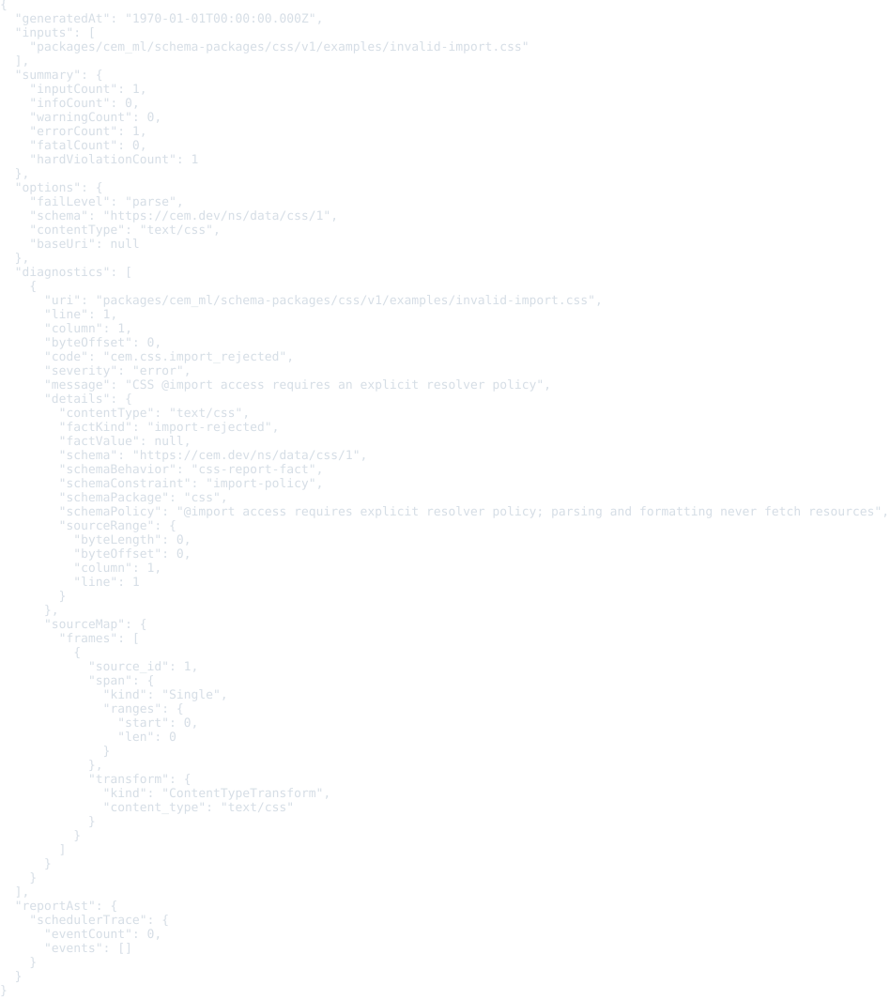
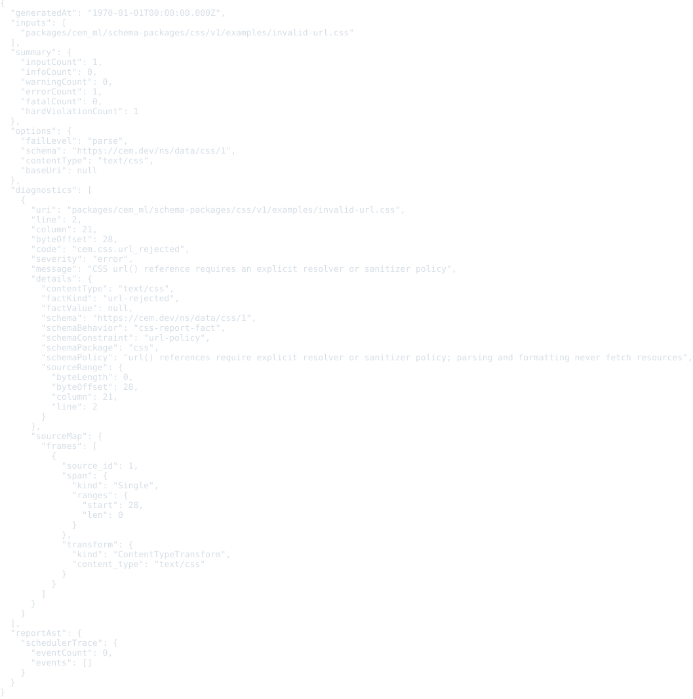
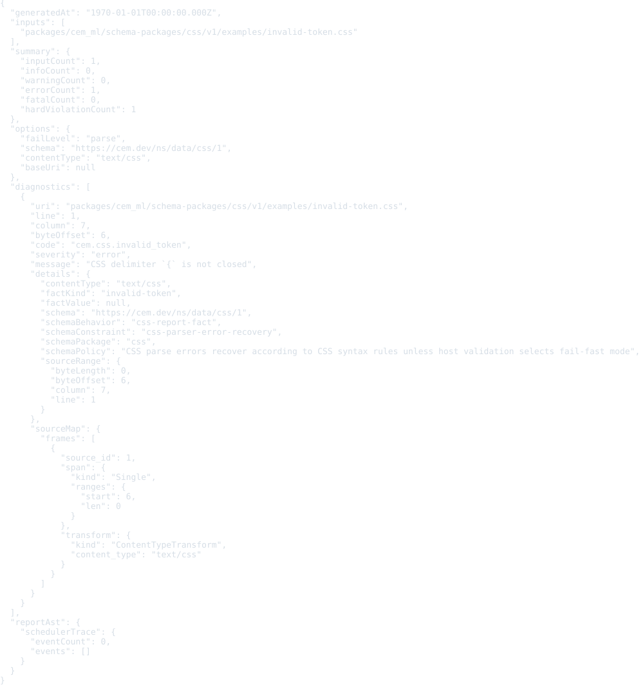
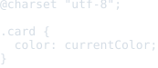

# CSS schema package v1

Status: schema, examples, formatter, and colorizer package frame

This package defines the CEM schema identity for CSS stylesheets and scoped style content.

- Schema URI: `https://cem.dev/ns/data/css/1`
- Primary content type: `text/css`
- Source schema: `schema/css.cem`

CSS source is not CEM-ML syntax. The package models stylesheet, style block, style attribute, rule, selector, declaration, and component-value structure for future parser and converter work.

Scoped style content is represented as metadata on style blocks and style attributes. The scope can point at an HTML, SVG, MathML, custom-element, or shadow-root host without changing the `text/css` content identity.

## Output Artifacts

The package declares CEMT formatter and colorizer artifacts in `package.cem`.
The public formatter profile names are `compact`, `pretty`, and `tabular`.
The public colorizer profile names are `terminal`, `html`, and `md`.

## Validation

Validate CSS resources through the CLI with the schema URI and content type:

```bash
cem-ml validate --format json \
  --content-type text/css \
  --schema https://cem.dev/ns/data/css/1 \
  packages/cem_ml/schema-packages/css/v1/examples/basic-stylesheet.css
```

The direct validator scans CSS syntax without fetching or executing anything.
It accepts stylesheet and declaration-list shaped scoped style content, reports
charset conflicts as warnings, rejects `@import` and external `url()` references
without an explicit resolver/sanitizer policy, and surfaces token/declaration
recovery diagnostics.

## Examples

This section is generated from `package.cem` `{example}` metadata by the
`samples2readme` Nx target. Each SVG previews the example content, not
the validation report. The target writes a preformatted HTML preview to
`dist/cem_ml/schema-packages/<package>/v1/examples/<example-file>.html`,
then renders the `<pre>` spans through headless Chromium into
`examples/previews/<example-file>.svg`.
Source snapshots are used only where the current CLI cannot yet render
the package formatter/colorizer path for that content identity.

<details>
<summary>basic-stylesheet</summary>

- Source: [`examples/basic-stylesheet.css`](./examples/basic-stylesheet.css)
- Content type: `text/css`
- Schema: `https://cem.dev/ns/data/css/1`
- Expected result: `pass`
- Preview renderer: `source snapshot HTML + html2svg`
- Preview HTML: `dist/cem_ml/schema-packages/css/v1/examples/basic-stylesheet.css.html`

</details>



<details>
<summary>scoped-component</summary>

- Source: [`examples/scoped-component.css`](./examples/scoped-component.css)
- Content type: `text/css`
- Schema: `https://cem.dev/ns/data/css/1`
- Expected result: `pass`
- Preview renderer: `source snapshot HTML + html2svg`
- Preview HTML: `dist/cem_ml/schema-packages/css/v1/examples/scoped-component.css.html`

</details>


<details>
<summary>style-attribute</summary>

- Source: [`examples/style-attribute.css`](./examples/style-attribute.css)
- Content type: `text/css`
- Schema: `https://cem.dev/ns/data/css/1`
- Expected result: `pass`
- Preview renderer: `source snapshot HTML + html2svg`
- Preview HTML: `dist/cem_ml/schema-packages/css/v1/examples/style-attribute.css.html`

</details>


<details>
<summary>invalid-import</summary>

- Source: [`examples/invalid-import.css`](./examples/invalid-import.css)
- Content type: `text/css`
- Schema: `https://cem.dev/ns/data/css/1`
- Expected result: `fail`
- Expected diagnostics: `cem.css.import_rejected`
- Preview renderer: `source snapshot HTML + html2svg`
- Preview HTML: `dist/cem_ml/schema-packages/css/v1/examples/invalid-import.css.html`

</details>



<details>
<summary>invalid-url</summary>

- Source: [`examples/invalid-url.css`](./examples/invalid-url.css)
- Content type: `text/css`
- Schema: `https://cem.dev/ns/data/css/1`
- Expected result: `fail`
- Expected diagnostics: `cem.css.url_rejected`
- Preview renderer: `source snapshot HTML + html2svg`
- Preview HTML: `dist/cem_ml/schema-packages/css/v1/examples/invalid-url.css.html`

</details>



<details>
<summary>invalid-token</summary>

- Source: [`examples/invalid-token.css`](./examples/invalid-token.css)
- Content type: `text/css`
- Schema: `https://cem.dev/ns/data/css/1`
- Expected result: `fail`
- Expected diagnostics: `cem.css.invalid_token`
- Preview renderer: `source snapshot HTML + html2svg`
- Preview HTML: `dist/cem_ml/schema-packages/css/v1/examples/invalid-token.css.html`

</details>



<details>
<summary>invalid-declaration</summary>

- Source: [`examples/invalid-declaration.css`](./examples/invalid-declaration.css)
- Content type: `text/css`
- Schema: `https://cem.dev/ns/data/css/1`
- Expected result: `pass`
- Expected diagnostics: `cem.css.invalid_declaration`
- Preview renderer: `source snapshot HTML + html2svg`
- Preview HTML: `dist/cem_ml/schema-packages/css/v1/examples/invalid-declaration.css.html`

</details>


<details>
<summary>encoding-conflict</summary>

- Source: [`examples/encoding-conflict.css`](./examples/encoding-conflict.css)
- Content type: `text/css; charset=iso-8859-1`
- Schema: `https://cem.dev/ns/data/css/1`
- Expected result: `pass`
- Expected diagnostics: `cem.css.encoding_conflict`
- Preview renderer: `source snapshot HTML + html2svg`
- Preview HTML: `dist/cem_ml/schema-packages/css/v1/examples/encoding-conflict.css.html`

</details>


