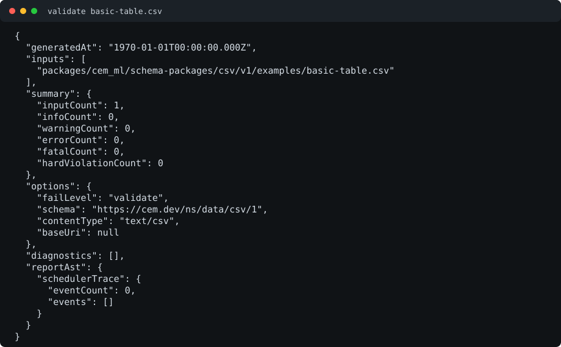
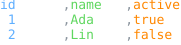
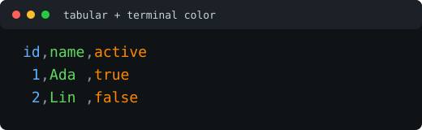

# CSV Resource Schema Package

Status: schema, examples, formatter, and colorizer package frame

This package defines registry identity for generic comma-separated value
resources.

CSV source is not CEM-ML syntax. The schema package and this manifest are
authored in CEM-ML, but resources with the `text/csv` content type are parsed
by a CSV parser or adapter.

## Owned Identities

- Schema URI: `https://cem.dev/ns/data/csv/1`
- Primary content type: `text/csv`
- Preferred extension: `.csv`

RFC 4180 registers `text/csv` with optional `charset` and `header` parameters.
RFC 7111 defines row, column, and cell fragment identifiers for `text/csv`.
The current parser accepts UTF-8 and US-ASCII CSV sources directly. Other
declared charsets require an explicit converter instead of silent transcoding.

## Standards And CEM Policy Matrix

| Area | External contract | CEM policy |
| --- | --- | --- |
| Media type | IANA registers `text/csv` with RFC 4180 and RFC 7111 references. | `text/csv` is the only primary CSV content type for this package. Delimited text variants need their own package or explicit converter profile. |
| Charset | RFC 7111, updating the registration under RFC 6657, says `charset` should be used and UTF-8 should be assumed when it is absent. | UTF-8, `utf8`, US-ASCII, and `ascii` are accepted directly. Other declared charsets produce `cem.csv.unsupported_encoding` until an explicit transcoding converter is selected. |
| Header parameter | RFC 4180/RFC 7111 define optional `header=present|absent`; absent metadata leaves header detection to processors. | The raw `header` parameter is preserved. Unknown values produce `cem.csv.invalid_header_parameter` as metadata drift while valid CSV bytes can still parse. |
| Line endings | RFC 4180 uses CRLF for records and notes that other implementations may use other values; CSVW accepts common LF handling. | Parsers accept CRLF, LF, CR, and mixed line endings as facts. Formatter output defaults to LF for repository-friendly deterministic fixtures. This conflicts with strict `text/csv` CRLF interchange expectations; use generic formatter option `lineEnding=crlf` when the receiver requires strict media-type output. |
| Field spacing | RFC 4180 treats spaces as part of a field and says they should not be ignored. | Formatter-owned presentation padding is allowed only in readable profiles. Compact output must not add alignment padding or trim field values. |
| Quoting | RFC 4180 requires quoting for fields containing commas, quotes, or record line breaks and doubles quotes inside quoted fields. | `compact` uses the package-owned quoting rule as strict writer output. Readable profiles start from the same quoted field text, but may add presentation padding around serialized fields and are not strict-CSV guarantees. |
| Fragments | RFC 7111 defines 1-based `row`, `col`, and `cell` fragment addressing with ranges and ignored invalid selections. | The schema records source-map hooks today. Full fragment resolver tests remain a tracked implementation item. |
| CSVW metadata | W3C CSVW defines dialect metadata, datatypes, null/default handling, list separators, keys, foreign keys, and transformations. | This package currently models the core table and a narrow dialect subset. CSVW-compatible typed column metadata is future schema-owned work, not formatter inference. |
| Spreadsheet consumers | Spreadsheet applications may interpret CSV cells as formulas even though CSV itself is passive text. | CSV syntax validation does not rewrite data. Spreadsheet-safe export must be an explicit lossy presentation/security profile or warning mode. |

Primary references: [RFC 4180](https://datatracker.ietf.org/doc/html/rfc4180),
[RFC 7111](https://datatracker.ietf.org/doc/html/rfc7111),
[RFC 6657](https://datatracker.ietf.org/doc/html/rfc6657),
[IANA media types](https://www.iana.org/assignments/media-types/media-types.xhtml),
[W3C CSVW Tabular Data Model](https://www.w3.org/TR/tabular-data-model/),
[W3C CSVW Metadata Vocabulary](https://www.w3.org/TR/tabular-metadata/),
and [OWASP CSV Injection](https://owasp.org/www-community/attacks/CSV_Injection).

## Output Artifacts

The package declares CEMT formatter and colorizer artifacts in `package.cem`.
The public formatter profile names are `compact`, `pretty`, and `tabular`.
The public colorizer profile names are `terminal`, `html`, and `md`.
Each profile is backed by the matching design-named package asset:
`formatters/compact.cemt`, `formatters/pretty.cemt`, `formatters/tabular.cemt`,
`colorizers/terminal.cemt`, `colorizers/html.cemt`, and `colorizers/md.cemt`.

CSV formatter assets declare `@produces="cem-tree"` and return a formatted CSV
CEM tree with `formatNodes` plus ordered writer-token nodes. CSV colorizers
consume that tree and return a colored CSV CEM tree with `colorNodes`. The
generic writer is the only stage that flattens those writer-token nodes into
target-native CSV bytes.

## Formatter Presentation Profiles

CSV formatting has two different audiences: machine import and human review.
`compact` is the canonical CSV writer profile. It adds no formatter-owned
presentation padding, applies minimal quoting only when required by CSV syntax,
and preserves full field values without display trimming. It does not strip
lexical spaces that belong to the original field value; those spaces remain
data and are quoted when needed.

`pretty` is a readable presentation profile. It may use horizontal tab
characters with an 8-column tab-stop assumption to align nearby fields, but it
does not guarantee strict vertical alignment across every row. `pretty` should
avoid trimming by default, but it is still visual output rather than an
interchange contract.

`tabular` is a review and diff presentation profile. It aligns field content
and delimiter positions vertically so row changes can be scanned at the field
level. It may add spaces or tabs for display and is not canonical CSV when
presentation padding or trimming is enabled. Consumers that need import-safe
CSV should request `compact`.

Treat `pretty`, `tabular`, and terminal-colored CSV output as review
presentations. They are useful for diffs, logs, and documentation previews, but
their formatter-owned padding is still CSV field content under strict CSV
rules, and padding around quoted fields may be rejected by strict readers.
Many popular CSV libraries and data frameworks accept this whitespace-tolerant
form or can be configured to trim leading and trailing field padding. That is
the only recovery assumption for permissive consumers; no other value recovery
is guaranteed. For non-visual data formatting, imports, or interchange bytes,
use `compact` and choose a line-ending policy explicitly when the receiver
requires CRLF.

`pretty` and `tabular` align values by declared column type when available,
falling back to column inference across non-empty fields. Mixed or unknown
columns use string alignment:

- strings are left aligned;
- integers are right aligned;
- decimal numbers are aligned on the decimal point;
- booleans, enums, and mixed values use string alignment unless a schema or
  adapter declares a narrower type.

The intended generic CLI surface for formatter options is repeatable
`--cemt-formatter-option NAME=VALUE`. Generic formatter options are unprefixed:

- `lineEnding=lf|crlf|preserve`: output record-ending policy. `lf` is the
  default used by repository fixtures across formatters, `crlf` is the strict
  `text/csv` interchange option, and `preserve` keeps detected CRLF or LF
  source line endings when source preservation metadata is available. CR-only
  and mixed source line endings currently normalize to LF because the formatter
  exposes one record-ending choice per output document.

CSV-specific formatter options use the `csv.` namespace:

- `csv.maxFieldWidth=N`: maximum display width for a single field in `tabular`
  output. When absent, fields are not trimmed by width.
- `csv.stringTrim=right|middle|left`: string trimming mode when
  `csv.maxFieldWidth` is active. The default is `right`.

Max-width trimming is display-oriented and uses ASCII `...` as the omission
marker:

- strings use `csv.stringTrim`; `right` keeps the left side and appends `...`,
  `left` prepends `...` and keeps the right side, and `middle` keeps both ends;
- integers are right aligned and trim from the left only as a last resort,
  preserving the least-significant digits;
- decimal numbers align on the decimal point, then reduce fractional precision
  to fit before trimming from the left as a last resort;
- empty fields remain empty and do not influence inferred numeric alignment.

Once `csv.maxFieldWidth` trims a value, the output is deliberately lossy visual
text and may no longer be valid as recoverable CSV data. Use `compact` whenever
the formatted result will be consumed by software rather than read by people.

## Spreadsheet Security Boundary

CSV is passive text as a media type, but common spreadsheet applications may
interpret cells beginning with formula markers such as `=`, `+`, `-`, or `@`
as formulas after import. Quoting alone is not a universal mitigation across
spreadsheet save/open cycles. The CSV package therefore keeps syntax-preserving
validation separate from spreadsheet-consumer hardening:

- syntax validation reports CSV contract facts; it does not rewrite cell
  content;
- `compact` preserves data and must not inject spreadsheet-safety prefixes;
- a future spreadsheet-safe profile should be explicit about lossiness, for
  example `csv.spreadsheetSafe=warn|reject|prefix-tab`;
- examples with formula-looking values should pass CSV syntax validation while
  documenting the downstream spreadsheet risk.

## Formatter And Preview SDLC

CSV formatter/colorizer changes should move through the same lifecycle as other
schema-package output support:

1. Add or update the smallest CSV fixture that exposes the behavior.
2. Declare the fixture in `package.cem` with expected result and diagnostics.
3. Add focused Rust or CLI tests for parse facts, formatter output bytes, and
   output-stage metadata.
4. Update README command examples and their SVG previews in
   `examples/previews/` when visible output changes.
5. Keep a follow-up automation task for generated previews: run each documented
   command, capture stable stdout without local build noise, render the SVG,
   and fail CI when checked-in previews drift.

Tracked but not complete:

- RFC 7111 fragment resolver coverage for 1-based `row`, `col`, and `cell`
  selections, ranges, out-of-range selections, and inverse-range ignore rules;
- CSVW-style schema-owned column metadata for datatypes, null/default values,
  list separators, keys, foreign keys, and transformations;
- dialect metadata beyond the current comma delimiter, quote, escape,
  line-ending, charset, and header facts.

## Resource Model

The schema describes CSV resources as a tabular model:

- tables preserve row order;
- rows preserve field order;
- optional header rows provide column names;
- fields preserve lexical value, quoted state, and source location when
  available;
- parser metadata records encoding, delimiter, line-ending style, and header
  disposition.

The default delimiter for `text/csv` is comma. Other delimited text formats
should use their own schema package or an explicit converter profile instead of
being silently treated as CSV.
When the MIME `header` parameter is present, it must be `present` or `absent`;
an unknown value is reported as package-owned metadata drift while the CSV bytes
are still parsed.

## Design: Schema-Owned Parsing And Validation

The target is schema-owned CSV semantics, not a claim that bytes can be parsed
without host code. CSV is not CEM-ML syntax, so a byte reader still needs a
host parsing primitive. The ownership change is that Rust stops deciding
CSV-specific policy and diagnostics. Rust supplies generic, deterministic facts
about the byte stream; `schema/csv.cem` owns which facts are valid, which facts
are warnings or errors, and which diagnostic codes are emitted.

### Current Boundary To Remove

The current CLI path has CSV-specific validation logic in Rust. It interprets
the `text/csv` parameters, checks UTF-8 and US-ASCII byte compatibility,
parses records, detects inconsistent field counts, maps parser errors to
`cem.csv.*` diagnostics, and decides warning versus error severity.

That makes the CSV package partly declarative and partly Rust-owned. The
schema declares `cem.csv.unclosed_quote`, `cem.csv.inconsistent_field_count`,
and related diagnostics, but the Rust validator still owns the conditions that
produce them.

### Target Boundary

The target boundary has three layers:

1. Source identity normalization:
   The generic content-type reader normalizes the media-type essence and
   exposes parameters such as `charset` and `header` as structured source
   metadata. It does not decide CSV policy beyond generic media-type parsing.

2. CSV parse fact extraction:
   A generic resource behavior reads bytes and returns a schema-facing parse
   report. The report is data, not diagnostics. It includes encoding facts,
   delimiter facts, records, fields, quoted state, line endings, parser events,
   byte ranges, and recoverable or fatal parse facts such as unclosed quotes.

3. CSV schema contract evaluation:
   `schema/csv.cem` evaluates the parse report using schema-declared
   constraints, behaviors, comparisons, and diagnostics. This layer decides
   whether a fact is accepted, warned, or rejected.

Rust may still implement a reusable parser primitive for performance and byte
accuracy, but it must be policy-neutral. It should not contain CSV-specific
diagnostic-code selection, severity selection, or package-specific acceptance
rules.

### Schema-Facing Parse Report

The parser primitive should project a stable report shape that the schema can
query:

- `source`: URI, content type, media-type parameters, byte length, and charset
  declaration;
- `encoding`: decoded charset, decoder status, first invalid byte when present,
  and whether transcoding was required;
- `dialect`: delimiter, quote character, escape style, header parameter value,
  and line-ending style;
- `records`: ordered rows with record index, field count, byte range, and line
  range;
- `fields`: ordered fields with row index, field index, raw span, decoded value,
  quoted state, and escape events;
- `parseFacts`: non-diagnostic facts such as `unclosed-quote`,
  `invalid-quote-escape`, `ragged-row`, `unsupported-charset`,
  `declared-us-ascii-non-ascii-byte`, and `invalid-header-parameter`;
- `sourceMap`: a byte-offset map for rows, fields, quote tokens, separators,
  and line endings when available.

The schema owns the mapping from those facts to diagnostics. For example,
`parseFacts.kind = "unclosed-quote"` maps to `cem.csv.unclosed_quote` as an
error, while `parseFacts.kind = "ragged-row"` maps to
`cem.csv.inconsistent_field_count` as a warning unless a future schema profile
explicitly permits ragged rows.

### CSV Schema Contracts

`schema/csv.cem` should become the single place that declares these package
policies:

- `csv-source-parser`: binds the generic resource behavior that produces the
  parse report and declares the expected report shape;
- `charset-parameter-supported`: accepts `utf-8`, `utf8`, `us-ascii`, and
  `ascii`; other declared charsets require an explicit converter before CSV
  validation;
- `us-ascii-byte-compatibility`: rejects non-ASCII bytes when the source
  declares US-ASCII;
- `header-parameter-values`: accepts `present` and `absent`; unknown values are
  metadata drift and emit a warning while valid CSV bytes can still parse;
- `comma-delimiter-default`: keeps `text/csv` comma-delimited unless a future
  package profile declares a different dialect;
- `quote-escape-policy`: double quotes inside quoted fields must be represented
  by two double quote characters;
- `field-count-policy`: rows should match the first row width unless a future
  schema profile explicitly permits ragged rows;
- `source-map-preferred`: parser-provided byte ranges should be preserved on
  table, row, and field facts when available.

Diagnostics stay package-owned in this schema. Rust should pass fact kinds,
source ranges, and raw parser details upward; the schema decides whether to
emit `cem.csv.parse_error`, `cem.csv.unsupported_encoding`,
`cem.csv.unclosed_quote`, `cem.csv.invalid_quote_escape`,
`cem.csv.inconsistent_field_count`, `cem.csv.invalid_header_parameter`, or
`cem.csv.source_map_unavailable`.

### Behavior And Diagnostic Binding

The schema should use package-visible behavior declarations for diagnostic
construction. Each behavior binds a parse fact plus source range inputs and
returns a diagnostic payload with stable structured details:

- `factKind`: the parser fact being interpreted;
- `contract`: the schema constraint that interpreted the fact;
- `sourceRange`: byte and line range from the parser report;
- `mediaType`: normalized `text/csv` identity and original parameters;
- `rowIndex` and `fieldIndex` when the fact is row or field scoped;
- `expected` and `actual` for value comparisons such as field counts or header
  parameter values.

This keeps compatibility with existing CLI diagnostic codes while making the
diagnostic provenance schema-owned and inspectable.

### Migration Plan

1. Add the parse-report model to `schema/csv.cem` as schema-declared nodes,
   attributes, constraints, and behavior names.
2. Add a generic host behavior for CSV parse fact extraction. The behavior name
   should be referenced from `csv-source-parser` instead of being called
   directly by CLI CSV special cases.
3. Change CLI validation to route `text/csv` through the generic
   schema-package validation path. The CLI should provide bytes, content type,
   schema URI, and resolver context, then consume schema-produced diagnostics.
4. Move existing CSV diagnostic mapping out of
   `packages/cem_ml_cli/src/dispatch.rs`. Keep only generic source loading,
   media-type parsing, schema selection, and report projection there.
5. Expand package examples so every current Rust-owned condition has a
   schema-owned fixture: valid table, quoted fields, unclosed quote, invalid
   quote escape, ragged row, unsupported charset, US-ASCII byte mismatch, and
   invalid `header` parameter.
6. Add contract tests that mutate `schema/csv.cem` behavior bindings and prove
   CSV diagnostics change because the schema changed, not because a Rust CSV
   branch changed.

### Verification Gates

The migration is not complete until these gates pass:

- the CSV package examples validate through the same schema-package example
  harness used by other packages;
- no `cem.csv.*` diagnostic is emitted by a CSV-specific branch in
  `packages/cem_ml_cli/src/dispatch.rs`;
- source ranges for row, field, quote, and encoding diagnostics survive through
  CLI JSON output;
- CEMT formatter/colorizer assets consume the schema-facing table model rather
  than reparsing CSV bytes;
- `yarn nx run cem_ml_cli:validate-cemt-pipeline-fixture` and
  `yarn nx run cem_ml:test` pass after the Rust-specific CSV validator is
  removed.

## Validation Examples

The schema-owned examples live in [`examples/`](examples/) and are used by the
CLI validation integration tests.

<!--
AI maintenance: when changing the command examples below, their referenced CSV
fixtures, formatter/colorizer assets, CLI report shape, or CSV presentation
output, update the matching SVG preview in `examples/previews/` in the same
change.
-->

| Example | Purpose | Expected result |
| --- | --- | --- |
| [`basic-table.csv`](examples/basic-table.csv) | Minimal table with a header row and scalar fields. | Pass |
| [`quoted-fields.csv`](examples/quoted-fields.csv) | Quoted fields with an embedded newline and escaped quote. | Pass |
| [`header-absent.csv`](examples/header-absent.csv) | Data rows with `header=absent` content-type metadata. | Pass |
| [`line-ending-lf.csv`](examples/line-ending-lf.csv) | LF-delimited rows accepted by the parser and used by repo fixtures. | Pass |
| [`line-ending-crlf.csv`](examples/line-ending-crlf.csv) | CRLF-delimited rows for strict `text/csv` interchange coverage. | Pass |
| [`utf8-bom.csv`](examples/utf8-bom.csv) | UTF-8 source with a byte-order mark at the beginning of the first field. | Pass |
| [`spaced-fields.csv`](examples/spaced-fields.csv) | Leading and trailing spaces preserved as field content. | Pass |
| [`tabs-and-empty-fields.csv`](examples/tabs-and-empty-fields.csv) | Tab characters and empty fields preserved as field content. | Pass |
| [`formula-looking-values.csv`](examples/formula-looking-values.csv) | CSV-syntax-valid values that spreadsheet applications may treat as formulas. | Pass |
| [`wide-unicode.csv`](examples/wide-unicode.csv) | Non-ASCII display-width coverage for formatter review output. | Pass |
| [`invalid-unclosed-quote.csv`](examples/invalid-unclosed-quote.csv) | Unterminated quoted field rejected by the CSV quote policy. | Fail with `cem.csv.unclosed_quote` |
| [`invalid-quote-escape.csv`](examples/invalid-quote-escape.csv) | Quote inside an unquoted field rejected by the CSV quote policy. | Fail with `cem.csv.invalid_quote_escape` |
| [`ragged-row.csv`](examples/ragged-row.csv) | Row width differs from the first row. | Pass with warning `cem.csv.inconsistent_field_count` |
| [`unsupported-charset.csv`](examples/unsupported-charset.csv) | MIME charset requires transcoding before direct CSV validation. | Fail with `cem.csv.unsupported_encoding` |
| [`us-ascii-non-ascii-byte.csv`](examples/us-ascii-non-ascii-byte.csv) | Source declares US-ASCII but contains a non-ASCII byte. | Fail with `cem.csv.unsupported_encoding` |
| [`invalid-header-parameter.csv`](examples/invalid-header-parameter.csv) | CSV bytes are valid, but MIME header metadata is invalid. | Pass with warning `cem.csv.invalid_header_parameter` |

Validate an example explicitly against this schema:

```bash
cargo run -p cem-ml-cli -- validate \
  --content-type text/csv \
  --schema https://cem.dev/ns/data/csv/1 \
  packages/cem_ml/schema-packages/csv/v1/examples/basic-table.csv
```



Convert the checked-in basic table with the package `pretty` formatter and
ANSI terminal color on stdout from a built CLI binary. The color profile
decorates terminal presentation only. Use `compact` for canonical import-safe
CSV; readable profiles may carry presentation spacing.

```bash
dist/target/debug/cem-ml convert \
  packages/cem_ml/schema-packages/csv/v1/examples/basic-table.csv \
  --content-type text/csv \
  --schema https://cem.dev/ns/data/csv/1 \
  --to-content-type text/csv \
  --to-schema https://cem.dev/ns/data/csv/1 \
  --cemt-formatter-profile pretty \
  --cemt-color-profile terminal \
  --output-color-type ansi-256
```



Render the same table as tabular review output with a maximum field display
width and middle string trimming:

```bash
dist/target/debug/cem-ml convert \
  packages/cem_ml/schema-packages/csv/v1/examples/basic-table.csv \
  --content-type text/csv \
  --schema https://cem.dev/ns/data/csv/1 \
  --to-content-type text/csv \
  --to-schema https://cem.dev/ns/data/csv/1 \
  --cemt-formatter-profile tabular \
  --cemt-formatter-option csv.maxFieldWidth=24 \
  --cemt-formatter-option csv.stringTrim=middle \
  --cemt-color-profile terminal \
  --output-color-type ansi-256
```


