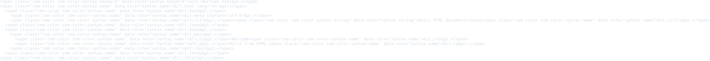
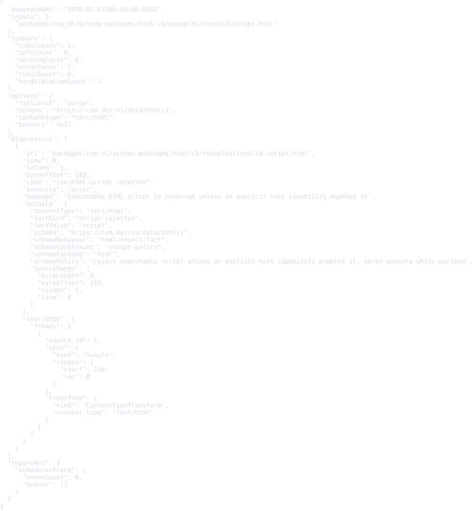

# HTML schema package v1

Status: schema, examples, formatter, colorizer, and converter package frame

This package defines the CEM schema identity for HTML resources.

- Schema URI: `https://cem.dev/ns/data/html/1`
- Primary content type: `text/html`
- DOM namespaces:
    - HTML: `http://www.w3.org/1999/xhtml`
    - SVG: `http://www.w3.org/2000/svg`
    - MathML: `http://www.w3.org/1998/Math/MathML`
- Source schema: `schema/html.cem`

HTML is not XML. The package models `text/html` as an HTML-parser-backed source format that can recover incomplete or non-normalized markup into a normalized DOM, preserving source identity where parser offsets are available.

XHTML remains a separate XML-backed package for `application/xhtml+xml`. In
`text/html`, HTML, SVG, and MathML are all parser-default DOM namespaces: SVG
and MathML tags switch into their own namespaces while remaining associated with
their registered schema packages.

## Output Artifacts

The package declares CEMT formatter and colorizer artifacts in `package.cem`.
The public formatter profile names are `compact`, `pretty`, and `tabular`.
The public colorizer profile names are `terminal`, `html`, and `md`.

## Validation

Validate HTML resources through the CLI with the schema URI and content type:

```bash
cem-ml validate --format json \
  --content-type text/html \
  --schema https://cem.dev/ns/data/html/1 \
  packages/cem_ml/schema-packages/html/v1/examples/basic-document.html
```

The direct validator treats incomplete and non-normalized HTML as parser-backed
input, accepts SVG and MathML namespace islands, rejects executable script and
external resource access without explicit policy, reports invalid custom-element
names, and preserves parser recovery as diagnostics instead of requiring XML
well-formedness.

## Examples

This section is generated from `package.cem` `{example}` metadata by the
`samples2readme` Nx target. Each SVG previews the example content, not
the validation report. The target writes a preformatted HTML preview to
`dist/cem_ml/schema-packages/<package>/v1/examples/<example-file>.html`,
then renders the `<pre>` spans through headless Chromium into
`examples/previews/<example-file>.svg`.
Source snapshots are used only where the current CLI cannot yet render
the package formatter/colorizer path for that content identity.

### basic-document

- Source: [`examples/basic-document.html`](examples/basic-document.html)
- Content type: `text/html`
- Schema: `https://cem.dev/ns/data/html/1`
- Expected result: `pass`
- Preview renderer: `CLI convert, tabular formatter, preview HTML + html2svg`
- Preview HTML: `dist/cem_ml/schema-packages/html/v1/examples/basic-document.html.html`

```bash
dist/target/cem_ml_cli/debug/cem-ml convert --input-spec \
  uri=packages/cem_ml/schema-packages/html/v1/examples/basic-document.html,contentType=text/html,schema=https://cem.dev/ns/data/html/1 \
  --from-format html --to-content-type text/html --to-schema \
  https://cem.dev/ns/data/html/1 --cemt-formatter-profile tabular --cemt-color-profile \
  terminal --output-color-type ansi-256
```



### fragment

- Source: [`examples/fragment.html`](examples/fragment.html)
- Content type: `text/html`
- Schema: `https://cem.dev/ns/data/html/1`
- Expected result: `pass`
- Preview renderer: `CLI convert, tabular formatter, preview HTML + html2svg`
- Preview HTML: `dist/cem_ml/schema-packages/html/v1/examples/fragment.html.html`

```bash
dist/target/cem_ml_cli/debug/cem-ml convert --input-spec \
  uri=packages/cem_ml/schema-packages/html/v1/examples/fragment.html,contentType=text/html,schema=https://cem.dev/ns/data/html/1 \
  --from-format html --to-content-type text/html --to-schema \
  https://cem.dev/ns/data/html/1 --cemt-formatter-profile tabular --cemt-color-profile \
  terminal --output-color-type ansi-256
```


### svg-mathml-islands

- Source: [`examples/svg-mathml-islands.html`](examples/svg-mathml-islands.html)
- Content type: `text/html`
- Schema: `https://cem.dev/ns/data/html/1`
- Expected result: `pass`
- Preview renderer: `CLI convert, tabular formatter, preview HTML + html2svg`
- Preview HTML: `dist/cem_ml/schema-packages/html/v1/examples/svg-mathml-islands.html.html`

```bash
dist/target/cem_ml_cli/debug/cem-ml convert --input-spec \
  uri=packages/cem_ml/schema-packages/html/v1/examples/svg-mathml-islands.html,contentType=text/html,schema=https://cem.dev/ns/data/html/1 \
  --from-format html --to-content-type text/html --to-schema \
  https://cem.dev/ns/data/html/1 --cemt-formatter-profile tabular --cemt-color-profile \
  terminal --output-color-type ansi-256
```


### invalid-script

- Source: [`examples/invalid-script.html`](examples/invalid-script.html)
- Content type: `text/html`
- Schema: `https://cem.dev/ns/data/html/1`
- Expected result: `fail`
- Expected diagnostics: `cem.html.script_rejected`
- Preview renderer: `CLI convert, tabular formatter, preview HTML + html2svg`
- Preview HTML: `dist/cem_ml/schema-packages/html/v1/examples/invalid-script.html.html`

```bash
dist/target/cem_ml_cli/debug/cem-ml convert --input-spec \
  uri=packages/cem_ml/schema-packages/html/v1/examples/invalid-script.html,contentType=text/html,schema=https://cem.dev/ns/data/html/1 \
  --from-format html --to-content-type text/html --to-schema \
  https://cem.dev/ns/data/html/1 --cemt-formatter-profile tabular --cemt-color-profile \
  terminal --output-color-type ansi-256
```



### invalid-external-resource

- Source: [`examples/invalid-external-resource.html`](examples/invalid-external-resource.html)
- Content type: `text/html`
- Schema: `https://cem.dev/ns/data/html/1`
- Expected result: `fail`
- Expected diagnostics: `cem.html.external_resource_rejected`
- Preview renderer: `CLI convert, tabular formatter, preview HTML + html2svg`
- Preview HTML: `dist/cem_ml/schema-packages/html/v1/examples/invalid-external-resource.html.html`

```bash
dist/target/cem_ml_cli/debug/cem-ml convert --input-spec \
  uri=packages/cem_ml/schema-packages/html/v1/examples/invalid-external-resource.html,contentType=text/html,schema=https://cem.dev/ns/data/html/1 \
  --from-format html --to-content-type text/html --to-schema \
  https://cem.dev/ns/data/html/1 --cemt-formatter-profile tabular --cemt-color-profile \
  terminal --output-color-type ansi-256
```


### invalid-custom-element

- Source: [`examples/invalid-custom-element.html`](examples/invalid-custom-element.html)
- Content type: `text/html`
- Schema: `https://cem.dev/ns/data/html/1`
- Expected result: `fail`
- Expected diagnostics: `cem.html.custom_element_name_invalid`
- Preview renderer: `CLI convert, tabular formatter, preview HTML + html2svg`
- Preview HTML: `dist/cem_ml/schema-packages/html/v1/examples/invalid-custom-element.html.html`

```bash
dist/target/cem_ml_cli/debug/cem-ml convert --input-spec \
  uri=packages/cem_ml/schema-packages/html/v1/examples/invalid-custom-element.html,contentType=text/html,schema=https://cem.dev/ns/data/html/1 \
  --from-format html --to-content-type text/html --to-schema \
  https://cem.dev/ns/data/html/1 --cemt-formatter-profile tabular --cemt-color-profile \
  terminal --output-color-type ansi-256
```


### encoding-conflict

- Source: [`examples/encoding-conflict.html`](examples/encoding-conflict.html)
- Content type: `text/html; charset=windows-1252`
- Schema: `https://cem.dev/ns/data/html/1`
- Expected result: `pass`
- Expected diagnostics: `cem.html.encoding_conflict`
- Preview renderer: `CLI convert, tabular formatter, preview HTML + html2svg`
- Preview HTML: `dist/cem_ml/schema-packages/html/v1/examples/encoding-conflict.html.html`

```bash
dist/target/cem_ml_cli/debug/cem-ml convert --input-spec \
  'uri=packages/cem_ml/schema-packages/html/v1/examples/encoding-conflict.html,contentType=text/html; charset=windows-1252,schema=https://cem.dev/ns/data/html/1' \
  --from-format html --to-content-type text/html --to-schema \
  https://cem.dev/ns/data/html/1 --cemt-formatter-profile tabular --cemt-color-profile \
  terminal --output-color-type ansi-256
```


