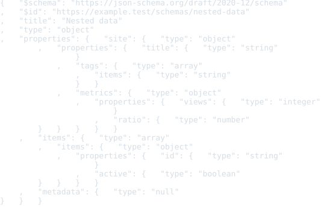

# JSON Schema Resource Schema Package

Status: schema, examples, formatter, and colorizer package frame

This package defines registry identity for JSON Schema documents.

JSON Schema source is JSON text, not CEM-ML syntax. The schema package and this
manifest are authored in CEM-ML, but resources with the `application/schema+json`
content type are parsed as JSON and interpreted as JSON Schema vocabulary
documents.

## Owned Identities

- Schema URI: `https://cem.dev/ns/data/json-schema/1`
- Primary content type: `application/schema+json`
- Common file forms: `.schema.json`, `.jsonschema`

This package depends on the generic JSON package because JSON Schema documents
are JSON values first. It does not claim `application/json`; callers should use
`application/schema+json` or an explicit schema identity when the same bytes are
intended to be interpreted as a JSON Schema document.

## Output Artifacts

The package declares CEMT formatter and colorizer artifacts in `package.cem`.
The public formatter profile names are `compact`, `pretty`, and `tabular`.
The public colorizer profile names are `terminal`, `html`, and `md`.

Formatter/colorizer assets consume the typed JSON Schema document and CEM-tree
stage boundaries. The formatter emits formatted CEM-tree output for `compact`,
`pretty`, and `tabular`; the colorizer consumes that tree and returns colored
CEM-tree output for `terminal`, `html`, and `md` before the generic writer emits
text or HTML.

Readable formatter profiles inherit JSON-family comma-scope defaults:
`leadingComma=true` and `scopeOpeningNewLine=false`. Use
`--cemt-formatter-option leadingComma=false` and
`--cemt-formatter-option scopeOpeningNewLine=true` to request the conventional
comma-after-item, newline-after-open layout.

## Resource Model

The schema describes the JSON Schema document model used by registry loaders and
tooling:

- schemas declare a dialect such as Draft 2020-12 through `$schema`;
- schema resources may carry `$id`, anchors, and dynamic anchors;
- `$ref` and `$dynamicRef` edges are URI references resolved by the loader;
- vocabularies define keyword sets and whether support is required;
- validation, applicator, annotation, format, and unevaluated keywords are kept
  distinct so engines can report unsupported vocabulary precisely.

Generic CEM reference normalization may finalize a document URI, but JSON
Schema reference traversal remains loader-owned. `$ref` and `$dynamicRef`
resolution must account for `$id`, anchors, dynamic anchors, dialect, and
dynamic scope instead of reducing those edges to generic URL joining.

## Verification

The package-local `cem_ml_schema_package_json_schema_v1:verify` target checks:

- manifest validation against the schema-package schema;
- manifest-index coverage for all declared examples;
- embedded formatter/colorizer artifact catalog registration;
- JSON Schema formatter/colorizer CEMT execution through package-owned
  JSON Schema document and CEM-tree boundaries;
- JSON Schema AST, lifecycle adapter, and engine validation routing tests;
- CLI validation behavior for a valid Draft 2020-12 schema and an unsupported
  dialect;
- README SVG preview drift for every manifest example.

## Release Behavior

Validation currently recognizes Draft 2020-12 dialect declarations and reports
unsupported or missing dialects. JSON parse errors and dialect diagnostics are
bound to schema-owned diagnostics through the JSON Schema lifecycle AST stream;
CLI validation delegates to the same library boundary. Full JSON Schema
validation of instance documents, remote reference loading, dynamic scope
resolution, and vocabulary assertion semantics are not part of the current
release contract.

## Examples

This section is generated from `package.cem` `{example}` metadata by the
`samples2readme` Nx target. Each SVG previews the rendered example
content or validation diagnostics for expected-fail examples. The target writes a
preformatted HTML preview to
`dist/cem_ml/schema-packages/<package>/v1/examples/<example-file>.html`,
then renders the `<pre>` spans through headless Chromium into
`examples/previews/<example-file>.svg`.
Source snapshots are used only where the current CLI cannot yet render
the package formatter/colorizer path for that content identity.

<details>
<summary>basic-schema</summary>

- Source: [`examples/basic-schema.schema.json`](./examples/basic-schema.schema.json)
- Content type: `application/schema+json`
- Schema: `https://cem.dev/ns/data/json-schema/1`
- Expected result: `pass`
- Preview renderer: `CLI convert, tabular formatter, preview HTML + html2svg`
- Preview HTML: `dist/cem_ml/schema-packages/json-schema/v1/examples/basic-schema.schema.json.html`

```bash
dist/target/cem_ml_cli/debug/cem-ml convert --input-spec \
  uri=packages/cem_ml/schema-packages/json-schema/v1/examples/basic-schema.schema.json,contentType=application/schema+json,schema=https://cem.dev/ns/data/json-schema/1 \
  --to-content-type application/schema+json --to-schema \
  https://cem.dev/ns/data/json-schema/1 --cemt-formatter-profile tabular \
  --cemt-color-profile html
```

</details>


<details>
<summary>catalog-schema</summary>

- Source: [`examples/catalog-schema.schema.json`](./examples/catalog-schema.schema.json)
- Content type: `application/schema+json`
- Schema: `https://cem.dev/ns/data/json-schema/1`
- Expected result: `pass`
- Preview renderer: `CLI convert, tabular formatter, preview HTML + html2svg`
- Preview HTML: `dist/cem_ml/schema-packages/json-schema/v1/examples/catalog-schema.schema.json.html`

```bash
dist/target/cem_ml_cli/debug/cem-ml convert --input-spec \
  uri=packages/cem_ml/schema-packages/json-schema/v1/examples/catalog-schema.schema.json,contentType=application/schema+json,schema=https://cem.dev/ns/data/json-schema/1 \
  --to-content-type application/schema+json --to-schema \
  https://cem.dev/ns/data/json-schema/1 --cemt-formatter-profile tabular \
  --cemt-color-profile html
```

</details>


<details>
<summary>nested-data</summary>

- Source: [`examples/nested-data.schema.json`](./examples/nested-data.schema.json)
- Content type: `application/schema+json`
- Schema: `https://cem.dev/ns/data/json-schema/1`
- Expected result: `pass`
- Preview renderer: `CLI convert, tabular formatter, preview HTML + html2svg`
- Preview HTML: `dist/cem_ml/schema-packages/json-schema/v1/examples/nested-data.schema.json.html`

```bash
dist/target/cem_ml_cli/debug/cem-ml convert --input-spec \
  uri=packages/cem_ml/schema-packages/json-schema/v1/examples/nested-data.schema.json,contentType=application/schema+json,schema=https://cem.dev/ns/data/json-schema/1 \
  --to-content-type application/schema+json --to-schema \
  https://cem.dev/ns/data/json-schema/1 --cemt-formatter-profile tabular \
  --cemt-color-profile html
```

</details>



<details>
<summary>invalid-unsupported-dialect</summary>

- Source: [`examples/invalid-unsupported-dialect.schema.json`](./examples/invalid-unsupported-dialect.schema.json)
- Content type: `application/schema+json`
- Schema: `https://cem.dev/ns/data/json-schema/1`
- Expected result: `fail`
- Expected diagnostics: `cem.json_schema.unsupported_dialect`
- Preview renderer: `CLI validate, JSON report, preview HTML + html2svg`
- Preview HTML: `dist/cem_ml/schema-packages/json-schema/v1/examples/invalid-unsupported-dialect.schema.json.html`

```bash
dist/target/cem_ml_cli/debug/cem-ml validate --format json --fail-level parse \
  --content-type application/schema+json --schema https://cem.dev/ns/data/json-schema/1 \
  packages/cem_ml/schema-packages/json-schema/v1/examples/invalid-unsupported-dialect.schema.json
```

</details>


<details>
<summary>invalid-parse</summary>

- Source: [`examples/invalid-parse.schema.json`](./examples/invalid-parse.schema.json)
- Content type: `application/schema+json`
- Schema: `https://cem.dev/ns/data/json-schema/1`
- Expected result: `fail`
- Expected diagnostics: `cem.json_schema.parse_error`
- Preview renderer: `CLI validate, JSON report, preview HTML + html2svg`
- Preview HTML: `dist/cem_ml/schema-packages/json-schema/v1/examples/invalid-parse.schema.json.html`

```bash
dist/target/cem_ml_cli/debug/cem-ml validate --format json --fail-level parse \
  --content-type application/schema+json --schema https://cem.dev/ns/data/json-schema/1 \
  packages/cem_ml/schema-packages/json-schema/v1/examples/invalid-parse.schema.json
```

</details>


