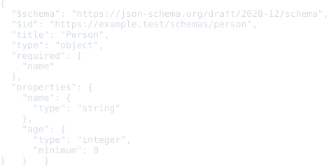
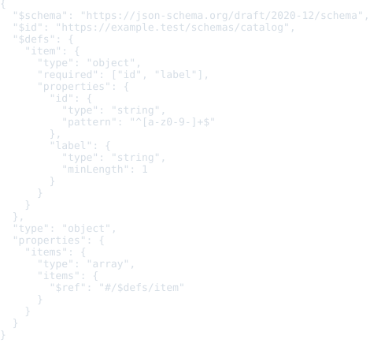
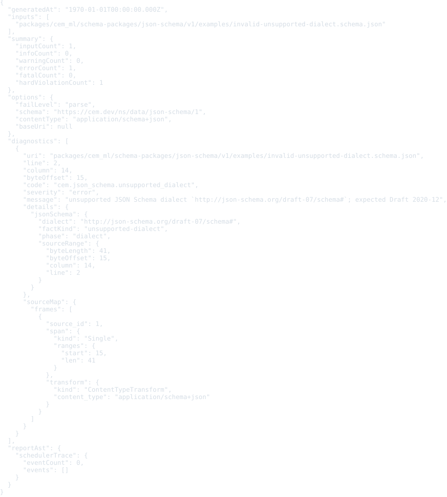

# JSON Schema Resource Schema Package

Status: schema, examples, formatter, and colorizer package frame

This package defines registry identity for JSON Schema documents.

JSON Schema source is JSON text, not CEM-ML syntax. The schema package and this
manifest are authored in CEM-ML, but resources with the `application/schema+json`
content type are parsed as JSON and interpreted as JSON Schema vocabulary
documents.

## Owned Identities

- Schema URI: `https://cem.dev/ns/data/json-schema/1`
- Primary content type: `application/schema+json`
- Common file forms: `.schema.json`, `.jsonschema`

This package depends on the generic JSON package because JSON Schema documents
are JSON values first. It does not claim `application/json`; callers should use
`application/schema+json` or an explicit schema identity when the same bytes are
intended to be interpreted as a JSON Schema document.

## Output Artifacts

The package declares CEMT formatter and colorizer artifacts in `package.cem`.
The public formatter profile names are `compact`, `pretty`, and `tabular`.
The public colorizer profile names are `terminal`, `html`, and `md`.

## Resource Model

The schema describes the JSON Schema document model used by registry loaders and
tooling:

- schemas declare a dialect such as Draft 2020-12 through `$schema`;
- schema resources may carry `$id`, anchors, and dynamic anchors;
- `$ref` and `$dynamicRef` edges are URI references resolved by the loader;
- vocabularies define keyword sets and whether support is required;
- validation, applicator, annotation, format, and unevaluated keywords are kept
  distinct so engines can report unsupported vocabulary precisely.

Generic CEM reference normalization may finalize a document URI, but JSON
Schema reference traversal remains loader-owned. `$ref` and `$dynamicRef`
resolution must account for `$id`, anchors, dynamic anchors, dialect, and
dynamic scope instead of reducing those edges to generic URL joining.

## Examples

This section is generated from `package.cem` `{example}` metadata by the
`samples2readme` Nx target. Each SVG previews the example content, not
the validation report. The target writes a preformatted HTML preview to
`dist/cem_ml/schema-packages/<package>/v1/examples/<example-file>.html`,
then renders the `<pre>` spans through headless Chromium into
`examples/previews/<example-file>.svg`.
Source snapshots are used only where the current CLI cannot yet render
the package formatter/colorizer path for that content identity.

### basic-schema

- Source: [`examples/basic-schema.schema.json`](examples/basic-schema.schema.json)
- Content type: `application/schema+json`
- Schema: `https://cem.dev/ns/data/json-schema/1`
- Expected result: `pass`
- Preview renderer: `source snapshot HTML + html2svg`
- Preview HTML: `dist/cem_ml/schema-packages/json-schema/v1/examples/basic-schema.schema.json.html`

### catalog-schema

- Source: [`examples/catalog-schema.schema.json`](examples/catalog-schema.schema.json)
- Content type: `application/schema+json`
- Schema: `https://cem.dev/ns/data/json-schema/1`
- Expected result: `pass`
- Preview renderer: `source snapshot HTML + html2svg`
- Preview HTML: `dist/cem_ml/schema-packages/json-schema/v1/examples/catalog-schema.schema.json.html`

### invalid-unsupported-dialect

- Source: [`examples/invalid-unsupported-dialect.schema.json`](examples/invalid-unsupported-dialect.schema.json)
- Content type: `application/schema+json`
- Schema: `https://cem.dev/ns/data/json-schema/1`
- Expected result: `fail`
- Expected diagnostics: `cem.json_schema.unsupported_dialect`
- Preview renderer: `source snapshot HTML + html2svg`
- Preview HTML: `dist/cem_ml/schema-packages/json-schema/v1/examples/invalid-unsupported-dialect.schema.json.html`

### invalid-parse

- Source: [`examples/invalid-parse.schema.json`](examples/invalid-parse.schema.json)
- Content type: `application/schema+json`
- Schema: `https://cem.dev/ns/data/json-schema/1`
- Expected result: `fail`
- Expected diagnostics: `cem.json_schema.parse_error`
- Preview renderer: `source snapshot HTML + html2svg`
- Preview HTML: `dist/cem_ml/schema-packages/json-schema/v1/examples/invalid-parse.schema.json.html`

