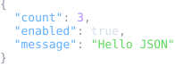
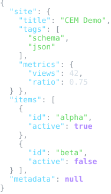

# JSON Resource Schema Package

Status: schema, examples, lifecycle input/output adapter, formatter, and colorizer package frame

This package defines registry identity for generic JSON text resources.

JSON source is not CEM-ML syntax. The schema package and this manifest are
authored in CEM-ML, but resources with the `application/json` content type are
parsed by a JSON parser or adapter.

## Owned Identities

- Schema URI: `https://cem.dev/ns/data/json/1`
- Primary content type: `application/json`
- Authoring/legacy alias: `text/json`

This package does not claim JSON Schema (`application/schema+json`) or
CEM-specific projection/vendor JSON types such as `application/vnd.cem.*+json`.
Those formats have their own schemas and converter rules.

## Output Artifacts

The package declares CEMT formatter and colorizer artifacts in `package.cem`.
The public formatter profile names are `compact`, `pretty`, and `tabular`.
The public colorizer profile names are `terminal`, `html`, and `md`.

Readable formatter profiles default to leading commas and no newline after an
opening object or array delimiter, for example `{   "name": "Ada"\n,   "id":
1\n}`. Use `--cemt-formatter-option leadingComma=false` and
`--cemt-formatter-option scopeOpeningNewLine=true` to request the conventional
comma-after-item, newline-after-open layout.

## Resource Model

The schema describes JSON values as a lossless resource model:

- documents contain one root value;
- objects preserve member order and key source identity;
- arrays preserve item order;
- strings, numbers, booleans, and null preserve their JSON value kind;
- parsers should retain lexical/source-map information when available.

## Verification

`cem_ml_schema_package_json_v1:verify` validates the package manifest, checks
that package examples are manifest-indexed, and runs focused lifecycle adapter,
engine conversion, CLI same-schema JSON regressions, and README/SVG preview
drift checks.

## Release Behavior

`application/json`, `text/json`, and `https://cem.dev/ns/data/json/1` inputs
are imported by a JSON lifecycle adapter into a CEM-owned typed AST stream with
source ranges/source-map stacks. Same-schema JSON output consumes that typed AST
stream and emits JSON through package-owned CEMT formatter/colorizer functions.
Formatter profiles render typed `json-document` subjects into CEM tree
artifacts; colorizer profiles consume CEM tree artifacts for terminal, HTML, and
Markdown output.

Cross data-format conversion imports JSON into the typed JSON AST first, lowers
that AST into the generic data AST stream, and lets the target package consume
the generic stream for output. JSON/YAML conversion must not use a direct
format-pair bridge, and future JavaScript object-like inputs such as JSONP must
follow the same source-package AST to generic-AST to target-package output
pattern.

## Tracked Incomplete Work

- Add conversion-boundary validation coverage that fails when a content-type
  conversion directly couples JSON to another concrete data format without the
  generic AST stream between them.

## Examples

This section is generated from `package.cem` `{example}` metadata by the
`samples2readme` Nx target. Each SVG previews the example content, not
the validation report. The target writes a preformatted HTML preview to
`dist/cem_ml/schema-packages/<package>/v1/examples/<example-file>.html`,
then renders the `<pre>` spans through headless Chromium into
`examples/previews/<example-file>.svg`.
Source snapshots are used only where the current CLI cannot yet render
the package formatter/colorizer path for that content identity.

<details>
<summary>basic-object</summary>

- Source: [`examples/basic-object.json`](./examples/basic-object.json)
- Content type: `application/json`
- Schema: `https://cem.dev/ns/data/json/1`
- Expected result: `pass`
- Preview renderer: `CLI convert, tabular formatter, preview HTML + html2svg`
- Preview HTML: `dist/cem_ml/schema-packages/json/v1/examples/basic-object.json.html`

```bash
dist/target/cem_ml_cli/debug/cem-ml convert --input-spec \
  uri=packages/cem_ml/schema-packages/json/v1/examples/basic-object.json,contentType=application/json,schema=https://cem.dev/ns/data/json/1 \
  --to-content-type application/json --to-schema https://cem.dev/ns/data/json/1 \
  --cemt-formatter-profile tabular --cemt-color-profile terminal --output-color-type \
  ansi-256
```

</details>



<details>
<summary>nested-data</summary>

- Source: [`examples/nested-data.json`](./examples/nested-data.json)
- Content type: `application/json`
- Schema: `https://cem.dev/ns/data/json/1`
- Expected result: `pass`
- Preview renderer: `CLI convert, tabular formatter, preview HTML + html2svg`
- Preview HTML: `dist/cem_ml/schema-packages/json/v1/examples/nested-data.json.html`

```bash
dist/target/cem_ml_cli/debug/cem-ml convert --input-spec \
  uri=packages/cem_ml/schema-packages/json/v1/examples/nested-data.json,contentType=application/json,schema=https://cem.dev/ns/data/json/1 \
  --to-content-type application/json --to-schema https://cem.dev/ns/data/json/1 \
  --cemt-formatter-profile tabular --cemt-color-profile terminal --output-color-type \
  ansi-256
```

</details>



<details>
<summary>invalid-trailing-comma</summary>

- Source: [`examples/invalid-trailing-comma.json`](./examples/invalid-trailing-comma.json)
- Content type: `application/json`
- Schema: `https://cem.dev/ns/data/json/1`
- Expected result: `fail`
- Expected diagnostics: `cem.json.parse_error`
- Preview renderer: `CLI convert, tabular formatter, preview HTML + html2svg`
- Preview HTML: `dist/cem_ml/schema-packages/json/v1/examples/invalid-trailing-comma.json.html`

```bash
dist/target/cem_ml_cli/debug/cem-ml convert --input-spec \
  uri=packages/cem_ml/schema-packages/json/v1/examples/invalid-trailing-comma.json,contentType=application/json,schema=https://cem.dev/ns/data/json/1 \
  --to-content-type application/json --to-schema https://cem.dev/ns/data/json/1 \
  --cemt-formatter-profile tabular --cemt-color-profile terminal --output-color-type \
  ansi-256
```

</details>


