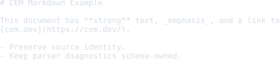
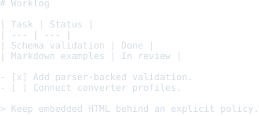
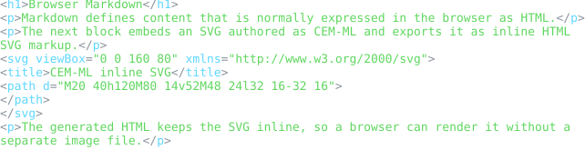
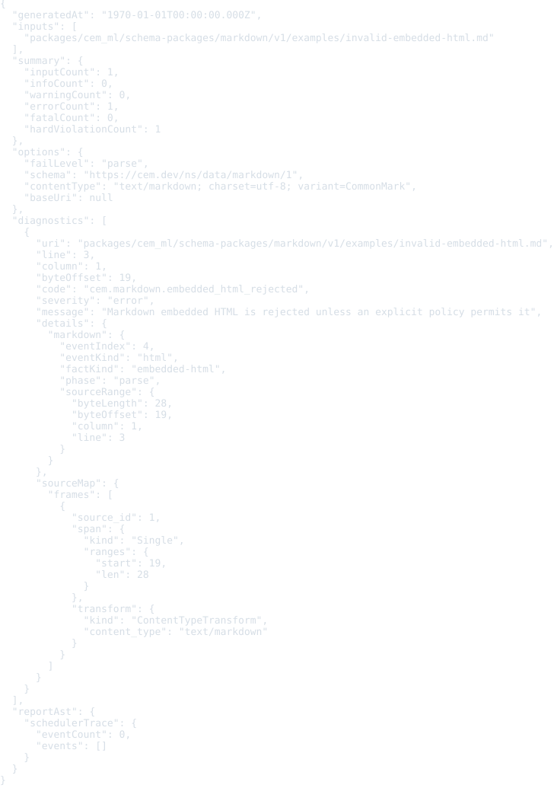

# Markdown Resource Schema Package

Status: schema, examples, formatter, and colorizer package frame

This package defines registry identity for generic Markdown resources.

Markdown source is not CEM-ML syntax. The schema package and this manifest are
authored in CEM-ML, but resources with the `text/markdown` content type are
parsed by a Markdown parser or adapter.

## Owned Identities

- Schema URI: `https://cem.dev/ns/data/markdown/1`
- Primary content type: `text/markdown`
- Preferred extensions: `.md`, `.markdown`

RFC 7763 registers `text/markdown` with required `charset` and optional
`variant` parameters. RFC 7764 defines Markdown variant registration and local
storage guidance.

## Output Artifacts

The package declares CEMT formatter and colorizer artifacts in `package.cem`.
The public formatter profile names are `compact`, `pretty`, and `tabular`.
The public colorizer profile names are `terminal`, `html`, and `md`.

## Resource Model

The schema describes Markdown resources as a document model:

- documents preserve encoding, optional charset, optional variant, and source
  identity;
- blocks preserve order, nesting, headings, lists, code fences, and block HTML;
- inline nodes preserve text, emphasis, links, images, breaks, and inline HTML;
- link references preserve labels, destinations, and titles;
- embedded HTML is explicit and must carry a trust policy before execution or
  rendering as trusted HTML;
- source offsets are preserved when the parser exposes them.

Variant-specific parsers can refine this model through converter profiles
instead of changing the generic Markdown schema identity.

## Verification

The package-local `cem_ml_schema_package_markdown_v1:verify` target checks:

- manifest validation against the schema-package schema;
- manifest-index coverage for all declared examples;
- embedded formatter/colorizer artifact catalog registration;
- formatter/colorizer CEMT body execution over `markdown-document` and
  `cem-tree` boundaries;
- Markdown source validation behavior for valid CommonMark, missing charset,
  unknown variant, embedded HTML rejection, and unsupported UTF-8;
- CLI validation behavior for the same Markdown source cases;
- README SVG preview drift for every manifest example.

## Release Behavior

Validation currently recognizes UTF-8 Markdown text, checks the `charset` and
`variant` content-type parameters, enables GFM parser options for GFM variants,
and rejects embedded HTML unless a future policy permits it. Markdown source
validation now opens a typed Markdown AST/event stream with source metadata,
encoding facts, variant facts, parser events, embedded-HTML facts, and source
maps before projecting diagnostics. Package-owned formatter/colorizer bodies
now consume the `markdown-document` subject and pass formatted/colored
`cem-tree` artifacts to the writer. The current formatter is an event-stream
writer, not a full Markdown block/inline reflow engine. Trusted HTML rendering
modes and variant-specific extension models are not part of the current release
contract.

Markdown documents can also export to `text/html` through the typed Markdown
AST stream. The current HTML export covers common block and inline Markdown and
supports fenced `cem-ml svg` blocks as trusted package examples: the fenced
CEM-ML is parsed and rendered as inline SVG markup before the generated HTML is
passed through the HTML formatter/colorizer preview path.

## Examples

This section is generated from `package.cem` `{example}` metadata by the
`samples2readme` Nx target. Each SVG previews the rendered example
content or validation diagnostics for expected-fail examples. The target writes a
preformatted HTML preview to
`dist/cem_ml/schema-packages/<package>/v1/examples/<example-file>.html`,
then renders the `<pre>` spans through headless Chromium into
`examples/previews/<example-file>.svg`.

<details>
<summary>basic-document</summary>

- Source: [`examples/basic-document.md`](./examples/basic-document.md)
- Content type: `text/markdown; charset=utf-8; variant=CommonMark`
- Schema: `https://cem.dev/ns/data/markdown/1`
- Expected result: `pass`
- Preview renderer: `CLI convert, tabular formatter, preview HTML + html2svg`
- Preview HTML: `dist/cem_ml/schema-packages/markdown/v1/examples/basic-document.md.html`

```bash
dist/target/cem_ml_cli/debug/cem-ml convert --input-spec \
  'uri=packages/cem_ml/schema-packages/markdown/v1/examples/basic-document.md,contentType=text/markdown; charset=utf-8; variant=CommonMark,schema=https://cem.dev/ns/data/markdown/1' \
  --to-content-type text/markdown --to-schema https://cem.dev/ns/data/markdown/1 \
  --cemt-formatter-profile tabular --cemt-color-profile html
```

</details>



<details>
<summary>gfm-worklog</summary>

- Source: [`examples/gfm-worklog.md`](./examples/gfm-worklog.md)
- Content type: `text/markdown; charset=utf-8; variant=GFM`
- Schema: `https://cem.dev/ns/data/markdown/1`
- Expected result: `pass`
- Preview renderer: `CLI convert, tabular formatter, preview HTML + html2svg`
- Preview HTML: `dist/cem_ml/schema-packages/markdown/v1/examples/gfm-worklog.md.html`

```bash
dist/target/cem_ml_cli/debug/cem-ml convert --input-spec \
  'uri=packages/cem_ml/schema-packages/markdown/v1/examples/gfm-worklog.md,contentType=text/markdown; charset=utf-8; variant=GFM,schema=https://cem.dev/ns/data/markdown/1' \
  --to-content-type text/markdown --to-schema https://cem.dev/ns/data/markdown/1 \
  --cemt-formatter-profile tabular --cemt-color-profile html
```

</details>



<details>
<summary>markdown-html-svg</summary>

- Source: [`examples/markdown1.md`](./examples/markdown1.md)
- Content type: `text/markdown; charset=utf-8; variant=CommonMark`
- Schema: `https://cem.dev/ns/data/markdown/1`
- Expected result: `pass`
- Preview renderer: `CLI convert, tabular formatter, preview HTML + html2svg`
- Preview HTML: `dist/cem_ml/schema-packages/markdown/v1/examples/markdown1.md.html.html`

```bash
dist/target/cem_ml_cli/debug/cem-ml convert --input-spec \
  'uri=packages/cem_ml/schema-packages/markdown/v1/examples/markdown1.md,contentType=text/markdown; charset=utf-8; variant=CommonMark,schema=https://cem.dev/ns/data/markdown/1' \
  --to-content-type text/html --to-schema https://cem.dev/ns/data/html/1 \
  --cemt-formatter-profile tabular --cemt-color-profile terminal --output-color-type \
  ansi-256
```

</details>



<details>
<summary>invalid-embedded-html</summary>

- Source: [`examples/invalid-embedded-html.md`](./examples/invalid-embedded-html.md)
- Content type: `text/markdown; charset=utf-8; variant=CommonMark`
- Schema: `https://cem.dev/ns/data/markdown/1`
- Expected result: `fail`
- Expected diagnostics: `cem.markdown.embedded_html_rejected`
- Preview renderer: `CLI validate, JSON report, preview HTML + html2svg`
- Preview HTML: `dist/cem_ml/schema-packages/markdown/v1/examples/invalid-embedded-html.md.html`

```bash
dist/target/cem_ml_cli/debug/cem-ml validate --format json --fail-level parse \
  --content-type 'text/markdown; charset=utf-8; variant=CommonMark' --schema \
  https://cem.dev/ns/data/markdown/1 \
  packages/cem_ml/schema-packages/markdown/v1/examples/invalid-embedded-html.md
```

</details>



<details>
<summary>unknown-variant</summary>

- Source: [`examples/unknown-variant.md`](./examples/unknown-variant.md)
- Content type: `text/markdown; charset=utf-8; variant=CustomWiki`
- Schema: `https://cem.dev/ns/data/markdown/1`
- Expected result: `pass`
- Expected diagnostics: `cem.markdown.unknown_variant`
- Preview renderer: `CLI convert, tabular formatter, preview HTML + html2svg`
- Preview HTML: `dist/cem_ml/schema-packages/markdown/v1/examples/unknown-variant.md.html`

```bash
dist/target/cem_ml_cli/debug/cem-ml convert --input-spec \
  'uri=packages/cem_ml/schema-packages/markdown/v1/examples/unknown-variant.md,contentType=text/markdown; charset=utf-8; variant=CustomWiki,schema=https://cem.dev/ns/data/markdown/1' \
  --to-content-type text/markdown --to-schema https://cem.dev/ns/data/markdown/1 \
  --cemt-formatter-profile tabular --cemt-color-profile html
```

</details>


