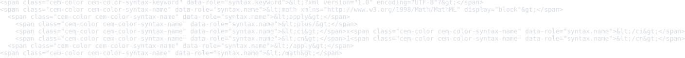
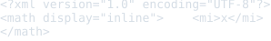
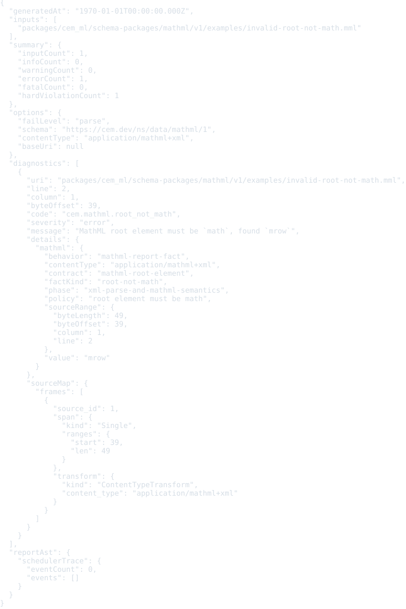
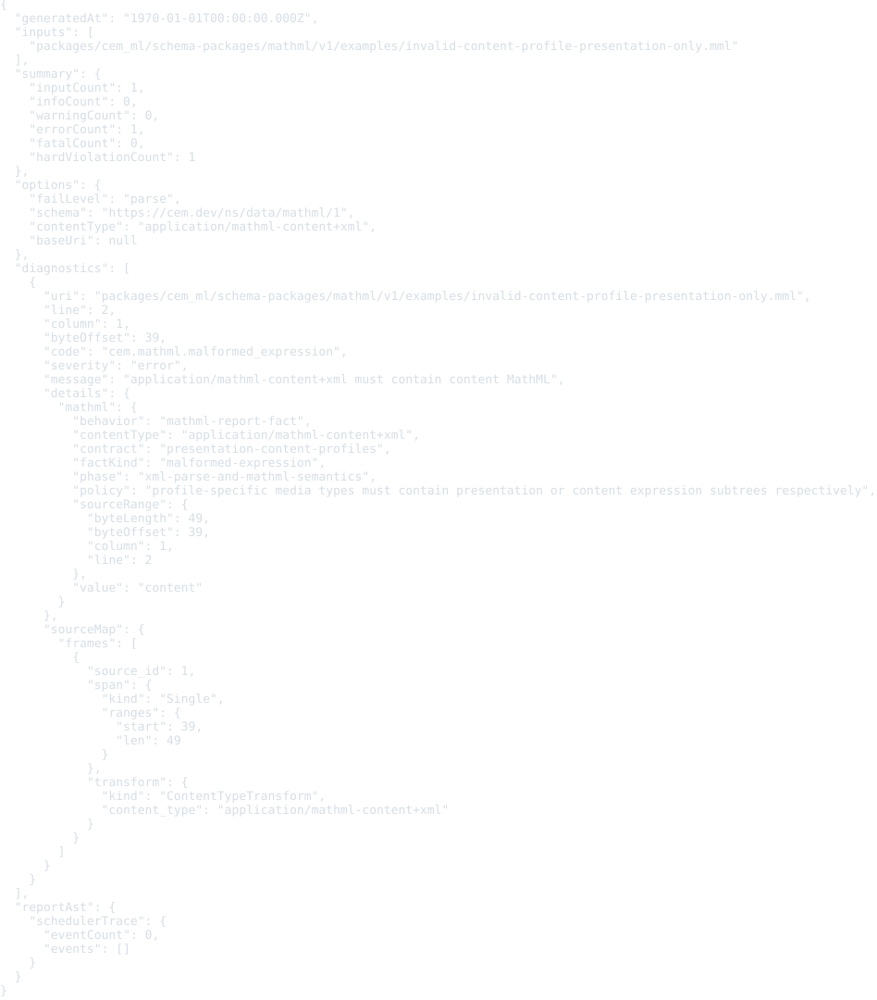
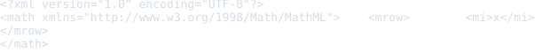

# MathML schema package v1

This package defines the CEM schema identity for MathML resources.

- Schema URI: `https://cem.dev/ns/data/mathml/1`
- Primary content type: `application/mathml+xml`
- Alias content types: `application/mathml-presentation+xml`, `application/mathml-content+xml`
- Document namespace: `http://www.w3.org/1998/Math/MathML`
- Source schema: `schema/mathml.cem`

MathML is XML-backed. Direct validation routes MathML content types through
this schema package and reuses the XML event reader as the parser. Conversion
and export lifecycle routing still uses the XML adapter for standalone MathML
resources, while MathML embedded in HTML can be selected by namespace through
the HTML adapter when no explicit content type or package schema URI is present.

The schema keeps the presentation, content, semantics, annotation, source-map, and accessibility-related fields explicit so later converters can normalize MathML without losing source identity.

## Validation

Validate MathML resources through the CLI with the schema URI and content type:

```bash
cem-ml validate --format json \
  --content-type application/mathml+xml \
  --schema https://cem.dev/ns/data/mathml/1 \
  packages/cem_ml/schema-packages/mathml/v1/examples/basic-presentation.mml
```

The direct validator parses MathML as XML, requires a `math` root in the MathML
namespace, recognizes the presentation and content media-type aliases, and
reports external annotation `src` values as policy warnings unless a loader
policy is supplied by a later conversion layer.

## Examples

This section is generated from `package.cem` `{example}` metadata by the
`samples2readme` Nx target. Each SVG previews the example content, not
the validation report. The target writes a preformatted HTML preview to
`dist/cem_ml/schema-packages/<package>/v1/examples/<example-file>.html`,
then renders the `<pre>` spans through headless Chromium into
`examples/previews/<example-file>.svg`.
Source snapshots are used only where the current CLI cannot yet render
the package formatter/colorizer path for that content identity.

<details>
<summary>basic-presentation</summary>

- Source: [`examples/basic-presentation.mml`](./examples/basic-presentation.mml)
- Content type: `application/mathml+xml`
- Schema: `https://cem.dev/ns/data/mathml/1`
- Expected result: `pass`
- Preview renderer: `CLI convert, tabular formatter, preview HTML + html2svg`
- Preview HTML: `dist/cem_ml/schema-packages/mathml/v1/examples/basic-presentation.mml.html`

```bash
dist/target/cem_ml_cli/debug/cem-ml convert --input-spec \
  uri=packages/cem_ml/schema-packages/mathml/v1/examples/basic-presentation.mml,contentType=application/mathml+xml,schema=https://cem.dev/ns/data/mathml/1 \
  --from-format xml --to-content-type application/mathml+xml --to-schema \
  https://cem.dev/ns/data/mathml/1 --cemt-formatter-profile tabular --cemt-color-profile \
  terminal --output-color-type ansi-256
```

</details>


<details>
<summary>content-expression</summary>

- Source: [`examples/content-expression.mathml`](./examples/content-expression.mathml)
- Content type: `application/mathml-content+xml`
- Schema: `https://cem.dev/ns/data/mathml/1`
- Expected result: `pass`
- Preview renderer: `CLI convert, tabular formatter, preview HTML + html2svg`
- Preview HTML: `dist/cem_ml/schema-packages/mathml/v1/examples/content-expression.mathml.html`

```bash
dist/target/cem_ml_cli/debug/cem-ml convert --input-spec \
  uri=packages/cem_ml/schema-packages/mathml/v1/examples/content-expression.mathml,contentType=application/mathml-content+xml,schema=https://cem.dev/ns/data/mathml/1 \
  --from-format xml --to-content-type application/mathml-content+xml --to-schema \
  https://cem.dev/ns/data/mathml/1 --cemt-formatter-profile tabular --cemt-color-profile \
  terminal --output-color-type ansi-256
```

</details>



<details>
<summary>semantics-external-annotation</summary>

- Source: [`examples/semantics-external-annotation.mml`](./examples/semantics-external-annotation.mml)
- Content type: `application/mathml+xml`
- Schema: `https://cem.dev/ns/data/mathml/1`
- Expected result: `pass`
- Expected diagnostics: `cem.mathml.external_annotation_rejected`
- Preview renderer: `CLI convert, tabular formatter, preview HTML + html2svg`
- Preview HTML: `dist/cem_ml/schema-packages/mathml/v1/examples/semantics-external-annotation.mml.html`

```bash
dist/target/cem_ml_cli/debug/cem-ml convert --input-spec \
  uri=packages/cem_ml/schema-packages/mathml/v1/examples/semantics-external-annotation.mml,contentType=application/mathml+xml,schema=https://cem.dev/ns/data/mathml/1 \
  --from-format xml --to-content-type application/mathml+xml --to-schema \
  https://cem.dev/ns/data/mathml/1 --cemt-formatter-profile tabular --cemt-color-profile \
  terminal --output-color-type ansi-256
```

</details>


<details>
<summary>invalid-missing-namespace</summary>

- Source: [`examples/invalid-missing-namespace.mml`](./examples/invalid-missing-namespace.mml)
- Content type: `application/mathml+xml`
- Schema: `https://cem.dev/ns/data/mathml/1`
- Expected result: `fail`
- Expected diagnostics: `cem.mathml.namespace_missing`
- Preview renderer: `CLI convert, tabular formatter, preview HTML + html2svg`
- Preview HTML: `dist/cem_ml/schema-packages/mathml/v1/examples/invalid-missing-namespace.mml.html`

```bash
dist/target/cem_ml_cli/debug/cem-ml convert --input-spec \
  uri=packages/cem_ml/schema-packages/mathml/v1/examples/invalid-missing-namespace.mml,contentType=application/mathml+xml,schema=https://cem.dev/ns/data/mathml/1 \
  --from-format xml --to-content-type application/mathml+xml --to-schema \
  https://cem.dev/ns/data/mathml/1 --cemt-formatter-profile tabular --cemt-color-profile \
  terminal --output-color-type ansi-256
```

</details>



<details>
<summary>invalid-root-not-math</summary>

- Source: [`examples/invalid-root-not-math.mml`](./examples/invalid-root-not-math.mml)
- Content type: `application/mathml+xml`
- Schema: `https://cem.dev/ns/data/mathml/1`
- Expected result: `fail`
- Expected diagnostics: `cem.mathml.root_not_math`
- Preview renderer: `CLI convert, tabular formatter, preview HTML + html2svg`
- Preview HTML: `dist/cem_ml/schema-packages/mathml/v1/examples/invalid-root-not-math.mml.html`

```bash
dist/target/cem_ml_cli/debug/cem-ml convert --input-spec \
  uri=packages/cem_ml/schema-packages/mathml/v1/examples/invalid-root-not-math.mml,contentType=application/mathml+xml,schema=https://cem.dev/ns/data/mathml/1 \
  --from-format xml --to-content-type application/mathml+xml --to-schema \
  https://cem.dev/ns/data/mathml/1 --cemt-formatter-profile tabular --cemt-color-profile \
  terminal --output-color-type ansi-256
```

</details>



<details>
<summary>invalid-content-profile-presentation-only</summary>

- Source: [`examples/invalid-content-profile-presentation-only.mml`](./examples/invalid-content-profile-presentation-only.mml)
- Content type: `application/mathml-content+xml`
- Schema: `https://cem.dev/ns/data/mathml/1`
- Expected result: `fail`
- Expected diagnostics: `cem.mathml.malformed_expression`
- Preview renderer: `CLI convert, tabular formatter, preview HTML + html2svg`
- Preview HTML: `dist/cem_ml/schema-packages/mathml/v1/examples/invalid-content-profile-presentation-only.mml.html`

```bash
dist/target/cem_ml_cli/debug/cem-ml convert --input-spec \
  uri=packages/cem_ml/schema-packages/mathml/v1/examples/invalid-content-profile-presentation-only.mml,contentType=application/mathml-content+xml,schema=https://cem.dev/ns/data/mathml/1 \
  --from-format xml --to-content-type application/mathml-content+xml --to-schema \
  https://cem.dev/ns/data/mathml/1 --cemt-formatter-profile tabular --cemt-color-profile \
  terminal --output-color-type ansi-256
```

</details>



<details>
<summary>invalid-not-well-formed</summary>

- Source: [`examples/invalid-not-well-formed.mml`](./examples/invalid-not-well-formed.mml)
- Content type: `application/mathml+xml`
- Schema: `https://cem.dev/ns/data/mathml/1`
- Expected result: `fail`
- Expected diagnostics: `cem.mathml.not_well_formed_xml`
- Preview renderer: `CLI convert, tabular formatter, preview HTML + html2svg`
- Preview HTML: `dist/cem_ml/schema-packages/mathml/v1/examples/invalid-not-well-formed.mml.html`

```bash
dist/target/cem_ml_cli/debug/cem-ml convert --input-spec \
  uri=packages/cem_ml/schema-packages/mathml/v1/examples/invalid-not-well-formed.mml,contentType=application/mathml+xml,schema=https://cem.dev/ns/data/mathml/1 \
  --from-format xml --to-content-type application/mathml+xml --to-schema \
  https://cem.dev/ns/data/mathml/1 --cemt-formatter-profile tabular --cemt-color-profile \
  terminal --output-color-type ansi-256
```

</details>


