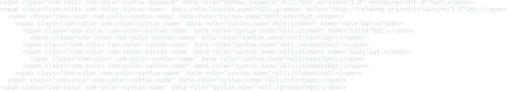
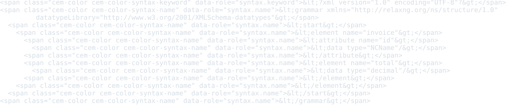
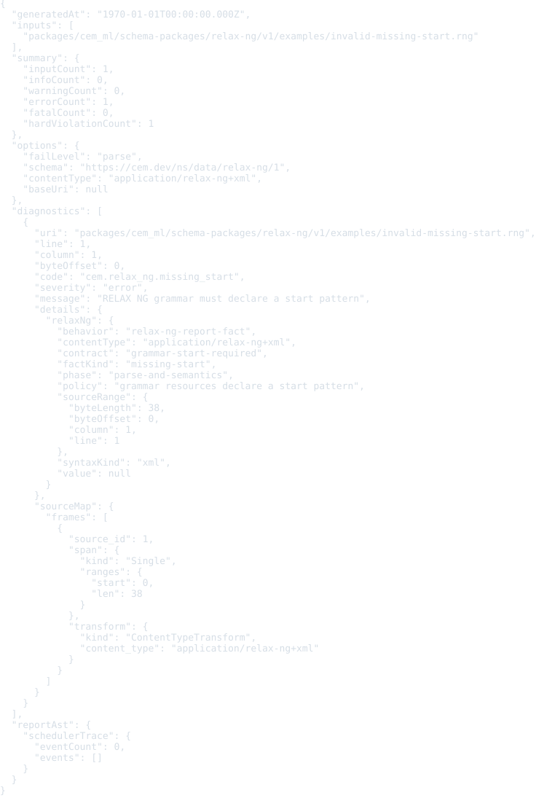
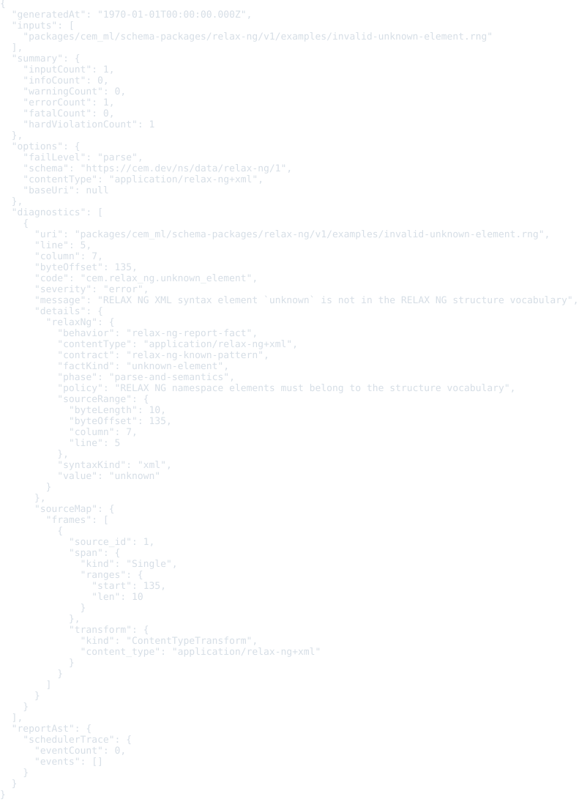
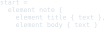

# RELAX NG Schema Package

Status: schema, typed dual-syntax lifecycle input/output adapter, examples,
formatter, and colorizer

This package defines registry identity and executable source handling for RELAX
NG schema resources.

RELAX NG schema source is not CEM-ML syntax. The schema package and manifest are
authored in CEM-ML, but `.rng` resources use the RELAX NG XML syntax and `.rnc`
resources use the compact syntax. Both are represented by a typed
`RelaxNgDocumentAst` with an explicit syntax kind.

## Owned Identities

- Schema URI: `https://cem.dev/ns/data/relax-ng/1`
- Primary content type: `application/relax-ng+xml`
- Alias content types: `application/relax-ng-compact-syntax`
- Preferred extensions: `.rng`, `.rnc`
- XML syntax namespace: `http://relaxng.org/ns/structure/1.0`

The XML identity follows the RELAX NG XML syntax and structure namespace. The
compact identity follows the RELAX NG compact syntax media type. The package
does not claim generic XML or arbitrary XML-derived schema languages.

## Resource Model

The schema describes RELAX NG resources as validation schema inputs:

- source identity preserves URI, full content type, media-type essence,
  parameters, byte length, detected line ending, and syntax kind;
- XML syntax reuses the generic typed XML event model and preserves declarations,
  namespace-qualified elements and attributes, text, comments, processing
  instructions, lexical order, source ranges, and source-map stacks;
- compact syntax preserves every keyword, identifier, string, operator,
  punctuation, comment, whitespace, and raw lexeme with delimiter depth and
  source ranges;
- include and external reference declarations remain explicit, but are rejected
  unless an explicit resolver policy enables them.

## Parser Facts And Diagnostics

The adapters emit neutral facts for XML and compact parse errors, unsupported or
conflicting encodings, invalid XML namespace/root, unknown vocabulary elements,
missing required attributes, missing start patterns, include/external-reference
policy, source-map availability, and observed namespaces/patterns. Constraints
in `schema/relax-ng.cem` bind reportable facts to package-owned diagnostic codes
and severities through `relax-ng-report-fact` behavior. CLI and engine callers
do not reinterpret these sources as CEM syntax or generic XML output.

The compact parser currently provides a lossless lexical AST plus delimiter,
string, start-definition, namespace, pattern-keyword, and reference-policy
checks. It is not yet a complete RELAX NG grammar compiler or validator for
instance documents.

## Output Artifacts

The package declares distinct XML and compact CEMT boundaries. Each syntax owns
`compact`, `pretty`, and `tabular` formatter wrappers plus `terminal`, `html`,
and `md` colorizer wrappers. Formatter output is a package-owned CEM tree; the
colorizer consumes that tree before the shared text writer.

All formatter profiles currently preserve source lexemes and intentionally emit
the same bytes. Their CEM-tree metadata records a syntax-specific
`lexical-lossless-*` layout decision. Reflow is deferred until whitespace and
annotation semantics can be preserved rigorously. Same-schema output preserves
the input syntax and detected line ending, and the text writer appends one final
newline when absent.

## Resolver Safety

The lifecycle registry selects this adapter only for the RELAX NG schema URI or
its two owned media types. XML syntax is not exported through the generic XML
package, and compact syntax is not parsed as CEM. Same-schema output resolves
the package profile wrapper and target-scoped private helper before the common
CEM-tree writer.

Includes and external references are reject-only in both syntaxes. No filesystem
or network schema resolver is invoked. Enabling reference resolution requires a
separate explicit resolver policy with cycle, depth, size, and origin controls.
The current adapters accept UTF-8 and compatible US-ASCII input; unsupported
encodings are diagnosed rather than transcoded.

## Verification

`yarn nx run cem_ml_schema_package_relax_ng_v1:verify` runs:

- schema-package manifest validation and complete manifest example indexing;
- schema-derived fact binding and direct XML/compact validator tests, including
  reject-only include and external-reference behavior;
- typed lifecycle load/export and exact same-schema engine/CLI conversion tests;
- executable package artifact and formatter/colorizer profile coverage across
  both syntax kinds;
- schema-owned CLI validation for every declared example and README/SVG preview
  drift checks with no source fallback.

## Release Behavior

RELAX NG input is decoded, parsed into the syntax-specific typed AST, and
validated from schema-owned fact bindings. Same-schema conversion preserves the
source syntax and executes the corresponding package formatter, optional
colorizer, and writer pipeline. The output metadata identifies the
`relax-ng-lifecycle-output` converter and the XML or compact implementation;
cross-schema conversion requires an explicit registered converter.

## Tracked Incomplete Work

- Replace the compact lexical validator with a complete grammar parser while
  retaining lossless tokens and source maps.
- Add semantic grammar compilation and RELAX NG instance validation as separate
  contracts from source-format validation.
- Define whitespace- and annotation-aware reflow before `pretty` or `tabular`
  changes source lexemes.
- Add an explicit bounded resolver policy before enabling include or external
  reference loading.

## Examples

This section is generated from `package.cem` `{example}` metadata by the
`samples2readme` Nx target. Each SVG previews the rendered example
content or validation diagnostics for expected-fail examples. The target writes a
preformatted HTML preview to
`dist/cem_ml/schema-packages/<package>/v1/examples/<example-file>.html`,
then renders the `<pre>` spans through headless Chromium into
`examples/previews/<example-file>.svg`.

<details>
<summary>basic-schema-xml</summary>

- Source: [`examples/basic-schema.rng`](./examples/basic-schema.rng)
- Content type: `application/relax-ng+xml`
- Schema: `https://cem.dev/ns/data/relax-ng/1`
- Expected result: `pass`
- Preview renderer: `CLI convert, tabular formatter, preview HTML + html2svg`
- Preview HTML: `dist/cem_ml/schema-packages/relax-ng/v1/examples/basic-schema.rng.html`

```bash
dist/target/cem_ml_cli/debug/cem-ml convert --input-spec \
  uri=packages/cem_ml/schema-packages/relax-ng/v1/examples/basic-schema.rng,contentType=application/relax-ng+xml,schema=https://cem.dev/ns/data/relax-ng/1 \
  --to-content-type application/relax-ng+xml --to-schema \
  https://cem.dev/ns/data/relax-ng/1 --cemt-formatter-profile tabular \
  --cemt-color-profile html
```

</details>



<details>
<summary>datatype-schema</summary>

- Source: [`examples/datatype-schema.rng`](./examples/datatype-schema.rng)
- Content type: `application/relax-ng+xml`
- Schema: `https://cem.dev/ns/data/relax-ng/1`
- Expected result: `pass`
- Preview renderer: `CLI convert, tabular formatter, preview HTML + html2svg`
- Preview HTML: `dist/cem_ml/schema-packages/relax-ng/v1/examples/datatype-schema.rng.html`

```bash
dist/target/cem_ml_cli/debug/cem-ml convert --input-spec \
  uri=packages/cem_ml/schema-packages/relax-ng/v1/examples/datatype-schema.rng,contentType=application/relax-ng+xml,schema=https://cem.dev/ns/data/relax-ng/1 \
  --to-content-type application/relax-ng+xml --to-schema \
  https://cem.dev/ns/data/relax-ng/1 --cemt-formatter-profile tabular \
  --cemt-color-profile html
```

</details>



<details>
<summary>basic-schema-compact</summary>

- Source: [`examples/basic-schema.rnc`](./examples/basic-schema.rnc)
- Content type: `application/relax-ng-compact-syntax`
- Schema: `https://cem.dev/ns/data/relax-ng/1`
- Expected result: `pass`
- Preview renderer: `CLI convert, tabular formatter, preview HTML + html2svg`
- Preview HTML: `dist/cem_ml/schema-packages/relax-ng/v1/examples/basic-schema.rnc.html`

```bash
dist/target/cem_ml_cli/debug/cem-ml convert --input-spec \
  uri=packages/cem_ml/schema-packages/relax-ng/v1/examples/basic-schema.rnc,contentType=application/relax-ng-compact-syntax,schema=https://cem.dev/ns/data/relax-ng/1 \
  --to-content-type application/relax-ng-compact-syntax --to-schema \
  https://cem.dev/ns/data/relax-ng/1 --cemt-formatter-profile tabular \
  --cemt-color-profile html
```

</details>


<details>
<summary>invalid-missing-start</summary>

- Source: [`examples/invalid-missing-start.rng`](./examples/invalid-missing-start.rng)
- Content type: `application/relax-ng+xml`
- Schema: `https://cem.dev/ns/data/relax-ng/1`
- Expected result: `fail`
- Expected diagnostics: `cem.relax_ng.missing_start`
- Preview renderer: `CLI validate, JSON report, preview HTML + html2svg`
- Preview HTML: `dist/cem_ml/schema-packages/relax-ng/v1/examples/invalid-missing-start.rng.html`

```bash
dist/target/cem_ml_cli/debug/cem-ml validate --format json --fail-level parse \
  --content-type application/relax-ng+xml --schema https://cem.dev/ns/data/relax-ng/1 \
  packages/cem_ml/schema-packages/relax-ng/v1/examples/invalid-missing-start.rng
```

</details>



<details>
<summary>invalid-unknown-element</summary>

- Source: [`examples/invalid-unknown-element.rng`](./examples/invalid-unknown-element.rng)
- Content type: `application/relax-ng+xml`
- Schema: `https://cem.dev/ns/data/relax-ng/1`
- Expected result: `fail`
- Expected diagnostics: `cem.relax_ng.unknown_element`
- Preview renderer: `CLI validate, JSON report, preview HTML + html2svg`
- Preview HTML: `dist/cem_ml/schema-packages/relax-ng/v1/examples/invalid-unknown-element.rng.html`

```bash
dist/target/cem_ml_cli/debug/cem-ml validate --format json --fail-level parse \
  --content-type application/relax-ng+xml --schema https://cem.dev/ns/data/relax-ng/1 \
  packages/cem_ml/schema-packages/relax-ng/v1/examples/invalid-unknown-element.rng
```

</details>



<details>
<summary>invalid-unclosed-compact</summary>

- Source: [`examples/invalid-unclosed-compact.rnc`](./examples/invalid-unclosed-compact.rnc)
- Content type: `application/relax-ng-compact-syntax`
- Schema: `https://cem.dev/ns/data/relax-ng/1`
- Expected result: `fail`
- Expected diagnostics: `cem.relax_ng.compact_parse_error`
- Preview renderer: `CLI validate, JSON report, preview HTML + html2svg`
- Preview HTML: `dist/cem_ml/schema-packages/relax-ng/v1/examples/invalid-unclosed-compact.rnc.html`

```bash
dist/target/cem_ml_cli/debug/cem-ml validate --format json --fail-level parse \
  --content-type application/relax-ng-compact-syntax --schema \
  https://cem.dev/ns/data/relax-ng/1 \
  packages/cem_ml/schema-packages/relax-ng/v1/examples/invalid-unclosed-compact.rnc
```

</details>


