# CEM Schema Package Metadata Package

Status: current implemented surface for the schema-package manifest package.
Reference-normalization target design lives in
[`../../../../../docs/cem-ml-reference-normalization-design.md`](../../../../../docs/cem-ml-reference-normalization-design.md),
with lookup and comparison vocabulary in
[`../../../../../docs/cem-ml-reference-vocabulary-design.md`](../../../../../docs/cem-ml-reference-vocabulary-design.md)
and
[`../../../../../docs/cem-ml-reference-comparison-design.md`](../../../../../docs/cem-ml-reference-comparison-design.md).

This package defines `package.cem`, the metadata manifest found at:

```text
schema-packages/{schema-name}/{version}/package.cem
```

Owned schema URI:

```text
https://cem.dev/ns/schema-package/1
```

Schema source:

```text
schema/schema-package.cem
```

Primary content type:

```text
application/vnd.cem.schema-package+cem
```

The package metadata schema is separate from the schema definition language. It
describes package registration metadata, while `https://cem.dev/ns/schema/1`
describes validation schemas for input content.

Converter declarations are registry-owned metadata in `package.cem`. A
converter can declare a Rust implementation hook or CEMT template, source and
target content identities, fallback hook, readiness, and planner `cost`.
Validation enforces the manifest shape and implementation-specific contracts:
the package root must include schema and content-type children, exactly one
content-type child must be marked primary through a schema-declared CEM-ML
behavior function, CEMT converters must name a CEMT template identity, Rust
converters must name a `rust-symbol`, each converter must have exactly one
`from` and `to` endpoint, planner cost is validated by the schema-owned
integer `minInclusive` contract,
`explicit-only=true` cannot be paired with `implicit=true`, and known endpoint
schemas must own the declared content type.
Serializer converters may also declare output-contract metadata:
`output-syntax`, `encoding-category`, `formatter-profile`, `color-profile`, and
`parity`. For CEMT schema-output producers, this metadata plans the structured
pipeline as CEMT transform, CEM tree formatting, CEM tree coloring, then final
writer. A missing visual `color-profile` still means a semantic no-color CEM
tree color stage before the writer. Declaring a formatter or color profile also
requires `output-syntax` and `encoding-category` so the pipeline identity is
complete. When a CEMT converter declares
formatter/coloring output profiles, validation reads the referenced template
through the local package path or template resolver and compiles it as a
formatted CEM-tree producer before writer output is allowed. A CEMT converter
that only declares source/target identity, `output-syntax`, or
`encoding-category` is treated as metadata-only and does not get this executable
template contract check. Converter-local `parity-fixture` children name
package-relative inputs that paired CEMT/native producers must share, plus
optional input identity and expected diagnostic codes.
Artifact declarations can also describe runtime output-stage assets. For
formatter and colorizer CEMT artifacts, `content-type` and `schema` identify the
artifact source itself, while `target-content-type`, `target-schema`, and
`target-category` identify the CEM tree the artifact formats or colors.
`function-name` identifies the CEMT output function supplied by the asset, and
`function-profile` records the referenced CEMT declaration's own `@profile`
when present. `formatter-profile` or `color-profile` selects the stage profile
when multiple assets can serve the same target. Formatter artifacts must use
package-relative `.cemt` paths under `formatters/`; colorizer artifacts must use
package-relative `.cemt` paths under `colorizers/`. These directories sit beside
`schema/` inside the same `schema-packages/{schema-name}/{version}/` hierarchy,
so schema-owned formatting and coloring travel with the schema package instead
of a writer-local string filter.

The current shipped manifest surface remains lexical: artifacts declare
package-relative `path`, lexical `function-name`, optional lexical
`function-profile`, and stage profile selectors. The reference-normalization
target treats those fields as separate domains: `path` resolves through
document/artifact identity, `function-name` remains the authored exported
symbol, compiled CEMT declarations expose function identity records, and
profile fields use dotted profile-symbol semantics. Current validators may
project that structure internally while preserving the existing manifest field
names and diagnostic compatibility.
The target declarative check sequence keeps source readability and CEMT parse
validity in explicit resource behaviors, then uses read-only
`schema:cemt-output-function` inspection to select output declaration metadata
by resolved artifact identity plus lexical function name. The selected
declaration is normalized as `schema:function-identity`; artifact contract
checks compare its kind, target content type, target schema, target category,
optional profile, and subject metadata against manifest fields without
executing the CEMT function body.

Compatibility projection is part of the migration contract. Current CLI/report
output may keep existing diagnostic codes and broad value buckets while
structured metadata records target operand bindings, lookup key provenance,
normalized values, and per-item or per-operand reasons. The compatibility
projection must not collapse schema identity to URI-only equality or treat
namespace claims as schema identity.

For local `package.cem` inputs, validation also reads the declared schema
source before registry admission. The first pass is pure declaration
consistency: manifest schema URI, content type claims, and namespace URI claims
must match the referenced `schema/*.cem` file without resolving the package
through the runtime catalog. After those checks pass, the validator may build an
isolated provisional descriptor for the current package and run registry-backed
endpoint, example, artifact, and namespace checks against built-ins plus that
overlay. The provisional descriptor records complete schema identity, package
id/version, manifest and schema source artifact identity, declared content-type
and namespace claims, descriptor origin, registry layer, match rule, and source
ranges when available. It is admitted to a host catalog only after all required
checks pass.

## Folder Contract

`package.cem` is the manifest-owned index for this folder. It declares the
schema URI and source file, the primary content type, namespace claims, schema
package manifest constraints, and every validation example under `examples/`.

`project.json` owns the package-local Nx library
`cem_ml_schema_package_schema_package_v1`. Its `verify` target validates
`package.cem` through the CLI at the parse failure boundary and tracks
`README.md`, `schema/**/*.cem`, `formatters/**/*.cemt`,
`colorizers/**/*.cemt`, `converters/**/*.cemt`, and `examples/**/*` as package
inputs. Full semantic schema-package validation remains in the final
registry/package gate.

Example metadata is intentionally manifest-owned. This package does not require
checked-in `.example.cem` sidecars because `package.cem` already records the
example path, content type, schema URI, expected pass/fail result, and expected
diagnostic codes.

## CEMT Output Status

The schema-package metadata package currently declares no runtime converter
edges in its own manifest and no package-owned formatter or colorizer CEMT
artifacts. The schema-package structure audit therefore reports the baseline
formatter/colorizer profiles as alignment gaps, not hard errors.

CEMT files under `examples/converters/`, `examples/formatters/`, and
`examples/transforms/` are validation fixtures, not registered package output
assets. They exercise converter and artifact contract failures for package
metadata validation. Until schema-package-specific formatter and colorizer
assets are authored, schema-package examples rely on the generic CEM-ML output
path rather than a schema-package-specific output pipeline.

## Examples

This section is generated from `package.cem` `{example}` metadata by the
`samples2readme` Nx target. Each SVG previews the example content, not
the validation report. The target writes a preformatted HTML preview to
`dist/cem_ml/schema-packages/<package>/v1/examples/<example-file>.html`,
then renders the `<pre>` spans through headless Chromium into
`examples/previews/<example-file>.svg`.
Source snapshots are used only where the current CLI cannot yet render
the package formatter/colorizer path for that content identity.

### basic-package

- Source: [`examples/basic-package.cem`](examples/basic-package.cem)
- Content type: `application/vnd.cem.schema-package+cem`
- Schema: `https://cem.dev/ns/schema-package/1`
- Expected result: `pass`
- Preview renderer: `CLI convert, tabular formatter, preview HTML + html2svg`
- Preview HTML: `dist/cem_ml/schema-packages/schema-package/v1/examples/basic-package.cem.html`

```bash
dist/target/cem_ml_cli/debug/cem-ml convert --input-spec \
  uri=packages/cem_ml/schema-packages/schema-package/v1/examples/basic-package.cem,contentType=application/vnd.cem.schema-package+cem,schema=https://cem.dev/ns/schema-package/1 \
  --to-content-type application/cem --to-schema https://cem.dev/ns/cem-ml/1 \
  --cemt-formatter-profile tabular --cemt-color-profile terminal --output-color-type \
  ansi-256
```

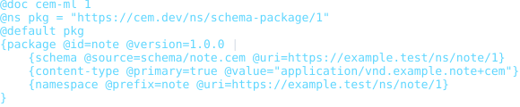

### converter-package

- Source: [`examples/converter-package.cem`](examples/converter-package.cem)
- Content type: `application/vnd.cem.schema-package+cem`
- Schema: `https://cem.dev/ns/schema-package/1`
- Expected result: `pass`
- Preview renderer: `CLI convert, tabular formatter, preview HTML + html2svg`
- Preview HTML: `dist/cem_ml/schema-packages/schema-package/v1/examples/converter-package.cem.html`

```bash
dist/target/cem_ml_cli/debug/cem-ml convert --input-spec \
  uri=packages/cem_ml/schema-packages/schema-package/v1/examples/converter-package.cem,contentType=application/vnd.cem.schema-package+cem,schema=https://cem.dev/ns/schema-package/1 \
  --to-content-type application/cem --to-schema https://cem.dev/ns/cem-ml/1 \
  --cemt-formatter-profile tabular --cemt-color-profile terminal --output-color-type \
  ansi-256
```

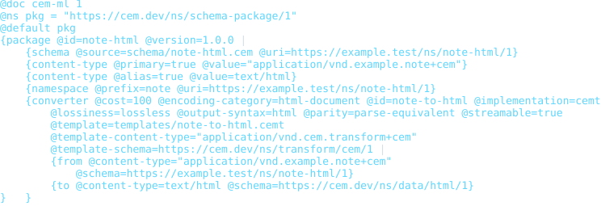

### invalid-unclosed-package

- Source: [`examples/invalid-unclosed-package.cem`](examples/invalid-unclosed-package.cem)
- Content type: `application/vnd.cem.schema-package+cem`
- Schema: `https://cem.dev/ns/schema-package/1`
- Expected result: `fail`
- Expected diagnostics: `cem.ast.unclosed_scope`
- Preview renderer: `CLI convert, tabular formatter, preview HTML + html2svg`
- Preview HTML: `dist/cem_ml/schema-packages/schema-package/v1/examples/invalid-unclosed-package.cem.html`

```bash
dist/target/cem_ml_cli/debug/cem-ml convert --input-spec \
  uri=packages/cem_ml/schema-packages/schema-package/v1/examples/invalid-unclosed-package.cem,contentType=application/vnd.cem.schema-package+cem,schema=https://cem.dev/ns/schema-package/1 \
  --to-content-type application/cem --to-schema https://cem.dev/ns/cem-ml/1 \
  --cemt-formatter-profile tabular --cemt-color-profile terminal --output-color-type \
  ansi-256
```

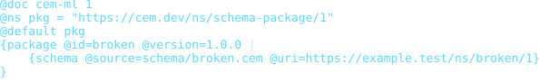

### invalid-missing-required-attribute

- Source: [`examples/invalid-missing-required-attribute.cem`](examples/invalid-missing-required-attribute.cem)
- Content type: `application/vnd.cem.schema-package+cem`
- Schema: `https://cem.dev/ns/schema-package/1`
- Expected result: `fail`
- Expected diagnostics: `cem.schema_model.missing_required_attribute`, `cem.schema_package.package_check`
- Preview renderer: `CLI convert, tabular formatter, preview HTML + html2svg`
- Preview HTML: `dist/cem_ml/schema-packages/schema-package/v1/examples/invalid-missing-required-attribute.cem.html`

```bash
dist/target/cem_ml_cli/debug/cem-ml convert --input-spec \
  uri=packages/cem_ml/schema-packages/schema-package/v1/examples/invalid-missing-required-attribute.cem,contentType=application/vnd.cem.schema-package+cem,schema=https://cem.dev/ns/schema-package/1 \
  --to-content-type application/cem --to-schema https://cem.dev/ns/cem-ml/1 \
  --cemt-formatter-profile tabular --cemt-color-profile terminal --output-color-type \
  ansi-256
```

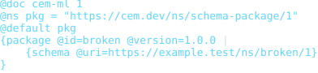

### invalid-primary-content-type

- Source: [`examples/invalid-primary-content-type.cem`](examples/invalid-primary-content-type.cem)
- Content type: `application/vnd.cem.schema-package+cem`
- Schema: `https://cem.dev/ns/schema-package/1`
- Expected result: `fail`
- Expected diagnostics: `cem.schema_package.content_type_conflict`
- Preview renderer: `CLI convert, tabular formatter, preview HTML + html2svg`
- Preview HTML: `dist/cem_ml/schema-packages/schema-package/v1/examples/invalid-primary-content-type.cem.html`

```bash
dist/target/cem_ml_cli/debug/cem-ml convert --input-spec \
  uri=packages/cem_ml/schema-packages/schema-package/v1/examples/invalid-primary-content-type.cem,contentType=application/vnd.cem.schema-package+cem,schema=https://cem.dev/ns/schema-package/1 \
  --to-content-type application/cem --to-schema https://cem.dev/ns/cem-ml/1 \
  --cemt-formatter-profile tabular --cemt-color-profile terminal --output-color-type \
  ansi-256
```

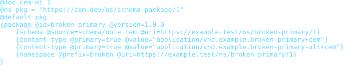

### invalid-primary-content-type-missing

- Source: [`examples/invalid-primary-content-type-missing.cem`](examples/invalid-primary-content-type-missing.cem)
- Content type: `application/vnd.cem.schema-package+cem`
- Schema: `https://cem.dev/ns/schema-package/1`
- Expected result: `fail`
- Expected diagnostics: `cem.schema_package.content_type_conflict`
- Preview renderer: `CLI convert, tabular formatter, preview HTML + html2svg`
- Preview HTML: `dist/cem_ml/schema-packages/schema-package/v1/examples/invalid-primary-content-type-missing.cem.html`

```bash
dist/target/cem_ml_cli/debug/cem-ml convert --input-spec \
  uri=packages/cem_ml/schema-packages/schema-package/v1/examples/invalid-primary-content-type-missing.cem,contentType=application/vnd.cem.schema-package+cem,schema=https://cem.dev/ns/schema-package/1 \
  --to-content-type application/cem --to-schema https://cem.dev/ns/cem-ml/1 \
  --cemt-formatter-profile tabular --cemt-color-profile terminal --output-color-type \
  ansi-256
```

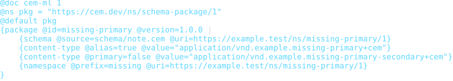

### invalid-converter-contract

- Source: [`examples/invalid-converter-contract.cem`](examples/invalid-converter-contract.cem)
- Content type: `application/vnd.cem.schema-package+cem`
- Schema: `https://cem.dev/ns/schema-package/1`
- Expected result: `fail`
- Expected diagnostics: `cem.schema_package.converter_check`
- Preview renderer: `CLI convert, tabular formatter, preview HTML + html2svg`
- Preview HTML: `dist/cem_ml/schema-packages/schema-package/v1/examples/invalid-converter-contract.cem.html`

```bash
dist/target/cem_ml_cli/debug/cem-ml convert --input-spec \
  uri=packages/cem_ml/schema-packages/schema-package/v1/examples/invalid-converter-contract.cem,contentType=application/vnd.cem.schema-package+cem,schema=https://cem.dev/ns/schema-package/1 \
  --to-content-type application/cem --to-schema https://cem.dev/ns/cem-ml/1 \
  --cemt-formatter-profile tabular --cemt-color-profile terminal --output-color-type \
  ansi-256
```

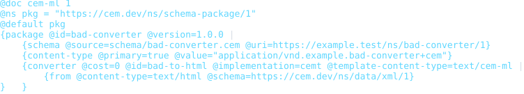

### invalid-converter-runtime-constraints

- Source: [`examples/invalid-converter-runtime-constraints.cem`](examples/invalid-converter-runtime-constraints.cem)
- Content type: `application/vnd.cem.schema-package+cem`
- Schema: `https://cem.dev/ns/schema-package/1`
- Expected result: `fail`
- Expected diagnostics: `cem.schema_package.converter_check`
- Preview renderer: `CLI convert, tabular formatter, preview HTML + html2svg`
- Preview HTML: `dist/cem_ml/schema-packages/schema-package/v1/examples/invalid-converter-runtime-constraints.cem.html`

```bash
dist/target/cem_ml_cli/debug/cem-ml convert --input-spec \
  uri=packages/cem_ml/schema-packages/schema-package/v1/examples/invalid-converter-runtime-constraints.cem,contentType=application/vnd.cem.schema-package+cem,schema=https://cem.dev/ns/schema-package/1 \
  --to-content-type application/cem --to-schema https://cem.dev/ns/cem-ml/1 \
  --cemt-formatter-profile tabular --cemt-color-profile terminal --output-color-type \
  ansi-256
```

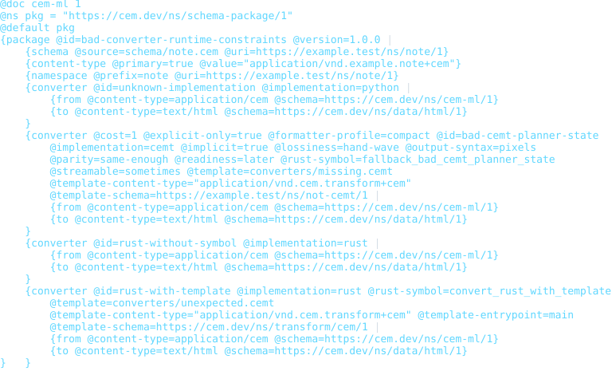

### invalid-converter-template-contract

- Source: [`examples/invalid-converter-template-contract.cem`](examples/invalid-converter-template-contract.cem)
- Content type: `application/vnd.cem.schema-package+cem`
- Schema: `https://cem.dev/ns/schema-package/1`
- Expected result: `fail`
- Expected diagnostics: `cem.schema_package.converter_check`
- Preview renderer: `CLI convert, tabular formatter, preview HTML + html2svg`
- Preview HTML: `dist/cem_ml/schema-packages/schema-package/v1/examples/invalid-converter-template-contract.cem.html`

```bash
dist/target/cem_ml_cli/debug/cem-ml convert --input-spec \
  uri=packages/cem_ml/schema-packages/schema-package/v1/examples/invalid-converter-template-contract.cem,contentType=application/vnd.cem.schema-package+cem,schema=https://cem.dev/ns/schema-package/1 \
  --to-content-type application/cem --to-schema https://cem.dev/ns/cem-ml/1 \
  --cemt-formatter-profile tabular --cemt-color-profile terminal --output-color-type \
  ansi-256
```

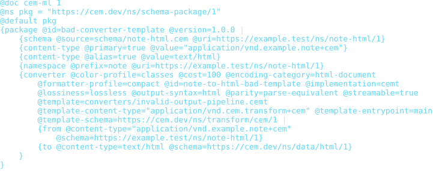

### invalid-converter-template-unreadable

- Source: [`examples/invalid-converter-template-unreadable.cem`](examples/invalid-converter-template-unreadable.cem)
- Content type: `application/vnd.cem.schema-package+cem`
- Schema: `https://cem.dev/ns/schema-package/1`
- Expected result: `fail`
- Expected diagnostics: `cem.schema_package.converter_check`
- Preview renderer: `CLI convert, tabular formatter, preview HTML + html2svg`
- Preview HTML: `dist/cem_ml/schema-packages/schema-package/v1/examples/invalid-converter-template-unreadable.cem.html`

```bash
dist/target/cem_ml_cli/debug/cem-ml convert --input-spec \
  uri=packages/cem_ml/schema-packages/schema-package/v1/examples/invalid-converter-template-unreadable.cem,contentType=application/vnd.cem.schema-package+cem,schema=https://cem.dev/ns/schema-package/1 \
  --to-content-type application/cem --to-schema https://cem.dev/ns/cem-ml/1 \
  --cemt-formatter-profile tabular --cemt-color-profile terminal --output-color-type \
  ansi-256
```

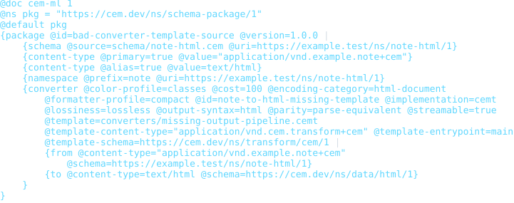

### invalid-artifact-contract

- Source: [`examples/invalid-artifact-contract.cem`](examples/invalid-artifact-contract.cem)
- Content type: `application/vnd.cem.schema-package+cem`
- Schema: `https://cem.dev/ns/schema-package/1`
- Expected result: `fail`
- Expected diagnostics: `cem.schema_package.artifact_check`
- Preview renderer: `CLI convert, tabular formatter, preview HTML + html2svg`
- Preview HTML: `dist/cem_ml/schema-packages/schema-package/v1/examples/invalid-artifact-contract.cem.html`

```bash
dist/target/cem_ml_cli/debug/cem-ml convert --input-spec \
  uri=packages/cem_ml/schema-packages/schema-package/v1/examples/invalid-artifact-contract.cem,contentType=application/vnd.cem.schema-package+cem,schema=https://cem.dev/ns/schema-package/1 \
  --to-content-type application/cem --to-schema https://cem.dev/ns/cem-ml/1 \
  --cemt-formatter-profile tabular --cemt-color-profile terminal --output-color-type \
  ansi-256
```

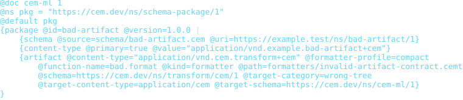

### invalid-artifact-layout

- Source: [`examples/invalid-artifact-layout.cem`](examples/invalid-artifact-layout.cem)
- Content type: `application/vnd.cem.schema-package+cem`
- Schema: `https://cem.dev/ns/schema-package/1`
- Expected result: `fail`
- Expected diagnostics: `cem.schema_package.artifact_check`
- Preview renderer: `CLI convert, tabular formatter, preview HTML + html2svg`
- Preview HTML: `dist/cem_ml/schema-packages/schema-package/v1/examples/invalid-artifact-layout.cem.html`

```bash
dist/target/cem_ml_cli/debug/cem-ml convert --input-spec \
  uri=packages/cem_ml/schema-packages/schema-package/v1/examples/invalid-artifact-layout.cem,contentType=application/vnd.cem.schema-package+cem,schema=https://cem.dev/ns/schema-package/1 \
  --to-content-type application/cem --to-schema https://cem.dev/ns/cem-ml/1 \
  --cemt-formatter-profile tabular --cemt-color-profile terminal --output-color-type \
  ansi-256
```

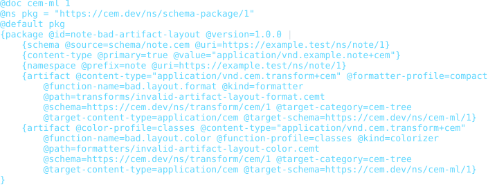

### invalid-artifact-source-unreadable

- Source: [`examples/invalid-artifact-source-unreadable.cem`](examples/invalid-artifact-source-unreadable.cem)
- Content type: `application/vnd.cem.schema-package+cem`
- Schema: `https://cem.dev/ns/schema-package/1`
- Expected result: `fail`
- Expected diagnostics: `cem.schema_package.artifact_check`
- Preview renderer: `CLI convert, tabular formatter, preview HTML + html2svg`
- Preview HTML: `dist/cem_ml/schema-packages/schema-package/v1/examples/invalid-artifact-source-unreadable.cem.html`

```bash
dist/target/cem_ml_cli/debug/cem-ml convert --input-spec \
  uri=packages/cem_ml/schema-packages/schema-package/v1/examples/invalid-artifact-source-unreadable.cem,contentType=application/vnd.cem.schema-package+cem,schema=https://cem.dev/ns/schema-package/1 \
  --to-content-type application/cem --to-schema https://cem.dev/ns/cem-ml/1 \
  --cemt-formatter-profile tabular --cemt-color-profile terminal --output-color-type \
  ansi-256
```

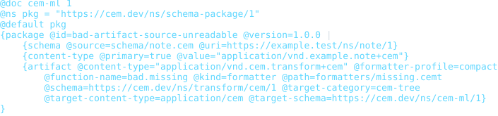

### invalid-artifact-source-parse

- Source: [`examples/invalid-artifact-source-parse.cem`](examples/invalid-artifact-source-parse.cem)
- Content type: `application/vnd.cem.schema-package+cem`
- Schema: `https://cem.dev/ns/schema-package/1`
- Expected result: `fail`
- Expected diagnostics: `cem.schema_package.artifact_check`
- Preview renderer: `CLI convert, tabular formatter, preview HTML + html2svg`
- Preview HTML: `dist/cem_ml/schema-packages/schema-package/v1/examples/invalid-artifact-source-parse.cem.html`

```bash
dist/target/cem_ml_cli/debug/cem-ml convert --input-spec \
  uri=packages/cem_ml/schema-packages/schema-package/v1/examples/invalid-artifact-source-parse.cem,contentType=application/vnd.cem.schema-package+cem,schema=https://cem.dev/ns/schema-package/1 \
  --to-content-type application/cem --to-schema https://cem.dev/ns/cem-ml/1 \
  --cemt-formatter-profile tabular --cemt-color-profile terminal --output-color-type \
  ansi-256
```

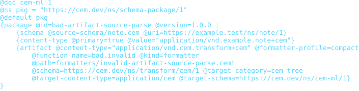

### invalid-artifact-function-missing

- Source: [`examples/invalid-artifact-function-missing.cem`](examples/invalid-artifact-function-missing.cem)
- Content type: `application/vnd.cem.schema-package+cem`
- Schema: `https://cem.dev/ns/schema-package/1`
- Expected result: `fail`
- Expected diagnostics: `cem.schema_package.artifact_check`
- Preview renderer: `CLI convert, tabular formatter, preview HTML + html2svg`
- Preview HTML: `dist/cem_ml/schema-packages/schema-package/v1/examples/invalid-artifact-function-missing.cem.html`

```bash
dist/target/cem_ml_cli/debug/cem-ml convert --input-spec \
  uri=packages/cem_ml/schema-packages/schema-package/v1/examples/invalid-artifact-function-missing.cem,contentType=application/vnd.cem.schema-package+cem,schema=https://cem.dev/ns/schema-package/1 \
  --to-content-type application/cem --to-schema https://cem.dev/ns/cem-ml/1 \
  --cemt-formatter-profile tabular --cemt-color-profile terminal --output-color-type \
  ansi-256
```

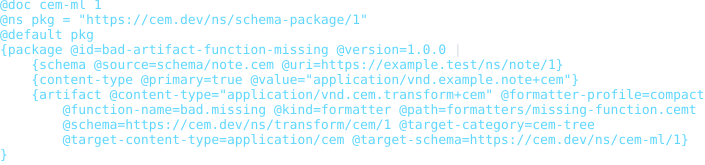

### invalid-schema-metadata

- Source: [`examples/invalid-schema-metadata.cem`](examples/invalid-schema-metadata.cem)
- Content type: `application/vnd.cem.schema-package+cem`
- Schema: `https://cem.dev/ns/schema-package/1`
- Expected result: `fail`
- Expected diagnostics: `cem.schema_package.schema_uri_mismatch`, `cem.schema_package.schema_content_type_mismatch`, `cem.schema_package.schema_namespace_mismatch`
- Preview renderer: `CLI convert, tabular formatter, preview HTML + html2svg`
- Preview HTML: `dist/cem_ml/schema-packages/schema-package/v1/examples/invalid-schema-metadata.cem.html`

```bash
dist/target/cem_ml_cli/debug/cem-ml convert --input-spec \
  uri=packages/cem_ml/schema-packages/schema-package/v1/examples/invalid-schema-metadata.cem,contentType=application/vnd.cem.schema-package+cem,schema=https://cem.dev/ns/schema-package/1 \
  --to-content-type application/cem --to-schema https://cem.dev/ns/cem-ml/1 \
  --cemt-formatter-profile tabular --cemt-color-profile terminal --output-color-type \
  ansi-256
```

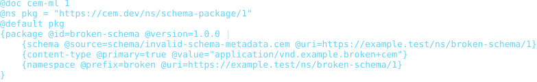

### invalid-schema-source-unreadable

- Source: [`examples/invalid-schema-source-unreadable.cem`](examples/invalid-schema-source-unreadable.cem)
- Content type: `application/vnd.cem.schema-package+cem`
- Schema: `https://cem.dev/ns/schema-package/1`
- Expected result: `fail`
- Expected diagnostics: `cem.schema_package.schema_source_unreadable`
- Preview renderer: `CLI convert, tabular formatter, preview HTML + html2svg`
- Preview HTML: `dist/cem_ml/schema-packages/schema-package/v1/examples/invalid-schema-source-unreadable.cem.html`

```bash
dist/target/cem_ml_cli/debug/cem-ml convert --input-spec \
  uri=packages/cem_ml/schema-packages/schema-package/v1/examples/invalid-schema-source-unreadable.cem,contentType=application/vnd.cem.schema-package+cem,schema=https://cem.dev/ns/schema-package/1 \
  --to-content-type application/cem --to-schema https://cem.dev/ns/cem-ml/1 \
  --cemt-formatter-profile tabular --cemt-color-profile terminal --output-color-type \
  ansi-256
```

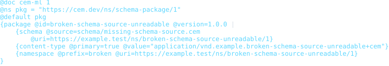

### invalid-schema-source-invalid

- Source: [`examples/invalid-schema-source-invalid.cem`](examples/invalid-schema-source-invalid.cem)
- Content type: `application/vnd.cem.schema-package+cem`
- Schema: `https://cem.dev/ns/schema-package/1`
- Expected result: `fail`
- Expected diagnostics: `cem.schema_package.schema_source_invalid`
- Preview renderer: `CLI convert, tabular formatter, preview HTML + html2svg`
- Preview HTML: `dist/cem_ml/schema-packages/schema-package/v1/examples/invalid-schema-source-invalid.cem.html`

```bash
dist/target/cem_ml_cli/debug/cem-ml convert --input-spec \
  uri=packages/cem_ml/schema-packages/schema-package/v1/examples/invalid-schema-source-invalid.cem,contentType=application/vnd.cem.schema-package+cem,schema=https://cem.dev/ns/schema-package/1 \
  --to-content-type application/cem --to-schema https://cem.dev/ns/cem-ml/1 \
  --cemt-formatter-profile tabular --cemt-color-profile terminal --output-color-type \
  ansi-256
```

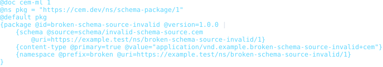

### invalid-example-contract

- Source: [`examples/invalid-example-contract.cem`](examples/invalid-example-contract.cem)
- Content type: `application/vnd.cem.schema-package+cem`
- Schema: `https://cem.dev/ns/schema-package/1`
- Expected result: `fail`
- Expected diagnostics: `cem.schema_package.example_check`
- Preview renderer: `CLI convert, tabular formatter, preview HTML + html2svg`
- Preview HTML: `dist/cem_ml/schema-packages/schema-package/v1/examples/invalid-example-contract.cem.html`

```bash
dist/target/cem_ml_cli/debug/cem-ml convert --input-spec \
  uri=packages/cem_ml/schema-packages/schema-package/v1/examples/invalid-example-contract.cem,contentType=application/vnd.cem.schema-package+cem,schema=https://cem.dev/ns/schema-package/1 \
  --to-content-type application/cem --to-schema https://cem.dev/ns/cem-ml/1 \
  --cemt-formatter-profile tabular --cemt-color-profile terminal --output-color-type \
  ansi-256
```

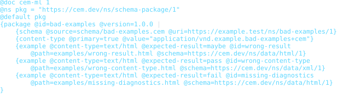

### invalid-example-source-contract

- Source: [`examples/invalid-example-source-contract.cem`](examples/invalid-example-source-contract.cem)
- Content type: `application/vnd.cem.schema-package+cem`
- Schema: `https://cem.dev/ns/schema-package/1`
- Expected result: `fail`
- Expected diagnostics: `cem.schema_package.example_check`
- Preview renderer: `CLI convert, tabular formatter, preview HTML + html2svg`
- Preview HTML: `dist/cem_ml/schema-packages/schema-package/v1/examples/invalid-example-source-contract.cem.html`

```bash
dist/target/cem_ml_cli/debug/cem-ml convert --input-spec \
  uri=packages/cem_ml/schema-packages/schema-package/v1/examples/invalid-example-source-contract.cem,contentType=application/vnd.cem.schema-package+cem,schema=https://cem.dev/ns/schema-package/1 \
  --to-content-type application/cem --to-schema https://cem.dev/ns/cem-ml/1 \
  --cemt-formatter-profile tabular --cemt-color-profile terminal --output-color-type \
  ansi-256
```

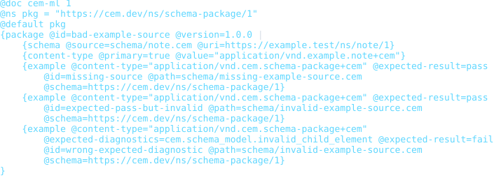
