# CEM Schema Definition Language Package

Status: current implemented surface for the schema definition language package.
Reference-normalization target design lives in
[`../../../../../docs/cem-ml-reference-normalization-design.md`](../../../../../docs/cem-ml-reference-normalization-design.md),
with lookup and comparison vocabulary in
[`../../../../../docs/cem-ml-reference-vocabulary-design.md`](../../../../../docs/cem-ml-reference-vocabulary-design.md)
and
[`../../../../../docs/cem-ml-reference-comparison-design.md`](../../../../../docs/cem-ml-reference-comparison-design.md).

This package defines the CEM-ML schema declaration language used to describe
validation schemas for input content.

Owned schema URI:

```text
https://cem.dev/ns/schema/1
```

Schema source:

```text
schema/cem-schema.cem
```

This filename is the documented v1 bootstrap exception to the default
`schema/schema.cem` shape. It preserves the schema-definition identity embedded
by the runtime catalog while the package still follows the rest of the
versioned folder contract.

Primary content type:

```text
application/vnd.cem.schema+cem
```

Schema source files are ordinary CEM-ML documents using this namespace for the
schema-authoring vocabulary. The target schema being described is carried by the
`schema @namespace` attribute in schema v1.

`schema @namespace` is a schema-v1 compatibility adapter input, not the
long-term schema identity field. Loaders may use it to project explicit
schema-source identity metadata for downstream package checks, while preserving
the authored namespace value as provenance. Manifest schema URI consistency
must compare against an explicit schema URI or resolved schema identity
projection, and namespace consistency must compare only namespace claims. A
future schema-source version should expose an explicit schema identity field
instead of relying on namespace-as-identity.

When schema v1 source is projected into a target descriptor, descriptor
provenance records the schema source artifact, source content type, package or
built-in origin, authored namespace compatibility value, declared content-type
claims, namespace claims, and source ranges when available. Current validators
may still emit compatibility diagnostics keyed to the shipped schema/package
fields, but target reference checks consume explicit schema URI declarations,
complete schema identity records, and namespace claims as separate domains.

## Folder Contract

`package.cem` is the manifest-owned index for this folder. It declares the
schema URI and source file, primary content type, namespace claim, and every
validation example under `examples/`.

`project.json` owns the package-local Nx library
`cem_ml_schema_package_schema_v1`. Its `verify` target validates `package.cem`
through the CLI at the parse failure boundary and tracks `README.md`,
`schema/**/*.cem`, `formatters/**/*.cemt`, `colorizers/**/*.cemt`,
`converters/**/*.cemt`, and `examples/**/*` as package inputs. Full semantic
schema-package validation remains in the final registry/package gate.

Example metadata is intentionally manifest-owned. This package does not require
checked-in `.example.cem` sidecars because `package.cem` already records the
example path, content type, schema URI, expected pass/fail result, and expected
diagnostic codes.

## CEMT Output Status

The schema definition package currently declares no converter edges and no
package-owned formatter or colorizer CEMT artifacts. The schema-package
structure audit therefore reports the baseline formatter/colorizer profiles as
alignment gaps, not hard errors. Until schema-specific CEMT formatters and
colorizers are authored, schema source examples rely on the generic CEM-ML
output path rather than a schema-definition-specific output pipeline.

## Field Contract Requirement

The schema definition language owns field contracts for every schema-declared
construct. A schema must be able to declare required, optional, and forbidden
fields or attributes; accepted children; value types and vocabularies; defaults;
dependent fields; mutually exclusive groups; conditional rules; open-content
policy; and the diagnostic contract for failed checks.

This follows the same separation of concerns used by established schema systems:
RELAX NG patterns own structure, XSD owns complex types and attribute use,
JSON Schema owns `properties`, `required`, `dependentRequired`, and
`if`/`then`, and SHACL owns shape constraints. In CEM, the `.cem` schema source
is the authority. Rust validators compile and evaluate the schema declarations
and perform operational checks, but they must not be the source of
package-specific required-field lists or conditional field rules.

Field-check diagnostics should identify the contract family and carry structured
details such as target, check kind, expected fields, missing fields, invalid
fields, forbidden fields, and actual values. They should not require one
diagnostic code per individual metadata or schema field.

Field contracts can be gated by value selectors such as `when-attribute` plus
`when-values`, by attribute selectors such as `when-present-attributes` and
`when-absent-attributes`, by child selectors such as `when-present-children`
and `when-absent-children`, or by combining selector families on one dependency
contract. Use attribute selectors for dependent-required rules such as "when
this attribute is present and that attribute is absent, require these other
attributes".
Use child selectors with `schema:field-dependency` when direct-child structure
implies required attributes, forbidden attributes, or forbidden attribute
values, such as requiring a label when a reference child is present and no
fallback child is present.
Use `forbidden-attributes` with the same selectors when a present or valued
gate makes another attribute invalid.
Use `forbidden-attribute-values` for value-specific exclusions, such as a
schema-owned mutual exclusion where one attribute value makes another attribute
value invalid while leaving other values legal.
Use `required-one-attributes` and `max-one-attributes` for choice cardinality
over alternative attributes. Declaring both on one field contract creates an
exactly-one attribute choice while still preserving the broad diagnostic family
code.
Use nested `choice` groups with `case` entries for broader grouped choices:
`choice @mode` accepts `exactly-one`, `at-least-one`, or `at-most-one`, and
each `case` declares the attributes and/or children that make that case
present. This is the preferred syntax for new `schema:choice-case` contracts;
the flat `required-one-attributes` and `max-one-attributes` attributes remain
compatibility shorthand for simple attribute choices.
Use `required-children` plus `max-one-children` for exact-one child occurrence
contracts, such as schema package converter `from`/`to` endpoints.
Use `required-one-child` and `max-one-child` for cardinality over a set of
alternative child names. Declaring both on one field contract creates an
exactly-one child choice while still preserving the broad diagnostic family
code.
Use `min-children` and `max-children` for broader child occurrence ranges
expressed as `child=count` name-value pairs.
Use `min-total-children`, `max-total-children`, and
`exact-total-children` when the contract is over the total number of element
children in the current scope instead of over one child name.
Use `min-distinct-children`, `max-distinct-children`, and
`exact-distinct-children` when the contract is over the number of different
child element names present in the current scope.
Use `selected-children` with `min-selected-children`,
`max-selected-children`, or `exact-selected-children` when the contract is
over total occurrences of only the declared child-name set.
Use `selected-children` with `min-selected-distinct-children`,
`max-selected-distinct-children`, or `exact-selected-distinct-children` when
the contract is over the number of different declared child names present,
ignoring unselected child names.
Schema-definition validation rejects selected child occurrence bounds that do
not declare `selected-children`, and rejects exact child occurrence bounds
outside their declared min/max envelope. It also rejects impossible direct
child boundary/sequence contradictions, such as a required boundary or sequence
matching its forbidden counterpart, or an `exact-child-sequence` that cannot
satisfy the same contract's boundary, prefix, suffix, required-sequence, or
forbidden-sequence declarations. Required fields or children cannot also be
forbidden by the same field contract, and required-one choices must leave at
least one non-forbidden, accepted alternative. Conditional selectors must be
satisfiable: `when-values` requires `when-attribute`, all-present selectors
cannot overlap all-absent selectors, and any-present/any-absent selectors must
leave at least one possible candidate.
Use `ordered-children` when the declared child-name set must appear in that
relative order among direct element children. Unlisted children are ignored;
requiredness and multiplicity remain separate child occurrence contracts.
Use `forbidden-ordered-children` when the declared child-name set must not
appear in that relative order; unlike `forbidden-child-sequence`, intervening
children do not make the order valid.
Use `first-child` and `last-child` when a direct element child must occupy the
first or last element-child position in the current scope.
Use `forbidden-first-child` and `forbidden-last-child` when a direct element
child is allowed in the scope but must not occupy a boundary position.
Use `required-child-sequence` when a contiguous direct-child run must appear
somewhere in the current scope. Extra children may appear before or after the
run, but intervening children break the sequence.
Use `forbidden-child-sequence` when a contiguous direct-child run must not
appear in the current scope.
Use `exact-child-sequence` when the complete direct element-child stream must
match the declared sequence, with no missing, extra, or reordered element
children.
Use `prefix-child-sequence` and `suffix-child-sequence` when the direct
element-child stream must start or end with a declared run while still allowing
other children outside that edge.
Use `forbidden-prefix-child-sequence` and
`forbidden-suffix-child-sequence` when the direct element-child stream may
contain a run elsewhere, but must not start or end with that run.
Use `path-layout-attributes` with `path-layout-prefix`,
`path-layout-directory-names`, `path-layout-forbidden-directory-names`, and
`path-layout-extension`, plus `path-layout-basenames` and
`path-layout-forbidden-basenames`, for package-relative path layout contracts,
such as formatter artifacts under `formatters/` and colorizer artifacts under
`colorizers/`.

The generic path-layout field-contract vocabulary is closed at prefix,
directory-name allow/forbid, extension, and basename allow/forbid facets for
the current design. A `schema:path` value resolves in the active scope context
before these facets run: `./...` is relative to the active context root,
protocol-prefixed values use their protocol resolver, and bare values use the
active module map or aliases. Defer generic path depth, segment count, suffix,
glob or segment-class, and alias or module-map matching facets until a concrete
schema-owned check can define stable resolver provenance, source-range
projection, and cross-protocol comparison behavior.

## Declarative Behavior Registry

The schema definition language declares reusable validation behavior under
`{behaviors}`. A `{diagnostic}` binds its stable `@code` to a qualified behavior
reference, and a field contract refers to that code. The code is the stable
behavior-contract identity emitted in CLI and report output; the behavior
reference selects the algorithm contract used to produce that diagnostic.

```cem
{behaviors |
    {behavior
        @name="field-contract"
        @implementation="engine"
        @execution="ast-validation"
        @primitive="schema:field-contract" |
        {inputs |
            {input-binding @name="candidate" @type="schema:node" @source="candidate" @required=true @source-range="candidate"}
            {input-binding @name="diagnostic" @type="schema:diagnostic" @source="diagnostic" @required=true}
        }
        {parameters |
            {parameter @name="contract" @type="schema:field-contract" @required=true}
        }
        {result
            @type="schema:diagnostic-result"
            @severity="error"
            @message="diagnostic"
            @source-range="candidate" |
            {detail @name="checkKind" @type="schema:identifier" @required=true}
            {detail @name="sourceRange" @type="schema:object" @source="candidate"}
        }
    }
}

{diagnostics |
    {diagnostic
        @code="example.resource.missing_label"
        @severity="warning"
        @behavior="schema:required-fields"
        @message="Page resources should declare a label"
    }
}
```

Behavior references resolve through schema `{uses}` aliases. Engine-provided
behaviors bind to a primitive algorithm with `@primitive`. The initial
field-contract primitive is `schema:field-contract`, and the bootstrap schema
declares named behavior contracts backed by that primitive:
`schema:required-fields`, `schema:forbidden-fields`,
`schema:dependent-required-fields`, `schema:mutual-exclusion`,
`schema:field-dependency`, `schema:choice-case`,
`schema:child-occurrence`, and `schema:path-layout`.
The required, forbidden, dependency, mutual-exclusion, and choice-case
contracts declare the structured detail fields that the engine emits for those
diagnostic results.

Individual `{field-contract}` declarations can also bind `@diagnostic` plus
`@behavior`. The diagnostic code remains the report identity, while the
contract-local behavior selects the operational algorithm for that contract.
This lets one broad diagnostic family such as
`cem.schema_package.converter_check` report a conditional dependency through
`schema:field-dependency` and a choice/case exclusion through
`schema:choice-case`.

Attribute-owned engine primitives are also schema-visible. Attribute
declarations bind `@values` failures through `@values-diagnostic` to
`schema:value-vocabulary`, scalar syntax failures for identifier, name-list,
type-reference, symbol-reference, wildcard-name/list/type-reference, boolean,
integer, number, qualified-name, semantic version, URI, media-type, and path
attributes through `@type-diagnostic` to `schema:scalar-type`,
and datatype parameter failures for integer and number
`@minInclusive`/`@maxInclusive`/`@minExclusive`/`@maxExclusive` bounds, string
`@minLength`/`@maxLength`/`@length`/`@stringPrefixes`/`@stringSuffixes`/
`@stringForbiddenPrefixes`/`@stringForbiddenSuffixes`/
`@stringIncludes`/`@stringExcludes`
constraints, list `@itemCount`/`@minItems`/`@maxItems` item-count
constraints, numeric `@totalDigits`/`@fractionDigits` digit-count
constraints, and regex `@pattern`, path `@pathPrefixes`/`@pathForbiddenPrefixes`/
`@pathDirectoryNames`/`@pathForbiddenDirectoryNames`/
`@pathExtensions`/`@pathForbiddenExtensions`/`@pathBasenames`/
`@pathForbiddenBasenames`, URI
`@uriSchemes`/`@uriForbiddenSchemes`/`@uriHosts`/`@uriForbiddenHosts`/
`@uriPorts`/`@uriForbiddenPorts`/`@uriRequiresAuthority`/`@uriPathPrefixes`/
`@uriForbiddenPathPrefixes`/`@uriPathExtensions`/`@uriForbiddenPathExtensions`/
`@uriPathBasenames`/`@uriForbiddenPathBasenames`/`@uriQueries`/`@uriForbiddenQueries`/
`@uriQueryParameters`/`@uriQueryParameterValues`/`@uriQueryForbiddenParameters`/
`@uriQueryRequiredParameters`/`@uriFragments`/`@uriForbiddenFragments`, and media-type
`@mediaTypes`/`@mediaTypeForbiddenEssences`/`@mediaTypeTypes`/`@mediaTypeSubtypes`/`@mediaTypeSuffixes`/
`@mediaTypeForbiddenTypes`/`@mediaTypeForbiddenSubtypes`/
`@mediaTypeForbiddenSuffixes`/`@mediaTypeParameters`/
`@mediaTypeParameterValues`/`@mediaTypeForbiddenParameters`/
`@mediaTypeRequiredParameters` constraints
through `@datatype-param-diagnostic` to
`schema:datatype-param`. In all cases the diagnostic `@code` remains the
stable output identity while `@behavior` selects the reusable algorithm
contract. The `schema:value-vocabulary` and `schema:scalar-type` result
contracts declare the emitted attribute value/type detail keys, and the
`schema:datatype-param` result contract declares the emitted datatype-specific
detail keys.

Operational constraints bind their execution behavior at the `{constraint}`
declaration while keeping the diagnostic family code stable. Constraint
declarations can use `@diagnostic` plus `@behavior` to bind resource readability
checks to `schema:resource-readable`, parser/validation checks to
`schema:resource-parse`, and cross-reference checks to
`schema:reference-resolution`. This lets a schema-package diagnostic such as
`cem.schema_package.artifact_check` remain the report identity while individual
constraint `checkKind` values select different engine algorithms.
Their result contracts declare the emitted resource path, read error,
parse/source diagnostic, expected-value, invalid-value, and source-range
details.

Function behaviors bind to a schema-declared function with `@function`, declare
typed `{inputs}`, optional typed `{parameters}`, and a `{result}` shape with
structured `{detail}` entries and source-range propagation policy:

```cem
{behavior
    @name="resource-label"
    @implementation="function"
    @execution="ast-validation"
    @function="resource-label-result"
    @select="resource"
    @match='kind == "page" && label == null' |
    {inputs |
        {input-binding @name="candidate" @type="schema:node" @source="candidate" @required=true}
    }
    {parameters |
        {parameter @name="expected" @type="schema:string" @required=true @default="label"}
    }
    {result @type="schema:diagnostic-result" @source-range="candidate" |
        {detail @name="checkKind" @type="schema:identifier" @required=true}
        {detail @name="expected" @type="schema:string" @required=true}
    }
    {function @name="resource-label-result" @returns="object" @deterministic=true |
        {param @name="candidate" @type="object" @required=true}
        {param @name="expected" @type="string" @required=true}
        {body | {$ { message: "Page resource needs a label", details: { checkKind: "resource-label", expected: expected, element: candidate.name } } }}
    }
}

{diagnostics |
    {diagnostic @code="example.resource.missing_label" @severity="warning" @behavior="resource-label" |
        {arguments |
            {argument @name="expected" @value="label"}
        }
    }
}
```

The compiler now validates diagnostic behavior references, unsupported engine
primitives, missing function bindings, inline function lookup, function return
type, diagnostic result shape, required CEM-QL `@select`/`@match` expressions,
executable CEM-ML behavior body presence, and required function-parameter
binding through declared inputs or defaulted behavior parameters. The CEM-QL
schema-behavior bridge now evaluates direct candidate selection and match
expressions, binds defaulted typed behavior parameters, and executes inline
CEM-ML behavior function bodies outside CEMT to produce diagnostic messages and
structured details. Qualified function references now resolve through schema
`{uses}` aliases to visible reusable CEM-ML behavior functions. Diagnostic
`{arguments}` now bind non-default parameter overrides for function behaviors.
The first field-contract-backed and attribute-owned engine behavior aliases now
compile and execute through diagnostic `@behavior`; field-contract-local
`schema:field-dependency` and `schema:choice-case` bindings now compile and
stamp operational diagnostics while preserving broad diagnostic family codes.
The `schema:field-dependency` alias covers required, forbidden, and
forbidden-value field dependencies gated by values, attribute presence, or
child structure, and its result contract declares the emitted
required/missing/forbidden/invalid field, value, and condition details.
Constraint-owned `schema:resource-readable`, `schema:resource-parse`, and
`schema:reference-resolution` bindings now compile and stamp operational
diagnostics with their declared behavior; their result contracts declare the
emitted path/error/source-diagnostic and reference expected/invalid value
details. Integer and number `minInclusive`,
`maxInclusive`, `minExclusive`, and `maxExclusive` bounds, numeric
`totalDigits`/`fractionDigits` constraints, string `minLength`/`maxLength`/
`length`/`stringPrefixes`/`stringSuffixes`/`stringForbiddenPrefixes`/
`stringForbiddenSuffixes`/`stringIncludes`/`stringExcludes` constraints, list
`itemCount`/`minItems`/`maxItems` constraints, regex `pattern`, path
prefix/forbidden-prefix/directory-name/forbidden-directory-name/extension/forbidden-extension/basename/forbidden-basename `pathPrefixes`/`pathForbiddenPrefixes`/`pathDirectoryNames`/`pathForbiddenDirectoryNames`/`pathExtensions`/`pathForbiddenExtensions`/`pathBasenames`/`pathForbiddenBasenames`, URI scheme/forbidden-scheme/host/forbidden-host/port/forbidden-port/authority/path-prefix/forbidden-path-prefix/path-extension/forbidden-path-extension/path-basename/forbidden-path-basename/query/forbidden-query/query-parameter-name/value/forbidden-parameter/required-parameter/fragment/forbidden-fragment
`uriSchemes`/`uriForbiddenSchemes`/`uriHosts`/`uriForbiddenHosts`/`uriPorts`/
`uriForbiddenPorts`/`uriRequiresAuthority`/`uriPathPrefixes`/
`uriForbiddenPathPrefixes`/`uriPathExtensions`/`uriForbiddenPathExtensions`/
`uriPathBasenames`/`uriForbiddenPathBasenames`/`uriQueries`/`uriForbiddenQueries`/
`uriQueryParameters`/`uriQueryParameterValues`/`uriQueryForbiddenParameters`/
`uriQueryRequiredParameters`/`uriFragments`/`uriForbiddenFragments`, and media-type
essence/forbidden-essence/type/subtype/structured-suffix/forbidden-type/forbidden-subtype/
forbidden-structured-suffix/parameter-name/value/forbidden-parameter/
required-parameter `mediaTypes`/`mediaTypeForbiddenEssences`/`mediaTypeTypes`/`mediaTypeSubtypes`/`mediaTypeSuffixes`/
`mediaTypeForbiddenTypes`/`mediaTypeForbiddenSubtypes`/`mediaTypeForbiddenSuffixes`/`mediaTypeParameters`/
`mediaTypeParameterValues`/`mediaTypeForbiddenParameters`/
`mediaTypeRequiredParameters` datatype parameter variations now execute through
`schema:datatype-param`, whose result contract declares the emitted
family-specific string/list/digit/path/URI/media-type details; identifier, name-list, type-reference,
symbol-reference, wildcard-name/list/type-reference, boolean, integer, number,
qualified-name, semantic version, basic absolute-URI, basic media-type, and
scope-context path scalar syntax now execute through `schema:scalar-type`,
whose result contract declares emitted scalar value/type details;
schema-definition validation also rejects numeric bound/digit-count params on
non-numeric attributes, string length/prefix/suffix/forbidden-prefix/forbidden-suffix/include/exclude params on non-string attributes,
list item-count params on non-list attributes, inconsistent numeric min/max
bound envelopes, inconsistent string/list min/max/exact count envelopes, and
inconsistent URI/media-type required/forbidden parameter declarations;
required-one/max-one attribute choice cardinality and nested choice/case groups
now execute through `schema:choice-case`, whose result contract declares the
flat and grouped choice details emitted by the engine; child-set cardinality,
`min-children`/`max-children` named child occurrence ranges, and
total/distinct/selected occurrence and selected-distinct child-count bounds,
child presence/absence condition selectors, required/forbidden relative child
ordering, required/forbidden boundary child placement, and
exact/required/forbidden/prefix/suffix/forbidden-prefix/forbidden-suffix child sequences, now
execute through `schema:child-occurrence`; the
currently declared attribute datatype-parameter vocabulary is covered by
`schema:datatype-param`. Attribute declarations can now carry literal
`@default` metadata, and default values are validated against declared scalar
types, value vocabularies, and datatype parameters; applying omitted defaults
to candidate input remains a runtime contract step.

## Examples

This section is generated from `package.cem` `{example}` metadata by the
`samples2readme` Nx target. Each SVG previews the example content, not
the validation report. The target writes a preformatted HTML preview to
`dist/cem_ml/schema-packages/<package>/v1/examples/<example-file>.html`,
then renders the `<pre>` spans through headless Chromium into
`examples/previews/<example-file>.svg`.
Source snapshots are used only where the current CLI cannot yet render
the package formatter/colorizer path for that content identity.

<details>
<summary>basic-schema</summary>

- Source: [`examples/basic-schema.cem`](./examples/basic-schema.cem)
- Content type: `application/vnd.cem.schema+cem`
- Schema: `https://cem.dev/ns/schema/1`
- Expected result: `pass`
- Preview renderer: `CLI convert, tabular formatter, preview HTML + html2svg`
- Preview HTML: `dist/cem_ml/schema-packages/schema/v1/examples/basic-schema.cem.html`

```bash
dist/target/cem_ml_cli/debug/cem-ml convert --input-spec \
  uri=packages/cem_ml/schema-packages/schema/v1/examples/basic-schema.cem,contentType=application/vnd.cem.schema+cem,schema=https://cem.dev/ns/schema/1 \
  --to-content-type application/cem --to-schema https://cem.dev/ns/cem-ml/1 \
  --cemt-formatter-profile tabular --cemt-color-profile terminal --output-color-type \
  ansi-256
```

</details>

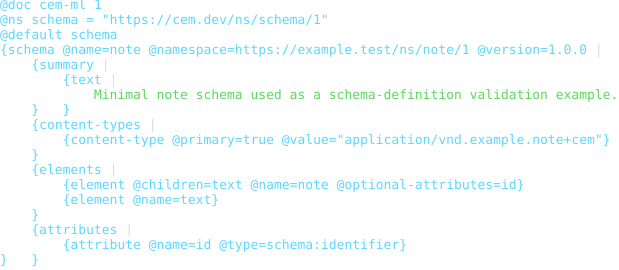

<details>
<summary>typed-resource-schema</summary>

- Source: [`examples/typed-resource-schema.cem`](./examples/typed-resource-schema.cem)
- Content type: `application/vnd.cem.schema+cem`
- Schema: `https://cem.dev/ns/schema/1`
- Expected result: `pass`
- Preview renderer: `CLI convert, tabular formatter, preview HTML + html2svg`
- Preview HTML: `dist/cem_ml/schema-packages/schema/v1/examples/typed-resource-schema.cem.html`

```bash
dist/target/cem_ml_cli/debug/cem-ml convert --input-spec \
  uri=packages/cem_ml/schema-packages/schema/v1/examples/typed-resource-schema.cem,contentType=application/vnd.cem.schema+cem,schema=https://cem.dev/ns/schema/1 \
  --to-content-type application/cem --to-schema https://cem.dev/ns/cem-ml/1 \
  --cemt-formatter-profile tabular --cemt-color-profile terminal --output-color-type \
  ansi-256
```

</details>

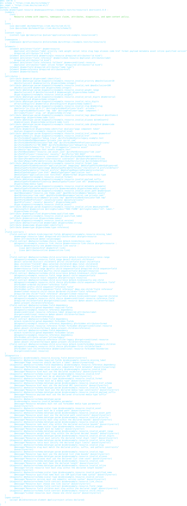

<details>
<summary>custom-behavior-schema</summary>

- Source: [`examples/custom-behavior-schema.cem`](./examples/custom-behavior-schema.cem)
- Content type: `application/vnd.cem.schema+cem`
- Schema: `https://cem.dev/ns/schema/1`
- Expected result: `pass`
- Preview renderer: `CLI convert, tabular formatter, preview HTML + html2svg`
- Preview HTML: `dist/cem_ml/schema-packages/schema/v1/examples/custom-behavior-schema.cem.html`

```bash
dist/target/cem_ml_cli/debug/cem-ml convert --input-spec \
  uri=packages/cem_ml/schema-packages/schema/v1/examples/custom-behavior-schema.cem,contentType=application/vnd.cem.schema+cem,schema=https://cem.dev/ns/schema/1 \
  --to-content-type application/cem --to-schema https://cem.dev/ns/cem-ml/1 \
  --cemt-formatter-profile tabular --cemt-color-profile terminal --output-color-type \
  ansi-256
```

</details>

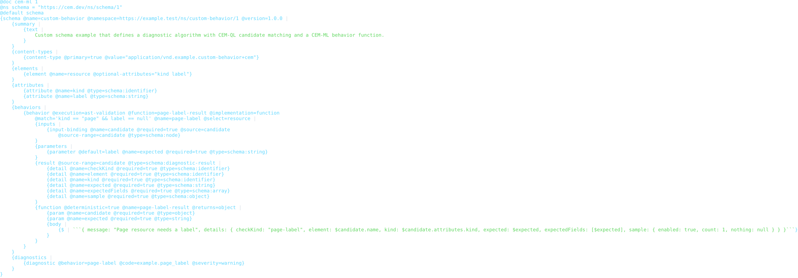

<details>
<summary>custom-behavior-schema-strict</summary>

- Source: [`examples/custom-behavior-schema-strict.cem`](./examples/custom-behavior-schema-strict.cem)
- Content type: `application/vnd.cem.schema+cem`
- Schema: `https://cem.dev/ns/schema/1`
- Expected result: `pass`
- Preview renderer: `CLI convert, tabular formatter, preview HTML + html2svg`
- Preview HTML: `dist/cem_ml/schema-packages/schema/v1/examples/custom-behavior-schema-strict.cem.html`

```bash
dist/target/cem_ml_cli/debug/cem-ml convert --input-spec \
  uri=packages/cem_ml/schema-packages/schema/v1/examples/custom-behavior-schema-strict.cem,contentType=application/vnd.cem.schema+cem,schema=https://cem.dev/ns/schema/1 \
  --to-content-type application/cem --to-schema https://cem.dev/ns/cem-ml/1 \
  --cemt-formatter-profile tabular --cemt-color-profile terminal --output-color-type \
  ansi-256
```

</details>

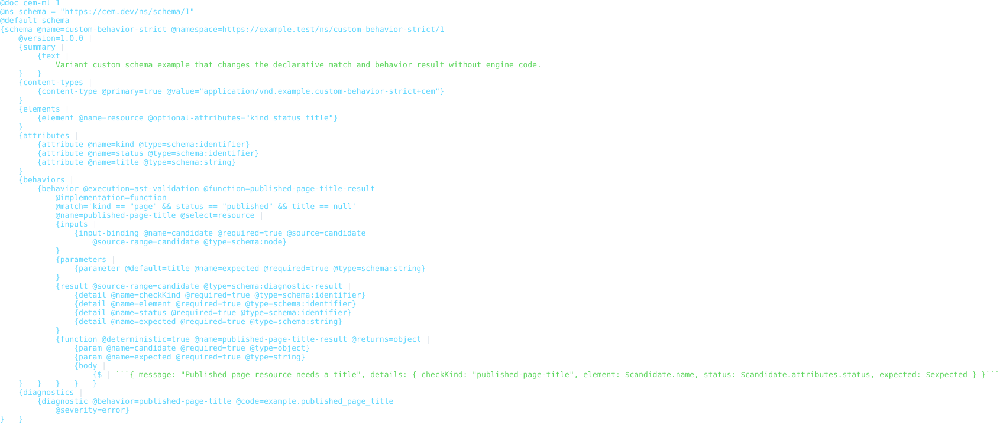

<details>
<summary>invalid-missing-required-attribute</summary>

- Source: [`examples/invalid-missing-required-attribute.cem`](./examples/invalid-missing-required-attribute.cem)
- Content type: `application/vnd.cem.schema+cem`
- Schema: `https://cem.dev/ns/schema/1`
- Expected result: `fail`
- Expected diagnostics: `cem.schema_model.missing_required_attribute`
- Preview renderer: `CLI convert, tabular formatter, preview HTML + html2svg`
- Preview HTML: `dist/cem_ml/schema-packages/schema/v1/examples/invalid-missing-required-attribute.cem.html`

```bash
dist/target/cem_ml_cli/debug/cem-ml convert --input-spec \
  uri=packages/cem_ml/schema-packages/schema/v1/examples/invalid-missing-required-attribute.cem,contentType=application/vnd.cem.schema+cem,schema=https://cem.dev/ns/schema/1 \
  --to-content-type application/cem --to-schema https://cem.dev/ns/cem-ml/1 \
  --cemt-formatter-profile tabular --cemt-color-profile terminal --output-color-type \
  ansi-256
```

</details>

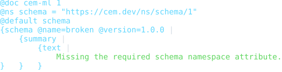

<details>
<summary>invalid-diagnostic-behavior</summary>

- Source: [`examples/invalid-diagnostic-behavior.cem`](./examples/invalid-diagnostic-behavior.cem)
- Content type: `application/vnd.cem.schema+cem`
- Schema: `https://cem.dev/ns/schema/1`
- Expected result: `fail`
- Expected diagnostics: `cem.schema_definition.unknown_diagnostic_behavior`
- Preview renderer: `CLI convert, tabular formatter, preview HTML + html2svg`
- Preview HTML: `dist/cem_ml/schema-packages/schema/v1/examples/invalid-diagnostic-behavior.cem.html`

```bash
dist/target/cem_ml_cli/debug/cem-ml convert --input-spec \
  uri=packages/cem_ml/schema-packages/schema/v1/examples/invalid-diagnostic-behavior.cem,contentType=application/vnd.cem.schema+cem,schema=https://cem.dev/ns/schema/1 \
  --to-content-type application/cem --to-schema https://cem.dev/ns/cem-ml/1 \
  --cemt-formatter-profile tabular --cemt-color-profile terminal --output-color-type \
  ansi-256
```

</details>

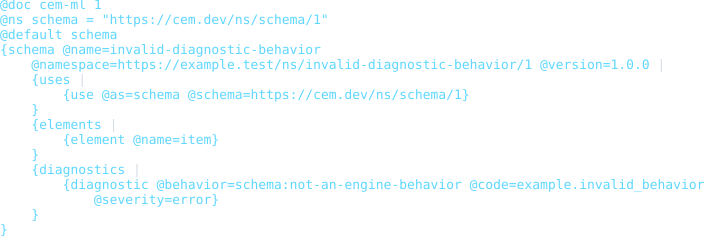

<details>
<summary>invalid-custom-behavior-unresolved-function</summary>

- Source: [`examples/invalid-custom-behavior-unresolved-function.cem`](./examples/invalid-custom-behavior-unresolved-function.cem)
- Content type: `application/vnd.cem.schema+cem`
- Schema: `https://cem.dev/ns/schema/1`
- Expected result: `fail`
- Expected diagnostics: `cem.schema_definition.unresolved_behavior_function`
- Preview renderer: `CLI convert, tabular formatter, preview HTML + html2svg`
- Preview HTML: `dist/cem_ml/schema-packages/schema/v1/examples/invalid-custom-behavior-unresolved-function.cem.html`

```bash
dist/target/cem_ml_cli/debug/cem-ml convert --input-spec \
  uri=packages/cem_ml/schema-packages/schema/v1/examples/invalid-custom-behavior-unresolved-function.cem,contentType=application/vnd.cem.schema+cem,schema=https://cem.dev/ns/schema/1 \
  --to-content-type application/cem --to-schema https://cem.dev/ns/cem-ml/1 \
  --cemt-formatter-profile tabular --cemt-color-profile terminal --output-color-type \
  ansi-256
```

</details>

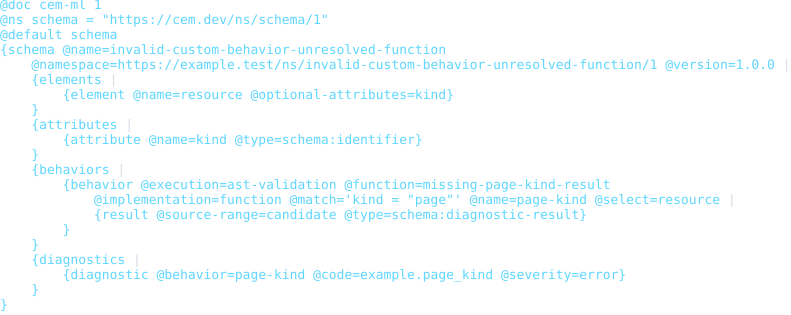

<details>
<summary>invalid-custom-behavior-select-query</summary>

- Source: [`examples/invalid-custom-behavior-select-query.cem`](./examples/invalid-custom-behavior-select-query.cem)
- Content type: `application/vnd.cem.schema+cem`
- Schema: `https://cem.dev/ns/schema/1`
- Expected result: `fail`
- Expected diagnostics: `cem.schema_behavior.query_invalid`
- Preview renderer: `CLI convert, tabular formatter, preview HTML + html2svg`
- Preview HTML: `dist/cem_ml/schema-packages/schema/v1/examples/invalid-custom-behavior-select-query.cem.html`

```bash
dist/target/cem_ml_cli/debug/cem-ml convert --input-spec \
  uri=packages/cem_ml/schema-packages/schema/v1/examples/invalid-custom-behavior-select-query.cem,contentType=application/vnd.cem.schema+cem,schema=https://cem.dev/ns/schema/1 \
  --to-content-type application/cem --to-schema https://cem.dev/ns/cem-ml/1 \
  --cemt-formatter-profile tabular --cemt-color-profile terminal --output-color-type \
  ansi-256
```

</details>

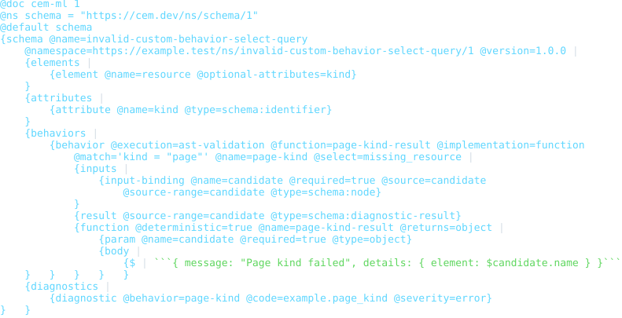

<details>
<summary>invalid-custom-behavior-match-query</summary>

- Source: [`examples/invalid-custom-behavior-match-query.cem`](./examples/invalid-custom-behavior-match-query.cem)
- Content type: `application/vnd.cem.schema+cem`
- Schema: `https://cem.dev/ns/schema/1`
- Expected result: `fail`
- Expected diagnostics: `cem.schema_behavior.query_invalid`
- Preview renderer: `CLI convert, tabular formatter, preview HTML + html2svg`
- Preview HTML: `dist/cem_ml/schema-packages/schema/v1/examples/invalid-custom-behavior-match-query.cem.html`

```bash
dist/target/cem_ml_cli/debug/cem-ml convert --input-spec \
  uri=packages/cem_ml/schema-packages/schema/v1/examples/invalid-custom-behavior-match-query.cem,contentType=application/vnd.cem.schema+cem,schema=https://cem.dev/ns/schema/1 \
  --to-content-type application/cem --to-schema https://cem.dev/ns/cem-ml/1 \
  --cemt-formatter-profile tabular --cemt-color-profile terminal --output-color-type \
  ansi-256
```

</details>

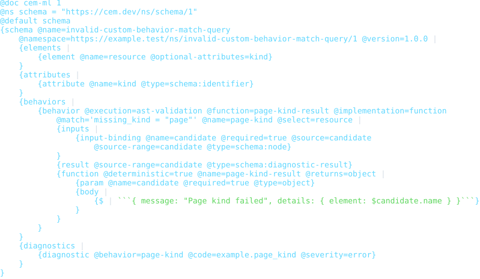

<details>
<summary>invalid-custom-behavior-argument-type</summary>

- Source: [`examples/invalid-custom-behavior-argument-type.cem`](./examples/invalid-custom-behavior-argument-type.cem)
- Content type: `application/vnd.cem.schema+cem`
- Schema: `https://cem.dev/ns/schema/1`
- Expected result: `fail`
- Expected diagnostics: `cem.schema_definition.invalid_diagnostic_behavior_contract`
- Preview renderer: `CLI convert, tabular formatter, preview HTML + html2svg`
- Preview HTML: `dist/cem_ml/schema-packages/schema/v1/examples/invalid-custom-behavior-argument-type.cem.html`

```bash
dist/target/cem_ml_cli/debug/cem-ml convert --input-spec \
  uri=packages/cem_ml/schema-packages/schema/v1/examples/invalid-custom-behavior-argument-type.cem,contentType=application/vnd.cem.schema+cem,schema=https://cem.dev/ns/schema/1 \
  --to-content-type application/cem --to-schema https://cem.dev/ns/cem-ml/1 \
  --cemt-formatter-profile tabular --cemt-color-profile terminal --output-color-type \
  ansi-256
```

</details>

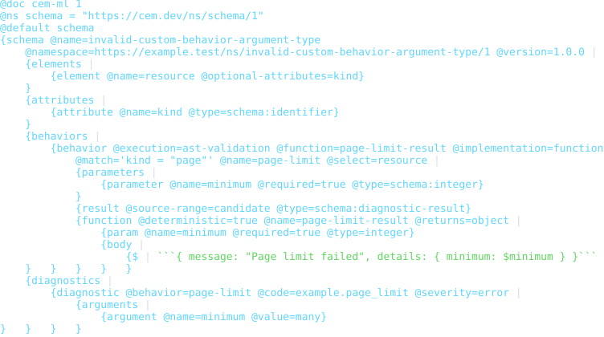

<details>
<summary>invalid-custom-behavior-signature</summary>

- Source: [`examples/invalid-custom-behavior-signature.cem`](./examples/invalid-custom-behavior-signature.cem)
- Content type: `application/vnd.cem.schema+cem`
- Schema: `https://cem.dev/ns/schema/1`
- Expected result: `fail`
- Expected diagnostics: `cem.schema_definition.invalid_diagnostic_behavior_contract`
- Preview renderer: `CLI convert, tabular formatter, preview HTML + html2svg`
- Preview HTML: `dist/cem_ml/schema-packages/schema/v1/examples/invalid-custom-behavior-signature.cem.html`

```bash
dist/target/cem_ml_cli/debug/cem-ml convert --input-spec \
  uri=packages/cem_ml/schema-packages/schema/v1/examples/invalid-custom-behavior-signature.cem,contentType=application/vnd.cem.schema+cem,schema=https://cem.dev/ns/schema/1 \
  --to-content-type application/cem --to-schema https://cem.dev/ns/cem-ml/1 \
  --cemt-formatter-profile tabular --cemt-color-profile terminal --output-color-type \
  ansi-256
```

</details>

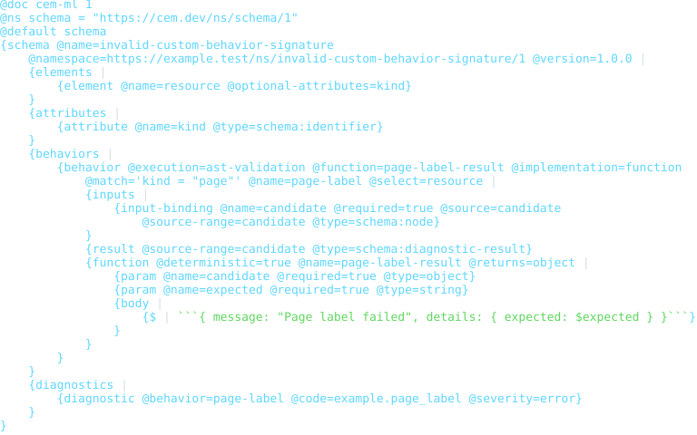

<details>
<summary>invalid-custom-behavior-unsafe-call</summary>

- Source: [`examples/invalid-custom-behavior-unsafe-call.cem`](./examples/invalid-custom-behavior-unsafe-call.cem)
- Content type: `application/vnd.cem.schema+cem`
- Schema: `https://cem.dev/ns/schema/1`
- Expected result: `fail`
- Expected diagnostics: `cem.schema_behavior.function_failed`
- Preview renderer: `CLI convert, tabular formatter, preview HTML + html2svg`
- Preview HTML: `dist/cem_ml/schema-packages/schema/v1/examples/invalid-custom-behavior-unsafe-call.cem.html`

```bash
dist/target/cem_ml_cli/debug/cem-ml convert --input-spec \
  uri=packages/cem_ml/schema-packages/schema/v1/examples/invalid-custom-behavior-unsafe-call.cem,contentType=application/vnd.cem.schema+cem,schema=https://cem.dev/ns/schema/1 \
  --to-content-type application/cem --to-schema https://cem.dev/ns/cem-ml/1 \
  --cemt-formatter-profile tabular --cemt-color-profile terminal --output-color-type \
  ansi-256
```

</details>

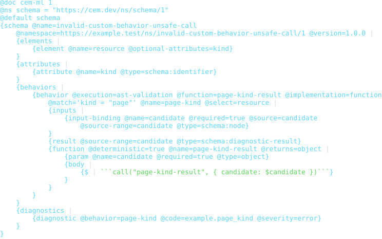

<details>
<summary>invalid-custom-behavior-contracts</summary>

- Source: [`examples/invalid-custom-behavior-contracts.cem`](./examples/invalid-custom-behavior-contracts.cem)
- Content type: `application/vnd.cem.schema+cem`
- Schema: `https://cem.dev/ns/schema/1`
- Expected result: `fail`
- Expected diagnostics: `cem.schema_definition.invalid_diagnostic_behavior_contract`
- Preview renderer: `CLI convert, tabular formatter, preview HTML + html2svg`
- Preview HTML: `dist/cem_ml/schema-packages/schema/v1/examples/invalid-custom-behavior-contracts.cem.html`

```bash
dist/target/cem_ml_cli/debug/cem-ml convert --input-spec \
  uri=packages/cem_ml/schema-packages/schema/v1/examples/invalid-custom-behavior-contracts.cem,contentType=application/vnd.cem.schema+cem,schema=https://cem.dev/ns/schema/1 \
  --to-content-type application/cem --to-schema https://cem.dev/ns/cem-ml/1 \
  --cemt-formatter-profile tabular --cemt-color-profile terminal --output-color-type \
  ansi-256
```

</details>

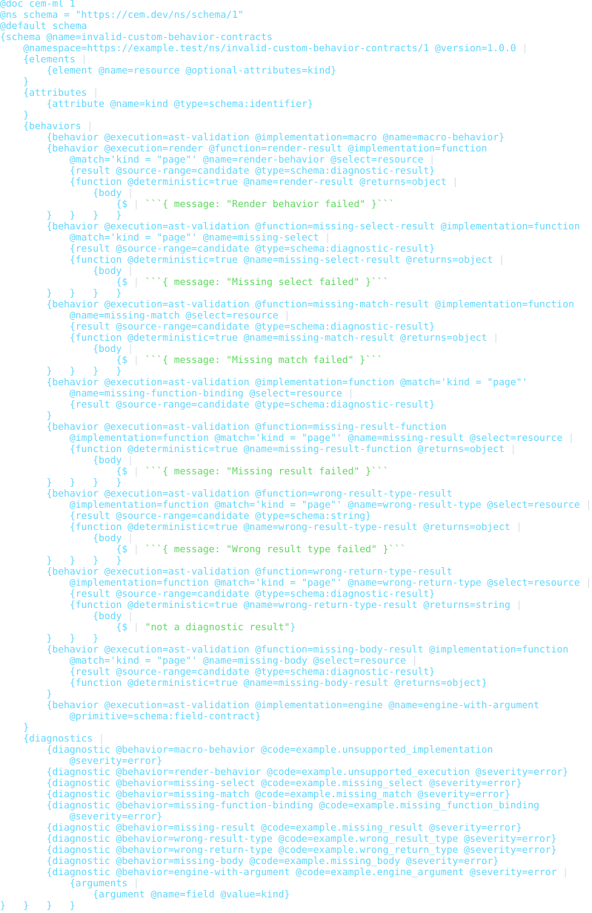

<details>
<summary>invalid-datatype-param-length</summary>

- Source: [`examples/invalid-datatype-param-length.cem`](./examples/invalid-datatype-param-length.cem)
- Content type: `application/vnd.cem.schema+cem`
- Schema: `https://cem.dev/ns/schema/1`
- Expected result: `fail`
- Expected diagnostics: `cem.schema_definition.invalid_datatype_param`
- Preview renderer: `CLI convert, tabular formatter, preview HTML + html2svg`
- Preview HTML: `dist/cem_ml/schema-packages/schema/v1/examples/invalid-datatype-param-length.cem.html`

```bash
dist/target/cem_ml_cli/debug/cem-ml convert --input-spec \
  uri=packages/cem_ml/schema-packages/schema/v1/examples/invalid-datatype-param-length.cem,contentType=application/vnd.cem.schema+cem,schema=https://cem.dev/ns/schema/1 \
  --to-content-type application/cem --to-schema https://cem.dev/ns/cem-ml/1 \
  --cemt-formatter-profile tabular --cemt-color-profile terminal --output-color-type \
  ansi-256
```

</details>

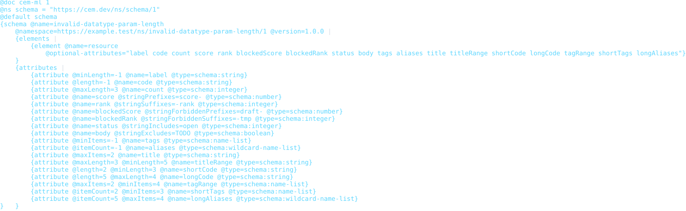

<details>
<summary>invalid-datatype-param-bound</summary>

- Source: [`examples/invalid-datatype-param-bound.cem`](./examples/invalid-datatype-param-bound.cem)
- Content type: `application/vnd.cem.schema+cem`
- Schema: `https://cem.dev/ns/schema/1`
- Expected result: `fail`
- Expected diagnostics: `cem.schema_definition.invalid_datatype_param`
- Preview renderer: `CLI convert, tabular formatter, preview HTML + html2svg`
- Preview HTML: `dist/cem_ml/schema-packages/schema/v1/examples/invalid-datatype-param-bound.cem.html`

```bash
dist/target/cem_ml_cli/debug/cem-ml convert --input-spec \
  uri=packages/cem_ml/schema-packages/schema/v1/examples/invalid-datatype-param-bound.cem,contentType=application/vnd.cem.schema+cem,schema=https://cem.dev/ns/schema/1 \
  --to-content-type application/cem --to-schema https://cem.dev/ns/cem-ml/1 \
  --cemt-formatter-profile tabular --cemt-color-profile terminal --output-color-type \
  ansi-256
```

</details>

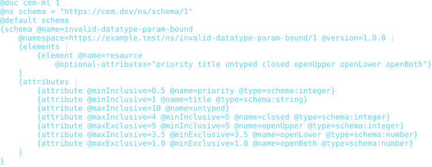

<details>
<summary>invalid-datatype-param-pattern</summary>

- Source: [`examples/invalid-datatype-param-pattern.cem`](./examples/invalid-datatype-param-pattern.cem)
- Content type: `application/vnd.cem.schema+cem`
- Schema: `https://cem.dev/ns/schema/1`
- Expected result: `fail`
- Expected diagnostics: `cem.schema_definition.invalid_datatype_param`
- Preview renderer: `CLI convert, tabular formatter, preview HTML + html2svg`
- Preview HTML: `dist/cem_ml/schema-packages/schema/v1/examples/invalid-datatype-param-pattern.cem.html`

```bash
dist/target/cem_ml_cli/debug/cem-ml convert --input-spec \
  uri=packages/cem_ml/schema-packages/schema/v1/examples/invalid-datatype-param-pattern.cem,contentType=application/vnd.cem.schema+cem,schema=https://cem.dev/ns/schema/1 \
  --to-content-type application/cem --to-schema https://cem.dev/ns/cem-ml/1 \
  --cemt-formatter-profile tabular --cemt-color-profile terminal --output-color-type \
  ansi-256
```

</details>

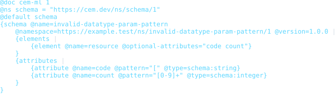

<details>
<summary>invalid-datatype-param-digits</summary>

- Source: [`examples/invalid-datatype-param-digits.cem`](./examples/invalid-datatype-param-digits.cem)
- Content type: `application/vnd.cem.schema+cem`
- Schema: `https://cem.dev/ns/schema/1`
- Expected result: `fail`
- Expected diagnostics: `cem.schema_definition.invalid_datatype_param`
- Preview renderer: `CLI convert, tabular formatter, preview HTML + html2svg`
- Preview HTML: `dist/cem_ml/schema-packages/schema/v1/examples/invalid-datatype-param-digits.cem.html`

```bash
dist/target/cem_ml_cli/debug/cem-ml convert --input-spec \
  uri=packages/cem_ml/schema-packages/schema/v1/examples/invalid-datatype-param-digits.cem,contentType=application/vnd.cem.schema+cem,schema=https://cem.dev/ns/schema/1 \
  --to-content-type application/cem --to-schema https://cem.dev/ns/cem-ml/1 \
  --cemt-formatter-profile tabular --cemt-color-profile terminal --output-color-type \
  ansi-256
```

</details>

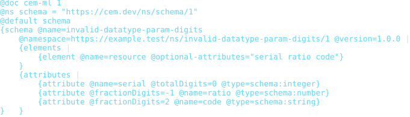

<details>
<summary>invalid-datatype-param-uri-media</summary>

- Source: [`examples/invalid-datatype-param-uri-media.cem`](./examples/invalid-datatype-param-uri-media.cem)
- Content type: `application/vnd.cem.schema+cem`
- Schema: `https://cem.dev/ns/schema/1`
- Expected result: `fail`
- Expected diagnostics: `cem.schema_definition.invalid_datatype_param`
- Preview renderer: `CLI convert, tabular formatter, preview HTML + html2svg`
- Preview HTML: `dist/cem_ml/schema-packages/schema/v1/examples/invalid-datatype-param-uri-media.cem.html`

```bash
dist/target/cem_ml_cli/debug/cem-ml convert --input-spec \
  uri=packages/cem_ml/schema-packages/schema/v1/examples/invalid-datatype-param-uri-media.cem,contentType=application/vnd.cem.schema+cem,schema=https://cem.dev/ns/schema/1 \
  --to-content-type application/cem --to-schema https://cem.dev/ns/cem-ml/1 \
  --cemt-formatter-profile tabular --cemt-color-profile terminal --output-color-type \
  ansi-256
```

</details>

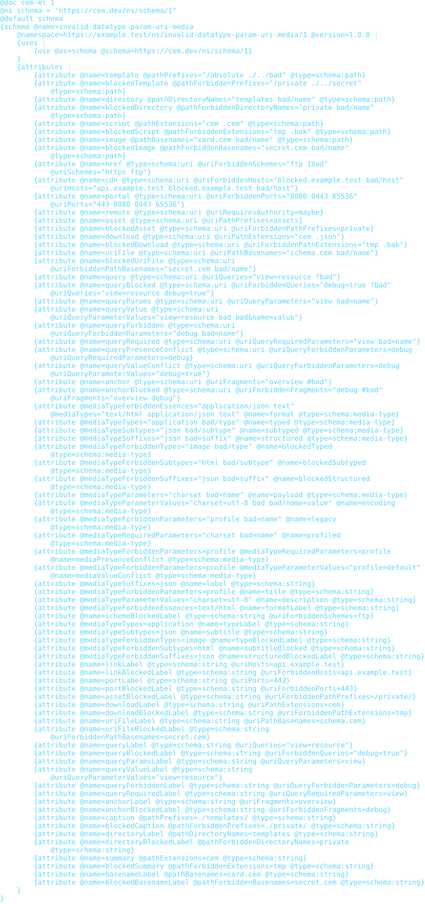

<details>
<summary>invalid-field-contract-presence</summary>

- Source: [`examples/invalid-field-contract-presence.cem`](./examples/invalid-field-contract-presence.cem)
- Content type: `application/vnd.cem.schema+cem`
- Schema: `https://cem.dev/ns/schema/1`
- Expected result: `fail`
- Expected diagnostics: `cem.schema_definition.invalid_field_contract`
- Preview renderer: `CLI convert, tabular formatter, preview HTML + html2svg`
- Preview HTML: `dist/cem_ml/schema-packages/schema/v1/examples/invalid-field-contract-presence.cem.html`

```bash
dist/target/cem_ml_cli/debug/cem-ml convert --input-spec \
  uri=packages/cem_ml/schema-packages/schema/v1/examples/invalid-field-contract-presence.cem,contentType=application/vnd.cem.schema+cem,schema=https://cem.dev/ns/schema/1 \
  --to-content-type application/cem --to-schema https://cem.dev/ns/cem-ml/1 \
  --cemt-formatter-profile tabular --cemt-color-profile terminal --output-color-type \
  ansi-256
```

</details>

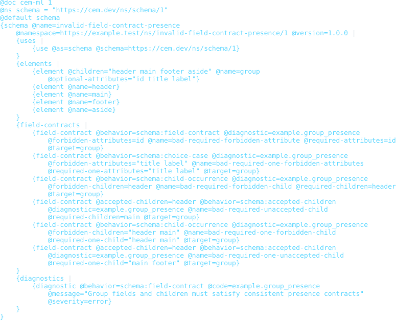

<details>
<summary>invalid-field-contract-condition</summary>

- Source: [`examples/invalid-field-contract-condition.cem`](./examples/invalid-field-contract-condition.cem)
- Content type: `application/vnd.cem.schema+cem`
- Schema: `https://cem.dev/ns/schema/1`
- Expected result: `fail`
- Expected diagnostics: `cem.schema_definition.invalid_field_contract`
- Preview renderer: `CLI convert, tabular formatter, preview HTML + html2svg`
- Preview HTML: `dist/cem_ml/schema-packages/schema/v1/examples/invalid-field-contract-condition.cem.html`

```bash
dist/target/cem_ml_cli/debug/cem-ml convert --input-spec \
  uri=packages/cem_ml/schema-packages/schema/v1/examples/invalid-field-contract-condition.cem,contentType=application/vnd.cem.schema+cem,schema=https://cem.dev/ns/schema/1 \
  --to-content-type application/cem --to-schema https://cem.dev/ns/cem-ml/1 \
  --cemt-formatter-profile tabular --cemt-color-profile terminal --output-color-type \
  ansi-256
```

</details>

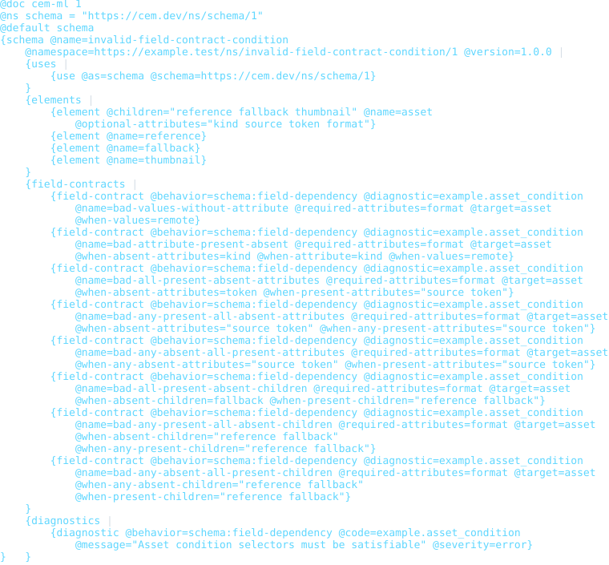

<details>
<summary>invalid-field-contract-child-sequence</summary>

- Source: [`examples/invalid-field-contract-child-sequence.cem`](./examples/invalid-field-contract-child-sequence.cem)
- Content type: `application/vnd.cem.schema+cem`
- Schema: `https://cem.dev/ns/schema/1`
- Expected result: `fail`
- Expected diagnostics: `cem.schema_definition.invalid_field_contract`
- Preview renderer: `CLI convert, tabular formatter, preview HTML + html2svg`
- Preview HTML: `dist/cem_ml/schema-packages/schema/v1/examples/invalid-field-contract-child-sequence.cem.html`

```bash
dist/target/cem_ml_cli/debug/cem-ml convert --input-spec \
  uri=packages/cem_ml/schema-packages/schema/v1/examples/invalid-field-contract-child-sequence.cem,contentType=application/vnd.cem.schema+cem,schema=https://cem.dev/ns/schema/1 \
  --to-content-type application/cem --to-schema https://cem.dev/ns/cem-ml/1 \
  --cemt-formatter-profile tabular --cemt-color-profile terminal --output-color-type \
  ansi-256
```

</details>

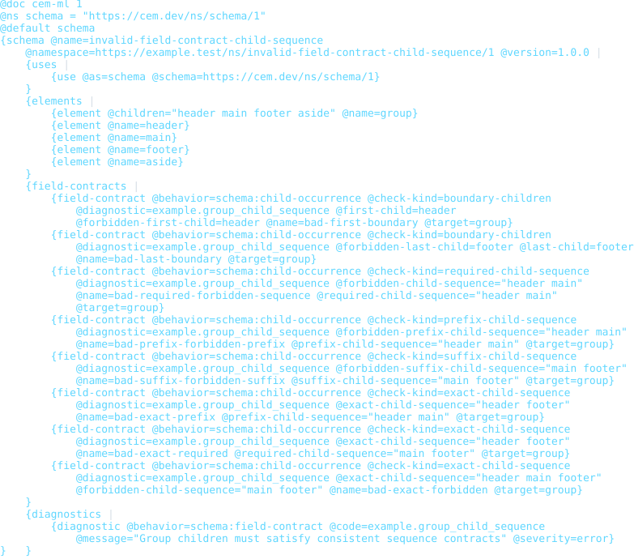

<details>
<summary>invalid-attribute-default</summary>

- Source: [`examples/invalid-attribute-default.cem`](./examples/invalid-attribute-default.cem)
- Content type: `application/vnd.cem.schema+cem`
- Schema: `https://cem.dev/ns/schema/1`
- Expected result: `fail`
- Expected diagnostics: `cem.schema_definition.invalid_default_value`
- Preview renderer: `CLI convert, tabular formatter, preview HTML + html2svg`
- Preview HTML: `dist/cem_ml/schema-packages/schema/v1/examples/invalid-attribute-default.cem.html`

```bash
dist/target/cem_ml_cli/debug/cem-ml convert --input-spec \
  uri=packages/cem_ml/schema-packages/schema/v1/examples/invalid-attribute-default.cem,contentType=application/vnd.cem.schema+cem,schema=https://cem.dev/ns/schema/1 \
  --to-content-type application/cem --to-schema https://cem.dev/ns/cem-ml/1 \
  --cemt-formatter-profile tabular --cemt-color-profile terminal --output-color-type \
  ansi-256
```

</details>

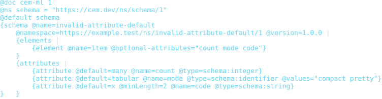

<details>
<summary>invalid-unclosed-schema</summary>

- Source: [`examples/invalid-unclosed-schema.cem`](./examples/invalid-unclosed-schema.cem)
- Content type: `application/vnd.cem.schema+cem`
- Schema: `https://cem.dev/ns/schema/1`
- Expected result: `fail`
- Expected diagnostics: `cem.ast.unclosed_scope`
- Preview renderer: `CLI convert, tabular formatter, preview HTML + html2svg`
- Preview HTML: `dist/cem_ml/schema-packages/schema/v1/examples/invalid-unclosed-schema.cem.html`

```bash
dist/target/cem_ml_cli/debug/cem-ml convert --input-spec \
  uri=packages/cem_ml/schema-packages/schema/v1/examples/invalid-unclosed-schema.cem,contentType=application/vnd.cem.schema+cem,schema=https://cem.dev/ns/schema/1 \
  --to-content-type application/cem --to-schema https://cem.dev/ns/cem-ml/1 \
  --cemt-formatter-profile tabular --cemt-color-profile terminal --output-color-type \
  ansi-256
```

</details>

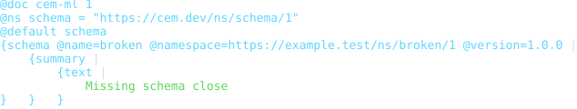
