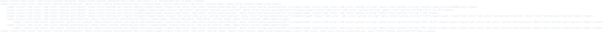
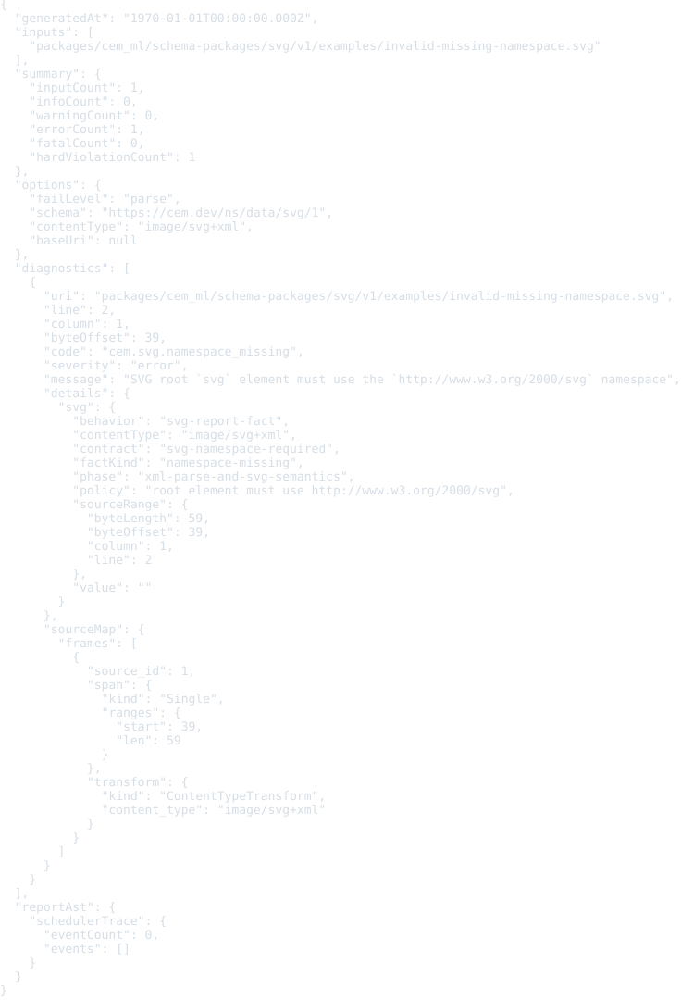
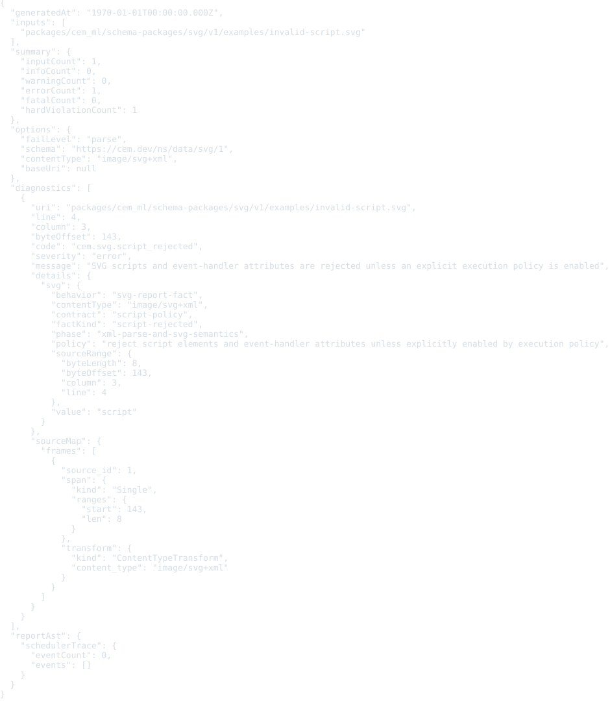
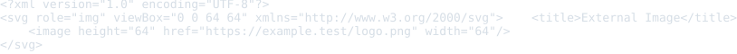

# SVG Resource Schema Package

This package defines registry identity for SVG resources.

SVG source is not CEM-ML syntax. The schema package and this manifest are
authored in CEM-ML, but resources with the `image/svg+xml` content type are
parsed as XML and validated as SVG vocabulary in the SVG namespace.

## Owned Identities

- Schema URI: `https://cem.dev/ns/data/svg/1`
- Primary content type: `image/svg+xml`
- Document namespace: `http://www.w3.org/2000/svg`
- Preferred extensions: `.svg`, `.svgz`

IANA registers `image/svg+xml` with optional `charset`. The `.svgz` extension is
treated as gzip-compressed SVG content with the same media type, not a separate
schema identity.

## Resource Model

The schema describes SVG resources as an XML-based graphics document model:

- documents reuse the generic XML schema and preserve charset, compression
  disposition, source identity, and byte offsets;
- the root element must be `svg` in the SVG namespace;
- viewport, geometry, paint, text, definition, filter, animation, style, and
  script nodes are modeled explicitly enough for validation and conversion;
- visible SVG accessibility hooks are explicit through title, desc, role, and
  ARIA name material;
- external resources, scripts, CSS, and foreign content require explicit
  policy before dereferencing or execution;
- foreign content must be handled by a registered schema package or converter
  profile.

Validation routes `image/svg+xml` through the SVG schema package and reuses the
XML event reader as the parser. Conversion/export lifecycle routing still uses
the XML adapter for standalone SVG resources. A bare SVG namespace in mixed HTML
remains an embedded-namespace hint for the HTML adapter.

## Validation

Validate SVG resources through the CLI with the schema URI and content type:

```bash
cem-ml validate --format json \
  --content-type image/svg+xml \
  --schema https://cem.dev/ns/data/svg/1 \
  packages/cem_ml/schema-packages/svg/v1/examples/basic-icon.svg
```

The direct validator parses SVG as XML, requires an `svg` root in the SVG
namespace, rejects scripts and external resource references unless an explicit
policy is available, and reports warning diagnostics for visible SVG roots that
do not provide accessible name material.

## Examples

This section is generated from `package.cem` `{example}` metadata by the
`samples2readme` Nx target. Each SVG previews the example content, not
the validation report. The target writes a preformatted HTML preview to
`dist/cem_ml/schema-packages/<package>/v1/examples/<example-file>.html`,
then renders the `<pre>` spans through headless Chromium into
`examples/previews/<example-file>.svg`.
Source snapshots are used only where the current CLI cannot yet render
the package formatter/colorizer path for that content identity.

<details>
<summary>basic-icon</summary>

- Source: [`examples/basic-icon.svg`](./examples/basic-icon.svg)
- Content type: `image/svg+xml`
- Schema: `https://cem.dev/ns/data/svg/1`
- Expected result: `pass`
- Preview renderer: `CLI convert, tabular formatter, preview HTML + html2svg`
- Preview HTML: `dist/cem_ml/schema-packages/svg/v1/examples/basic-icon.svg.html`

```bash
dist/target/cem_ml_cli/debug/cem-ml convert --input-spec \
  uri=packages/cem_ml/schema-packages/svg/v1/examples/basic-icon.svg,contentType=image/svg+xml,schema=https://cem.dev/ns/data/svg/1 \
  --from-format xml --to-content-type image/svg+xml --to-schema \
  https://cem.dev/ns/data/svg/1 --cemt-formatter-profile tabular --cemt-color-profile \
  terminal --output-color-type ansi-256
```

</details>


<details>
<summary>bar-chart</summary>

- Source: [`examples/bar-chart.svg`](./examples/bar-chart.svg)
- Content type: `image/svg+xml`
- Schema: `https://cem.dev/ns/data/svg/1`
- Expected result: `pass`
- Preview renderer: `CLI convert, tabular formatter, preview HTML + html2svg`
- Preview HTML: `dist/cem_ml/schema-packages/svg/v1/examples/bar-chart.svg.html`

```bash
dist/target/cem_ml_cli/debug/cem-ml convert --input-spec \
  uri=packages/cem_ml/schema-packages/svg/v1/examples/bar-chart.svg,contentType=image/svg+xml,schema=https://cem.dev/ns/data/svg/1 \
  --from-format xml --to-content-type image/svg+xml --to-schema \
  https://cem.dev/ns/data/svg/1 --cemt-formatter-profile tabular --cemt-color-profile \
  terminal --output-color-type ansi-256
```

</details>


<details>
<summary>unnamed-icon</summary>

- Source: [`examples/unnamed-icon.svg`](./examples/unnamed-icon.svg)
- Content type: `image/svg+xml`
- Schema: `https://cem.dev/ns/data/svg/1`
- Expected result: `pass`
- Expected diagnostics: `cem.svg.accessible_name_missing`
- Preview renderer: `CLI convert, tabular formatter, preview HTML + html2svg`
- Preview HTML: `dist/cem_ml/schema-packages/svg/v1/examples/unnamed-icon.svg.html`

```bash
dist/target/cem_ml_cli/debug/cem-ml convert --input-spec \
  uri=packages/cem_ml/schema-packages/svg/v1/examples/unnamed-icon.svg,contentType=image/svg+xml,schema=https://cem.dev/ns/data/svg/1 \
  --from-format xml --to-content-type image/svg+xml --to-schema \
  https://cem.dev/ns/data/svg/1 --cemt-formatter-profile tabular --cemt-color-profile \
  terminal --output-color-type ansi-256
```

</details>



<details>
<summary>invalid-missing-namespace</summary>

- Source: [`examples/invalid-missing-namespace.svg`](./examples/invalid-missing-namespace.svg)
- Content type: `image/svg+xml`
- Schema: `https://cem.dev/ns/data/svg/1`
- Expected result: `fail`
- Expected diagnostics: `cem.svg.namespace_missing`
- Preview renderer: `CLI convert, tabular formatter, preview HTML + html2svg`
- Preview HTML: `dist/cem_ml/schema-packages/svg/v1/examples/invalid-missing-namespace.svg.html`

```bash
dist/target/cem_ml_cli/debug/cem-ml convert --input-spec \
  uri=packages/cem_ml/schema-packages/svg/v1/examples/invalid-missing-namespace.svg,contentType=image/svg+xml,schema=https://cem.dev/ns/data/svg/1 \
  --from-format xml --to-content-type image/svg+xml --to-schema \
  https://cem.dev/ns/data/svg/1 --cemt-formatter-profile tabular --cemt-color-profile \
  terminal --output-color-type ansi-256
```

</details>



<details>
<summary>invalid-script</summary>

- Source: [`examples/invalid-script.svg`](./examples/invalid-script.svg)
- Content type: `image/svg+xml`
- Schema: `https://cem.dev/ns/data/svg/1`
- Expected result: `fail`
- Expected diagnostics: `cem.svg.script_rejected`
- Preview renderer: `CLI convert, tabular formatter, preview HTML + html2svg`
- Preview HTML: `dist/cem_ml/schema-packages/svg/v1/examples/invalid-script.svg.html`

```bash
dist/target/cem_ml_cli/debug/cem-ml convert --input-spec \
  uri=packages/cem_ml/schema-packages/svg/v1/examples/invalid-script.svg,contentType=image/svg+xml,schema=https://cem.dev/ns/data/svg/1 \
  --from-format xml --to-content-type image/svg+xml --to-schema \
  https://cem.dev/ns/data/svg/1 --cemt-formatter-profile tabular --cemt-color-profile \
  terminal --output-color-type ansi-256
```

</details>



<details>
<summary>invalid-external-image</summary>

- Source: [`examples/invalid-external-image.svg`](./examples/invalid-external-image.svg)
- Content type: `image/svg+xml`
- Schema: `https://cem.dev/ns/data/svg/1`
- Expected result: `fail`
- Expected diagnostics: `cem.svg.external_resource_rejected`
- Preview renderer: `CLI convert, tabular formatter, preview HTML + html2svg`
- Preview HTML: `dist/cem_ml/schema-packages/svg/v1/examples/invalid-external-image.svg.html`

```bash
dist/target/cem_ml_cli/debug/cem-ml convert --input-spec \
  uri=packages/cem_ml/schema-packages/svg/v1/examples/invalid-external-image.svg,contentType=image/svg+xml,schema=https://cem.dev/ns/data/svg/1 \
  --from-format xml --to-content-type image/svg+xml --to-schema \
  https://cem.dev/ns/data/svg/1 --cemt-formatter-profile tabular --cemt-color-profile \
  terminal --output-color-type ansi-256
```

</details>


