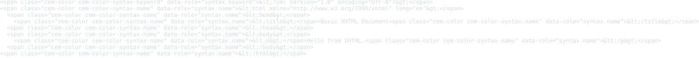
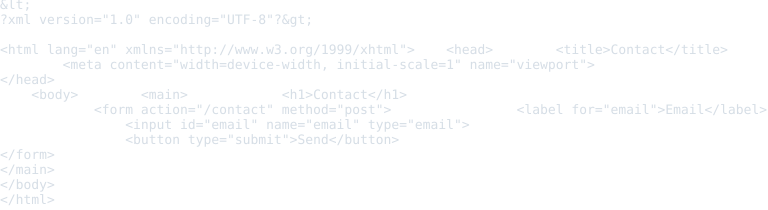
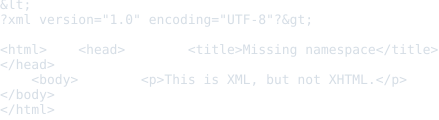
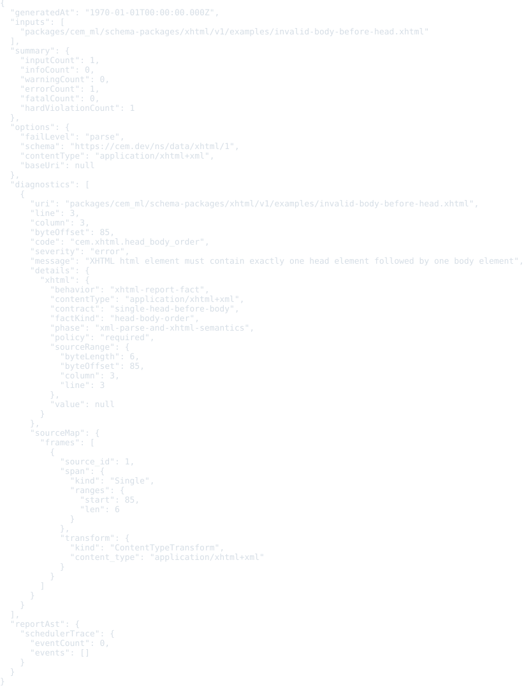
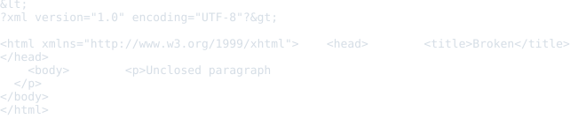

# XHTML Resource Schema Package

This package defines registry identity for XHTML resources.

XHTML source is not CEM-ML syntax. The schema package and this manifest are
authored in CEM-ML, but resources with the `application/xhtml+xml` content type
are parsed as XML and validated as HTML vocabulary in the XHTML namespace.

## Owned Identities

- Schema URI: `https://cem.dev/ns/data/xhtml/1`
- Primary content type: `application/xhtml+xml`
- Document namespace: `http://www.w3.org/1999/xhtml`
- Preferred extensions: `.xhtml`, `.xht`

RFC 3236 registers `application/xhtml+xml` with optional `charset` and
`profile` parameters. IANA now records `profile` as deprecated because XHTML
profiles were obsoleted in HTML5.

## Resource Model

The schema describes XHTML resources as an XML-based HTML document model:

- documents reuse the generic XML schema and preserve XML declaration,
  charset, doctype, source identity, and byte offsets;
- the root element must be `html` in the XHTML namespace;
- `head` and `body` structure is explicit and ordered;
- metadata, flow, phrasing, and interactive content are modeled as XHTML
  vocabulary facets over XML elements;
- foreign content is explicit and must be handled by a registered schema
  package or converter profile;
- `text/html` remains a separate HTML serialization identity and is not claimed
  by this package.

Current runtime export still routes `application/xhtml+xml` through the HTML
adapter; this package records the future XHTML-specific schema identity and
validation surface.

## Examples

This section is generated from `package.cem` `{example}` metadata by the
`samples2readme` Nx target. Each SVG previews the example content, not
the validation report. The target writes a preformatted HTML preview to
`dist/cem_ml/schema-packages/<package>/v1/examples/<example-file>.html`,
then renders the `<pre>` spans through headless Chromium into
`examples/previews/<example-file>.svg`.
Source snapshots are used only where the current CLI cannot yet render
the package formatter/colorizer path for that content identity.

### basic-document

- Source: [`examples/basic-document.xhtml`](examples/basic-document.xhtml)
- Content type: `application/xhtml+xml`
- Schema: `https://cem.dev/ns/data/xhtml/1`
- Expected result: `pass`
- Preview renderer: `CLI convert, tabular formatter, preview HTML + html2svg`
- Preview HTML: `dist/cem_ml/schema-packages/xhtml/v1/examples/basic-document.xhtml.html`

```bash
dist/target/cem_ml_cli/debug/cem-ml convert --input-spec \
  uri=packages/cem_ml/schema-packages/xhtml/v1/examples/basic-document.xhtml,contentType=application/xhtml+xml,schema=https://cem.dev/ns/data/xhtml/1 \
  --from-format xml --to-content-type application/xhtml+xml --to-schema \
  https://cem.dev/ns/data/xhtml/1 --cemt-formatter-profile tabular --cemt-color-profile \
  terminal --output-color-type ansi-256
```



### form-page

- Source: [`examples/form-page.xhtml`](examples/form-page.xhtml)
- Content type: `application/xhtml+xml`
- Schema: `https://cem.dev/ns/data/xhtml/1`
- Expected result: `pass`
- Preview renderer: `CLI convert, tabular formatter, preview HTML + html2svg`
- Preview HTML: `dist/cem_ml/schema-packages/xhtml/v1/examples/form-page.xhtml.html`

```bash
dist/target/cem_ml_cli/debug/cem-ml convert --input-spec \
  uri=packages/cem_ml/schema-packages/xhtml/v1/examples/form-page.xhtml,contentType=application/xhtml+xml,schema=https://cem.dev/ns/data/xhtml/1 \
  --from-format xml --to-content-type application/xhtml+xml --to-schema \
  https://cem.dev/ns/data/xhtml/1 --cemt-formatter-profile tabular --cemt-color-profile \
  terminal --output-color-type ansi-256
```



### invalid-missing-namespace

- Source: [`examples/invalid-missing-namespace.xhtml`](examples/invalid-missing-namespace.xhtml)
- Content type: `application/xhtml+xml`
- Schema: `https://cem.dev/ns/data/xhtml/1`
- Expected result: `fail`
- Expected diagnostics: `cem.xhtml.namespace_missing`
- Preview renderer: `CLI convert, tabular formatter, preview HTML + html2svg`
- Preview HTML: `dist/cem_ml/schema-packages/xhtml/v1/examples/invalid-missing-namespace.xhtml.html`

```bash
dist/target/cem_ml_cli/debug/cem-ml convert --input-spec \
  uri=packages/cem_ml/schema-packages/xhtml/v1/examples/invalid-missing-namespace.xhtml,contentType=application/xhtml+xml,schema=https://cem.dev/ns/data/xhtml/1 \
  --from-format xml --to-content-type application/xhtml+xml --to-schema \
  https://cem.dev/ns/data/xhtml/1 --cemt-formatter-profile tabular --cemt-color-profile \
  terminal --output-color-type ansi-256
```



### invalid-body-before-head

- Source: [`examples/invalid-body-before-head.xhtml`](examples/invalid-body-before-head.xhtml)
- Content type: `application/xhtml+xml`
- Schema: `https://cem.dev/ns/data/xhtml/1`
- Expected result: `fail`
- Expected diagnostics: `cem.xhtml.head_body_order`
- Preview renderer: `CLI convert, tabular formatter, preview HTML + html2svg`
- Preview HTML: `dist/cem_ml/schema-packages/xhtml/v1/examples/invalid-body-before-head.xhtml.html`

```bash
dist/target/cem_ml_cli/debug/cem-ml convert --input-spec \
  uri=packages/cem_ml/schema-packages/xhtml/v1/examples/invalid-body-before-head.xhtml,contentType=application/xhtml+xml,schema=https://cem.dev/ns/data/xhtml/1 \
  --from-format xml --to-content-type application/xhtml+xml --to-schema \
  https://cem.dev/ns/data/xhtml/1 --cemt-formatter-profile tabular --cemt-color-profile \
  terminal --output-color-type ansi-256
```



### invalid-not-well-formed

- Source: [`examples/invalid-not-well-formed.xhtml`](examples/invalid-not-well-formed.xhtml)
- Content type: `application/xhtml+xml`
- Schema: `https://cem.dev/ns/data/xhtml/1`
- Expected result: `fail`
- Expected diagnostics: `cem.xhtml.not_well_formed_xml`
- Preview renderer: `CLI convert, tabular formatter, preview HTML + html2svg`
- Preview HTML: `dist/cem_ml/schema-packages/xhtml/v1/examples/invalid-not-well-formed.xhtml.html`

```bash
dist/target/cem_ml_cli/debug/cem-ml convert --input-spec \
  uri=packages/cem_ml/schema-packages/xhtml/v1/examples/invalid-not-well-formed.xhtml,contentType=application/xhtml+xml,schema=https://cem.dev/ns/data/xhtml/1 \
  --from-format xml --to-content-type application/xhtml+xml --to-schema \
  https://cem.dev/ns/data/xhtml/1 --cemt-formatter-profile tabular --cemt-color-profile \
  terminal --output-color-type ansi-256
```


