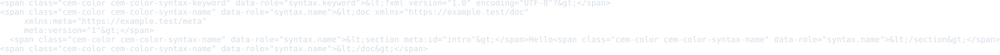
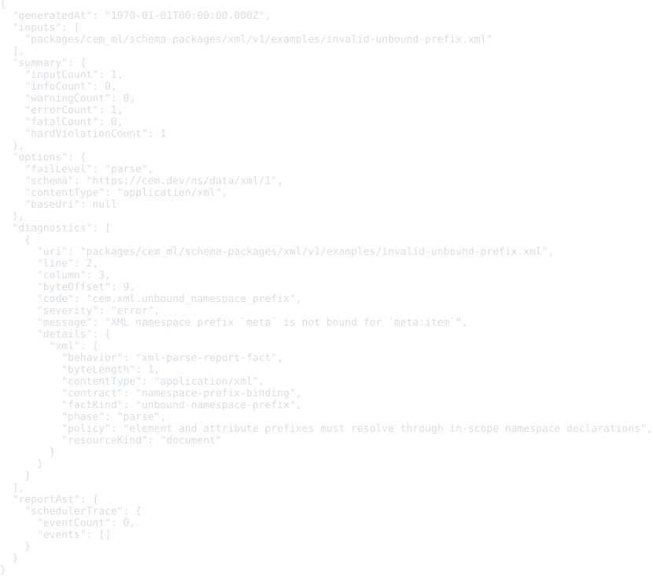
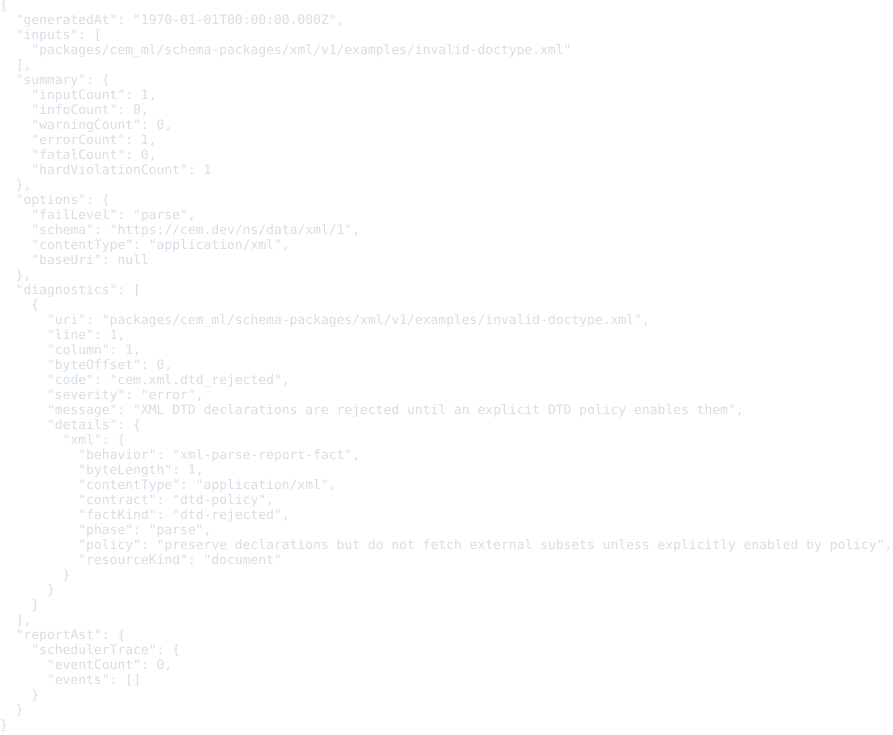

# XML Resource Schema Package

Status: schema, examples, formatter, colorizer, and converter package frame

This package defines registry identity for generic XML resources.

XML source is not CEM-ML syntax. The schema package and this manifest are
authored in CEM-ML, but resources with XML content types are parsed by an XML
parser or adapter.

## Owned Identities

- Schema URI: `https://cem.dev/ns/data/xml/1`
- Primary content type: `application/xml`
- Alias content types: `text/xml`, `application/xml-external-parsed-entity`,
  `text/xml-external-parsed-entity`, `application/xml-dtd`
- Preferred extension: `.xml`

RFC 7303 standardizes generic XML media types and the `+xml` structured syntax
suffix.

## Resource Model

The schema describes XML resources as a namespace-aware document model:

- documents preserve XML declaration, MIME charset, XML version, standalone
  state, root element, optional doctype, and source identity;
- elements and attributes preserve qualified names, expanded namespace identity,
  lexical order, and source offsets when available;
- text, CDATA, comments, processing instructions, and entity references remain
  explicit nodes;
- DTD and external entity material is preserved as declarations but external
  resolution is rejected unless an explicit policy enables it;
- external parsed entities and XML DTD resources use the same schema identity
  with specialized top-level resource elements.

This package intentionally does not claim all media types ending in `+xml`.
Domain formats such as XHTML, SVG, MathML, XSLT, Atom, and RSS need their own
schema packages that can depend on the generic XML schema.

## Output Artifacts

The package declares CEMT formatter and colorizer artifacts in `package.cem`.
The public formatter profile names are `compact`, `pretty`, and `tabular`.
The public colorizer profile names are `terminal`, `html`, and `md`.

## Examples

This section is generated from `package.cem` `{example}` metadata by the
`samples2readme` Nx target. Each SVG previews the example content, not
the validation report. The target writes a preformatted HTML preview to
`dist/cem_ml/schema-packages/<package>/v1/examples/<example-file>.html`,
then renders the `<pre>` spans through headless Chromium into
`examples/previews/<example-file>.svg`.
Source snapshots are used only where the current CLI cannot yet render
the package formatter/colorizer path for that content identity.

### basic-document

- Source: [`examples/basic-document.xml`](examples/basic-document.xml)
- Content type: `application/xml`
- Schema: `https://cem.dev/ns/data/xml/1`
- Expected result: `pass`
- Preview renderer: `CLI convert, tabular formatter, preview HTML + html2svg`
- Preview HTML: `dist/cem_ml/schema-packages/xml/v1/examples/basic-document.xml.html`

```bash
dist/target/cem_ml_cli/debug/cem-ml convert --input-spec \
  uri=packages/cem_ml/schema-packages/xml/v1/examples/basic-document.xml,contentType=application/xml,schema=https://cem.dev/ns/data/xml/1 \
  --from-format xml --to-content-type application/xml --to-schema \
  https://cem.dev/ns/data/xml/1 --cemt-formatter-profile tabular --cemt-color-profile \
  terminal --output-color-type ansi-256
```


### namespaced-document

- Source: [`examples/namespaced-document.xml`](examples/namespaced-document.xml)
- Content type: `text/xml; charset=utf-8`
- Schema: `https://cem.dev/ns/data/xml/1`
- Expected result: `pass`
- Preview renderer: `CLI convert, tabular formatter, preview HTML + html2svg`
- Preview HTML: `dist/cem_ml/schema-packages/xml/v1/examples/namespaced-document.xml.html`

```bash
dist/target/cem_ml_cli/debug/cem-ml convert --input-spec \
  'uri=packages/cem_ml/schema-packages/xml/v1/examples/namespaced-document.xml,contentType=text/xml; charset=utf-8,schema=https://cem.dev/ns/data/xml/1' \
  --from-format xml --to-content-type 'text/xml; charset=utf-8' --to-schema \
  https://cem.dev/ns/data/xml/1 --cemt-formatter-profile tabular --cemt-color-profile \
  terminal --output-color-type ansi-256
```



### invalid-mismatched-tag

- Source: [`examples/invalid-mismatched-tag.xml`](examples/invalid-mismatched-tag.xml)
- Content type: `application/xml`
- Schema: `https://cem.dev/ns/data/xml/1`
- Expected result: `fail`
- Expected diagnostics: `cem.xml.parse_error`
- Preview renderer: `CLI convert, tabular formatter, preview HTML + html2svg`
- Preview HTML: `dist/cem_ml/schema-packages/xml/v1/examples/invalid-mismatched-tag.xml.html`

```bash
dist/target/cem_ml_cli/debug/cem-ml convert --input-spec \
  uri=packages/cem_ml/schema-packages/xml/v1/examples/invalid-mismatched-tag.xml,contentType=application/xml,schema=https://cem.dev/ns/data/xml/1 \
  --from-format xml --to-content-type application/xml --to-schema \
  https://cem.dev/ns/data/xml/1 --cemt-formatter-profile tabular --cemt-color-profile \
  terminal --output-color-type ansi-256
```


### invalid-unbound-prefix

- Source: [`examples/invalid-unbound-prefix.xml`](examples/invalid-unbound-prefix.xml)
- Content type: `application/xml`
- Schema: `https://cem.dev/ns/data/xml/1`
- Expected result: `fail`
- Expected diagnostics: `cem.xml.unbound_namespace_prefix`
- Preview renderer: `CLI convert, tabular formatter, preview HTML + html2svg`
- Preview HTML: `dist/cem_ml/schema-packages/xml/v1/examples/invalid-unbound-prefix.xml.html`

```bash
dist/target/cem_ml_cli/debug/cem-ml convert --input-spec \
  uri=packages/cem_ml/schema-packages/xml/v1/examples/invalid-unbound-prefix.xml,contentType=application/xml,schema=https://cem.dev/ns/data/xml/1 \
  --from-format xml --to-content-type application/xml --to-schema \
  https://cem.dev/ns/data/xml/1 --cemt-formatter-profile tabular --cemt-color-profile \
  terminal --output-color-type ansi-256
```



### invalid-doctype

- Source: [`examples/invalid-doctype.xml`](examples/invalid-doctype.xml)
- Content type: `application/xml`
- Schema: `https://cem.dev/ns/data/xml/1`
- Expected result: `fail`
- Expected diagnostics: `cem.xml.dtd_rejected`
- Preview renderer: `CLI convert, tabular formatter, preview HTML + html2svg`
- Preview HTML: `dist/cem_ml/schema-packages/xml/v1/examples/invalid-doctype.xml.html`

```bash
dist/target/cem_ml_cli/debug/cem-ml convert --input-spec \
  uri=packages/cem_ml/schema-packages/xml/v1/examples/invalid-doctype.xml,contentType=application/xml,schema=https://cem.dev/ns/data/xml/1 \
  --from-format xml --to-content-type application/xml --to-schema \
  https://cem.dev/ns/data/xml/1 --cemt-formatter-profile tabular --cemt-color-profile \
  terminal --output-color-type ansi-256
```


