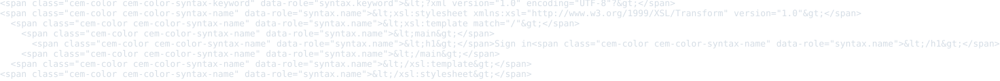
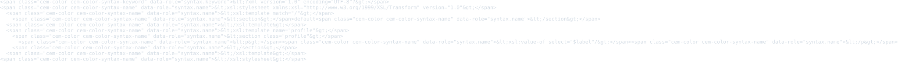
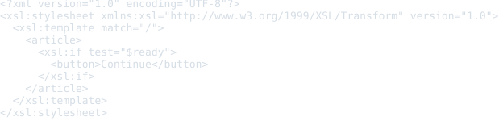
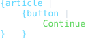
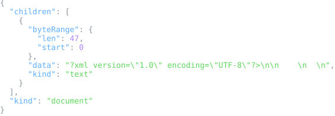
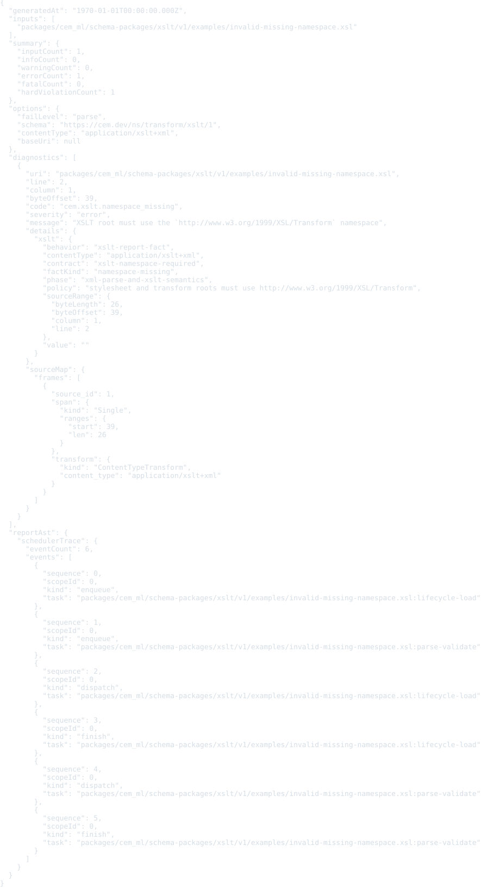
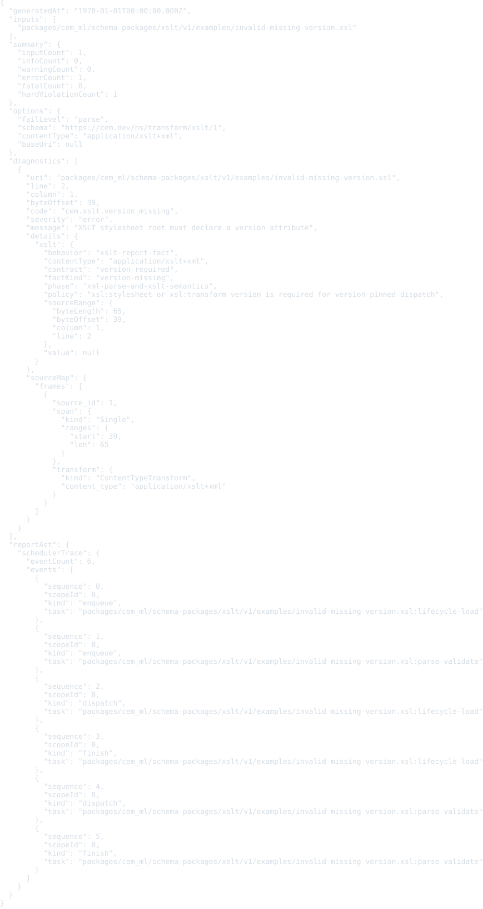
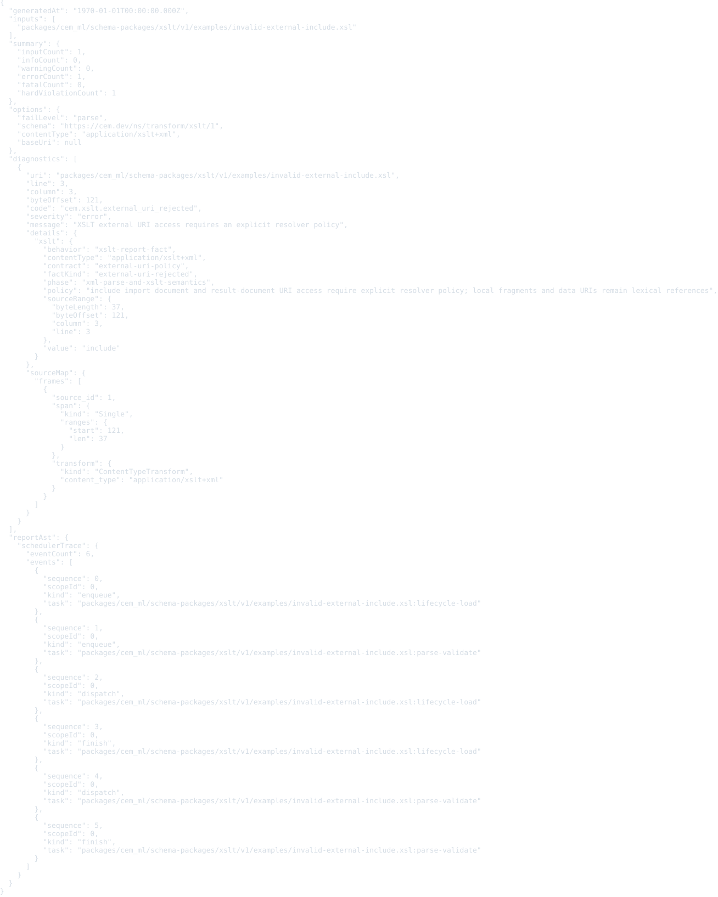
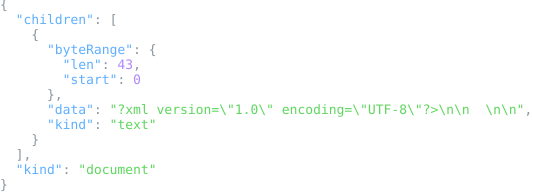
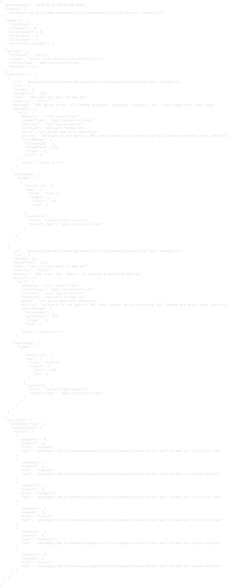

# XSLT schema package v1

This package defines CEM schema identity for XSLT stylesheet resources and for the legacy custom-element XSLT compatibility markers.

- Schema URI: `https://cem.dev/ns/transform/xslt/1`
- Primary content type: `application/xslt+xml`
- Alias content types: `text/xsl`, `custom-element-xslt`, `text/custom-element-xslt`, `application/custom-element-xslt`, `text/x-custom-element-xslt`
- Document namespace: `http://www.w3.org/1999/XSL/Transform`
- Source schema: `schema/xslt.cem`

XSLT is XML-backed. Direct validation routes the XSLT media type and
compatibility aliases through this schema package and reuses the XML event
reader as the parser. The package registers the stylesheet identity and the
compatibility aliases consumed by the existing CEM legacy custom-element
adapter.

The current executable support is intentionally bounded: copied custom-element and XSLT parity templates can lower through the CEM-owned compatibility path, while full XSLT 3.0/4.0 execution remains capability-gated roadmap work. Browser-native `XSLTProcessor` execution is not part of this package contract.

## Validation

Validate XSLT stylesheet resources through the CLI with the schema URI and
content type:

```bash
cem-ml validate --format json \
  --content-type application/xslt+xml \
  --schema https://cem.dev/ns/transform/xslt/1 \
  packages/cem_ml/schema-packages/xslt/v1/examples/basic-stylesheet.xsl
```

The direct validator parses standard XSLT as XML, requires an `xsl:stylesheet`
or `xsl:transform` root in the XSLT namespace, validates the root `version`
attribute, requires at least one top-level `xsl:template`, rejects external URI
constructs such as `xsl:include`, and reports warning diagnostics for extension
constructs outside the bounded legacy compatibility profile. The
`custom-element-xslt` aliases also accept legacy custom-element fragment
resources when the source is not a stylesheet root.

## Examples

This section is generated from `package.cem` `{example}` metadata by the
`samples2readme` Nx target. Each SVG previews the example content, not
the validation report. The target writes a preformatted HTML preview to
`dist/cem_ml/schema-packages/<package>/v1/examples/<example-file>.html`,
then renders the `<pre>` spans through headless Chromium into
`examples/previews/<example-file>.svg`.
Source snapshots are used only where the current CLI cannot yet render
the package formatter/colorizer path for that content identity.

<details>
<summary>basic-stylesheet</summary>

- Source: [`examples/basic-stylesheet.xsl`](./examples/basic-stylesheet.xsl)
- Content type: `application/xslt+xml`
- Schema: `https://cem.dev/ns/transform/xslt/1`
- Expected result: `pass`
- Preview renderer: `CLI convert, tabular formatter, preview HTML + html2svg`
- Preview HTML: `dist/cem_ml/schema-packages/xslt/v1/examples/basic-stylesheet.xsl.html`

```bash
dist/target/cem_ml_cli/debug/cem-ml convert --input-spec \
  uri=packages/cem_ml/schema-packages/xslt/v1/examples/basic-stylesheet.xsl,contentType=application/xslt+xml,schema=https://cem.dev/ns/transform/xslt/1 \
  --from-format xml --to-content-type application/xslt+xml --to-schema \
  https://cem.dev/ns/transform/xslt/1 --cemt-formatter-profile tabular \
  --cemt-color-profile terminal --output-color-type ansi-256
```

</details>



<details>
<summary>named-template</summary>

- Source: [`examples/named-template.xslt`](./examples/named-template.xslt)
- Content type: `text/xsl`
- Schema: `https://cem.dev/ns/transform/xslt/1`
- Expected result: `pass`
- Preview renderer: `CLI convert, tabular formatter, preview HTML + html2svg`
- Preview HTML: `dist/cem_ml/schema-packages/xslt/v1/examples/named-template.xslt.html`

```bash
dist/target/cem_ml_cli/debug/cem-ml convert --input-spec \
  uri=packages/cem_ml/schema-packages/xslt/v1/examples/named-template.xslt,contentType=text/xsl,schema=https://cem.dev/ns/transform/xslt/1 \
  --from-format xml --to-content-type text/xsl --to-schema \
  https://cem.dev/ns/transform/xslt/1 --cemt-formatter-profile tabular \
  --cemt-color-profile terminal --output-color-type ansi-256
```

</details>



<details>
<summary>legacy-custom-element-stylesheet</summary>

- Source: [`examples/legacy-custom-element-stylesheet.xsl`](./examples/legacy-custom-element-stylesheet.xsl)
- Content type: `custom-element-xslt`
- Schema: `https://cem.dev/ns/transform/xslt/1`
- Expected result: `pass`
- Preview renderer: `source snapshot HTML + html2svg`
- Preview HTML: `dist/cem_ml/schema-packages/xslt/v1/examples/legacy-custom-element-stylesheet.xsl.html`

</details>



<details>
<summary>legacy-custom-element-fragment</summary>

- Source: [`examples/legacy-custom-element-fragment.html`](./examples/legacy-custom-element-fragment.html)
- Content type: `custom-element-xslt`
- Schema: `https://cem.dev/ns/transform/xslt/1`
- Expected result: `pass`
- Preview renderer: `source snapshot HTML + html2svg`
- Preview HTML: `dist/cem_ml/schema-packages/xslt/v1/examples/legacy-custom-element-fragment.html.html`

</details>



<details>
<summary>unsupported-extension-warning</summary>

- Source: [`examples/unsupported-extension-warning.xsl`](./examples/unsupported-extension-warning.xsl)
- Content type: `application/xslt+xml`
- Schema: `https://cem.dev/ns/transform/xslt/1`
- Expected result: `pass`
- Expected diagnostics: `legacy_xslt.unsupported_construct`
- Preview renderer: `CLI convert, tabular formatter, preview HTML + html2svg`
- Preview HTML: `dist/cem_ml/schema-packages/xslt/v1/examples/unsupported-extension-warning.xsl.html`

```bash
dist/target/cem_ml_cli/debug/cem-ml convert --input-spec \
  uri=packages/cem_ml/schema-packages/xslt/v1/examples/unsupported-extension-warning.xsl,contentType=application/xslt+xml,schema=https://cem.dev/ns/transform/xslt/1 \
  --from-format xml --to-content-type application/xslt+xml --to-schema \
  https://cem.dev/ns/transform/xslt/1 --cemt-formatter-profile tabular \
  --cemt-color-profile terminal --output-color-type ansi-256
```

</details>



<details>
<summary>invalid-missing-namespace</summary>

- Source: [`examples/invalid-missing-namespace.xsl`](./examples/invalid-missing-namespace.xsl)
- Content type: `application/xslt+xml`
- Schema: `https://cem.dev/ns/transform/xslt/1`
- Expected result: `fail`
- Expected diagnostics: `cem.xslt.namespace_missing`
- Preview renderer: `CLI convert, tabular formatter, preview HTML + html2svg`
- Preview HTML: `dist/cem_ml/schema-packages/xslt/v1/examples/invalid-missing-namespace.xsl.html`

```bash
dist/target/cem_ml_cli/debug/cem-ml convert --input-spec \
  uri=packages/cem_ml/schema-packages/xslt/v1/examples/invalid-missing-namespace.xsl,contentType=application/xslt+xml,schema=https://cem.dev/ns/transform/xslt/1 \
  --from-format xml --to-content-type application/xslt+xml --to-schema \
  https://cem.dev/ns/transform/xslt/1 --cemt-formatter-profile tabular \
  --cemt-color-profile terminal --output-color-type ansi-256
```

</details>



<details>
<summary>invalid-missing-version</summary>

- Source: [`examples/invalid-missing-version.xsl`](./examples/invalid-missing-version.xsl)
- Content type: `application/xslt+xml`
- Schema: `https://cem.dev/ns/transform/xslt/1`
- Expected result: `fail`
- Expected diagnostics: `cem.xslt.version_missing`
- Preview renderer: `CLI convert, tabular formatter, preview HTML + html2svg`
- Preview HTML: `dist/cem_ml/schema-packages/xslt/v1/examples/invalid-missing-version.xsl.html`

```bash
dist/target/cem_ml_cli/debug/cem-ml convert --input-spec \
  uri=packages/cem_ml/schema-packages/xslt/v1/examples/invalid-missing-version.xsl,contentType=application/xslt+xml,schema=https://cem.dev/ns/transform/xslt/1 \
  --from-format xml --to-content-type application/xslt+xml --to-schema \
  https://cem.dev/ns/transform/xslt/1 --cemt-formatter-profile tabular \
  --cemt-color-profile terminal --output-color-type ansi-256
```

</details>



<details>
<summary>invalid-external-include</summary>

- Source: [`examples/invalid-external-include.xsl`](./examples/invalid-external-include.xsl)
- Content type: `application/xslt+xml`
- Schema: `https://cem.dev/ns/transform/xslt/1`
- Expected result: `fail`
- Expected diagnostics: `cem.xslt.external_uri_rejected`
- Preview renderer: `CLI convert, tabular formatter, preview HTML + html2svg`
- Preview HTML: `dist/cem_ml/schema-packages/xslt/v1/examples/invalid-external-include.xsl.html`

```bash
dist/target/cem_ml_cli/debug/cem-ml convert --input-spec \
  uri=packages/cem_ml/schema-packages/xslt/v1/examples/invalid-external-include.xsl,contentType=application/xslt+xml,schema=https://cem.dev/ns/transform/xslt/1 \
  --from-format xml --to-content-type application/xslt+xml --to-schema \
  https://cem.dev/ns/transform/xslt/1 --cemt-formatter-profile tabular \
  --cemt-color-profile terminal --output-color-type ansi-256
```

</details>



<details>
<summary>invalid-missing-entrypoint</summary>

- Source: [`examples/invalid-missing-entrypoint.xsl`](./examples/invalid-missing-entrypoint.xsl)
- Content type: `application/xslt+xml`
- Schema: `https://cem.dev/ns/transform/xslt/1`
- Expected result: `fail`
- Expected diagnostics: `cem.xslt.entrypoint_missing`
- Preview renderer: `CLI convert, tabular formatter, preview HTML + html2svg`
- Preview HTML: `dist/cem_ml/schema-packages/xslt/v1/examples/invalid-missing-entrypoint.xsl.html`

```bash
dist/target/cem_ml_cli/debug/cem-ml convert --input-spec \
  uri=packages/cem_ml/schema-packages/xslt/v1/examples/invalid-missing-entrypoint.xsl,contentType=application/xslt+xml,schema=https://cem.dev/ns/transform/xslt/1 \
  --from-format xml --to-content-type application/xslt+xml --to-schema \
  https://cem.dev/ns/transform/xslt/1 --cemt-formatter-profile tabular \
  --cemt-color-profile terminal --output-color-type ansi-256
```

</details>



<details>
<summary>invalid-not-well-formed</summary>

- Source: [`examples/invalid-not-well-formed.xsl`](./examples/invalid-not-well-formed.xsl)
- Content type: `application/xslt+xml`
- Schema: `https://cem.dev/ns/transform/xslt/1`
- Expected result: `fail`
- Expected diagnostics: `cem.xslt.not_well_formed_xml`
- Preview renderer: `CLI convert, tabular formatter, preview HTML + html2svg`
- Preview HTML: `dist/cem_ml/schema-packages/xslt/v1/examples/invalid-not-well-formed.xsl.html`

```bash
dist/target/cem_ml_cli/debug/cem-ml convert --input-spec \
  uri=packages/cem_ml/schema-packages/xslt/v1/examples/invalid-not-well-formed.xsl,contentType=application/xslt+xml,schema=https://cem.dev/ns/transform/xslt/1 \
  --from-format xml --to-content-type application/xslt+xml --to-schema \
  https://cem.dev/ns/transform/xslt/1 --cemt-formatter-profile tabular \
  --cemt-color-profile terminal --output-color-type ansi-256
```

</details>


