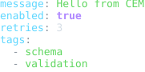
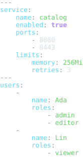

# YAML Resource Schema Package

Status: schema, examples, formatter, and colorizer package frame

This package defines registry identity for generic YAML resources.

YAML source is not CEM-ML syntax. The schema package and this manifest are
authored in CEM-ML, but resources with the `application/yaml` content type are
parsed by a YAML parser or adapter.

## Owned Identities

- Schema URI: `https://cem.dev/ns/data/yaml/1`
- Primary content type: `application/yaml`
- Compatibility aliases: `application/x-yaml`, `text/yaml`, `text/x-yaml`
- Preferred extension: `.yaml`
- Accepted extension: `.yml`

RFC 9512 registers `application/yaml` and identifies the older names above as
deprecated aliases that are still seen in deployed systems.

The `+yaml` structured syntax suffix is a content-type family signal for future
vendor or domain-specific YAML packages. This generic package owns only the base
YAML resource schema and common compatibility aliases.

## Output Artifacts

The package declares CEMT formatter and colorizer artifacts in `package.cem`.
The public formatter profile names are `compact`, `pretty`, and `tabular`.
The public colorizer profile names are `terminal`, `html`, and `md`.

## Resource Model

The schema describes YAML streams as a lossless resource model:

- streams contain zero or more documents;
- documents contain one root representation-graph node;
- mappings preserve entry order and key/value source identity;
- sequences preserve item order;
- scalars preserve style, lexical text, and implicit kind when available;
- anchors and aliases preserve graph identity when the parser exposes them;
- comments and directives are retained as presentation metadata where possible.

Parsers must use safe tag resolution by default. Host-object or executable tags
belong behind explicit adapter policy and runtime limits.

## Examples

This section is generated from `package.cem` `{example}` metadata by the
`samples2readme` Nx target. Each SVG previews the example content, not
the validation report. The target writes a preformatted HTML preview to
`dist/cem_ml/schema-packages/<package>/v1/examples/<example-file>.html`,
then renders the `<pre>` spans through headless Chromium into
`examples/previews/<example-file>.svg`.
Source snapshots are used only where the current CLI cannot yet render
the package formatter/colorizer path for that content identity.

### basic-document

- Source: [`examples/basic-document.yaml`](examples/basic-document.yaml)
- Content type: `application/yaml`
- Schema: `https://cem.dev/ns/data/yaml/1`
- Expected result: `pass`
- Preview renderer: `CLI convert, tabular formatter, preview HTML + html2svg`
- Preview HTML: `dist/cem_ml/schema-packages/yaml/v1/examples/basic-document.yaml.html`

```bash
dist/target/cem_ml_cli/debug/cem-ml convert --input-spec \
  uri=packages/cem_ml/schema-packages/yaml/v1/examples/basic-document.yaml,contentType=application/yaml,schema=https://cem.dev/ns/data/yaml/1 \
  --to-content-type application/yaml --to-schema https://cem.dev/ns/data/yaml/1 \
  --cemt-formatter-profile tabular --cemt-color-profile terminal --output-color-type \
  ansi-256
```



### nested-stream

- Source: [`examples/nested-stream.yml`](examples/nested-stream.yml)
- Content type: `text/yaml`
- Schema: `https://cem.dev/ns/data/yaml/1`
- Expected result: `pass`
- Preview renderer: `CLI convert, tabular formatter, preview HTML + html2svg`
- Preview HTML: `dist/cem_ml/schema-packages/yaml/v1/examples/nested-stream.yml.html`

```bash
dist/target/cem_ml_cli/debug/cem-ml convert --input-spec \
  uri=packages/cem_ml/schema-packages/yaml/v1/examples/nested-stream.yml,contentType=text/yaml,schema=https://cem.dev/ns/data/yaml/1 \
  --to-content-type application/yaml --to-schema https://cem.dev/ns/data/yaml/1 \
  --cemt-formatter-profile tabular --cemt-color-profile terminal --output-color-type \
  ansi-256
```



### invalid-parse

- Source: [`examples/invalid-parse.yaml`](examples/invalid-parse.yaml)
- Content type: `application/yaml`
- Schema: `https://cem.dev/ns/data/yaml/1`
- Expected result: `fail`
- Expected diagnostics: `cem.yaml.parse_error`
- Preview renderer: `CLI convert, tabular formatter, preview HTML + html2svg`
- Preview HTML: `dist/cem_ml/schema-packages/yaml/v1/examples/invalid-parse.yaml.html`

```bash
dist/target/cem_ml_cli/debug/cem-ml convert --input-spec \
  uri=packages/cem_ml/schema-packages/yaml/v1/examples/invalid-parse.yaml,contentType=application/yaml,schema=https://cem.dev/ns/data/yaml/1 \
  --to-content-type application/yaml --to-schema https://cem.dev/ns/data/yaml/1 \
  --cemt-formatter-profile tabular --cemt-color-profile terminal --output-color-type \
  ansi-256
```


### invalid-unsafe-tag

- Source: [`examples/invalid-unsafe-tag.yaml`](examples/invalid-unsafe-tag.yaml)
- Content type: `application/x-yaml`
- Schema: `https://cem.dev/ns/data/yaml/1`
- Expected result: `fail`
- Expected diagnostics: `cem.yaml.unsafe_tag`
- Preview renderer: `CLI convert, tabular formatter, preview HTML + html2svg`
- Preview HTML: `dist/cem_ml/schema-packages/yaml/v1/examples/invalid-unsafe-tag.yaml.html`

```bash
dist/target/cem_ml_cli/debug/cem-ml convert --input-spec \
  uri=packages/cem_ml/schema-packages/yaml/v1/examples/invalid-unsafe-tag.yaml,contentType=application/x-yaml,schema=https://cem.dev/ns/data/yaml/1 \
  --to-content-type application/yaml --to-schema https://cem.dev/ns/data/yaml/1 \
  --cemt-formatter-profile tabular --cemt-color-profile terminal --output-color-type \
  ansi-256
```


